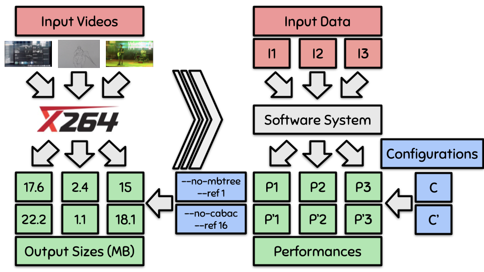

# Input Sensitivity

Dear reviewers,

This is the companion repository related to our submission.

## Organization

Measurements and details about data can be consulted in the **data** folder.

Source code can be found in the **src** directory.

The **results** folder contains the results shown in the submission, as well as complementary results.

The **replication** folder contains all you need to replicate our experiments.

The article (pdf file) can be consulted directly in the root directory.

## Our research work in a nutshell

This paper **investigates, demonstrates and quantifies what effects configurable system inputs can have on performance.**

## Artifact evaluation

Please read and follow the [README.md](https://anonymous.4open.science/repository/df319578-8767-47b0-919d-a8e57eb67d25/replication/README.md) file of the replication directory if you want to evaluate our artifacts.

