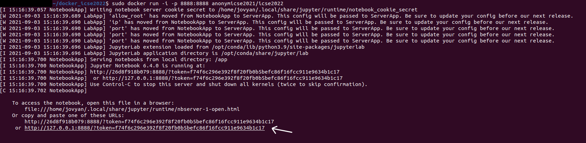
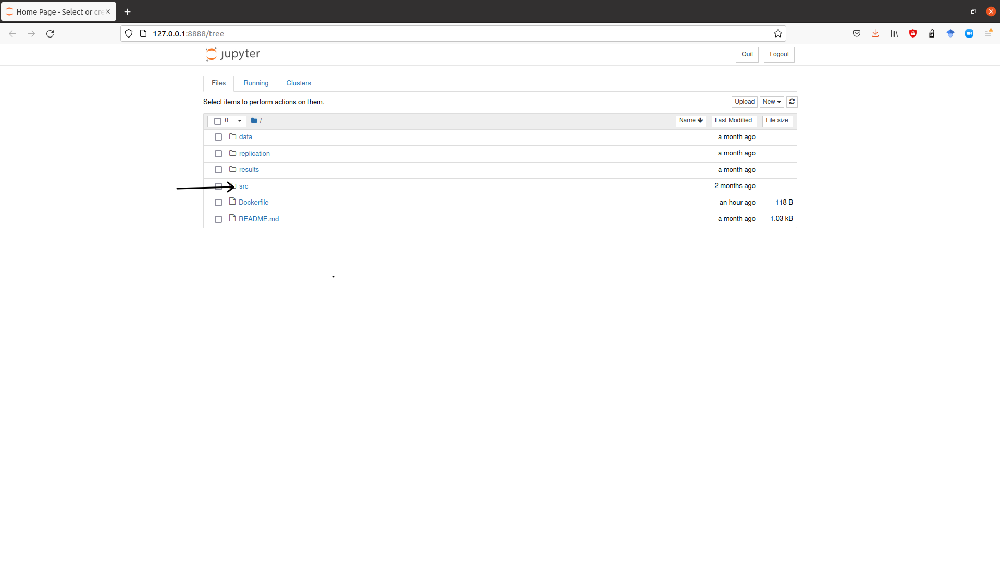
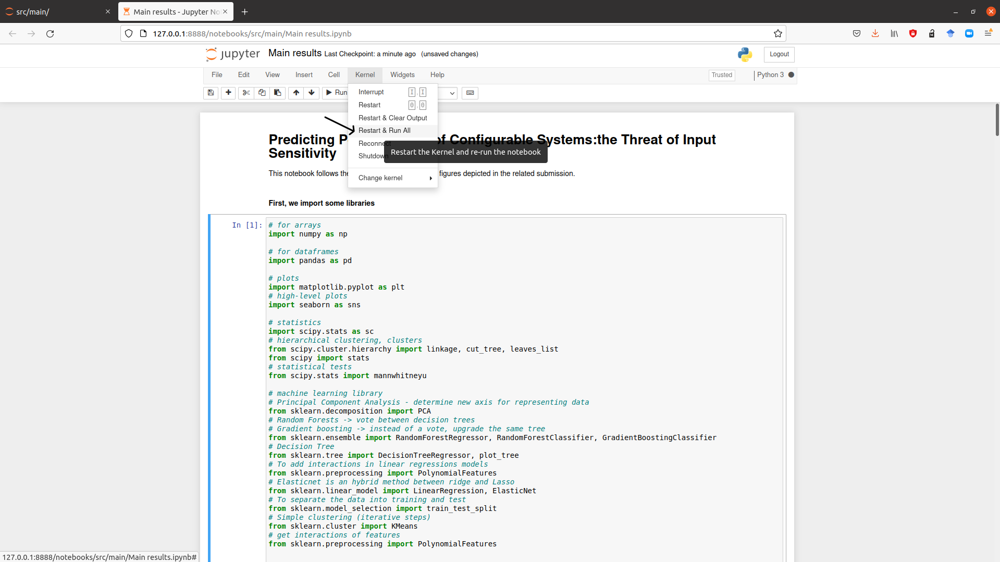

## Replication

To replicate our work, you have to:
1. Replicate the **measurement process**
2. **Run the code** in order to obtain our results

### Prerequisites

Install [docker](https://docs.docker.com/get-docker/). You can check that docker is working by checking its version (use the command line ```sudo docker --version```) or status (use ```sudo systemctl status docker```).

### 1. Measurement process

In this paper, we measured several performance properties of 8 different software systems (*gcc*, *ImageMagick*, *lingeling*, *nodeJS*, *poppler*, *xz* and *x264*) for multiple run-time configurations and multiple inputs. 

For each of these system, we provide a docker container to measure its performances:
- for *gcc*, please follow this link : https://hub.docker.com/r/anonymicse2021/gcc_inputs
- for *ImageMagick*, please follow this link : https://hub.docker.com/r/anonymicse2021/imagemagick_inputs
- for *lingeling*, please follow this link : https://hub.docker.com/r/anonymicse2021/lingeling_inputs
- for *nodeJS*, please follow this link : https://hub.docker.com/r/anonymicse2021/nodejs_inputs
- for *poppler*, please follow this link : https://hub.docker.com/r/anonymicse2021/poppler_inputs
- for *SQLite*, please follow this link : https://hub.docker.com/r/anonymicse2021/sqlite_inputs
- for *xz*, please follow this link : https://hub.docker.com/r/anonymicse2021/xz_inputs
- for *x264*, please follow this link : https://hub.docker.com/r/anonymicse2021/x264_inputs

For the rest of this part, we will consider xz's container, but the command lines we provide can be adapted to other containers. Note that docker will require administrative rights.

First, pull the container:

`sudo docker pull anonymicse2021/xz_inputs`

Run it in interactive mode:

`sudo docker run -it anonymicse2021/xz_inputs`

Now you are in the container. You can start the measurement process for xz. **WARNING! Since replicating all the measurements might take a while, we recommend you to stop the process after few minutes (2 or 3 is enough).**

`bash launchMeasures.sh`

To stop the process, just press ctrl + c on your keyboard. Now go to the output folder:

`cd output`

You will see a list of csv file similar (each with the name of the inputs processed by xz). To make sure that data are stored and that the container is working, and display the first file (if you are testing with another software system, just use `ls` to find a valid name):

`cat E.coli.csv`

You can compare it with this file : https://anonymous.4open.science/r/df319578-8767-47b0-919d-a8e57eb67d25/data/xz/Ecoli.csv

The first step is done!

You can `exit` the container.

### 2. Run the code

Now, you have the data. But how to replicate our results?

First, run this container :

`sudo docker run -i -p 8888:8888 anonymicse2021/icse2022`

Then, go to the link displayed on your terminal, starting with http://127.0.0.1:8888/?token= like in the following picture:



It will open a new tab on your web navigator, looking like this:



You can now click on the 'src' directory, and then on the 'main' directory...

Finally, open the 'Main results.ipynb' notebook, it will open a new tab. To run the code, search for "Kernel" -> "Restart and run all", and click, like this :



It will execute all the cells, displaying the different results of the submission.
You do not have to interfere with the notebook.
**WARNING! It might be long (maybe about 20-30 minutes) depending on your laptop, because there are lots of correlations to compute in figure 1 and lots of models for figure 2.**
It is time for a cup of coffee/tea/chocolate!

Check the results of the execution, i.e. the return of cells, and compare them to the figures of our paper.

The second part of the replication is done, you can now kill the process and exit the container.

Thank you for testing our artifact!

### To go further (optional for the testing of artifacts)

If you want to use our artifact to test new measurements, just follow this process:

1. Measurement process

First, you will have to select your software system. Make sure the software system provide run-time configuration options (reading the documentation helps to select the influential configuration options) and process input data.

Select a dataset of input data (c scripts for a compiler like gcc, databases for a DBMS like SQLite, etc.) and measure the performances of the software system for...
- All inputs
- All run-time configurations

... to obtain measurements following the structure detailed in the README.md of the data directory (each file for an input).

Copy these files in the docker container, in the data directory, with the name "mySoft" (see https://stackoverflow.com/questions/22907231/how-to-copy-files-from-host-to-docker-container).

2. Execute the code

Run the container as above:

`sudo docker run -i -p 8888:8888 anonymicse2021/icse2022`

Create a "mySoft" folder in the results directory : this directory aims at gathering the results for the new software system mySoft.

Open the main notebook.

In the second cell of code ([2], after the comment 'Import data') of the Main notebook, modify the second line of code ...

`name_systems = ["x264", "xz", "nodejs", "poppler"]`

by adding "mySoft" in the array. The second line of code should look like this : 

`name_systems = ["x264", "xz", "nodejs", "poppler", "mySoft"]`

Then, fill the inputperf dictionary with an array with the performance properties, inputsfeat with the configuration options, and inputcateg with the categorial features of your software system.

Execute the notebook as above, and check the "results/mySoft" directory.
