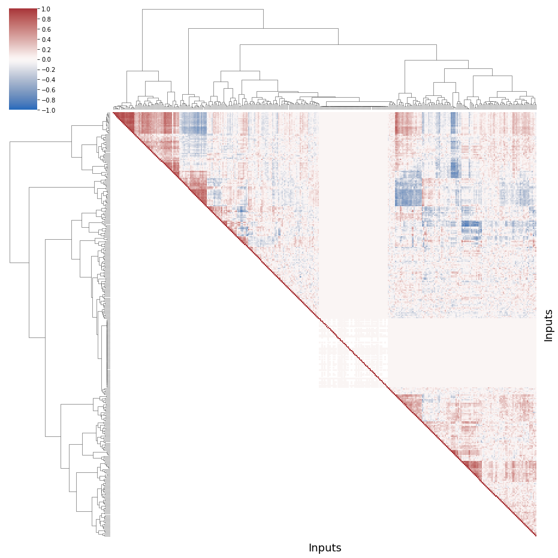
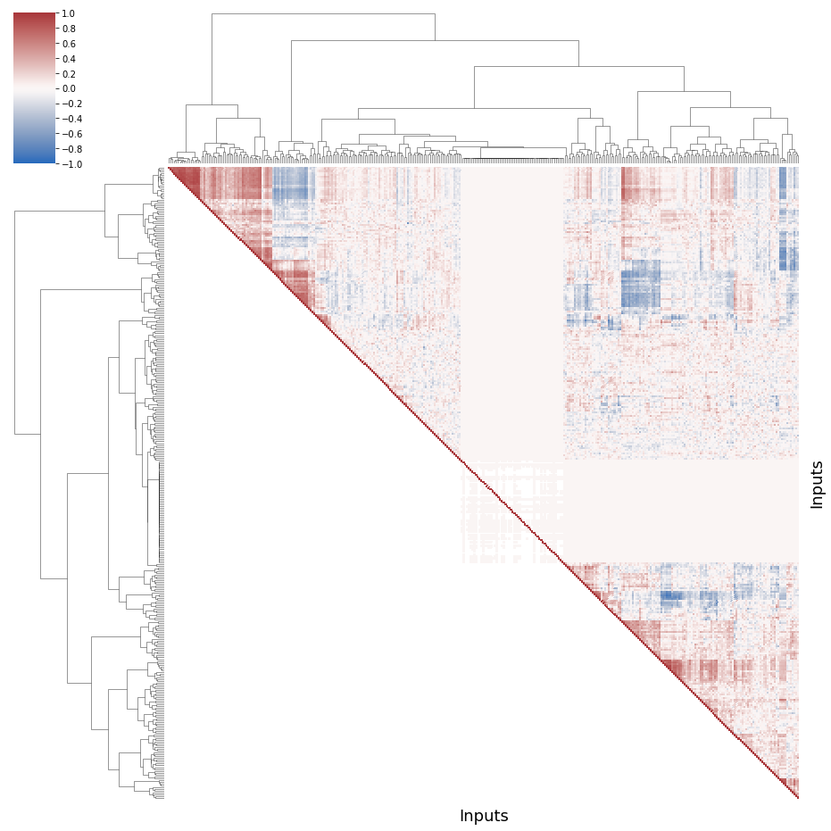
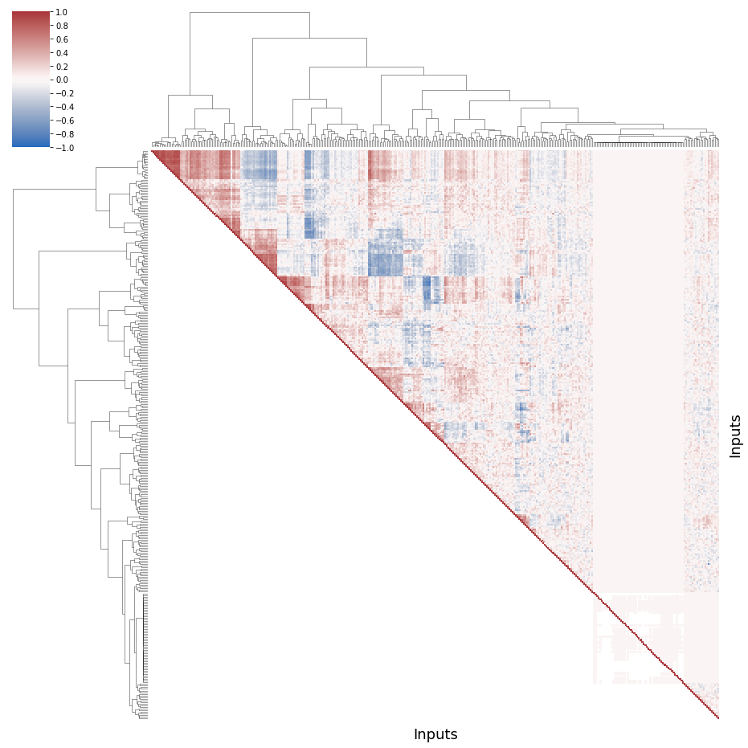
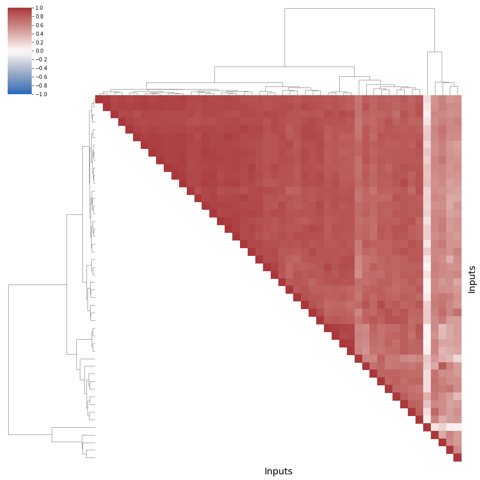
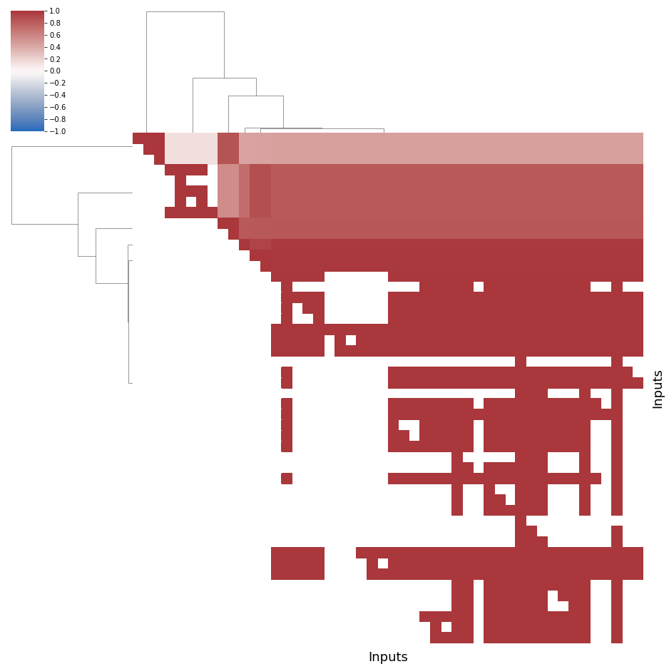
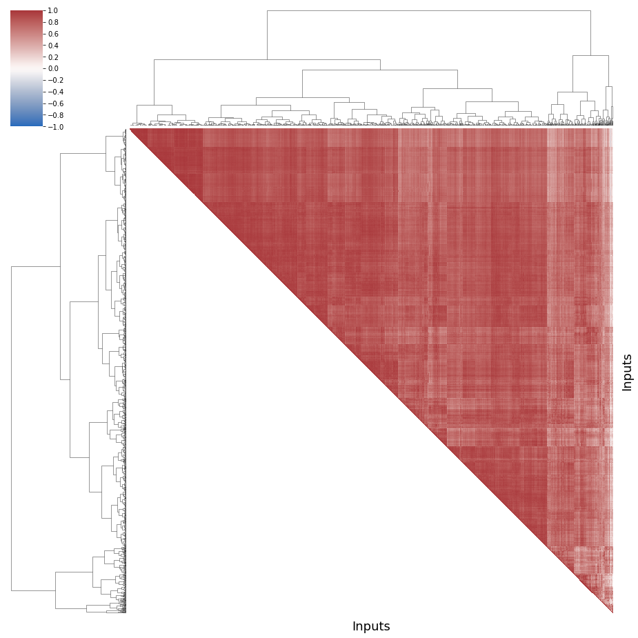
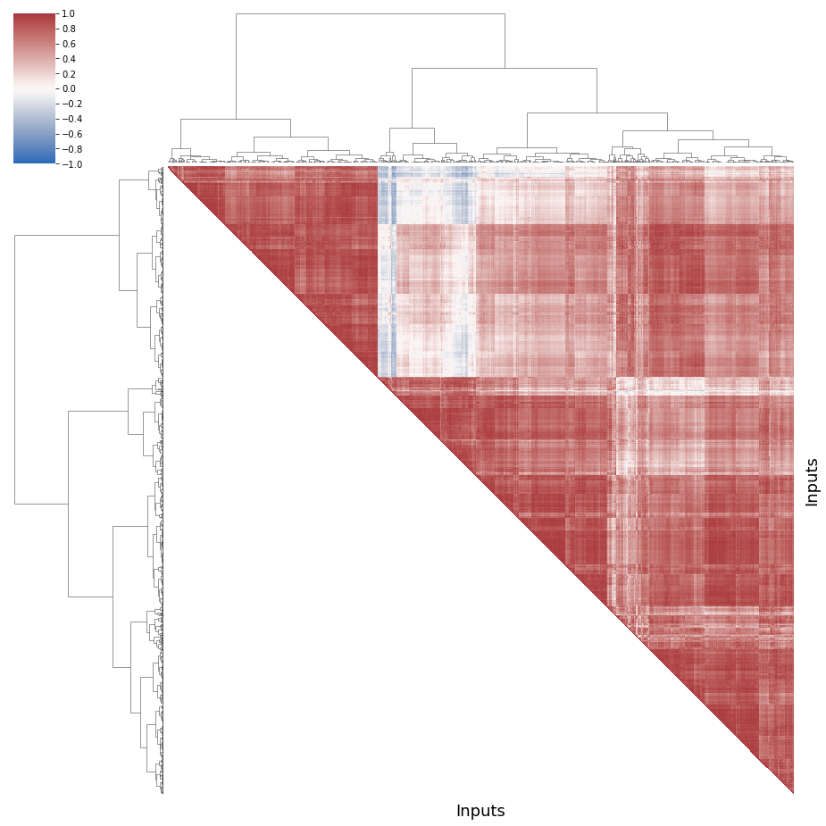

# First research question results

A common assertion in the transfer learning community is that the more the source and the target environment are similar in terms of software performances, the more the transfer will outperform the simple machine learning (i.e. directly on the target environment, without transfer). 
However, inputs have different properties that may change the software behavior and thus alter software performances.
To reuse a performance model on multiple inputs (\ie trained on one input and tested on another input), the performance of software systems must be consistent across inputs.

## $RQ_{1}$ - Do software performances stay consistent across inputs?
Are the performance distributions stable from one input to another? 
Are the rankings of performance the same for all inputs? 

To check this hypothesis, we compute, analyze and compare the Spearman's rank-order correlation of each couple of inputs for each system.

**Spearman correlations.**
The correlations are considered as a measure of similarity between the configurations' performances over two inputs. 
We use the Evans rule to interpret these correlations. In absolute value, we refer to correlations by the following labels; very low: 0-0.19, low: 0.2-0.39, moderate: 0.4-0.59, strong: 0.6-0.79, very strong: 0.8-1.00. 
A negative score tends to reverse the ranking of configurations. 
Very low or negative scores have practical implications: a good configuration for an input can very well exhibit bad performances for another input. 

### First, we import some libraries


```python
# for arrays
import numpy as np

# for dataframes
import pandas as pd

# plots
import matplotlib.pyplot as plt
# high-level plots
import seaborn as sns

# statistics
import scipy.stats as sc
# hierarchical clustering, clusters
from scipy.cluster.hierarchy import linkage, cut_tree, leaves_list
from scipy import stats
# statistical tests
from scipy.stats import mannwhitneyu

# machine learning library
# Principal Component Analysis - determine new axis for representing data
from sklearn.decomposition import PCA
# Random Forests -> vote between decision trees
# Gradient boosting -> instead of a vote, upgrade the same tree
from sklearn.ensemble import RandomForestRegressor, RandomForestClassifier, GradientBoostingClassifier
# Decision Tree
from sklearn.tree import DecisionTreeRegressor, plot_tree
# To add interactions in linear regressions models
from sklearn.preprocessing import PolynomialFeatures
# Elasticnet is an hybrid method between ridge and Lasso
from sklearn.linear_model import LinearRegression, ElasticNet
# To separate the data into training and test
from sklearn.model_selection import train_test_split
# Simple clustering (iterative steps)
from sklearn.cluster import KMeans
# get interactions of features
from sklearn.preprocessing import PolynomialFeatures


# we use it to interact with the file system
import os
# compute time
from time import time

# statistics
import scipy.stats as sc
# hierarchical clustering, clusters
from scipy.cluster.hierarchy import linkage, cut_tree, leaves_list
from scipy import stats
# statistical tests
from scipy.stats import mannwhitneyu

# no warning
import warnings
warnings.filterwarnings("ignore")
```

### Then the data


```python
data_dir = "../../../data/"
name_systems = ["nodejs", "poppler", "xz", "x264", "gcc", "lingeling"]

data = dict()
inputs_name = dict()
inputs_count = dict()

inputs_perf = dict()

inputs_perf["x264"] = ["size", "kbs", "fps", "etime", "cpu"]
inputs_perf["xz"] = ["size", "time"]
inputs_perf["poppler"] = ["size", "time"]
inputs_perf["nodejs"] = ["ops"]
inputs_perf["gcc"] = ["size", "time"]
inputs_perf["lingeling"] = ["conflicts", "cps", "reductions"]

inputs_feat = dict()

inputs_feat["x264"] = ["cabac", "ref", "deblock", "analyse", "me", "subme", "mixed_ref", "me_range", "trellis", 
                "8x8dct", "fast_pskip", "chroma_qp_offset", "bframes", "b_pyramid", "b_adapt", "direct", 
                "weightb", "open_gop", "weightp", "scenecut", "rc_lookahead", "mbtree", "qpmax", "aq-mode"]
inputs_feat["xz"] = ["memory","format","level","depth"]
inputs_feat["poppler"] = ["format","j","jp2","jbig2","ccitt"]
inputs_feat["nodejs"] = ["--jitless", "--experimental-wasm-modules", "--experimental-vm-modules",
                         "--preserve-symlinks-main","--no-warnings","--node-memory-debug"]
inputs_feat["gcc"] = ["optim","-floop-interchange","-fprefetch-loop-arrays","-ffloat-store","-fno-asm"]
inputs_feat["lingeling"] = ["--boost", "--carduse", "--decompose", "--gluescale", "--lkhd", "--memlim", 
"--minimize", "--prbsimple", "--sweepirr", "--sweepred"]

inputs_categ = dict()

inputs_categ["x264"] = ['analyse', 'me', 'direct', 'deblock']
inputs_categ["xz"] = ['memory', 'format']
inputs_categ["nodejs"] = []
inputs_categ["poppler"] = ["format"]
inputs_categ["gcc"] = ["optim"]
inputs_categ["lingeling"] = []

for ns in name_systems:
    
    data_path = data_dir+ns+'/'
    
    inputs = sorted(os.listdir(data_path))
    inputs.remove('others')

    inputs_name[ns] = inputs
    inputs_count[ns] = len(inputs)
    
    for i in range(len(inputs)):
        loc = data_path+inputs[i]
        data[ns, i] = pd.read_csv(loc)
```

# RQ1 code

### We define a function to plot and save the correlogram


```python
def plot_correlationmatrix_dendogram(ns, dim):
    # ns : name_system
    # dim : dimension
    # output : a plot of an ordered correlogram of the different compile-time options
    
    # number of videos
    inputs_nb = inputs_count[ns]

    corr = [[0 for x in range(inputs_nb)] for y in range(inputs_nb)]

    for i in range(inputs_nb):
        for j in range(inputs_nb):
            # A distribution of bitrates will have a correlaiton of 1 with itself
            if (i == j):
                corr[i][j] = 1
            else:
                # we compute the Spearman correlation between the input video i and the input video j
                corr[i][j] = sc.spearmanr(data[ns, i][dim],
                                          data[ns, j][dim]).correlation

    # we transform our matrix into a dataframe
    df = pd.DataFrame(corr)
    df = df.fillna(0)

    # group the videos, we choose the ward method 
    # single link method (minimum of distance) leads to numerous tiny clusters
    # centroid or average tend to split homogeneous clusters
    # and complete link aggregates unbalanced groups. 
    links = linkage(df, method="ward",)
    order = leaves_list(links)
    
    # Generate a mask for the upper triangle
    # we order the correlation following the aggregation clustering
    mask = np.zeros_like(corr, dtype=np.bool)

    for i in range(inputs_nb):
        for j in range(inputs_nb):    
            if i>j:
                mask[order[i]][order[j]] = True

    g = sns.clustermap(df, cmap="vlag", mask=mask, method="ward",
                   linewidths=0, figsize=(13, 13), 
                   cbar_kws={"ticks":[k/5 for k in np.arange(-10,10,1)]}, 
                   vmin =-1)
    g.ax_heatmap.set_yticklabels([])
    g.ax_heatmap.set_xticklabels([])
    g.ax_heatmap.tick_params(right=False, bottom=False)
    # abcissa and ordered labels
    g.ax_heatmap.set_xlabel("Inputs", fontsize = 18)
    g.ax_heatmap.set_ylabel("Inputs", fontsize = 18)
    # we save the figure in the result folder
    plt.savefig("../../../results/systems/"+ns+"/"+"corr_"+dim+".png")
    # we show the graph
    plt.show()
    
    return corr
```

### Then, we define a function to summarize the distribution of correlations

To show some basic statistics, as the average value, the median, the quartiles, etc.


```python
def describe(corr):
    
    corrDescription = [corr[i][j] for i in range(len(corr)) 
                              for j in range(len(corr)) if i >j]
    
    return np.round(pd.Series(corrDescription).describe(), 2)
```

# RQ1 results for each system

### GCC

#### time


```python
corr = plot_correlationmatrix_dendogram("gcc", "time")
```


    

    


```python
describe(corr)
```

#### size


```python
corr = plot_correlationmatrix_dendogram("gcc", "size")
```


    

    


```python
describe(corr)
```

### Lingeling

#### conflicts


```python
corr = plot_correlationmatrix_dendogram("lingeling", "conflicts")
```


    

    


```python
describe(corr)
```

#### conflicts per second


```python
corr = plot_correlationmatrix_dendogram("lingeling", "cps")
```


    

    


```python
describe(corr)
```

#### reductions


```python
corr = plot_correlationmatrix_dendogram("lingeling", "reductions")
```


    

    


```python
describe(corr)
```


```python

```

### NodeJS

#### number of operations per second


```python
corr = plot_correlationmatrix_dendogram("nodejs", "ops")
```


    

    


```python
describe(corr)
```

### Poppler

#### size


```python
corr = plot_correlationmatrix_dendogram("poppler", "size")
```


    

    


```python
describe(corr)
```

#### time


```python
corr = plot_correlationmatrix_dendogram("poppler", "time")
```


    

    


```python
describe(corr)
```


    count    1094460.00
    mean           0.19
    std            0.41
    min           -0.94
    25%           -0.11
    50%            0.15
    75%            0.52
    max            1.00
    dtype: float64


### xz

#### size


```python
corr = plot_correlationmatrix_dendogram("xz", "size")
```


    

    


```python
describe(corr)
```

#### time


```python
corr = plot_correlationmatrix_dendogram("xz", "time")
```


    

    


```python
describe(corr)
```

### x264

#### bitrate


```python
corr = plot_correlationmatrix_dendogram("x264", "kbs")
```


    

    


```python
describe(corr)
```

#### frame encoded per second


```python
corr = plot_correlationmatrix_dendogram("x264", "fps")
```


    

    


```python
describe(corr)
```

#### CPU usage


```python
corr = plot_correlationmatrix_dendogram("x264", "cpu")
```


    

    


```python
describe(corr)
```

#### Encoded size of video


```python
corr = plot_correlationmatrix_dendogram("x264", "size")
```


    

    


```python
describe(corr)
```

#### Encoding time


```python
corr = plot_correlationmatrix_dendogram("x264", "etime")
```


    

    


```python
describe(corr)
```


    count    975106.00
    mean          0.93
    std           0.08
    min           0.02
    25%           0.93
    50%           0.96
    75%           0.97
    max           1.00
    dtype: float64


```python

```
