# Second research question results

But software performances are influenced by the configuration options e.g. the energy consumption. 
An option is called influential for a performance when its values have a strong effect on this performance. 
For example, developers might wonder whether the option they add to a configurable software has an influence on its performance.
However, is an option identified as influential for some inputs still influential for other inputs?
If not, it would become both tedious and time-consuming to find influential options on a per-input basis. 
Besides, it is unclear if activating an option is always worth it in terms of performance; an option could improve the overall performance but reduce it for few inputs. 
If so, users may wonder which options to enable to improve software performances based on their input data. 

In order to understand how a performance model can change based on a given input, we next study how input data interact with configuration options. 

## $RQ_{2}$ - Do configuration option’s effects change with in-put data?


To assess the relative importances and effects of options, we use two well-known statistical methods. 


**Random Forest Importances.** The tree structure provides insights about the most essential options for prediction as a tree splits first options that provide the highest information gain. 
We use random forests (a vote between multiple decision trees):
we can derive, from the forests trained on the inputs, estimates of the options importance. 
The computation of option importance is realized through the observation of the effect on random forest accuracy of randomly shuffling each predictor variable.
For a random forest, we consider that an option is influential if its option importance (i.e. median on all inputs) is greater than $\frac{1}{n_{opt}}$, where $n_{opt}$ is the number of options considered in the dataset. 
This threshold represents the theoretic importance of options for a software having equally important options (inspired by the Kaiser rule). 


**Linear Regression Coefficients.** The coefficients of an Ordinary Least Square (OLS) regression weight the effect of configuration options. 
These coefficients can be positive (resp. negative) if a bigger (resp. lower) option value results in a bigger performance. 
Ideally, the sign of the coefficients of a given option should remain the same for all inputs: it would suggest that the effect of an option onto performance is stableWe also provide details about coefficients related to the interactions of options (i.e. feature interactions).


#### First, we import some libraries


```python
# for arrays
import numpy as np

# for dataframes
import pandas as pd

# plots
import matplotlib.pyplot as plt
# high-level plots
import seaborn as sns

# statistics
import scipy.stats as sc
# hierarchical clustering, clusters
from scipy.cluster.hierarchy import linkage, cut_tree, leaves_list
from scipy import stats
# statistical tests
from scipy.stats import mannwhitneyu

# machine learning library
# Principal Component Analysis - determine new axis for representing data
from sklearn.decomposition import PCA
# Random Forests -> vote between decision trees
# Gradient boosting -> instead of a vote, upgrade the same tree
from sklearn.ensemble import RandomForestRegressor, RandomForestClassifier, GradientBoostingClassifier
# Decision Tree
from sklearn.tree import DecisionTreeRegressor, plot_tree
# To add interactions in linear regressions models
from sklearn.preprocessing import PolynomialFeatures
# Elasticnet is an hybrid method between ridge and Lasso
from sklearn.linear_model import LinearRegression, ElasticNet
# To separate the data into training and test
from sklearn.model_selection import train_test_split
# Simple clustering (iterative steps)
from sklearn.cluster import KMeans
# get interactions of features
from sklearn.preprocessing import PolynomialFeatures


# we use it to interact with the file system
import os
# compute time
from time import time

# statistics
import scipy.stats as sc
# hierarchical clustering, clusters
from scipy.cluster.hierarchy import linkage, cut_tree, leaves_list
from scipy import stats
# statistical tests
from scipy.stats import mannwhitneyu

# no warning
import warnings
warnings.filterwarnings("ignore")
```

### Import data


```python
data_dir = "../../../data/"
name_systems = ["nodejs", "poppler", "xz", "x264", "gcc", "lingeling"]

data = dict()
inputs_name = dict()
inputs_count = dict()

inputs_perf = dict()

inputs_perf["x264"] = ["size", "kbs", "fps", "etime", "cpu"]
inputs_perf["xz"] = ["size", "time"]
inputs_perf["poppler"] = ["size", "time"]
inputs_perf["nodejs"] = ["ops"]
inputs_perf["gcc"] = ["size", "time"]
inputs_perf["lingeling"] = ["conflicts", "cps", "reductions"]

inputs_feat = dict()

inputs_feat["x264"] = ["cabac", "ref", "deblock", "analyse", "me", "subme", "mixed_ref", "me_range", "trellis", 
                "8x8dct", "fast_pskip", "chroma_qp_offset", "bframes", "b_pyramid", "b_adapt", "direct", 
                "weightb", "open_gop", "weightp", "scenecut", "rc_lookahead", "mbtree", "qpmax", "aq-mode"]
inputs_feat["xz"] = ["memory","format","level","depth"]
inputs_feat["poppler"] = ["format","j","jp2","jbig2","ccitt"]
inputs_feat["nodejs"] = ["--jitless", "--experimental-wasm-modules", "--experimental-vm-modules",
                         "--preserve-symlinks-main","--no-warnings","--node-memory-debug"]
inputs_feat["gcc"] = ["optim","-floop-interchange","-fprefetch-loop-arrays","-ffloat-store","-fno-asm"]
inputs_feat["lingeling"] = ["--boost", "--carduse", "--decompose", "--gluescale", "--lkhd", "--memlim", 
"--minimize", "--prbsimple", "--sweepirr", "--sweepred"]

inputs_categ = dict()

inputs_categ["x264"] = ['analyse', 'me', 'direct', 'deblock']
inputs_categ["xz"] = ['memory', 'format']
inputs_categ["nodejs"] = []
inputs_categ["poppler"] = ["format"]
inputs_categ["gcc"] = ["optim"]
inputs_categ["lingeling"] = []

for ns in name_systems:
    
    data_path = data_dir+ns+'/'
    
    inputs = sorted(os.listdir(data_path))
    inputs.remove('others')

    inputs_name[ns] = inputs
    inputs_count[ns] = len(inputs)
    
    for i in range(len(inputs)):
        loc = data_path+inputs[i]
        data[ns, i] = pd.read_csv(loc)
```

# RQ2 code

## Compute importances


```python
def compute_importances(ns, dim):
    # input : a list of videos
    # output : a dataframe of feature importances
    
    # the final list of importances
    listImportances = []
    
    features = inputs_feat[ns]
    to_keep = [f for f in features]
    to_keep.append(dim)
    categorial = inputs_categ[ns]

    # for each video of the list
    for id_input in range(inputs_count[ns]):
        
        # we replace missing numbers by 0
        df = data[ns, id_input][to_keep]
        
        df = df.replace(to_replace = "None", value = '0')
        
        # standardization
        for col in features:
            # we center and reduce the quantitative variables
            # i.e substract the mean, and divide by the standard deviation
            # to avoid the scale of the vars to interfere with the learning process
            if col not in categorial:
                arr_col = np.array(df[col], float)
                arr_col = (arr_col-np.mean(arr_col))/(np.std(arr_col)+1e-5)
                df[col] = arr_col
            else:
                # if the variable is categorial
                df[col] = [np.where(k==df[col].unique())[0][0] for k in df[col]]
                arr_col = np.array(df[col], float)
                arr_col = (arr_col-np.mean(arr_col))/(np.std(arr_col)+1e-5)
                df[col] = arr_col
        
        # for each video, we train a model
        clf = RandomForestRegressor(n_estimators=20)
        # we use all the configuration options as predicting variables
        X = df.drop([dim], axis=1)
        # and the bitrate distribution of the video as a variable to predict
        y = df[dim]
        # we train the model on all the data (not train-test since we don't use the model)
        clf.fit(X, y)
        
        # we add feature importances to the list
        listImportances.append(clf.feature_importances_)
    
    # final dataframe of feature importances
    res = pd.DataFrame({'features' : features})
    
    # significative numbers p, cs = 10^p
    cs = 100
    
    # we add the feature imps to the dataframe 
    for id_input in range(len(listImportances)):
        res['video_'+str(id_input)] = np.round(cs*listImportances[id_input])/cs
    
    # transpose it
    res = res.set_index('features').transpose()
    
    # return it 
    return res
```

## Compute effects


```python
def compute_coefs(ns, dim):
    # input : a list of videos
    # output : a dataframe of feature importances
    
    # the final list of coefficients
    listCoefs = []
    
    features = inputs_feat[ns]
    to_keep = [f for f in features]
    to_keep.append(dim)
    categorial = inputs_categ[ns]

    # for each video of the list
    for id_input in range(inputs_count[ns]):
        
        # we replace missing numbers by 0
        df = data[ns, id_input][to_keep]
        
        df = df.replace(to_replace = "NaN", value = '0')
        df = df.replace(to_replace = "None", value = '0')

        # standardization
        for col in to_keep:
            # we center and reduce the quantitative variables
            # i.e substract the mean, and divide by the standard deviation
            # to avoid the scale of the vars to interfere with the learning process
            if col not in categorial:
                arr_col = np.array(df[col], float)
                arr_col = (arr_col-np.mean(arr_col))/(np.std(arr_col)+1e-5)
                df[col] = arr_col
            else:
                # if the variable is categorial
                df[col] = [np.where(k==df[col].unique())[0][0] for k in df[col]]
                arr_col = np.array(df[col], float)
                arr_col = (arr_col-np.mean(arr_col))/(np.std(arr_col)+1e-5)
                df[col] = arr_col

        # for each video, we train a model
        indexes = np.array([k for k in range(len(df[dim])) 
                            if df[dim][k] != float("inf") and not np.isnan(df[dim][k])],int)
        lr = LinearRegression()
        # we use all the configuration options as predicting variables
        X = df.drop([dim], axis=1)
        # and the bitrate distribution of the video as a variable to predict
        y = [float(k) for k in df[dim]]
        #print(y)
        # we train the model on all the data (not train-test since we don't use the model)
        lr.fit(X, y)
        # we add feature importances to the list
        listCoefs.append(lr.coef_)
    
    # final dataframe of feature importances
    res = pd.DataFrame({'features' : features})
    
    # significative numbers p, cs = 10^p
    cs = 100
    
    # we add the feature imps to the dataframe 
    for id_input in range(len(listCoefs)):
        res['video_'+str(id_input)] = np.round(cs*listCoefs[id_input])/cs
    
    # transpose it
    res = res.set_index('features').transpose()
    
    # return it 
    return res
```

## Show the boxplot of effects and importances


```python
def boxplot_imp(ns, dim, xlim = None, xname='Importances'):
    ### in: 
    #### ns the name of the system
    #### dim the name of the current performance property
    #### xlim limits if needed to focus on the important part of the chart
    #### xname the name of the abcissae and if we compute the importances or the effects
    ### out :
    #### a boxplot (saved in the system file)
    
    if xname == 'Importances':
        res = compute_importances(ns, dim)
    else:
        res = compute_coefs(ns, dim)
    
    # sort by names
    listImp = [(np.abs(np.percentile(res[col],75)-np.percentile(res[col],25)),res[col], col) 
               for col in res.columns]
    listImp.sort(key=lambda tup: tup[2], reverse=True)

    # see figures 2a and 2b
    red_square = dict(markerfacecolor='r', marker='s')
    plt.figure(figsize=(15,8))
    plt.grid()
    plt.boxplot([l[1] for l in listImp], flierprops=red_square, 
              vert=False, patch_artist=True, #widths=0.25,
              boxprops=dict(facecolor=(0,0,1,0.5),linewidth=1,edgecolor='k'),
              whiskerprops = dict(linestyle='-.',linewidth=1.0, color='black'))
    plt.xlabel(xname, size=13)
    if xlim:
        plt.xlim(xlim)
    plt.yticks(range(1, len(listImp) + 1), [l[2] for l in listImp])
    if xname == 'Importances':
        plt.savefig("../../../results/systems/"+ns+"/"+"boxplot_imp_"+dim+".png")
    else:
        plt.savefig("../../../results/systems/"+ns+"/"+"boxplot_effect_"+dim+".png")
    plt.show()
```

# RQ2 results for each system

### GCC

#### time


```python
boxplot_imp("gcc", "time", xlim =[0,1], xname='Importances')
boxplot_imp("gcc", "time", xlim =[-1,1], xname='Coefficients')
```


    

    


    

    


#### size


```python
boxplot_imp("gcc", "size", xlim =[0,1], xname='Importances')
boxplot_imp("gcc", "size", xlim =[-1,1], xname='Coefficients')
```


    

    


    
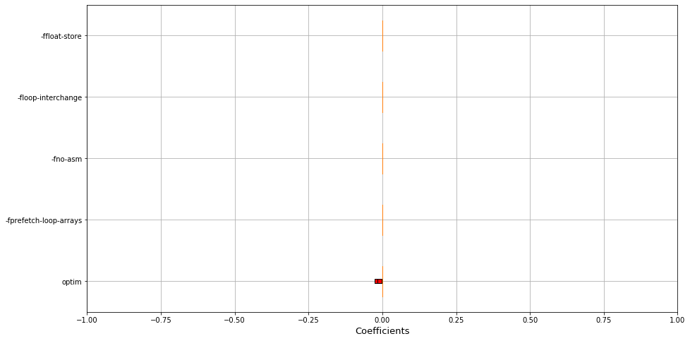
    


### Lingeling

#### conflicts


```python
boxplot_imp("lingeling", "conflicts", xlim =[0,1], xname='Importances')
boxplot_imp("lingeling", "conflicts", xlim =[-1,1], xname='Coefficients')
```


    
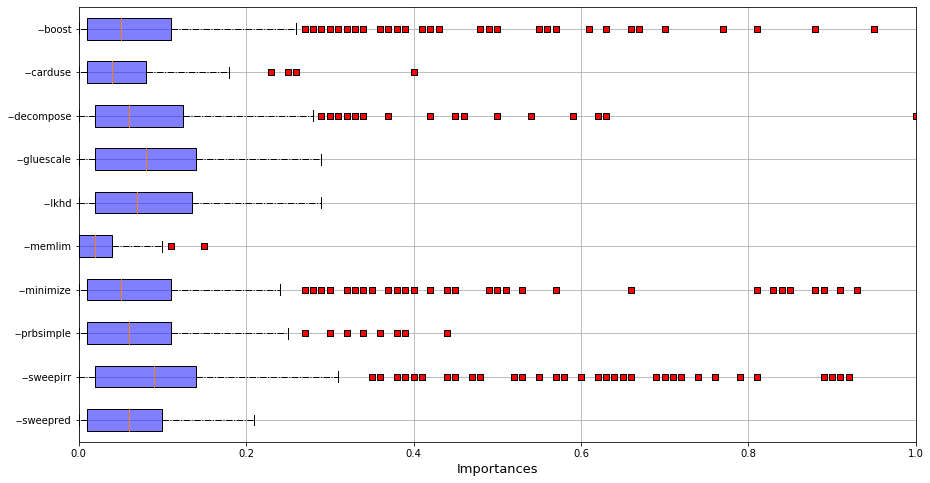
    


    
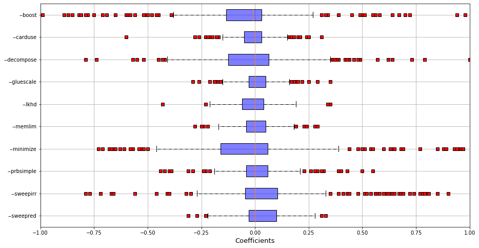
    


#### conflicts per second


```python
boxplot_imp("lingeling", "cps", xlim =[0,1], xname='Importances')
boxplot_imp("lingeling", "cps", xlim =[-1,1], xname='Coefficients')
```


    
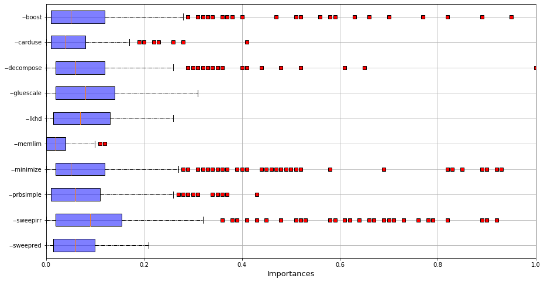
    


    
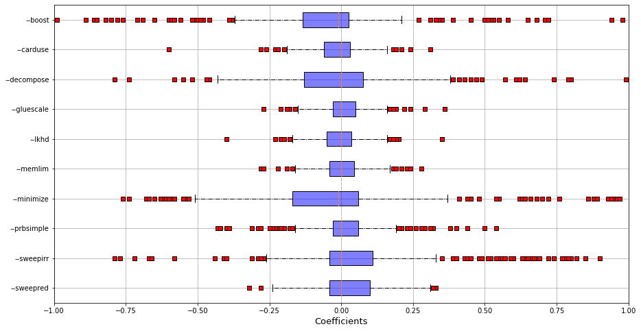
    


#### reductions


```python
boxplot_imp("lingeling", "reductions", xlim =[0,1], xname='Importances')
boxplot_imp("lingeling", "reductions", xlim =[-1,1], xname='Coefficients')
```


    
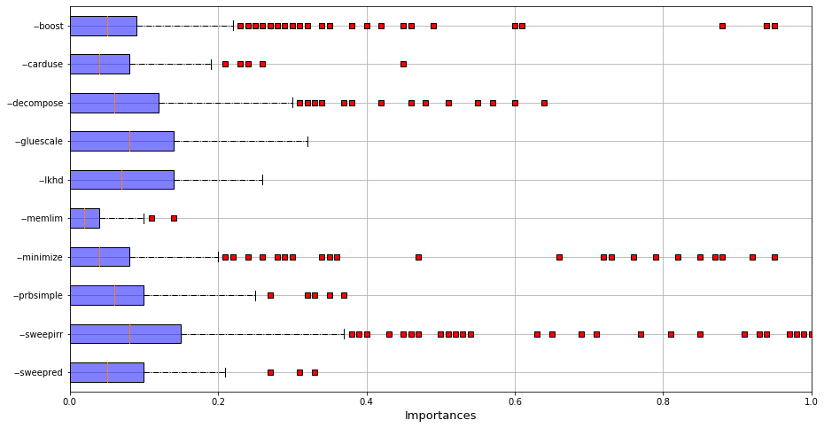
    


    

    


### NodeJS

#### number of operations per second


```python
boxplot_imp("nodejs", "ops", xlim =[0,1], xname='Importances')
boxplot_imp("nodejs", "ops", xlim =[-1,1], xname='Coefficients')
```


    

    


    

    


### Poppler

#### size


```python
boxplot_imp("poppler", "size", xlim =[0,1], xname='Importances')
boxplot_imp("poppler", "size", xlim =[-1,1], xname='Coefficients')
```


    

    


    
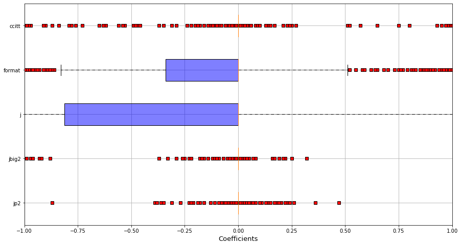
    


#### time


```python
boxplot_imp("poppler", "time", xlim =[0,1], xname='Importances')
boxplot_imp("poppler", "time", xlim =[-1,1], xname='Coefficients')
```


    
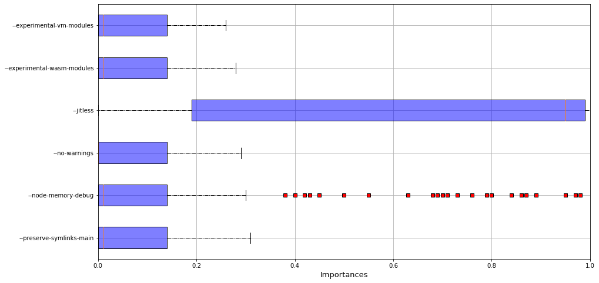
    


    

    


### xz

#### size


```python
boxplot_imp("xz", "size", xlim =[0,1], xname='Importances')
boxplot_imp("xz", "size", xlim =[-1,1], xname='Coefficients')
```


    

    


    
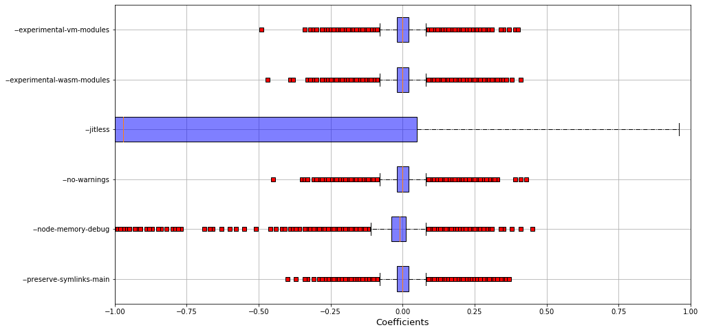
    


#### time


```python
boxplot_imp("xz", "time", xlim =[0,1], xname='Importances')
boxplot_imp("xz", "time", xlim =[-1,1], xname='Coefficients')
```


    

    


    

    


### x264

#### bitrate


```python
boxplot_imp("x264", "kbs", xlim =[0,1], xname='Importances')
boxplot_imp("x264", "kbs", xlim =[-1,1], xname='Coefficients')
```


    

    


    

    


#### frame encoded per second


```python
boxplot_imp("x264", "fps", xlim =[0,1], xname='Importances')
boxplot_imp("x264", "fps", xlim =[-1,1], xname='Coefficients')
```


    

    


    

    


#### CPU usage


```python
boxplot_imp("x264", "cpu", xlim =[0,1], xname='Importances')
boxplot_imp("x264", "cpu", xlim =[-1,1], xname='Coefficients')
```


    

    


    
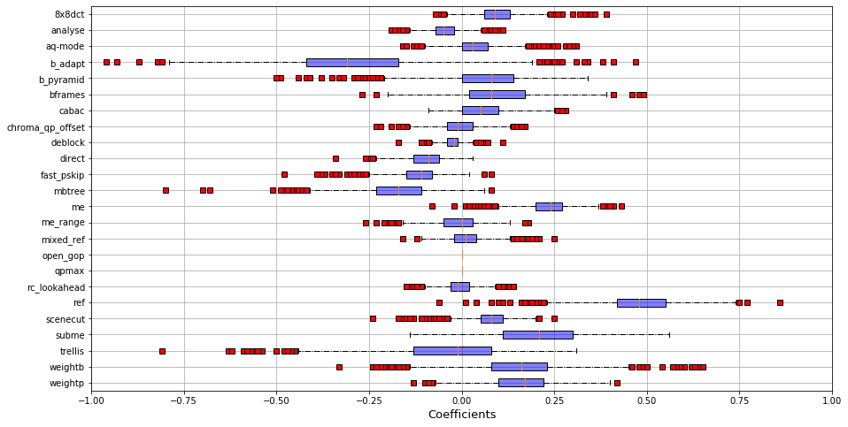
    


#### Encoded size of video


```python
boxplot_imp("x264", "size", xlim =[0,1], xname='Importances')
boxplot_imp("x264", "size", xlim =[-1,1], xname='Coefficients')
```


    
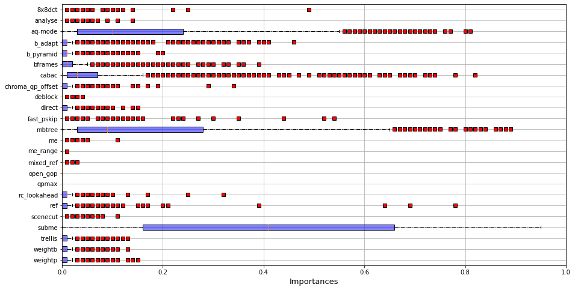
    


    
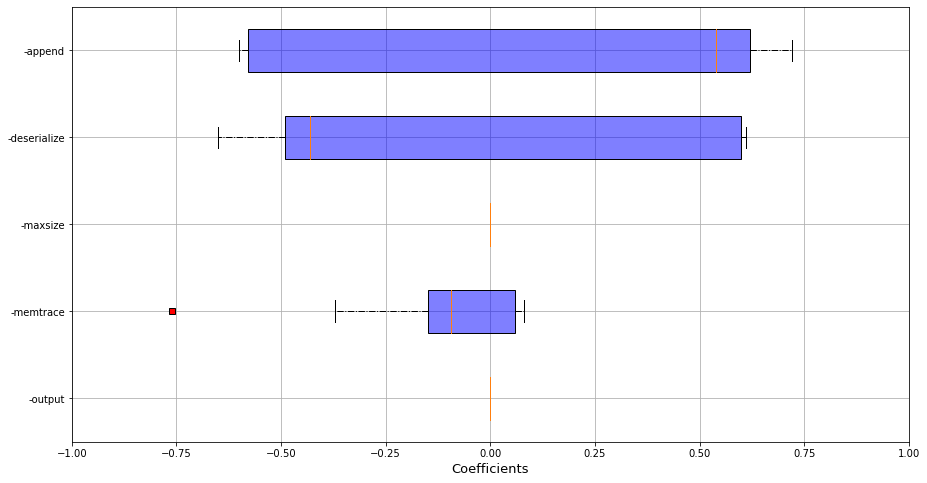
    


#### Encoding time


```python
boxplot_imp("x264", "etime", xlim =[0,1], xname='Importances')
boxplot_imp("x264", "etime", xlim =[-1,1], xname='Coefficients')
```


    

    


    
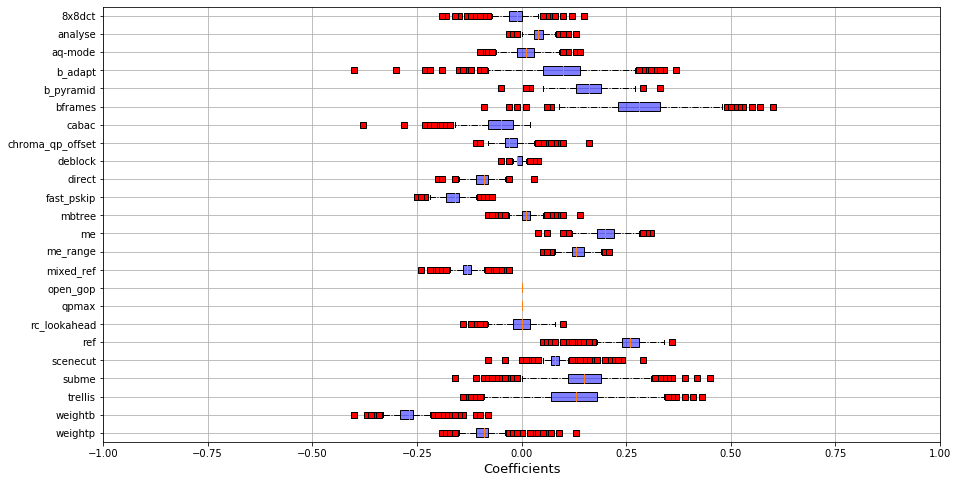
    


```python

```


```python

```


```python

```


```python

```


```python

```


```python

```


```python

```


```python

```
