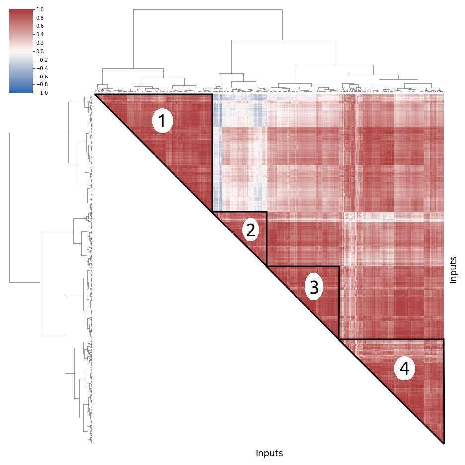
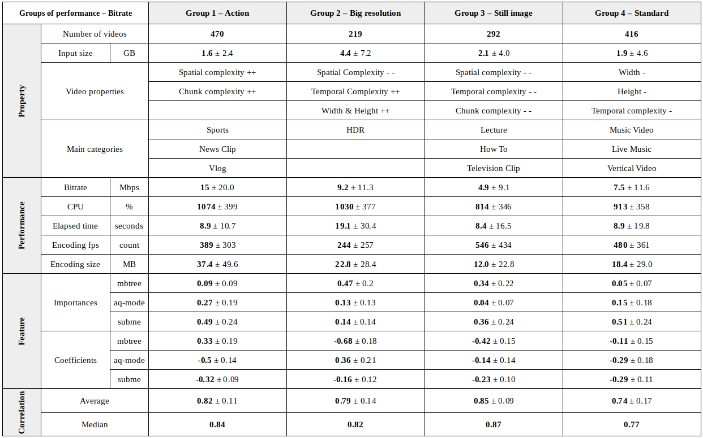
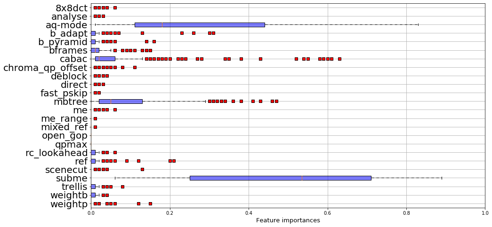
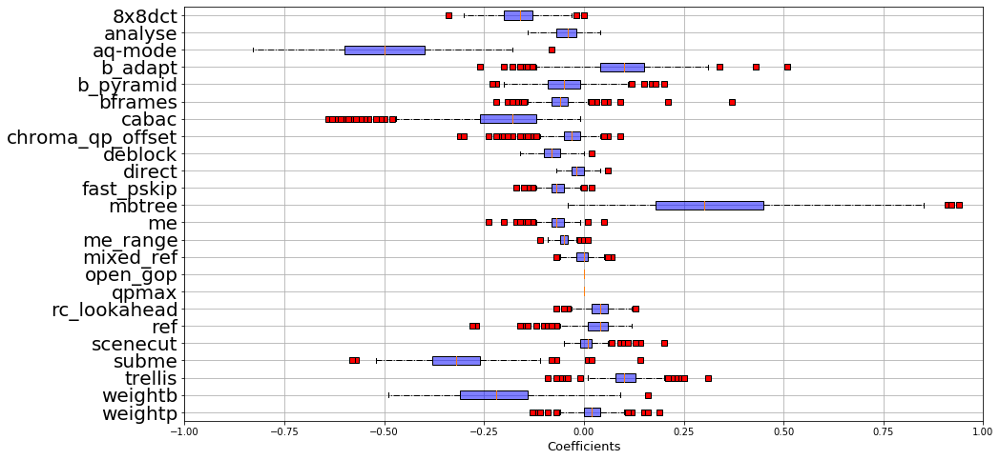
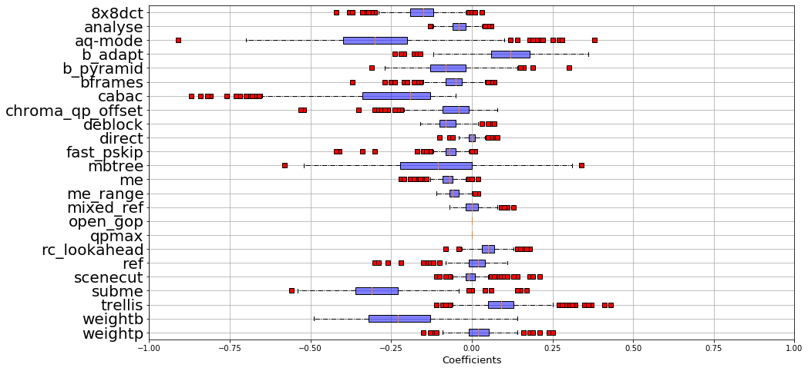

# Groups of inputs based on their performances : the case study of x264 and the bitrate

#### First, we import some libraries


```python
import numpy as np

import pandas as pd

import matplotlib.pyplot as plt
import seaborn as sns

import scipy.stats as sc
from scipy.cluster.hierarchy import linkage, cut_tree, leaves_list
from scipy import stats
from scipy.stats import mannwhitneyu

from sklearn.decomposition import PCA
from sklearn.ensemble import RandomForestRegressor, RandomForestClassifier, GradientBoostingClassifier
from sklearn.preprocessing import PolynomialFeatures
from sklearn.linear_model import LinearRegression, ElasticNet
from sklearn.model_selection import train_test_split
from sklearn.cluster import KMeans

import os

import keras
from keras.models import Sequential,Input,Model
from keras.layers import Dense, Dropout, Flatten
from keras.layers import Conv2D, MaxPooling2D, Activation
from keras.layers.normalization import BatchNormalization
from keras.preprocessing.image import ImageDataGenerator
from keras import regularizers
```

    Using TensorFlow backend.


#### Then we import x264 data


```python
res_dir = "../../../data/x264/"

v_names = sorted(os.listdir(res_dir)) 
# so we keep the same ids between two launches
v_names.remove("others")

listVideo = []

for v in v_names:
    data = pd.read_table(res_dir+v, delimiter = ',')
    listVideo.append(data)

input_sizes = pd.read_csv("../../../data/x264/others/ugc_meta/sizes.csv", delimiter=',').set_index('name')

for i in range(len(listVideo)):
    input_video_size = input_sizes.loc[v_names[i][:-4]]['size']
    listVideo[i]['crate'] = listVideo[i]['size']/input_video_size
    
predDimension = "kbs"

for i in range(len(listVideo)):
    sizes = listVideo[i][predDimension]
    ind = sorted(range(len(sizes)), key=lambda k: sizes[k])
    listVideo[i]['ranking'] = ind
```

## Groups of inputs based on performances


```python
nbVideos = len(listVideo)
corrSpearman = [[0 for x in range(nbVideos)] for y in range(nbVideos)]

for i in range(nbVideos):
    for j in range(nbVideos):
        if (i == j):
            corrSpearman[i][j] = 1
        else:
            corrSpearman[i][j] = sc.spearmanr(listVideo[i][predDimension],
                                            listVideo[j][predDimension]).correlation
```


```python
def plot_correlationmatrix_dendogram(corr, ticks, method= 'ward', div=False):

    df = pd.DataFrame(corr)
    
    # group the videos
    links = linkage(df, method=method,)
    order = leaves_list(links)
    
    # Generate a mask for the upper triangle
    mask = np.zeros_like(corr, dtype=np.bool)
    
    for i in range(nbVideos):
        for j in range(nbVideos):
            if i>j:
                mask[order[i]][order[j]] = True
    
    g = sns.clustermap(df, cmap="vlag", mask=mask, method=method,
                   linewidths=0, figsize=(13, 13), cbar_kws={"ticks":ticks}, vmin =-1)
    g.ax_heatmap.set_yticklabels([])
    g.ax_heatmap.set_xticklabels([])
    g.ax_heatmap.tick_params(right=False, bottom=False)
    g.ax_heatmap.set_xlabel("Input videos", fontsize = 18)
    g.ax_heatmap.set_ylabel("Input videos", fontsize = 18)
    plt.show()
    
    return cut_tree(links, n_clusters = 4)

group_no_ordered = plot_correlationmatrix_dendogram(corrSpearman, 
                                 [k/5 for k in np.arange(-10,10,1)], method='ward')
```


    

    






Based on the previous dendogram, we report on videos' properties that can be used to characterize four performance groups: 

- Group 1. action videos (high spatial and chunk complexities, Sports and News); 
- Group 2. big resolution videos (low spatial and high temporal complexities, High Dynamic Range);
- Group 3. still image videos (low temporal and chunk complexities, Lectures and HowTo)
- Group 4. standard videos (average properties values, various contents)


The different group characteristics (i.e. inputs' properties) are depicted in the following table. 
For each group (i.e. the columns), we depict the average values of some indicators (i.e. the lines). 
To describe a bit more the distributions, average values are shown with the standard deviations.

A first observation is that the correlations within each individual group are strong (for Group 4: 0.77) or very strong (for Group 3: 0.87). 
Within a group, configurations' performance generalize over all videos. Second, we can notice that the performance effects of x264 features significantly vary across groups. 
For instance, the feature importance of `mbtree` varies from 0.09 (weak effect on Group 1) to 0.47 (strong effect on Group 2). Moreover, the coefficients of `mbtree` can be either positive or negative: the setting of `mbtree` value (either true or false) can have opposite effects depending of the group. It is exactly why we want to identify groups: as a way to tune options' values depending on input. 
Finally, there exists video properties and categories to discriminate groups. For instance, Group 1 exhibits a high spatial and chunk complexity while Group 2 exhibits a low  spatial and high temporal complexity. 

## Reduce the benchmarking cost by selecting onlye few inputs

We propose to only keep 2 videos per group, cheap inputs in terms of encoding time, but highly correlated with other videos of their groups.

These 4 groups represent 4 profile performance of inputs for the non-functional property bitrate of x264.

It'll end up with 8 videos:

#### Group 1 : "Action video"
- Gaming_360P-56fe - [Link Youtube UGC](https://console.cloud.google.com/storage/browser/_details/ugc-dataset/original_videos/Gaming/360P/Gaming_360P-56fe.mkv)
- Sports_360P-4545 - [Link Youtube UGC](https://console.cloud.google.com/storage/browser/_details/ugc-dataset/original_videos/Sports/360P/Sports_360P-4545.mkv)

#### Group 2 : "Big resolution"
- Animation_480P-087e - [Link Youtube UGC](https://console.cloud.google.com/storage/browser/_details/ugc-dataset/original_videos/Animation/480P/Animation_480P-087e.mkv)
- CoverSong_360P-5d20 - [Link Youtube UGC](https://console.cloud.google.com/storage/browser/_details/ugc-dataset/original_videos/CoverSong/360P/CoverSong_360P-5d20.mkv)

#### Group 3 : "Still image"
- Lecture_360P-114f - [Link Youtube UGC](https://console.cloud.google.com/storage/browser/_details/ugc-dataset/original_videos/Lecture/360P/Lecture_360P-114f.mkv)
- MusicVideo_360P-5699 - [Link Youtube UGC](https://console.cloud.google.com/storage/browser/_details/ugc-dataset/original_videos/MusicVideo/360P/MusicVideo_360P-5699.mkv)

#### Group 4 : "Others/standard"
- LiveMusic_360P-1d94 - [Link Youtube UGC](https://console.cloud.google.com/storage/browser/_details/ugc-dataset/original_videos/LiveMusic/360P/LiveMusic_360P-1d94.mkv)
- LyricVideo_360P-5e87 - [Link Youtube UGC](https://console.cloud.google.com/storage/browser/_details/ugc-dataset/original_videos/LyricVideo/360P/LyricVideo_360P-5e87.mkv)


```python

```


```python

```


```python

```


```python

```

## Appendix :  detailed summary per group


```python
map_group = [2, 0, 3, 1]

def f(gr):
    return map_group[int(gr)]

groups = np.array([*map(f, group_no_ordered)],int)

print(sum(groups==0))
print(sum(groups==1))
print(sum(groups==2))
print(sum(groups==3))
```

    470
    219
    292
    416


```python
meta = pd.read_csv("../../../data/x264/others/ugc_meta/all_features.csv").set_index('FILENAME')
meta['category']=[str(meta.index[i]).split('_')[0] for i in range(meta.shape[0])]
del meta['NOISE_DMOS']
meta = meta.fillna(0)
cat_tab = pd.Series(meta['category'].values).unique()
meta['video_category'] = [np.where(cat_tab==meta['category'][i])[0][0] for i in range(len(meta['category']))]
del meta['category']
for col in meta.columns:#[:len(meta.columns)-1]:
    inter = np.array(meta[col],float)
    meta[col] = (inter-np.mean(inter))/np.std(inter)
perf = pd.DataFrame({'FILENAME': np.array([v_names[k][:-4] for k in range(len(v_names))]),
              'perf_group' : np.array([k for k in groups])}).set_index('FILENAME')
meta_perf = perf.join(meta)
meta_perf['str_video_cat'] = [str(meta_perf.index[i]).split('_')[0] for i in range(meta_perf.shape[0])]
total_cat = meta_perf.groupby('str_video_cat').count()['perf_group']
group_perf = np.array([gr for gr in groups])
listFeatures = ["cabac", "ref", "deblock", "analyse", "me", "subme", "mixed_ref", "me_range", "trellis", 
                "8x8dct", "fast_pskip", "chroma_qp_offset", "bframes", "b_pyramid", "b_adapt", "direct", 
                "weightb", "open_gop", "weightp", "scenecut", "rc_lookahead", "mbtree", "qpmax", "aq-mode"]

to_keep = [k for k in listFeatures]
to_keep.append(predDimension)
categorial = ['analyse', 'me', 'direct']

def compute_Importances(listVid, id_short=None):
    
    if not id_short:
        id_short = np.arange(0, len(listVid), 1)
        
    listImportances = []

    for id_video in range(len(listVid)):

        df = listVid[id_video][to_keep].replace(to_replace ="None",value='0')

        df['deblock'] =[int(val[0]) for val in df['deblock']]

        for col in df.columns:
            if col not in categorial:
                arr_col = np.array(df[col],int)
                arr_col = (arr_col-np.mean(arr_col))/(np.std(arr_col)+1e-5)
                df[col] = arr_col
            else:
                if col not in [predDimension,'ranking']:
                    df[col] = [np.where(k==df[col].unique())[0][0] for k in df[col]]
                    arr_col = np.array(df[col],int)
                    arr_col = (arr_col-np.mean(arr_col))/(np.std(arr_col)+1e-5)
                    df[col] = arr_col

        clf = RandomForestRegressor(n_estimators=5)
        X = df.drop([predDimension],axis=1)
        y = df[predDimension]
        clf.fit(X,y)

        listImportances.append(clf.feature_importances_)

    res = pd.DataFrame({'features' : listFeatures})

    cs = 100

    for id_video in range(len(listImportances)):
        res['video_'+str(id_short[id_video])] = np.round(cs*listImportances[id_video])/cs

    res = res.set_index('features').transpose()#.drop(['open_gop','qpmax'],axis=1)
    return res


def compute_poly(listVid, id_short=None):
    
    if not id_short:
        id_short = np.arange(0,len(listVid),1)
    
    listImportances = []
    
    #listFeatures = ['subme','aq-mode','mbtree','cabac']
    
    to_keep = [k for k in listFeatures]
    to_keep.append(predDimension)
    
    names = listFeatures
    final_names = []
    final_names.append('constant')
    for n in names:
        final_names.append(n)
    for n1 in range(len(names)):
        for n2 in range(len(names)):
            if n1>=n2:
                final_names.append(str(names[n1])+'*'+str(names[n2]))
    
    for id_video in range(len(listVid)):

        df = listVid[id_video][to_keep].replace(to_replace ="None",value='0')
        df['deblock'] =[int(val[0]) for val in df['deblock']]

        for col in df.columns:
            if col not in categorial:
                arr_col = np.array(df[col],int)
                arr_col = (arr_col-np.mean(arr_col))/(np.std(arr_col)+1e-5)
                df[col] = arr_col
            else:
                df[col] = [np.where(k==df[col].unique())[0][0] for k in df[col]]
                arr_col = np.array(df[col],int)
                arr_col = (arr_col-np.mean(arr_col))/(np.std(arr_col)+1e-5)
                df[col] = arr_col

        clf = LinearRegression()
        X = df.drop([predDimension],axis=1)
        #X = df[short_features]

        y = df[predDimension]
        #poly = PolynomialFeatures(degree=1, interaction_only = False, include_bias = True)    
        #X_interact = pd.DataFrame(poly.fit_transform(X))#, columns=final_names)
        #kept_names = ['subme','aq-mode','mbtree','cabac','cabac*mbtree','aq-mode*subme','cabac*subme']
        clf.fit(X,y)
        listImportances.append(clf.coef_)

    #res = pd.DataFrame({'features' : short_features})
    res = pd.DataFrame({'features' : listFeatures})

    cs = 100

    for id_video in range(len(listImportances)):
        res['video_'+str(id_short[id_video])] = np.round(cs*listImportances[id_video])/cs

    res = res.set_index('features').transpose()#.drop(['open_gop','qpmax'])
    #res = res.set_index('features').drop(['open_gop','qpmax']).transpose()
    return res


def boxplot_imp(res, xlim = None, criteria = 'max', name = None, xname='Feature importances', 
                x_size_text = 13, y_size_text = 20):
    if criteria == 'max':
        listImp = [(np.percentile(res[col],75), res[col], col) 
                   for col in res.columns]
        listImp.sort(key=lambda tup: tup[0])
    elif criteria == 'range':
        listImp = [(np.abs(np.percentile(res[col],75)-np.percentile(res[col],25)),res[col], col) 
                   for col in res.columns]
        listImp.sort(key=lambda tup: tup[0])
    elif criteria == 'name':
        listImp = [(np.abs(np.percentile(res[col],75)-np.percentile(res[col],25)),res[col], col) 
                   for col in res.columns]
        listImp.sort(key=lambda tup: tup[2], reverse=True)

    red_square = dict(markerfacecolor='r', marker='s')
    plt.figure(figsize=(15,8))
    plt.grid()
    plt.boxplot([l[1] for l in listImp], flierprops=red_square, 
              vert=False, patch_artist=True, #widths=0.25,
              boxprops=dict(facecolor=(0,0,1,0.5),linewidth=1,edgecolor='k'),
              whiskerprops = dict(linestyle='-.',linewidth=1.0, color='black'))
    
    plt.xlabel(xname, size=x_size_text)
    if xlim:
        plt.xlim(xlim)
    plt.yticks(range(1, len(listImp) + 1), [l[2] for l in listImp], size= y_size_text)
    if name:
        plt.savefig(name)
    plt.show()


def summary_group(id_group):
            
    id_list = [i for i in range(len(listVideo)) if group_perf[i]==id_group]
    v_names_group = [v_names[i][:-4] for i in range(len(v_names)) if i in id_list]
    listVideoGroup = [listVideo[i] for i in range(len(listVideo)) if i in id_list]
    
    print('Group '+str(id_group)+' : '+str(len(listVideoGroup))+' videos!')
    
    print('\n')
    
    video_size = [input_sizes.loc[index_vid]['size'] for index_vid in v_names_group]
    
    print("input avg size :", np.mean(video_size))
    print("input std size :", np.std(video_size))
    
    print('\n')

    # features importances
    res_imp = compute_Importances(listVideoGroup)
    
    print('\n')
    
    print('Imp mbtree:', np.mean(res_imp['mbtree']))
    print('Imp std mbtree:', np.std(res_imp['mbtree']))
    
    print('Imp aq-mode:', np.mean(res_imp['aq-mode']))
    print('Imp std aq-mode:', np.std(res_imp['aq-mode']))
    
    print('Imp subme:', np.mean(res_imp['subme']))
    print('Imp std subme:', np.std(res_imp['subme']))
    
    boxplot_imp(res_imp, criteria = 'name', xlim= (0, 1))

    # features effects
    res_poly = compute_poly(listVideoGroup)
    
    print('\n')
        
    print('Coef mbtree:', np.mean(res_poly['mbtree']))
    print('Coef mbtree std :', np.std(res_poly['mbtree']))
    print('Coef aq-mode:', np.mean(res_poly['aq-mode']))
    print('Coef aq_mode std :', np.std(res_poly['aq-mode']))
    print('Coef subme:', np.mean(res_poly['subme']))
    print('Coef subme std:', np.std(res_poly['subme']))
    
    boxplot_imp(res_poly, criteria = 'name', xlim = (-1, 1), xname = 'Coefficients')

    print('\n')

    interest_var = ['cpu', 'etime', 'fps', 'kbs', 'size']

    for iv in interest_var:
        pred = [np.mean(lv[iv]) for lv in listVideoGroup]
        print('Mean '+iv+' in the group: '+str(np.round(np.mean(pred),1)))
        print('Std dev : '+iv+' in the group: '+str(np.round(np.std(pred),1)))

    print('\n')

    # percentage of the videos present in the group par category

    meta_perf_group = meta_perf.query('perf_group=='+str(id_group))
    meta_perf_group['str_video_cat'] = [str(meta_perf_group.index[i]).split('_')[0] for i in range(meta_perf_group.shape[0])]
    val_group = meta_perf_group.groupby('str_video_cat').count()['perf_group']
    df_res_cat_group = pd.DataFrame({'val': val_group, 'total': total_cat})
    print(df_res_cat_group['val']/df_res_cat_group['total'])

    print('\n')

    # Mean of the videos of the group per properties

    for col in meta_perf_group.columns:
        if col not in ['str_video_cat', 'video_category']:
            print('Mean '+col+' : '+str(meta_perf_group[col].mean()))
            print('std '+col+' : '+str(meta_perf_group[col].std()))

    print('\n')

    corrGroup = np.array([corrSpearman[i][j] for i in range(len(corrSpearman)) if i in id_list 
                 for j in range(len(corrSpearman)) if j in id_list],float)

    print("Correlations intra-group: \n" + str(pd.Series(corrGroup).describe())+'\n')
```


```python
summary_group(0)
```

    Group 0 : 470 videos!
    
    
    input avg size : 1637205973.9170213
    input std size : 2438557837.558484
    
    
    
    
    Imp mbtree: 0.0893404255319149
    Imp std mbtree: 0.09433186700014909
    Imp aq-mode: 0.2744042553191489
    Imp std aq-mode: 0.19872992039068502
    Imp subme: 0.48851063829787233
    Imp std subme: 0.24687475266589715


    

    


    
    
    Coef mbtree: 0.33312765957446805
    Coef mbtree std : 0.19396699840176548
    Coef aq-mode: -0.5040851063829788
    Coef aq_mode std : 0.13980804922909124
    Coef subme: -0.3180851063829787
    Coef subme std: 0.09194212559556819


    

    


    
    
    Mean cpu in the group: 1074.5
    Std dev : cpu in the group: 398.9
    Mean etime in the group: 8.9
    Std dev : etime in the group: 10.7
    Mean fps in the group: 389.4
    Std dev : fps in the group: 302.9
    Mean kbs in the group: 15015.6
    Std dev : kbs in the group: 19927.0
    Mean size in the group: 37383809.7
    Std dev : size in the group: 49629655.1
    
    
    str_video_cat
    Animation         0.252874
    CoverSong         0.277108
    Gaming            0.363636
    HDR               0.057692
    HowTo             0.252874
    Lecture           0.086538
    LiveMusic         0.324324
    LyricVideo        0.216667
    MusicVideo        0.282051
    NewsClip          0.489583
    Sports            0.567742
    TelevisionClip    0.254545
    VR                0.426966
    VerticalVideo     0.289474
    Vlog              0.449367
    dtype: float64
    
    
    Mean perf_group : 0.0
    std perf_group : 0.0
    Mean SLEEQ_DMOS : -0.029323948203180957
    std SLEEQ_DMOS : 0.9164326353194944
    Mean BANDING_DMOS : -0.1830523651266118
    std BANDING_DMOS : 0.5248708286866567
    Mean WIDTH : -0.06749438276653899
    std WIDTH : 0.9073123854036537
    Mean HEIGHT : -0.08048432049239089
    std HEIGHT : 0.9052824339899326
    Mean SPATIAL_COMPLEXITY : 0.7962067871438034
    std SPATIAL_COMPLEXITY : 0.8957660811284948
    Mean TEMPORAL_COMPLEXITY : 0.2400374302535763
    std TEMPORAL_COMPLEXITY : 0.8396682455969656
    Mean CHUNK_COMPLEXITY_VARIATION : 0.5913149635812424
    std CHUNK_COMPLEXITY_VARIATION : 1.2310288951280874
    Mean COLOR_COMPLEXITY : -0.08257837385744365
    std COLOR_COMPLEXITY : 0.7750806293391255
    
    


    /home/llesoil/anaconda3/envs/x264/lib/python3.7/site-packages/ipykernel_launcher.py:223: SettingWithCopyWarning: 
    A value is trying to be set on a copy of a slice from a DataFrame.
    Try using .loc[row_indexer,col_indexer] = value instead
    
    See the caveats in the documentation: https://pandas.pydata.org/pandas-docs/stable/user_guide/indexing.html#returning-a-view-versus-a-copy


    Correlations intra-group: 
    count    220900.000000
    mean          0.817473
    std           0.106043
    min           0.150032
    25%           0.758338
    50%           0.837353
    75%           0.897179
    max           1.000000
    dtype: float64
    


```python
summary_group(1)
```

    Group 1 : 219 videos!
    
    
    input avg size : 4415585852.876713
    input std size : 7212521059.6005535
    
    
    
    
    Imp mbtree: 0.47662100456621004
    Imp std mbtree: 0.19637234624965294
    Imp aq-mode: 0.13273972602739725
    Imp std aq-mode: 0.1266778923958034
    Imp subme: 0.14547945205479454
    Imp std subme: 0.1496971777007566


    

    


    
    
    Coef mbtree: -0.6810958904109589
    Coef mbtree std : 0.18010824987381613
    Coef aq-mode: 0.3553881278538813
    Coef aq_mode std : 0.20988844622573236
    Coef subme: -0.16114155251141554
    Coef subme std: 0.12383916900657123


    

    


    
    
    Mean cpu in the group: 1029.7
    Std dev : cpu in the group: 377.2
    Mean etime in the group: 19.1
    Std dev : etime in the group: 30.4
    Mean fps in the group: 244.2
    Std dev : fps in the group: 256.7
    Mean kbs in the group: 9223.9
    Std dev : kbs in the group: 11328.4
    Mean size in the group: 22805170.5
    Std dev : size in the group: 28350618.9
    
    
    str_video_cat
    Animation         0.126437
    CoverSong         0.216867
    Gaming            0.139860
    HDR               0.519231
    HowTo             0.103448
    Lecture           0.240385
    LiveMusic         0.135135
    LyricVideo        0.183333
    MusicVideo        0.153846
    NewsClip          0.062500
    Sports            0.064516
    TelevisionClip    0.072727
    VR                0.089888
    VerticalVideo     0.197368
    Vlog              0.208861
    dtype: float64
    
    
    Mean perf_group : 1.0
    std perf_group : 0.0
    Mean SLEEQ_DMOS : 0.005360393998249836
    std SLEEQ_DMOS : 0.8958933053763064
    Mean BANDING_DMOS : 0.1688188082623658
    std BANDING_DMOS : 1.20468743040557
    Mean WIDTH : 0.521797505328845
    std WIDTH : 1.15643497785651
    Mean HEIGHT : 0.5052755770836741
    std HEIGHT : 1.1096896137917487
    Mean SPATIAL_COMPLEXITY : -0.9518615639075219
    std SPATIAL_COMPLEXITY : 0.40397004942488374
    Mean TEMPORAL_COMPLEXITY : 0.5388584880818494
    std TEMPORAL_COMPLEXITY : 1.1076262376057906
    Mean CHUNK_COMPLEXITY_VARIATION : -0.45496791524535657
    std CHUNK_COMPLEXITY_VARIATION : 0.5680391006251411
    Mean COLOR_COMPLEXITY : 0.11564808669923886
    std COLOR_COMPLEXITY : 1.3199383771341777
    
    


    /home/llesoil/anaconda3/envs/x264/lib/python3.7/site-packages/ipykernel_launcher.py:223: SettingWithCopyWarning: 
    A value is trying to be set on a copy of a slice from a DataFrame.
    Try using .loc[row_indexer,col_indexer] = value instead
    
    See the caveats in the documentation: https://pandas.pydata.org/pandas-docs/stable/user_guide/indexing.html#returning-a-view-versus-a-copy


    Correlations intra-group: 
    count    47961.000000
    mean         0.792342
    std          0.139192
    min         -0.070206
    25%          0.727803
    50%          0.824210
    75%          0.891503
    max          1.000000
    dtype: float64
    


```python
summary_group(2)
```

    Group 2 : 292 videos!
    
    
    input avg size : 2092791930.6780822
    input std size : 3964394793.670366
    
    
    
    
    Imp mbtree: 0.34044520547945206
    Imp std mbtree: 0.22810447410594462
    Imp aq-mode: 0.04373287671232877
    Imp std aq-mode: 0.07333146655846272
    Imp subme: 0.3654109589041096
    Imp std subme: 0.25201143350972877


    

    


    
    
    Coef mbtree: -0.41743150684931507
    Coef mbtree std : 0.14839983973029075
    Coef aq-mode: -0.1354109589041096
    Coef aq_mode std : 0.13883135878205718
    Coef subme: -0.23380136986301372
    Coef subme std: 0.10317694070873534


    

    


    
    
    Mean cpu in the group: 813.9
    Std dev : cpu in the group: 345.9
    Mean etime in the group: 8.4
    Std dev : etime in the group: 16.5
    Mean fps in the group: 546.0
    Std dev : fps in the group: 434.1
    Mean kbs in the group: 4882.3
    Std dev : kbs in the group: 9150.7
    Mean size in the group: 12024467.4
    Std dev : size in the group: 22828024.5
    
    
    str_video_cat
    Animation         0.321839
    CoverSong         0.325301
    Gaming            0.132867
    HDR               0.211538
    HowTo             0.356322
    Lecture           0.375000
    LiveMusic         0.148649
    LyricVideo        0.300000
    MusicVideo        0.192308
    NewsClip          0.114583
    Sports            0.109677
    TelevisionClip    0.381818
    VR                0.179775
    VerticalVideo     0.171053
    Vlog              0.094937
    dtype: float64
    
    
    Mean perf_group : 2.0
    std perf_group : 0.0
    Mean SLEEQ_DMOS : -0.01814251799112101
    std SLEEQ_DMOS : 1.1494241899350455
    Mean BANDING_DMOS : 0.25552197476787375
    std BANDING_DMOS : 1.4454605442030628
    Mean WIDTH : -0.07598371613632829
    std WIDTH : 1.024378109279234
    Mean HEIGHT : -0.058524867104368716
    std HEIGHT : 1.0499745827215659
    Mean SPATIAL_COMPLEXITY : -0.5083848327860403
    std SPATIAL_COMPLEXITY : 0.6503684809214616
    Mean TEMPORAL_COMPLEXITY : -0.6269825619095771
    std TEMPORAL_COMPLEXITY : 0.8379776438960976
    Mean CHUNK_COMPLEXITY_VARIATION : -0.5086953347981382
    std CHUNK_COMPLEXITY_VARIATION : 0.4932909402230662
    Mean COLOR_COMPLEXITY : -0.05210136381348378
    std COLOR_COMPLEXITY : 0.96647269804029
    
    


    /home/llesoil/anaconda3/envs/x264/lib/python3.7/site-packages/ipykernel_launcher.py:223: SettingWithCopyWarning: 
    A value is trying to be set on a copy of a slice from a DataFrame.
    Try using .loc[row_indexer,col_indexer] = value instead
    
    See the caveats in the documentation: https://pandas.pydata.org/pandas-docs/stable/user_guide/indexing.html#returning-a-view-versus-a-copy


    Correlations intra-group: 
    count    85264.000000
    mean         0.854160
    std          0.087861
    min          0.388941
    25%          0.806319
    50%          0.870667
    75%          0.920543
    max          1.000000
    dtype: float64
    


```python
summary_group(3)
```

    Group 3 : 416 videos!
    
    
    input avg size : 1930201013.7163463
    input std size : 4601483233.336385
    
    
    
    
    Imp mbtree: 0.053942307692307706
    Imp std mbtree: 0.06881089288252218
    Imp aq-mode: 0.15201923076923077
    Imp std aq-mode: 0.18427028542799836
    Imp subme: 0.5104807692307692
    Imp std subme: 0.25225570744359743


    

    


    
    
    Coef mbtree: -0.1120673076923077
    Coef mbtree std : 0.14862528801958744
    Coef aq-mode: -0.28807692307692306
    Coef aq_mode std : 0.1810244720126415
    Coef subme: -0.28870192307692305
    Coef subme std: 0.1088345056114392


    

    


    
    
    Mean cpu in the group: 912.9
    Std dev : cpu in the group: 354.9
    Mean etime in the group: 8.9
    Std dev : etime in the group: 19.8
    Mean fps in the group: 480.0
    Std dev : fps in the group: 361.5
    Mean kbs in the group: 7462.7
    Std dev : kbs in the group: 11611.8
    Mean size in the group: 18439974.0
    Std dev : size in the group: 28795627.9
    
    
    str_video_cat
    Animation         0.298851
    CoverSong         0.180723
    Gaming            0.363636
    HDR               0.211538
    HowTo             0.287356
    Lecture           0.298077
    LiveMusic         0.391892
    LyricVideo        0.300000
    MusicVideo        0.371795
    NewsClip          0.333333
    Sports            0.258065
    TelevisionClip    0.290909
    VR                0.303371
    VerticalVideo     0.342105
    Vlog              0.246835
    dtype: float64
    
    
    Mean perf_group : 3.0
    std perf_group : 0.0
    Mean SLEEQ_DMOS : 0.04304313611366742
    std SLEEQ_DMOS : 1.0324835249359274
    Mean BANDING_DMOS : -0.06141616353886917
    std BANDING_DMOS : 0.851350507488393
    Mean WIDTH : -0.1451058861897496
    std WIDTH : 0.907527351712292
    Mean HEIGHT : -0.13398668162361801
    std HEIGHT : 0.9261314439588301
    Mean SPATIAL_COMPLEXITY : -0.04161330838537622
    std SPATIAL_COMPLEXITY : 0.835141893103915
    Mean TEMPORAL_COMPLEXITY : -0.11478051209497389
    std TEMPORAL_COMPLEXITY : 0.961429130919884
    Mean CHUNK_COMPLEXITY_VARIATION : -0.071492840585083
    std CHUNK_COMPLEXITY_VARIATION : 0.7880940717413094
    Mean COLOR_COMPLEXITY : 0.06898678596010178
    std COLOR_COMPLEXITY : 1.0467618562050365
    
    


    /home/llesoil/anaconda3/envs/x264/lib/python3.7/site-packages/ipykernel_launcher.py:223: SettingWithCopyWarning: 
    A value is trying to be set on a copy of a slice from a DataFrame.
    Try using .loc[row_indexer,col_indexer] = value instead
    
    See the caveats in the documentation: https://pandas.pydata.org/pandas-docs/stable/user_guide/indexing.html#returning-a-view-versus-a-copy


    Correlations intra-group: 
    count    173056.000000
    mean          0.733806
    std           0.172576
    min          -0.157557
    25%           0.633778
    50%           0.773363
    75%           0.867401
    max           1.000000
    dtype: float64
    


### Inter-group correlogram


```python
group_perf =groups
id_list_0 = [i for i in range(len(listVideo)) if group_perf[i]==1]
id_list_1 = [i for i in range(len(listVideo)) if group_perf[i]==3]
id_list_2 = [i for i in range(len(listVideo)) if group_perf[i]==0]
id_list_3 = [i for i in range(len(listVideo)) if group_perf[i]==2]

res = np.zeros(16).reshape(4,4)
stds = np.zeros(16).reshape(4,4)
res_med = np.zeros(16).reshape(4,4)

tab = []
for id0 in id_list_0:
    for id1 in id_list_1:
        tab.append(corrSpearman[id0][id1])
res[0][1] = np.mean(tab)
stds[0][1] = np.std(tab)
res_med[0][1] = np.median(tab)

tab = []
for id0 in id_list_0:
    for id2 in id_list_2:
        tab.append(corrSpearman[id0][id2])
res[0][2] = np.mean(tab)
stds[0][2] = np.std(tab)
res_med[0][2] = np.median(tab)

tab = []
for id0 in id_list_0:
    for id3 in id_list_3:
        tab.append(corrSpearman[id0][id3])
res[0][3] = np.mean(tab)
stds[0][3] = np.std(tab)
res_med[0][3] = np.median(tab)

tab = []
for id1 in id_list_1:
    for id2 in id_list_2:
        tab.append(corrSpearman[id1][id2])
res[1][2] = np.mean(tab)
stds[1][2] = np.std(tab)
res_med[1][2] = np.median(tab)

tab = []
for id1 in id_list_1:
    for id3 in id_list_3:
        tab.append(corrSpearman[id1][id3])
res[1][3] = np.mean(tab)
stds[1][3] = np.std(tab)
res_med[1][3] = np.median(tab)

tab = []
for id2 in id_list_2:
    for id3 in id_list_3:
        tab.append(corrSpearman[id2][id3])
res[2][3] = np.mean(tab)
stds[2][3] = np.std(tab)
res_med[2][3] = np.median(tab)


res[0][0] = np.mean([[corrSpearman[id1][id2] for id1 in id_list_0] for id2 in id_list_0])
res[1][1] = np.mean([[corrSpearman[id1][id2] for id1 in id_list_1] for id2 in id_list_1])
res[2][2] = np.mean([[corrSpearman[id1][id2] for id1 in id_list_2] for id2 in id_list_2])
res[3][3] = np.mean([[corrSpearman[id1][id2] for id1 in id_list_3] for id2 in id_list_3])

print("AVG")
print(res)
print("STD")
print(stds)
print('MEDIAN')
print(res_med)
```

    AVG
    [[0.7923419  0.45023686 0.0414419  0.67379695]
     [0.         0.73380599 0.59842234 0.71700603]
     [0.         0.         0.81747322 0.37538304]
     [0.         0.         0.         0.85416018]]
    STD
    [[0.         0.20491938 0.21617771 0.17425259]
     [0.         0.         0.17676751 0.15529403]
     [0.         0.         0.         0.18792134]
     [0.         0.         0.         0.        ]]
    MEDIAN
    [[0.         0.47675224 0.04817805 0.71022817]
     [0.         0.         0.61590102 0.74202928]
     [0.         0.         0.         0.38420647]
     [0.         0.         0.         0.        ]]


```python

```


```python

```


```python

```


```python

```


```python

```


```python

```


```python

```


```python

```


```python

```


```python

```


```python

```


```python

```


```python

```


```python

```


```python

```


```python

```


```python

```


```python

```


```python

```


```python

```


```python

```


```python

```


```python

```


```python

```


```python

```


```python

```


```python

```


```python

```


```python

```


```python

```


```python

```


```python

```


```python

```


```python

```


```python

```


```python

```


```python

```
