```python
import numpy as np

import pandas as pd

import matplotlib.pyplot as plt
import seaborn as sns

import scipy.stats as sc
from scipy.cluster.hierarchy import linkage, cut_tree, leaves_list

from sklearn.decomposition import PCA
from sklearn.ensemble import RandomForestRegressor, RandomForestClassifier, GradientBoostingClassifier
from sklearn.preprocessing import PolynomialFeatures
from sklearn.linear_model import LinearRegression, ElasticNet
from sklearn.model_selection import train_test_split
from sklearn.cluster import KMeans

from qlr import QuantileLinearRegression

import os
```


```python
def elapsedtime_to_sec(el):
    tab = el.split(":")
    return float(tab[0])*60+float(tab[1])
#because x264 output is "m:s", where m is the number of minutes and s the number of seconds 

res_dir = "../../data/res_ugc/"

v_names = sorted(os.listdir(res_dir)) # so we keep the same ids between two launches

listVideo = []

for v in v_names:
    data = pd.read_table(res_dir+v, delimiter = ',')
    data['etime'] = [*map(elapsedtime_to_sec, data['elapsedtime'])]
    assert data.shape == (201,36) or data.shape == (201,34), v
    listVideo.append(data)
```


```python
#our variable of interest
predDimension = "cpu"
```

# RQ1 - Input sensitivity

## RQ1.1 - Do the same options have the same effect on all inputs?


```python
nbVideos = len(listVideo)
corrSpearman= [[0 for x in range(nbVideos)] for y in range(nbVideos)]

for i in range(nbVideos):
    for j in range(nbVideos):
        if (i == j):
            corrSpearman[i][j] = 1
        else:
            corrSpearman[i][j] = sc.spearmanr(listVideo[i][predDimension],
                                            listVideo[j][predDimension]).correlation
```


```python
result_dir = "../../results/"

def plot_correlationmatrix_dendogram(corr, img_name, ticks, method= 'ward', div=False):

    df = pd.DataFrame(corr)
    
    # group the videos
    links = linkage(df, method=method,)
    order = leaves_list(links)
    
    # Generate a mask for the upper triangle
    mask = np.zeros_like(corr, dtype=np.bool)
    
    for i in range(nbVideos):
        for j in range(nbVideos):
            if i>j:
                mask[order[i]][order[j]] = True
    
    sns.clustermap(df, cmap="vlag", mask=mask, method=method,
                   linewidths=0, figsize=(13, 13), cbar_kws={"ticks":ticks}, vmin =-0.5)
    plt.savefig(result_dir+img_name)
    plt.show()
    
    return cut_tree(links, n_clusters = 3)

group_no_ordered = plot_correlationmatrix_dendogram(corrSpearman, 
                                 "corrmatrix-ugc-dendo-Spearman-" + predDimension + ".png",
                                 [k/5 for k in np.arange(-10,10,1)], method='ward')
```


    
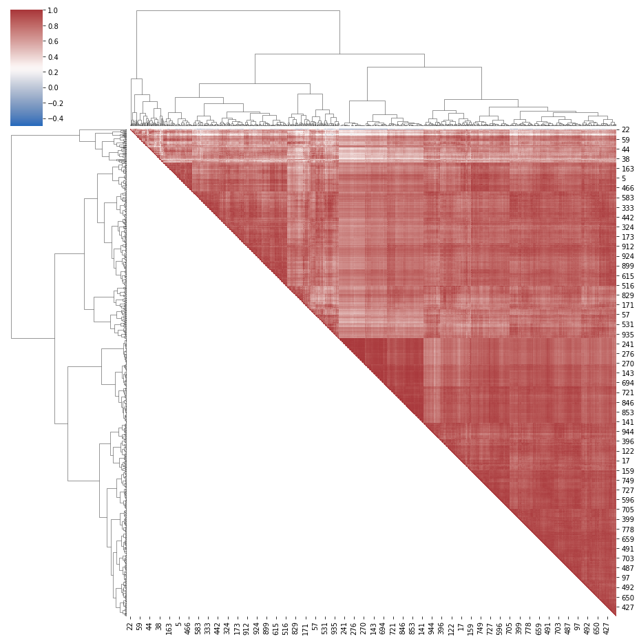
    


```python
map_group = [1, 2, 0]

def f(gr):
    return map_group[int(gr)]

groups = np.array([*map(f, group_no_ordered)],int)

sum(groups==0)
sum(groups==1)
sum(groups==2)
```


    542


```python
corrDescription = [corrSpearman[i][j] for i in range(nbVideos) for j in range(nbVideos) if i >j]
pd.Series(corrDescription).describe()
```


    count    450775.000000
    mean          0.795021
    std           0.122391
    min          -0.244185
    25%           0.739749
    50%           0.818756
    75%           0.879124
    max           0.997287
    dtype: float64


```python
def plot_simple_correlationmatrix_dendogram(corr, img_name, ticks, id_names, method='ward'):

    df = pd.DataFrame(corr)
    
    # Generate a mask for the upper triangle
    mask = np.zeros_like(corr, dtype=np.bool)
    
    for i in range(shortnbVideos):
        for j in range(shortnbVideos):
            if i>j:
                mask[i][j] = True
    fig = plt.figure(figsize=(10, 8.5))
    ax = fig.add_subplot(1,1,1)
    sns.heatmap(df, cmap="vlag", mask=mask,
               linewidths=.75, cbar_kws={"ticks":ticks})
    plt.yticks(np.arange(0,len(id_names),1)+0.5, id_names)
    plt.xticks(np.arange(0,len(id_names),1)+0.5, id_names)
    plt.savefig(result_dir+img_name)
    plt.show()
```


```python
id_short = [10, 14, 23, 26, 31, 41, 55, 66, 67, 125]
short_v_names = [v_names[k] for k in id_short]

shortlistVideo = []
for v in short_v_names:
    data = pd.read_table(res_dir+v, delimiter = ',')
    data['etime'] = [*map(elapsedtime_to_sec, data['elapsedtime'])]
    shortlistVideo.append(data)
    
shortnbVideos = len(shortlistVideo)

shortcorrSpearman= [[0 for x in range(shortnbVideos)] for y in range(shortnbVideos)]


for i in range(shortnbVideos):
    for j in range(shortnbVideos):
        if (i == j):
            shortcorrSpearman[i][j] = 1
        else:
            shortcorrSpearman[i][j] = sc.spearmanr(listVideo[id_short[i]][predDimension],listVideo[id_short[j]][predDimension]).correlation

plot_simple_correlationmatrix_dendogram(shortcorrSpearman, 
                     "corrmatrix-ugc-dendo-Spearman-short-" + predDimension + ".png", 
                     [k/5 for k in np.arange(-10,10,1)],
                                      id_short)
```


    
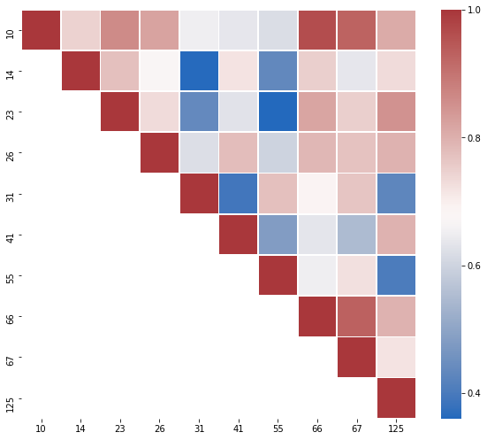
    


# RQ1-2

### Shortlist


```python
id_short
```


    [10, 14, 23, 26, 31, 41, 55, 66, 67, 125]


```python
shortlistVideo[0] # video 10
```


<div>
<style scoped>
    .dataframe tbody tr th:only-of-type {
        vertical-align: middle;
    }

    .dataframe tbody tr th {
        vertical-align: top;
    }

    .dataframe thead th {
        text-align: right;
    }
</style>
<table border="1" class="dataframe">
  <thead>
    <tr style="text-align: right;">
      <th></th>
      <th>configurationID</th>
      <th>cabac</th>
      <th>ref</th>
      <th>deblock</th>
      <th>analyse</th>
      <th>me</th>
      <th>subme</th>
      <th>mixed_ref</th>
      <th>me_range</th>
      <th>trellis</th>
      <th>...</th>
      <th>usertime</th>
      <th>systemtime</th>
      <th>elapsedtime</th>
      <th>cpu</th>
      <th>frames</th>
      <th>fps</th>
      <th>kbs</th>
      <th>ssim</th>
      <th>ssimdb</th>
      <th>etime</th>
    </tr>
  </thead>
  <tbody>
    <tr>
      <th>0</th>
      <td>1</td>
      <td>0</td>
      <td>1</td>
      <td>0:0:0</td>
      <td>0:0</td>
      <td>dia</td>
      <td>0</td>
      <td>0</td>
      <td>16</td>
      <td>0</td>
      <td>...</td>
      <td>8.69</td>
      <td>0.92</td>
      <td>0:01.75</td>
      <td>549</td>
      <td>480</td>
      <td>379.18</td>
      <td>7675.34</td>
      <td>NaN</td>
      <td>NaN</td>
      <td>1.75</td>
    </tr>
    <tr>
      <th>1</th>
      <td>101</td>
      <td>1</td>
      <td>2</td>
      <td>1:0:0</td>
      <td>0x3:0x113</td>
      <td>hex</td>
      <td>6</td>
      <td>1</td>
      <td>16</td>
      <td>1</td>
      <td>...</td>
      <td>29.88</td>
      <td>1.56</td>
      <td>0:04.08</td>
      <td>770</td>
      <td>480</td>
      <td>137.35</td>
      <td>2722.25</td>
      <td>NaN</td>
      <td>NaN</td>
      <td>4.08</td>
    </tr>
    <tr>
      <th>2</th>
      <td>102</td>
      <td>1</td>
      <td>2</td>
      <td>1:0:0</td>
      <td>0x3:0x113</td>
      <td>hex</td>
      <td>6</td>
      <td>1</td>
      <td>16</td>
      <td>1</td>
      <td>...</td>
      <td>26.00</td>
      <td>1.58</td>
      <td>0:03.04</td>
      <td>905</td>
      <td>480</td>
      <td>194.98</td>
      <td>3179.35</td>
      <td>NaN</td>
      <td>NaN</td>
      <td>3.04</td>
    </tr>
    <tr>
      <th>3</th>
      <td>103</td>
      <td>1</td>
      <td>2</td>
      <td>0:0:0</td>
      <td>0x3:0x3</td>
      <td>umh</td>
      <td>6</td>
      <td>1</td>
      <td>16</td>
      <td>1</td>
      <td>...</td>
      <td>32.80</td>
      <td>1.37</td>
      <td>0:02.89</td>
      <td>1181</td>
      <td>480</td>
      <td>206.63</td>
      <td>3142.93</td>
      <td>NaN</td>
      <td>NaN</td>
      <td>2.89</td>
    </tr>
    <tr>
      <th>4</th>
      <td>104</td>
      <td>1</td>
      <td>16</td>
      <td>1:0:0</td>
      <td>0x3:0x113</td>
      <td>hex</td>
      <td>6</td>
      <td>1</td>
      <td>24</td>
      <td>1</td>
      <td>...</td>
      <td>39.70</td>
      <td>1.41</td>
      <td>0:03.29</td>
      <td>1249</td>
      <td>480</td>
      <td>176.69</td>
      <td>2579.38</td>
      <td>NaN</td>
      <td>NaN</td>
      <td>3.29</td>
    </tr>
    <tr>
      <th>...</th>
      <td>...</td>
      <td>...</td>
      <td>...</td>
      <td>...</td>
      <td>...</td>
      <td>...</td>
      <td>...</td>
      <td>...</td>
      <td>...</td>
      <td>...</td>
      <td>...</td>
      <td>...</td>
      <td>...</td>
      <td>...</td>
      <td>...</td>
      <td>...</td>
      <td>...</td>
      <td>...</td>
      <td>...</td>
      <td>...</td>
      <td>...</td>
    </tr>
    <tr>
      <th>196</th>
      <td>97</td>
      <td>1</td>
      <td>2</td>
      <td>1:0:0</td>
      <td>0x3:0x113</td>
      <td>hex</td>
      <td>4</td>
      <td>1</td>
      <td>16</td>
      <td>0</td>
      <td>...</td>
      <td>24.80</td>
      <td>1.67</td>
      <td>0:03.55</td>
      <td>745</td>
      <td>480</td>
      <td>160.70</td>
      <td>2747.42</td>
      <td>NaN</td>
      <td>NaN</td>
      <td>3.55</td>
    </tr>
    <tr>
      <th>197</th>
      <td>98</td>
      <td>1</td>
      <td>2</td>
      <td>0:0:0</td>
      <td>0x3:0x113</td>
      <td>hex</td>
      <td>4</td>
      <td>0</td>
      <td>24</td>
      <td>0</td>
      <td>...</td>
      <td>21.85</td>
      <td>1.59</td>
      <td>0:03.06</td>
      <td>766</td>
      <td>480</td>
      <td>192.69</td>
      <td>2805.80</td>
      <td>NaN</td>
      <td>NaN</td>
      <td>3.06</td>
    </tr>
    <tr>
      <th>198</th>
      <td>99</td>
      <td>1</td>
      <td>5</td>
      <td>1:0:0</td>
      <td>0x3:0x113</td>
      <td>hex</td>
      <td>6</td>
      <td>1</td>
      <td>16</td>
      <td>1</td>
      <td>...</td>
      <td>32.95</td>
      <td>1.42</td>
      <td>0:03.45</td>
      <td>996</td>
      <td>480</td>
      <td>166.61</td>
      <td>2582.37</td>
      <td>NaN</td>
      <td>NaN</td>
      <td>3.45</td>
    </tr>
    <tr>
      <th>199</th>
      <td>100</td>
      <td>0</td>
      <td>3</td>
      <td>0:0:0</td>
      <td>0x113:0x113</td>
      <td>hex</td>
      <td>6</td>
      <td>1</td>
      <td>16</td>
      <td>1</td>
      <td>...</td>
      <td>26.68</td>
      <td>1.56</td>
      <td>0:02.76</td>
      <td>1022</td>
      <td>480</td>
      <td>218.91</td>
      <td>3379.49</td>
      <td>NaN</td>
      <td>NaN</td>
      <td>2.76</td>
    </tr>
    <tr>
      <th>200</th>
      <td>10</td>
      <td>1</td>
      <td>16</td>
      <td>1:0:0</td>
      <td>0x3:0x133</td>
      <td>tesa</td>
      <td>11</td>
      <td>1</td>
      <td>24</td>
      <td>2</td>
      <td>...</td>
      <td>479.12</td>
      <td>6.38</td>
      <td>0:31.19</td>
      <td>1556</td>
      <td>480</td>
      <td>15.69</td>
      <td>2230.33</td>
      <td>NaN</td>
      <td>NaN</td>
      <td>31.19</td>
    </tr>
  </tbody>
</table>
<p>201 rows × 36 columns</p>
</div>


```python
listFeatures = ["cabac", "ref", "deblock", "analyse", "me", "subme", "mixed_ref", "me_range", "trellis", "8x8dct", "fast_pskip", "chroma_qp_offset", "bframes", "b_pyramid", "b_adapt", "direct", "weightb", "open_gop", "weightp", "scenecut", "rc_lookahead", "mbtree", "qpmax", "aq-mode"]

to_keep = [k for k in listFeatures]
to_keep.append(predDimension)

categorial = ['analyse', 'me', 'direct']

def compute_Importances(listVid, id_short=None):
    
    if not id_short:
        id_short = np.arange(0,len(listVid),1)
        
    listImportances = []

    for id_video in range(len(listVid)):

        df = listVid[id_video][to_keep].replace(to_replace ="None",value='0')

        df['deblock'] =[int(val[0]) for val in df['deblock']]

        for col in df.columns:
            if col not in categorial:
                arr_col = np.array(df[col],int)
                arr_col = (arr_col-np.mean(arr_col))/(np.std(arr_col)+1e-5)
                df[col] = arr_col
            else:
                df[col] = [np.where(k==df[col].unique())[0][0] for k in df[col]]
                arr_col = np.array(df[col],int)
                arr_col = (arr_col-np.mean(arr_col))/(np.std(arr_col)+1e-5)
                df[col] = arr_col

        clf = RandomForestRegressor(n_estimators=200)
        X = df.drop([predDimension],axis=1)
        y = df[predDimension]
        clf.fit(X,y)

        listImportances.append(clf.feature_importances_)

    res = pd.DataFrame({'features' : listFeatures})

    cs = 100

    for id_video in range(len(listImportances)):
        res['video_'+str(id_short[id_video])] = np.round(cs*listImportances[id_video])/cs

    res = res.set_index('features').transpose().drop(['open_gop','qpmax'],axis=1)
    return res

res = compute_Importances(shortlistVideo, id_short)
res.to_csv("../results/shortlist_features_importances"+predDimension+".csv")
```

### Boxplot


```python
res = compute_Importances(listVideo)
```


```python
def boxplot_imp(res, xlim = None, criteria = 'max', name = None):
    if criteria == 'max':
        listImp = [(np.percentile(res[col],75), res[col], col) 
                   for col in res.columns]
        listImp.sort(key=lambda tup: tup[0])
    elif criteria == 'range':
        listImp = [(np.abs(np.percentile(res[col],75)-np.percentile(res[col],25)),res[col], col) 
                   for col in res.columns]
        listImp.sort(key=lambda tup: tup[0])
    elif criteria == 'name':
        listImp = [(np.abs(np.percentile(res[col],75)-np.percentile(res[col],25)),res[col], col) 
                   for col in res.columns]
        listImp.sort(key=lambda tup: tup[2], reverse=True)

    red_square = dict(markerfacecolor='r', marker='s')
    plt.figure(figsize=(15,8))
    plt.grid()
    plt.boxplot([l[1] for l in listImp], flierprops=red_square, 
              vert=False, patch_artist=True, #widths=0.25,
              boxprops=dict(facecolor=(0,0,1,0.5),linewidth=1,edgecolor='k'),
              whiskerprops = dict(linestyle='-.',linewidth=1.0, color='black'))
    plt.xlabel('Feature importances',size=13)
    if xlim:
        plt.xlim(xlim)
    plt.yticks(range(1, len(listImp) + 1), [l[2] for l in listImp])
    if name:
        plt.savefig(name)
    plt.show()
    
boxplot_imp(res, xlim = (-0.01,0.85),
            criteria = 'name', 
            name = "../group_paper/boxplot_features_imp_rf_"+predDimension+".png")
```


    
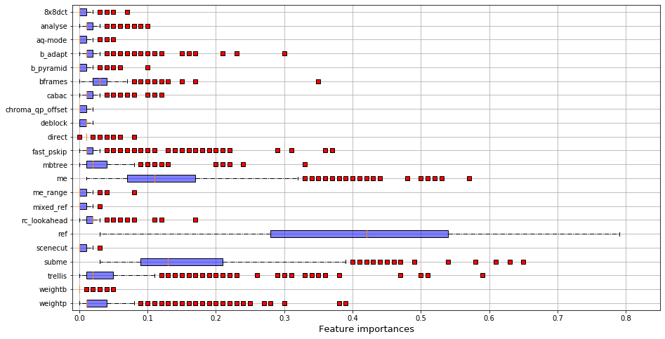
    


### Regression


```python
def compute_poly(listVid, id_short=None):
    
    if not id_short:
        id_short = np.arange(0,len(listVid),1)
    
    listImportances = []
    
    #listFeatures = ['subme','aq-mode','mbtree','cabac']
    
    to_keep = [k for k in listFeatures]
    to_keep.append(predDimension)
    
    names = listFeatures
    final_names = []
    final_names.append('constant')
    for n in names:
        final_names.append(n)
    for n1 in range(len(names)):
        for n2 in range(len(names)):
            if n1>=n2:
                final_names.append(str(names[n1])+'*'+str(names[n2]))
    
    for id_video in range(len(listVid)):

        df = listVid[id_video][to_keep].replace(to_replace ="None",value='0')
        df['deblock'] =[int(val[0]) for val in df['deblock']]

        for col in df.columns:
            if col not in categorial:
                arr_col = np.array(df[col],int)
                arr_col = (arr_col-np.mean(arr_col))/(np.std(arr_col)+1e-5)
                df[col] = arr_col
            else:
                df[col] = [np.where(k==df[col].unique())[0][0] for k in df[col]]
                arr_col = np.array(df[col],int)
                arr_col = (arr_col-np.mean(arr_col))/(np.std(arr_col)+1e-5)
                df[col] = arr_col

        clf = LinearRegression()
        X = df.drop([predDimension],axis=1)

        y = df[predDimension]
        #poly = PolynomialFeatures(degree=1, interaction_only = False, include_bias = True)    
        #X_interact = pd.DataFrame(poly.fit_transform(X))#, columns=final_names)
        #kept_names = ['subme','aq-mode','mbtree','cabac','cabac*mbtree','aq-mode*subme','cabac*subme']
        clf.fit(X,y)
        listImportances.append(clf.coef_)

    res = pd.DataFrame({'features' : listFeatures})

    cs = 100

    for id_video in range(len(listImportances)):
        res['video_'+str(id_short[id_video])] = np.round(cs*listImportances[id_video])/cs

    res = res.set_index('features').drop(['open_gop','qpmax']).transpose()
    return res

res = compute_poly(listVideo)
res.to_csv("../results/list_features_importances_poly_"+predDimension+".csv")
res
```


<div>
<style scoped>
    .dataframe tbody tr th:only-of-type {
        vertical-align: middle;
    }

    .dataframe tbody tr th {
        vertical-align: top;
    }

    .dataframe thead th {
        text-align: right;
    }
</style>
<table border="1" class="dataframe">
  <thead>
    <tr style="text-align: right;">
      <th>features</th>
      <th>cabac</th>
      <th>ref</th>
      <th>deblock</th>
      <th>analyse</th>
      <th>me</th>
      <th>subme</th>
      <th>mixed_ref</th>
      <th>me_range</th>
      <th>trellis</th>
      <th>8x8dct</th>
      <th>...</th>
      <th>bframes</th>
      <th>b_pyramid</th>
      <th>b_adapt</th>
      <th>direct</th>
      <th>weightb</th>
      <th>weightp</th>
      <th>scenecut</th>
      <th>rc_lookahead</th>
      <th>mbtree</th>
      <th>aq-mode</th>
    </tr>
  </thead>
  <tbody>
    <tr>
      <th>video_0</th>
      <td>0.06</td>
      <td>0.23</td>
      <td>-0.02</td>
      <td>0.05</td>
      <td>0.08</td>
      <td>0.31</td>
      <td>0.04</td>
      <td>0.03</td>
      <td>-0.09</td>
      <td>0.26</td>
      <td>...</td>
      <td>0.07</td>
      <td>-0.28</td>
      <td>-0.52</td>
      <td>-0.17</td>
      <td>0.60</td>
      <td>0.24</td>
      <td>-0.01</td>
      <td>0.07</td>
      <td>-0.16</td>
      <td>-0.03</td>
    </tr>
    <tr>
      <th>video_1</th>
      <td>0.00</td>
      <td>0.47</td>
      <td>-0.02</td>
      <td>-0.06</td>
      <td>0.22</td>
      <td>0.25</td>
      <td>0.01</td>
      <td>0.06</td>
      <td>0.21</td>
      <td>0.09</td>
      <td>...</td>
      <td>-0.10</td>
      <td>0.20</td>
      <td>-0.40</td>
      <td>-0.06</td>
      <td>0.14</td>
      <td>0.13</td>
      <td>0.15</td>
      <td>-0.01</td>
      <td>-0.12</td>
      <td>-0.03</td>
    </tr>
    <tr>
      <th>video_2</th>
      <td>0.11</td>
      <td>0.38</td>
      <td>-0.03</td>
      <td>-0.02</td>
      <td>0.34</td>
      <td>0.28</td>
      <td>0.01</td>
      <td>-0.03</td>
      <td>-0.09</td>
      <td>0.09</td>
      <td>...</td>
      <td>0.27</td>
      <td>0.01</td>
      <td>-0.41</td>
      <td>-0.08</td>
      <td>0.15</td>
      <td>0.18</td>
      <td>0.05</td>
      <td>0.01</td>
      <td>-0.16</td>
      <td>0.00</td>
    </tr>
    <tr>
      <th>video_3</th>
      <td>0.06</td>
      <td>0.61</td>
      <td>-0.03</td>
      <td>-0.09</td>
      <td>0.27</td>
      <td>0.17</td>
      <td>0.04</td>
      <td>-0.00</td>
      <td>0.06</td>
      <td>0.09</td>
      <td>...</td>
      <td>0.02</td>
      <td>0.13</td>
      <td>-0.43</td>
      <td>-0.05</td>
      <td>0.14</td>
      <td>0.14</td>
      <td>0.12</td>
      <td>-0.02</td>
      <td>-0.14</td>
      <td>-0.01</td>
    </tr>
    <tr>
      <th>video_4</th>
      <td>0.08</td>
      <td>0.51</td>
      <td>-0.00</td>
      <td>-0.02</td>
      <td>0.25</td>
      <td>0.28</td>
      <td>0.07</td>
      <td>-0.04</td>
      <td>0.00</td>
      <td>0.07</td>
      <td>...</td>
      <td>0.18</td>
      <td>0.04</td>
      <td>-0.53</td>
      <td>-0.05</td>
      <td>0.15</td>
      <td>0.20</td>
      <td>0.08</td>
      <td>0.01</td>
      <td>-0.21</td>
      <td>-0.02</td>
    </tr>
    <tr>
      <th>...</th>
      <td>...</td>
      <td>...</td>
      <td>...</td>
      <td>...</td>
      <td>...</td>
      <td>...</td>
      <td>...</td>
      <td>...</td>
      <td>...</td>
      <td>...</td>
      <td>...</td>
      <td>...</td>
      <td>...</td>
      <td>...</td>
      <td>...</td>
      <td>...</td>
      <td>...</td>
      <td>...</td>
      <td>...</td>
      <td>...</td>
      <td>...</td>
    </tr>
    <tr>
      <th>video_945</th>
      <td>0.13</td>
      <td>0.43</td>
      <td>0.00</td>
      <td>-0.04</td>
      <td>0.23</td>
      <td>0.27</td>
      <td>0.09</td>
      <td>-0.04</td>
      <td>-0.12</td>
      <td>0.11</td>
      <td>...</td>
      <td>0.26</td>
      <td>-0.03</td>
      <td>-0.44</td>
      <td>-0.05</td>
      <td>0.18</td>
      <td>0.24</td>
      <td>0.07</td>
      <td>0.01</td>
      <td>-0.15</td>
      <td>0.01</td>
    </tr>
    <tr>
      <th>video_946</th>
      <td>0.27</td>
      <td>0.50</td>
      <td>-0.00</td>
      <td>-0.03</td>
      <td>0.30</td>
      <td>-0.10</td>
      <td>0.01</td>
      <td>0.05</td>
      <td>-0.27</td>
      <td>0.06</td>
      <td>...</td>
      <td>0.16</td>
      <td>0.08</td>
      <td>-0.32</td>
      <td>-0.07</td>
      <td>0.22</td>
      <td>0.23</td>
      <td>0.09</td>
      <td>-0.02</td>
      <td>-0.08</td>
      <td>-0.11</td>
    </tr>
    <tr>
      <th>video_947</th>
      <td>0.09</td>
      <td>0.62</td>
      <td>-0.02</td>
      <td>-0.05</td>
      <td>0.29</td>
      <td>0.04</td>
      <td>0.04</td>
      <td>0.07</td>
      <td>0.05</td>
      <td>0.12</td>
      <td>...</td>
      <td>0.05</td>
      <td>0.11</td>
      <td>-0.48</td>
      <td>-0.08</td>
      <td>0.18</td>
      <td>0.16</td>
      <td>0.14</td>
      <td>-0.04</td>
      <td>-0.15</td>
      <td>0.03</td>
    </tr>
    <tr>
      <th>video_948</th>
      <td>-0.01</td>
      <td>0.62</td>
      <td>0.01</td>
      <td>-0.06</td>
      <td>0.29</td>
      <td>-0.13</td>
      <td>-0.00</td>
      <td>0.05</td>
      <td>0.11</td>
      <td>0.11</td>
      <td>...</td>
      <td>0.08</td>
      <td>0.21</td>
      <td>-0.02</td>
      <td>-0.11</td>
      <td>-0.06</td>
      <td>0.03</td>
      <td>-0.11</td>
      <td>-0.05</td>
      <td>-0.23</td>
      <td>0.12</td>
    </tr>
    <tr>
      <th>video_949</th>
      <td>0.05</td>
      <td>0.65</td>
      <td>-0.02</td>
      <td>-0.08</td>
      <td>0.24</td>
      <td>0.00</td>
      <td>0.01</td>
      <td>0.04</td>
      <td>-0.03</td>
      <td>0.11</td>
      <td>...</td>
      <td>0.14</td>
      <td>0.09</td>
      <td>-0.42</td>
      <td>-0.10</td>
      <td>0.24</td>
      <td>0.19</td>
      <td>0.09</td>
      <td>-0.04</td>
      <td>-0.14</td>
      <td>0.06</td>
    </tr>
  </tbody>
</table>
<p>950 rows × 22 columns</p>
</div>


```python
boxplot_imp(res, criteria ='range', name ="../group_paper/boxplot_features_imp_linear_"+predDimension+".png")
```


    
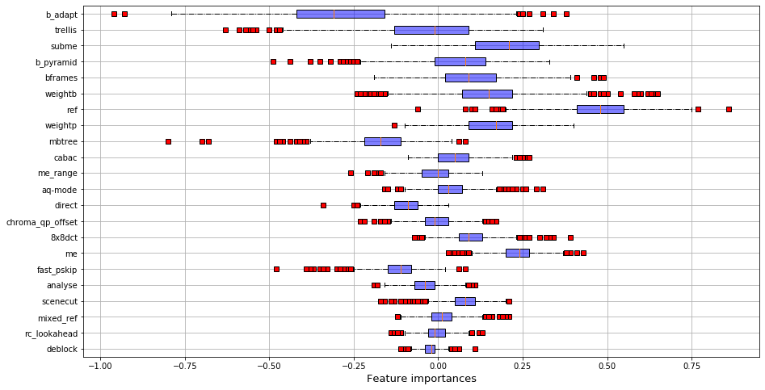
    


# RQ2

## RQ2.1 - Group of performances


```python
def plot_corr_matrix(corr, method = 'ward', title=''):

    df = pd.DataFrame(corr)
    
    links = linkage(df, method=method,)
    order = leaves_list(links)
    
    mask = np.zeros_like(corr, dtype=np.bool)
    
    for i in range(len(corr)):
        for j in range(len(corr)):
            if i>j:
                mask[order[i]][order[j]] = True
    
    g = sns.clustermap(df, cmap="vlag", mask=mask, method=method,
                   linewidths=0, figsize=(13, 13), vmin=-0.5)
    g.ax_heatmap.set_yticklabels([])
    g.ax_heatmap.set_xticklabels([])
    plt.title(title)
    plt.show()
    
    corrDescription = [corr[i][j] for i in range(len(corr)) for j in range(len(corr)) if i >j]
    return pd.Series(corrDescription).describe()

def plot_group(group_index):
    ind = np.array([k for k in range(len(corrSpearman)) if groups[k] == group_index], dtype=int)
    group = np.copy([[corrSpearman[k][j] for j in ind] for k in ind])
    print(plot_corr_matrix(group,title="group "+str(group_index)+" : "+str(len(group))))

for i in range(3):
    plot_group(i)
```


    
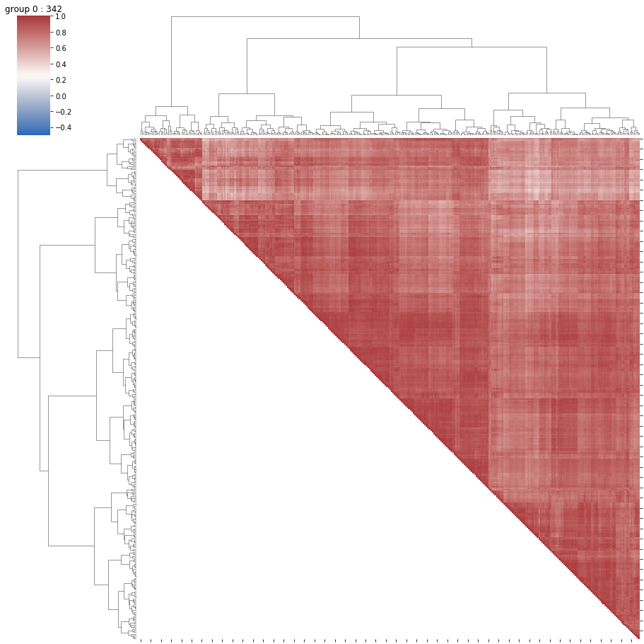
    


    count    58311.000000
    mean         0.796131
    std          0.095494
    min          0.384369
    25%          0.734768
    50%          0.805498
    75%          0.870849
    max          0.984000
    dtype: float64


    
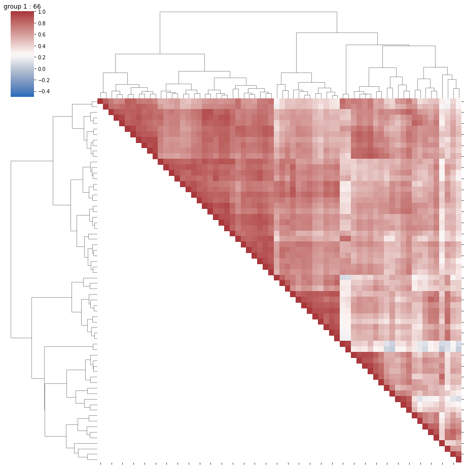
    


    count    2145.000000
    mean        0.615849
    std         0.163134
    min         0.021408
    25%         0.507399
    50%         0.621744
    75%         0.734265
    max         0.951373
    dtype: float64


    
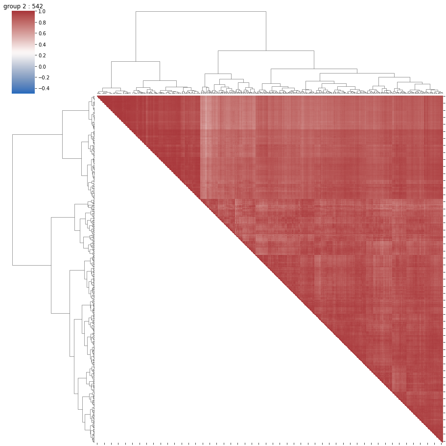
    


    count    146611.000000
    mean          0.876994
    std           0.059542
    min           0.517862
    25%           0.841582
    50%           0.883810
    75%           0.920144
    max           0.997287
    dtype: float64


## Summary per group


```python
meta = pd.read_csv("../ugc_meta/all_features.csv").set_index('FILENAME')
meta['category']=[str(meta.index[i]).split('_')[0] for i in range(meta.shape[0])]
del meta['NOISE_DMOS']
meta = meta.fillna(0)
cat_tab = pd.Series(meta['category'].values).unique()
meta['video_category'] = [np.where(cat_tab==meta['category'][i])[0][0] for i in range(len(meta['category']))]
del meta['category']
for col in meta.columns:#[:len(meta.columns)-1]:
    inter = np.array(meta[col],float)
    meta[col] = (inter-np.mean(inter))/np.std(inter)
perf = pd.DataFrame({'FILENAME': np.array([v_names[k][:-4] for k in range(len(v_names))])[1:],
              'perf_group' : np.array([k for k in groups])[1:]}).set_index('FILENAME')
meta_perf = perf.join(meta)
meta_perf
```


<div>
<style scoped>
    .dataframe tbody tr th:only-of-type {
        vertical-align: middle;
    }

    .dataframe tbody tr th {
        vertical-align: top;
    }

    .dataframe thead th {
        text-align: right;
    }
</style>
<table border="1" class="dataframe">
  <thead>
    <tr style="text-align: right;">
      <th></th>
      <th>perf_group</th>
      <th>SLEEQ_DMOS</th>
      <th>BANDING_DMOS</th>
      <th>WIDTH</th>
      <th>HEIGHT</th>
      <th>SPATIAL_COMPLEXITY</th>
      <th>TEMPORAL_COMPLEXITY</th>
      <th>CHUNK_COMPLEXITY_VARIATION</th>
      <th>COLOR_COMPLEXITY</th>
      <th>video_category</th>
    </tr>
    <tr>
      <th>FILENAME</th>
      <th></th>
      <th></th>
      <th></th>
      <th></th>
      <th></th>
      <th></th>
      <th></th>
      <th></th>
      <th></th>
      <th></th>
    </tr>
  </thead>
  <tbody>
    <tr>
      <th>Animation_1080P-05f8</th>
      <td>2</td>
      <td>0.843640</td>
      <td>0.742227</td>
      <td>0.380890</td>
      <td>0.330315</td>
      <td>-0.147062</td>
      <td>0.443113</td>
      <td>2.546727</td>
      <td>2.208462</td>
      <td>-1.618994</td>
    </tr>
    <tr>
      <th>Animation_1080P-0c4f</th>
      <td>2</td>
      <td>-0.656518</td>
      <td>-0.377309</td>
      <td>0.380890</td>
      <td>0.330315</td>
      <td>0.422696</td>
      <td>-0.963894</td>
      <td>1.055535</td>
      <td>-1.232585</td>
      <td>-1.618994</td>
    </tr>
    <tr>
      <th>Animation_1080P-0cdf</th>
      <td>2</td>
      <td>-0.294941</td>
      <td>-0.059125</td>
      <td>0.380890</td>
      <td>0.330315</td>
      <td>-0.028411</td>
      <td>0.429840</td>
      <td>-0.102867</td>
      <td>-0.448165</td>
      <td>-1.618994</td>
    </tr>
    <tr>
      <th>Animation_1080P-18f5</th>
      <td>2</td>
      <td>-0.479576</td>
      <td>-0.377309</td>
      <td>0.380890</td>
      <td>0.330315</td>
      <td>1.289667</td>
      <td>-0.959469</td>
      <td>-0.050889</td>
      <td>0.193239</td>
      <td>-1.618994</td>
    </tr>
    <tr>
      <th>Animation_1080P-209f</th>
      <td>0</td>
      <td>6.282675</td>
      <td>-0.377309</td>
      <td>0.380890</td>
      <td>0.330315</td>
      <td>2.315231</td>
      <td>-1.512538</td>
      <td>-0.622865</td>
      <td>-1.232585</td>
      <td>-1.618994</td>
    </tr>
    <tr>
      <th>...</th>
      <td>...</td>
      <td>...</td>
      <td>...</td>
      <td>...</td>
      <td>...</td>
      <td>...</td>
      <td>...</td>
      <td>...</td>
      <td>...</td>
      <td>...</td>
    </tr>
    <tr>
      <th>Vlog_720P-561e</th>
      <td>2</td>
      <td>-0.679597</td>
      <td>-0.377309</td>
      <td>-0.241046</td>
      <td>-0.334452</td>
      <td>0.979531</td>
      <td>-1.415198</td>
      <td>-0.652628</td>
      <td>0.457602</td>
      <td>1.494285</td>
    </tr>
    <tr>
      <th>Vlog_720P-5d08</th>
      <td>0</td>
      <td>-0.679597</td>
      <td>-0.377309</td>
      <td>-0.773579</td>
      <td>-0.334452</td>
      <td>3.258561</td>
      <td>-0.304636</td>
      <td>-0.437382</td>
      <td>-0.157800</td>
      <td>1.494285</td>
    </tr>
    <tr>
      <th>Vlog_720P-60f8</th>
      <td>2</td>
      <td>0.443598</td>
      <td>0.624381</td>
      <td>-0.241046</td>
      <td>-0.334452</td>
      <td>0.234735</td>
      <td>-0.043587</td>
      <td>-0.364052</td>
      <td>-0.149132</td>
      <td>1.494285</td>
    </tr>
    <tr>
      <th>Vlog_720P-6410</th>
      <td>0</td>
      <td>-0.456497</td>
      <td>3.770868</td>
      <td>-0.241046</td>
      <td>-0.334452</td>
      <td>-0.770858</td>
      <td>2.120018</td>
      <td>1.971948</td>
      <td>-0.240142</td>
      <td>1.494285</td>
    </tr>
    <tr>
      <th>Vlog_720P-6d56</th>
      <td>2</td>
      <td>0.628233</td>
      <td>-0.353740</td>
      <td>-0.241046</td>
      <td>-0.334452</td>
      <td>-0.329149</td>
      <td>0.328075</td>
      <td>1.647785</td>
      <td>0.565947</td>
      <td>1.494285</td>
    </tr>
  </tbody>
</table>
<p>949 rows × 10 columns</p>
</div>


```python
meta_perf['str_video_cat'] = [str(meta_perf.index[i]).split('_')[0] for i in range(meta_perf.shape[0])]
total_cat = meta_perf.groupby('str_video_cat').count()['perf_group']
group_perf = np.array([gr for gr in groups])
group_perf
```


    array([1, 2, 2, 2, 2, 0, 2, 2, 2, 0, 2, 2, 0, 2, 0, 0, 2, 2, 2, 1, 1, 2,
           1, 2, 2, 0, 0, 1, 0, 0, 0, 1, 0, 0, 0, 1, 0, 0, 1, 2, 0, 0, 0, 0,
           1, 0, 1, 1, 0, 1, 0, 1, 0, 0, 1, 1, 0, 0, 0, 1, 0, 0, 1, 2, 2, 2,
           2, 2, 2, 2, 2, 2, 0, 2, 2, 2, 0, 2, 0, 2, 2, 2, 2, 0, 2, 0, 2, 2,
           2, 0, 0, 0, 2, 0, 1, 2, 2, 2, 0, 2, 2, 0, 2, 0, 2, 2, 0, 2, 2, 2,
           0, 0, 0, 2, 2, 2, 2, 2, 2, 2, 2, 2, 2, 2, 0, 0, 2, 2, 2, 2, 2, 2,
           2, 2, 2, 2, 2, 2, 2, 2, 2, 2, 2, 2, 2, 2, 2, 2, 2, 2, 2, 2, 2, 2,
           2, 2, 2, 2, 2, 2, 2, 0, 0, 0, 0, 0, 0, 0, 0, 0, 0, 0, 0, 0, 0, 0,
           0, 0, 0, 0, 0, 0, 0, 0, 1, 0, 1, 0, 0, 0, 0, 0, 0, 2, 0, 0, 0, 2,
           0, 0, 0, 0, 0, 2, 2, 0, 2, 0, 2, 0, 2, 0, 0, 0, 2, 2, 2, 2, 2, 2,
           2, 2, 1, 2, 2, 0, 2, 2, 2, 0, 0, 2, 2, 2, 2, 2, 2, 2, 2, 2, 2, 2,
           2, 2, 2, 1, 2, 2, 2, 2, 2, 2, 2, 2, 2, 2, 2, 2, 2, 2, 2, 2, 2, 2,
           1, 2, 2, 2, 2, 2, 2, 2, 2, 2, 2, 2, 2, 2, 2, 2, 2, 2, 2, 2, 2, 2,
           2, 2, 2, 2, 2, 1, 2, 2, 2, 2, 0, 2, 2, 2, 2, 2, 2, 0, 2, 2, 2, 1,
           0, 0, 0, 0, 0, 0, 0, 1, 0, 0, 0, 0, 1, 0, 0, 0, 0, 0, 1, 1, 0, 0,
           0, 0, 0, 0, 1, 2, 2, 0, 1, 1, 0, 0, 0, 0, 1, 2, 1, 2, 0, 0, 1, 0,
           2, 0, 0, 0, 0, 2, 2, 2, 2, 2, 0, 0, 2, 2, 0, 2, 2, 2, 0, 0, 2, 2,
           0, 2, 2, 2, 2, 2, 1, 2, 2, 2, 2, 0, 2, 2, 2, 2, 0, 2, 2, 1, 0, 0,
           2, 2, 2, 2, 2, 0, 0, 0, 0, 0, 0, 1, 0, 0, 0, 0, 0, 0, 0, 2, 0, 0,
           0, 0, 0, 0, 0, 0, 0, 0, 2, 2, 0, 1, 0, 0, 1, 0, 0, 0, 2, 0, 0, 0,
           0, 2, 0, 0, 1, 2, 0, 0, 0, 2, 2, 2, 0, 2, 2, 2, 0, 2, 2, 2, 0, 2,
           2, 2, 2, 1, 0, 2, 2, 2, 2, 2, 2, 2, 2, 2, 0, 2, 2, 2, 2, 2, 2, 2,
           2, 2, 2, 2, 0, 2, 2, 2, 2, 1, 2, 2, 2, 2, 2, 2, 0, 0, 2, 1, 0, 0,
           0, 0, 0, 0, 0, 1, 0, 0, 0, 0, 0, 0, 0, 0, 0, 0, 0, 0, 0, 0, 0, 2,
           0, 0, 0, 0, 0, 2, 0, 1, 0, 0, 0, 0, 1, 2, 1, 2, 2, 1, 0, 2, 2, 2,
           2, 2, 2, 2, 2, 2, 0, 2, 1, 0, 0, 1, 0, 0, 2, 0, 2, 2, 0, 0, 0, 0,
           0, 2, 2, 2, 0, 0, 0, 0, 2, 2, 2, 0, 2, 2, 0, 1, 2, 1, 2, 2, 2, 2,
           2, 0, 2, 0, 1, 2, 2, 2, 2, 2, 2, 2, 2, 2, 2, 2, 2, 0, 0, 0, 0, 0,
           0, 2, 0, 0, 0, 2, 0, 0, 0, 0, 2, 0, 0, 2, 2, 2, 2, 0, 0, 2, 2, 2,
           0, 2, 2, 2, 0, 2, 2, 2, 2, 2, 2, 2, 2, 2, 2, 2, 2, 2, 2, 2, 2, 2,
           2, 2, 2, 0, 2, 2, 2, 0, 2, 2, 2, 2, 2, 2, 2, 2, 0, 2, 2, 2, 2, 0,
           0, 2, 2, 2, 2, 2, 2, 2, 2, 2, 2, 2, 2, 2, 2, 2, 2, 2, 0, 0, 2, 2,
           2, 2, 2, 0, 2, 1, 2, 2, 2, 2, 2, 2, 0, 2, 2, 2, 1, 2, 2, 2, 2, 2,
           2, 2, 2, 0, 2, 2, 2, 2, 2, 2, 2, 2, 2, 2, 0, 0, 0, 2, 2, 0, 0, 0,
           0, 2, 0, 2, 2, 2, 0, 2, 0, 2, 2, 2, 2, 0, 2, 2, 2, 2, 2, 2, 0, 2,
           2, 2, 2, 2, 2, 2, 2, 2, 2, 2, 2, 2, 2, 2, 2, 2, 2, 2, 2, 2, 2, 2,
           2, 2, 0, 2, 0, 0, 2, 2, 0, 2, 0, 0, 2, 0, 0, 2, 0, 2, 2, 2, 0, 2,
           0, 0, 0, 2, 2, 2, 2, 0, 2, 2, 1, 2, 2, 2, 2, 0, 2, 2, 0, 2, 0, 2,
           2, 2, 2, 2, 2, 2, 2, 2, 2, 2, 2, 2, 2, 2, 2, 2, 2, 2, 2, 2, 2, 2,
           2, 2, 2, 2, 2, 2, 2, 2, 2, 2, 2, 2, 2, 2, 2, 2, 2, 2, 2, 2, 2, 2,
           2, 2, 1, 0, 0, 0, 0, 0, 1, 0, 1, 0, 1, 0, 0, 1, 0, 0, 0, 0, 1, 0,
           0, 0, 0, 0, 0, 0, 0, 0, 0, 0, 0, 0, 0, 0, 1, 0, 0, 0, 0, 0, 0, 0,
           0, 0, 2, 0, 0, 2, 0, 0, 0, 1, 2, 0, 2, 1, 2, 2, 0, 2, 2, 2, 2, 2,
           0, 2, 0, 2])


```python
def summary_group(id_group):
            
    id_list = [i for i in range(len(listVideo)) if group_perf[i]==id_group]
    v_names_group = [v_names[i][:-4] for i in range(len(v_names)) if i in id_list]
    listVideoGroup = [listVideo[i] for i in range(len(listVideo)) if i in id_list]
    
    print('Group '+str(id_group)+' : '+str(len(listVideoGroup))+' videos!')
    
    print('\n')

    # features importances
    boxplot_imp(compute_Importances(listVideoGroup), criteria = 'name', xlim= (0, 1),
               name ="../results/boxplot_imp_group"+str(id_group)+".png")

    # features effects
    boxplot_imp(compute_poly(listVideoGroup), criteria = 'name', xlim = (-1, 1),
               name ="../results/boxplot_effect_group"+str(id_group)+".png")

    print('\n')

    interest_var = ['cpu', 'etime', 'fps', 'kbs', 'size']

    for iv in interest_var:
        pred = [np.mean(lv[iv]) for lv in listVideoGroup]
        print('Mean '+iv+' in the group: '+str(np.round(np.mean(pred),1)))

    print('\n')

    # percentage of the videos present in the group par category

    meta_perf_group = meta_perf.query('perf_group=='+str(id_group))
    meta_perf_group['str_video_cat'] = [str(meta_perf_group.index[i]).split('_')[0] for i in range(meta_perf_group.shape[0])]
    val_group = meta_perf_group.groupby('str_video_cat').count()['perf_group']
    df_res_cat_group = pd.DataFrame({'val': val_group, 'total': total_cat})
    print(df_res_cat_group['val']/df_res_cat_group['total'])

    print('\n')

    # Mean of the videos of the group per properties

    for col in meta_perf_group.columns:
        if col not in ['str_video_cat', 'video_category']:
            print('Mean '+col+' : '+str(meta_perf_group[col].mean()))

    print('\n')

    corrGroup = np.array([corrSpearman[i][j] for i in range(len(corrSpearman)) if i in id_list 
                 for j in range(len(corrSpearman)) if j in id_list],float)

    print("Correlations intra-group: \n" + str(pd.Series(corrGroup).describe().iloc[[1,5]])+'\n')
```


```python
summary_group(0)
```

    Group 0 : 342 videos!
    
    


    
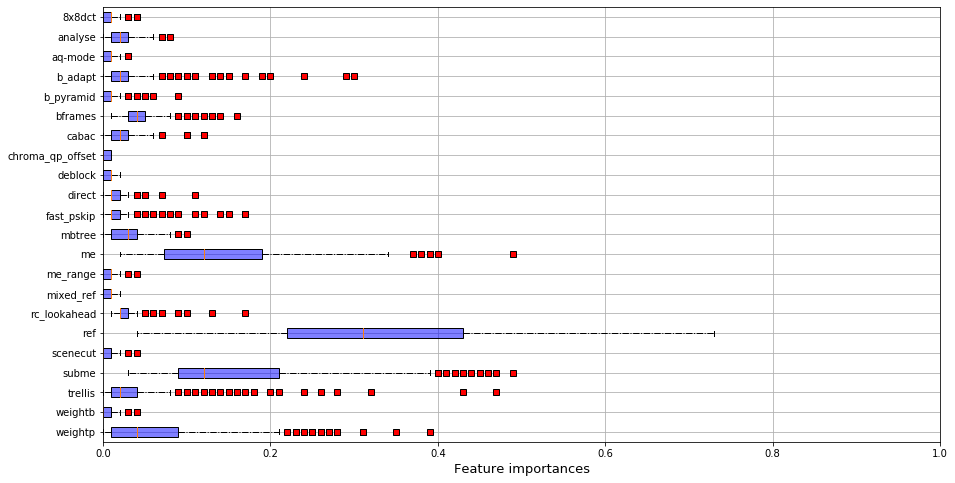
    


    
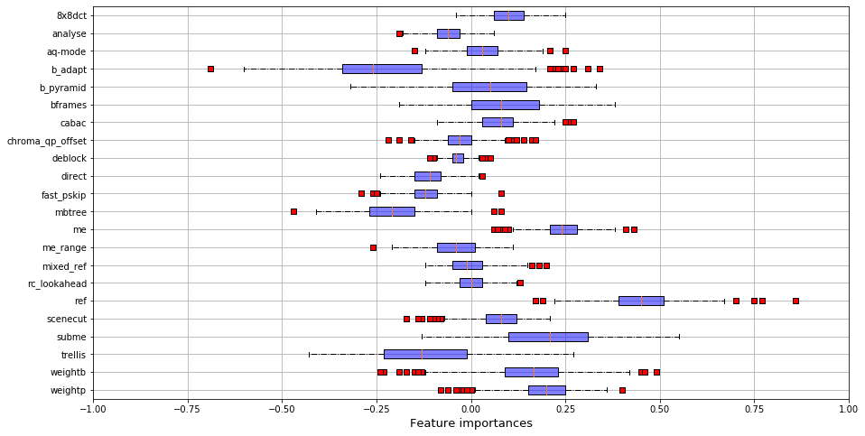
    


    
    
    Mean cpu in the group: 752.4
    Mean etime in the group: 3.9
    Mean fps in the group: 677.0
    Mean kbs in the group: 4570.5
    Mean size in the group: 11357010.2
    
    
    Animation         0.395349
    CoverSong         0.500000
    Gaming            0.391608
    HDR                    NaN
    HowTo             0.482759
    Lecture           0.451923
    LiveMusic         0.486486
    LyricVideo        0.545455
    MusicVideo        0.625000
    NewsClip          0.500000
    Sports            0.200000
    TelevisionClip    0.381818
    VR                0.128571
    VerticalVideo     0.173333
    Vlog              0.398734
    dtype: float64
    
    
    Mean perf_group : 0.0
    Mean SLEEQ_DMOS : 0.06101155252115993
    Mean BANDING_DMOS : -0.05147563458574577
    Mean WIDTH : -0.6009834952948019
    Mean HEIGHT : -0.6355841464534034
    Mean SPATIAL_COMPLEXITY : 0.3039973694391252
    Mean TEMPORAL_COMPLEXITY : 0.05402460119960146
    Mean CHUNK_COMPLEXITY_VARIATION : 0.1119109935243176
    Mean COLOR_COMPLEXITY : 0.09030465965831262
    
    


    /home/llesoil/anaconda3/envs/x264/lib/python3.7/site-packages/ipykernel_launcher.py:32: SettingWithCopyWarning: 
    A value is trying to be set on a copy of a slice from a DataFrame.
    Try using .loc[row_indexer,col_indexer] = value instead
    
    See the caveats in the documentation: https://pandas.pydata.org/pandas-docs/stable/user_guide/indexing.html#returning-a-view-versus-a-copy


    Correlations intra-group: 
    mean    0.796727
    50%     0.805879
    dtype: float64
    


```python
summary_group(1)
```

    Group 1 : 66 videos!
    
    


    
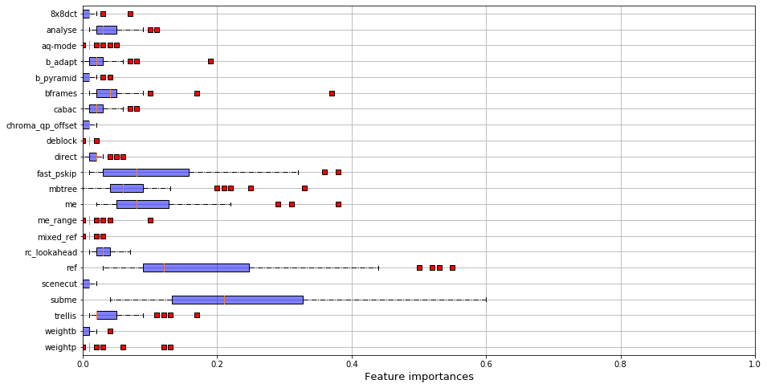
    


    
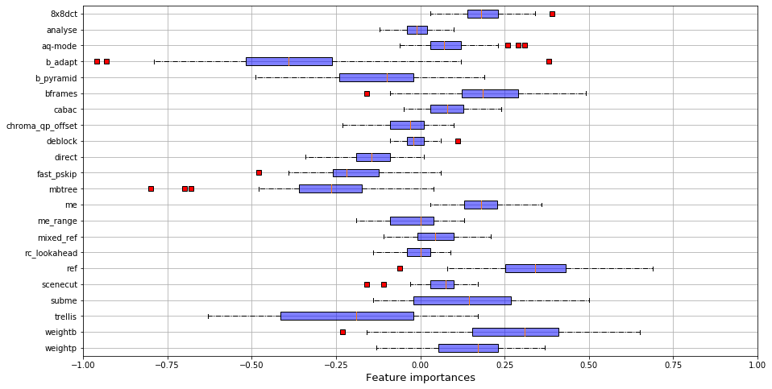
    


    
    
    Mean cpu in the group: 583.9
    Mean etime in the group: 4.8
    Mean fps in the group: 639.7
    Mean kbs in the group: 1787.9
    Mean size in the group: 4050357.4
    
    
    Animation         0.186047
    CoverSong         0.125000
    Gaming            0.020979
    HDR               0.038462
    HowTo             0.137931
    Lecture           0.067308
    LiveMusic         0.094595
    LyricVideo        0.181818
    MusicVideo             NaN
    NewsClip               NaN
    Sports            0.200000
    TelevisionClip    0.018182
    VR                0.014286
    VerticalVideo     0.013333
    Vlog              0.063291
    dtype: float64
    
    
    Mean perf_group : 1.0
    Mean SLEEQ_DMOS : -0.5005252276345113
    Mean BANDING_DMOS : -0.05948788663452829
    Mean WIDTH : -0.4102245710928738
    Mean HEIGHT : -0.4344511588082655
    Mean SPATIAL_COMPLEXITY : -0.5678958966007231
    Mean TEMPORAL_COMPLEXITY : -0.2235643447229323
    Mean CHUNK_COMPLEXITY_VARIATION : -0.523317984563195
    Mean COLOR_COMPLEXITY : -0.2204066410312244
    
    
    Correlations intra-group: 
    mean    0.621670
    50%     0.625512
    dtype: float64
    


    /home/llesoil/anaconda3/envs/x264/lib/python3.7/site-packages/ipykernel_launcher.py:32: SettingWithCopyWarning: 
    A value is trying to be set on a copy of a slice from a DataFrame.
    Try using .loc[row_indexer,col_indexer] = value instead
    
    See the caveats in the documentation: https://pandas.pydata.org/pandas-docs/stable/user_guide/indexing.html#returning-a-view-versus-a-copy


```python
summary_group(2)
```

    Group 2 : 542 videos!
    
    


    
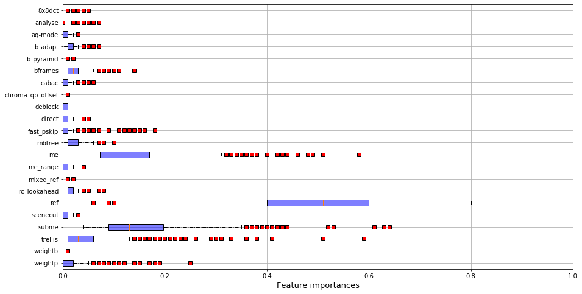
    


    
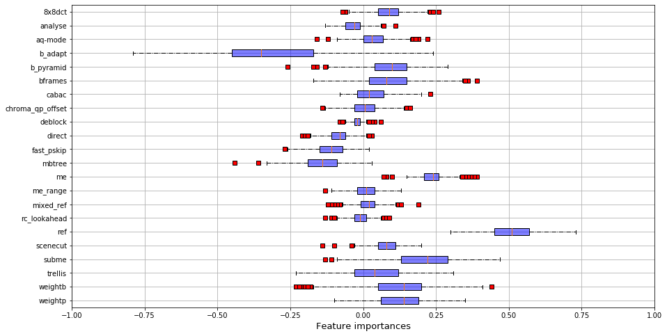
    


    
    
    Mean cpu in the group: 1136.8
    Mean etime in the group: 17.1
    Mean fps in the group: 229.5
    Mean kbs in the group: 14440.2
    Mean size in the group: 35719309.9
    
    
    str_video_cat
    Animation         0.418605
    CoverSong         0.375000
    Gaming            0.587413
    HDR               0.961538
    HowTo             0.379310
    Lecture           0.480769
    LiveMusic         0.418919
    LyricVideo        0.272727
    MusicVideo        0.375000
    NewsClip          0.500000
    Sports            0.600000
    TelevisionClip    0.600000
    VR                0.857143
    VerticalVideo     0.813333
    Vlog              0.537975
    dtype: float64
    
    
    Mean perf_group : 2.0
    Mean SLEEQ_DMOS : -0.007783684113521539
    Mean BANDING_DMOS : 0.0799198870830902
    Mean WIDTH : 0.48420997461208626
    Mean HEIGHT : 0.5268628743539673
    Mean SPATIAL_COMPLEXITY : -0.17632425968509177
    Mean TEMPORAL_COMPLEXITY : -0.007709160953271327
    Mean CHUNK_COMPLEXITY_VARIATION : 0.037016061288161414
    Mean COLOR_COMPLEXITY : -0.00044717907607854496
    
    


    /home/llesoil/anaconda3/envs/x264/lib/python3.7/site-packages/ipykernel_launcher.py:32: SettingWithCopyWarning: 
    A value is trying to be set on a copy of a slice from a DataFrame.
    Try using .loc[row_indexer,col_indexer] = value instead
    
    See the caveats in the documentation: https://pandas.pydata.org/pandas-docs/stable/user_guide/indexing.html#returning-a-view-versus-a-copy


    Correlations intra-group: 
    mean    0.877221
    50%     0.883954
    dtype: float64
    


```python
group_perf
id_list_0 = [i for i in range(len(listVideo)) if group_perf[i]==0]
id_list_1 = [i for i in range(len(listVideo)) if group_perf[i]==1]
id_list_2 = [i for i in range(len(listVideo)) if group_perf[i]==2]

res = np.zeros(9).reshape(3,3)

tab = []
for id0 in id_list_0:
    for id1 in id_list_1:
        tab.append(corrSpearman[id0][id1])
res[0][1] = np.mean(tab)

for id0 in id_list_0:
    for id2 in id_list_2:
        tab.append(corrSpearman[id0][id2])
res[0][2] = np.mean(tab)

for id1 in id_list_1:
    for id2 in id_list_2:
        tab.append(corrSpearman[id1][id2])
res[1][2] = np.mean(tab)

print(res)

res_med = np.zeros(9).reshape(3,3)

tab = []
for id0 in id_list_0:
    for id1 in id_list_1:
        tab.append(corrSpearman[id0][id1])
res_med[0][1] = np.median(tab)

for id0 in id_list_0:
    for id2 in id_list_2:
        tab.append(corrSpearman[id0][id2])
res_med[0][2] = np.median(tab)

for id1 in id_list_1:
    for id2 in id_list_2:
        tab.append(corrSpearman[id1][id2])
res_med[1][2] = np.median(tab)

res_med
```

    [[0.         0.10236622 0.39042802]
     [0.         0.         0.4402605 ]
     [0.         0.         0.        ]]


    array([[0.        , 0.10941812, 0.42301883],
           [0.        , 0.        , 0.47749604],
           [0.        , 0.        , 0.        ]])


## Penalized regression


```python
def compute_lasso_reg(listVid, id_short=None, sort_method = 'mean'):
    
    if not id_short:
        id_short = np.arange(0,len(listVid),1)
    
    listImportances = []
    
    to_keep = [k for k in listFeatures]
    to_keep.append(predDimension)
    
    names = listFeatures
    final_names = []
    final_names.append('constant')
    #for n in names:
    #    final_names.append(n)
    for n1 in range(len(names)):
        for n2 in range(len(names)):
            if n1>=n2:
                final_names.append(str(names[n1])+'*'+str(names[n2]))
    
    for id_video in range(len(listVid)):

        df = listVid[id_video][to_keep].replace(to_replace ="None",value='0')
        df['deblock'] =[int(val[0]) for val in df['deblock']]
        for col in df.columns:
            if col not in categorial:
                if col != predDimension:
                    arr_col = np.array(df[col],int)
                    arr_col = (arr_col-np.mean(arr_col))/(np.std(arr_col)+1e-5)
                    df[col] = arr_col
            else:
                df[col] = [np.where(k==df[col].unique())[0][0] for k in df[col]]
                arr_col = np.array(df[col],int)
                arr_col = (arr_col-np.mean(arr_col))/(np.std(arr_col)+1e-5)
                df[col] = arr_col
        clf = ElasticNet(l1_ratio = 1, tol = 0.01)
        X = df.drop([predDimension],axis=1)
        y = df[predDimension]
        
        poly = PolynomialFeatures(degree=2, interaction_only = True, include_bias = True)
        
        X_interact = pd.DataFrame(poly.fit_transform(X), columns=final_names)
        
        clf.fit(X_interact,y)
        
        listImportances.append(clf.coef_)

    res = pd.DataFrame({'features' : final_names})
    
    cs = 100
    
    for id_video in range(len(listImportances)):
        res['video_'+str(id_short[id_video])] = listImportances[id_video]
    
    res = res.set_index('features').transpose()
    
    feats = []
    for f in res.columns:
        if sort_method == 'mean':
            feats.append(np.mean(np.abs(res[f])))
        elif sort_method == 'max_abs':
            feats.append(np.max(np.abs(res[f])))
    
    return res[pd.Series(feats, res.columns).sort_values(ascending=False)[0:25].index]
```


```python
boxplot_imp(compute_lasso_reg(listVideo[0:5], sort_method = 'mean'))
```


    
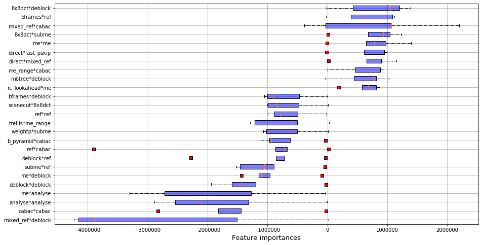
    


### With dummification - Fixed values for features


```python
vid = listVideo[0]

keep_features = ['cabac', 'ref', 'deblock', 'analyse', 'me', 'subme',
       'mixed_ref', 'me_range', 'trellis', '8x8dct', 'fast_pskip',
       'chroma_qp_offset', 'bframes', 'b_pyramid', 'b_adapt', 'direct',
       'weightb', 'open_gop', 'weightp', 'scenecut', 'rc_lookahead', 'mbtree',
       'qpmax', 'aq-mode']

dummies = pd.get_dummies(vid[keep_features], 
                   drop_first = False,
                   columns=keep_features)

X = pd.DataFrame(np.array(dummies, dtype=int))

poly = PolynomialFeatures(degree=2, interaction_only = True, include_bias = False)

dum_names = dummies.columns

X_interact = pd.DataFrame(np.array(poly.fit_transform(dummies),int))

names = []
for i in range(len(dum_names)):
    names.append(dum_names[i])
for i in range(len(dum_names)):
    for j in np.arange(i+1,len(dum_names), 1):
        names.append(dum_names[i] + " " + dum_names[j])

X_interact.columns = names
X_interact
```


<div>
<style scoped>
    .dataframe tbody tr th:only-of-type {
        vertical-align: middle;
    }

    .dataframe tbody tr th {
        vertical-align: top;
    }

    .dataframe thead th {
        text-align: right;
    }
</style>
<table border="1" class="dataframe">
  <thead>
    <tr style="text-align: right;">
      <th></th>
      <th>cabac_0</th>
      <th>cabac_1</th>
      <th>ref_1</th>
      <th>ref_2</th>
      <th>ref_3</th>
      <th>ref_5</th>
      <th>ref_7</th>
      <th>ref_8</th>
      <th>ref_16</th>
      <th>deblock_0:0:0</th>
      <th>...</th>
      <th>mbtree_0 mbtree_1</th>
      <th>mbtree_0 qpmax_69</th>
      <th>mbtree_0 aq-mode_0</th>
      <th>mbtree_0 aq-mode_1</th>
      <th>mbtree_1 qpmax_69</th>
      <th>mbtree_1 aq-mode_0</th>
      <th>mbtree_1 aq-mode_1</th>
      <th>qpmax_69 aq-mode_0</th>
      <th>qpmax_69 aq-mode_1</th>
      <th>aq-mode_0 aq-mode_1</th>
    </tr>
  </thead>
  <tbody>
    <tr>
      <th>0</th>
      <td>1</td>
      <td>0</td>
      <td>1</td>
      <td>0</td>
      <td>0</td>
      <td>0</td>
      <td>0</td>
      <td>0</td>
      <td>0</td>
      <td>1</td>
      <td>...</td>
      <td>0</td>
      <td>1</td>
      <td>1</td>
      <td>0</td>
      <td>0</td>
      <td>0</td>
      <td>0</td>
      <td>1</td>
      <td>0</td>
      <td>0</td>
    </tr>
    <tr>
      <th>1</th>
      <td>0</td>
      <td>1</td>
      <td>0</td>
      <td>1</td>
      <td>0</td>
      <td>0</td>
      <td>0</td>
      <td>0</td>
      <td>0</td>
      <td>0</td>
      <td>...</td>
      <td>0</td>
      <td>0</td>
      <td>0</td>
      <td>0</td>
      <td>1</td>
      <td>0</td>
      <td>1</td>
      <td>0</td>
      <td>1</td>
      <td>0</td>
    </tr>
    <tr>
      <th>2</th>
      <td>0</td>
      <td>1</td>
      <td>0</td>
      <td>1</td>
      <td>0</td>
      <td>0</td>
      <td>0</td>
      <td>0</td>
      <td>0</td>
      <td>0</td>
      <td>...</td>
      <td>0</td>
      <td>0</td>
      <td>0</td>
      <td>0</td>
      <td>1</td>
      <td>1</td>
      <td>0</td>
      <td>1</td>
      <td>0</td>
      <td>0</td>
    </tr>
    <tr>
      <th>3</th>
      <td>0</td>
      <td>1</td>
      <td>0</td>
      <td>1</td>
      <td>0</td>
      <td>0</td>
      <td>0</td>
      <td>0</td>
      <td>0</td>
      <td>1</td>
      <td>...</td>
      <td>0</td>
      <td>0</td>
      <td>0</td>
      <td>0</td>
      <td>1</td>
      <td>1</td>
      <td>0</td>
      <td>1</td>
      <td>0</td>
      <td>0</td>
    </tr>
    <tr>
      <th>4</th>
      <td>0</td>
      <td>1</td>
      <td>0</td>
      <td>0</td>
      <td>0</td>
      <td>0</td>
      <td>0</td>
      <td>0</td>
      <td>1</td>
      <td>0</td>
      <td>...</td>
      <td>0</td>
      <td>1</td>
      <td>0</td>
      <td>1</td>
      <td>0</td>
      <td>0</td>
      <td>0</td>
      <td>0</td>
      <td>1</td>
      <td>0</td>
    </tr>
    <tr>
      <th>...</th>
      <td>...</td>
      <td>...</td>
      <td>...</td>
      <td>...</td>
      <td>...</td>
      <td>...</td>
      <td>...</td>
      <td>...</td>
      <td>...</td>
      <td>...</td>
      <td>...</td>
      <td>...</td>
      <td>...</td>
      <td>...</td>
      <td>...</td>
      <td>...</td>
      <td>...</td>
      <td>...</td>
      <td>...</td>
      <td>...</td>
      <td>...</td>
    </tr>
    <tr>
      <th>196</th>
      <td>0</td>
      <td>1</td>
      <td>0</td>
      <td>1</td>
      <td>0</td>
      <td>0</td>
      <td>0</td>
      <td>0</td>
      <td>0</td>
      <td>0</td>
      <td>...</td>
      <td>0</td>
      <td>0</td>
      <td>0</td>
      <td>0</td>
      <td>1</td>
      <td>0</td>
      <td>1</td>
      <td>0</td>
      <td>1</td>
      <td>0</td>
    </tr>
    <tr>
      <th>197</th>
      <td>0</td>
      <td>1</td>
      <td>0</td>
      <td>1</td>
      <td>0</td>
      <td>0</td>
      <td>0</td>
      <td>0</td>
      <td>0</td>
      <td>1</td>
      <td>...</td>
      <td>0</td>
      <td>0</td>
      <td>0</td>
      <td>0</td>
      <td>1</td>
      <td>0</td>
      <td>1</td>
      <td>0</td>
      <td>1</td>
      <td>0</td>
    </tr>
    <tr>
      <th>198</th>
      <td>0</td>
      <td>1</td>
      <td>0</td>
      <td>0</td>
      <td>0</td>
      <td>1</td>
      <td>0</td>
      <td>0</td>
      <td>0</td>
      <td>0</td>
      <td>...</td>
      <td>0</td>
      <td>0</td>
      <td>0</td>
      <td>0</td>
      <td>1</td>
      <td>0</td>
      <td>1</td>
      <td>0</td>
      <td>1</td>
      <td>0</td>
    </tr>
    <tr>
      <th>199</th>
      <td>1</td>
      <td>0</td>
      <td>0</td>
      <td>0</td>
      <td>1</td>
      <td>0</td>
      <td>0</td>
      <td>0</td>
      <td>0</td>
      <td>1</td>
      <td>...</td>
      <td>0</td>
      <td>1</td>
      <td>0</td>
      <td>1</td>
      <td>0</td>
      <td>0</td>
      <td>0</td>
      <td>0</td>
      <td>1</td>
      <td>0</td>
    </tr>
    <tr>
      <th>200</th>
      <td>0</td>
      <td>1</td>
      <td>0</td>
      <td>0</td>
      <td>0</td>
      <td>0</td>
      <td>0</td>
      <td>0</td>
      <td>1</td>
      <td>0</td>
      <td>...</td>
      <td>0</td>
      <td>0</td>
      <td>0</td>
      <td>0</td>
      <td>1</td>
      <td>0</td>
      <td>1</td>
      <td>0</td>
      <td>1</td>
      <td>0</td>
    </tr>
  </tbody>
</table>
<p>201 rows × 3081 columns</p>
</div>


```python
def compute_lasso(id_group):
    id_video = [i for i in range(len(listVideo)) if group_perf[i]==id_group]
    keep_inter = []
    for idv in id_video:
        vid = listVideo[idv]
        regr = ElasticNet(l1_ratio = 1, tol = 0.01)
        regr.fit(X_interact, vid[predDimension])
        serie = pd.Series(np.abs(regr.coef_), names)
        keep_inter.append(np.array(serie.sort_values(ascending=False)[0:25].index, str))
    arr = np.array(keep_inter).reshape(-1,1)
    d = dict()
    for interact in arr:
        word = interact[0]
        if word not in d:
            d[word] = 1
        else:
            d[word] = d[word]+1
    res = pd.Series([d[w] for w in d.keys()], d.keys())
    return np.array(res.sort_values(ascending=False)[0:25].index, str)  
```


```python
for t in range(3):
    print(np.sort(compute_lasso(t)))
```

    ['analyse_0:0' 'analyse_0:0 subme_1' 'analyse_0x3:0x3 bframes_0'
     'aq-mode_0' 'cabac_0' 'cabac_0 analyse_0x3:0x133' 'cabac_0 bframes_16'
     'cabac_0 ref_1' 'cabac_0 ref_16' 'cabac_0 ref_3' 'cabac_0 ref_5'
     'cabac_0 ref_8' 'cabac_0 subme_11' 'cabac_1 deblock_0:0:0'
     'cabac_1 scenecut_None' 'deblock_0:0:0' 'rc_lookahead_20' 'ref_1'
     'ref_16 subme_7' 'ref_2 subme_7' 'ref_3 analyse_0:0' 'scenecut_None'
     'subme_0' 'subme_2' 'subme_7']
    ['analyse_0:0 subme_1' 'aq-mode_0' 'bframes_0' 'cabac_0'
     'cabac_0 bframes_16' 'cabac_0 ref_1' 'cabac_0 ref_16' 'cabac_0 ref_3'
     'cabac_0 ref_5' 'cabac_0 subme_11' 'cabac_1 ref_7'
     'cabac_1 scenecut_None' 'mbtree_0' 'me_dia' 'me_hex subme_0' 'ref_1'
     'ref_2 subme_10' 'ref_3' 'ref_3 analyse_0x113:0x113' 'ref_7'
     'scenecut_None' 'subme_0' 'subme_1 rc_lookahead_10' 'subme_2' 'subme_6']
    ['analyse_0:0' 'analyse_0x3:0x3 bframes_0' 'b_pyramid_1' 'bframes_0'
     'cabac_0' 'cabac_0 bframes_16' 'cabac_0 ref_1' 'cabac_0 ref_16'
     'cabac_0 ref_3' 'cabac_0 ref_5' 'cabac_0 ref_8' 'cabac_0 subme_11'
     'cabac_1 deblock_0:0:0' 'cabac_1 ref_7' 'deblock_0:0:0' 'me_dia'
     'me_hex subme_0' 'me_tesa' 'ref_1' 'ref_2 subme_7' 'ref_7'
     'scenecut_None' 'subme_0' 'subme_2' 'subme_7']


## Quantile regression


```python
def compute_quantile_reg(listVid, id_short=None, quantile = 0.5):
    
    if not id_short:
        id_short = np.arange(0,len(listVid),1)
    
    listImportances = []
    
    to_keep = [k for k in listFeatures]
    to_keep.append(predDimension)
    
    for id_video in range(len(listVid)):

        df = listVid[id_video][to_keep].replace(to_replace ="None",value='0')
        df['deblock'] =[int(val[0]) for val in df['deblock']]
        for col in df.columns:
            if col not in categorial:
                if col != predDimension:
                    arr_col = np.array(df[col],int)
                    arr_col = (arr_col-np.mean(arr_col))/(np.std(arr_col)+1e-5)
                    df[col] = arr_col
            else:
                df[col] = [np.where(k==df[col].unique())[0][0] for k in df[col]]
                arr_col = np.array(df[col],int)
                arr_col = (arr_col-np.mean(arr_col))/(np.std(arr_col)+1e-5)
                df[col] = arr_col
        if quantile:
            clf = QuantileLinearRegression(quantile=quantile)
        else:
            clf = QuantileLinearRegression()
        X = df.drop([predDimension],axis=1)
        y = df[predDimension]
        
        clf.fit(X,y)
        
        listImportances.append(clf.coef_)

    res = pd.DataFrame({'features' : listFeatures})
    
    cs = 100
    
    for id_video in range(len(listImportances)):
        res['video_'+str(id_short[id_video])] = listImportances[id_video]
    
    return res.set_index('features').transpose()
```


```python
id_list = [i for i in range(len(listVideo)) if group_perf[i]==0]
listVideoGroup = [listVideo[i] for i in range(len(listVideo)) if i in id_list]
quantile = [0.1*k for k in np.arange(0.1,1,0.1)]
for q in quantile:
    boxplot_imp(compute_quantile_reg(listVideoGroup, quantile = q))
```


    

    


    
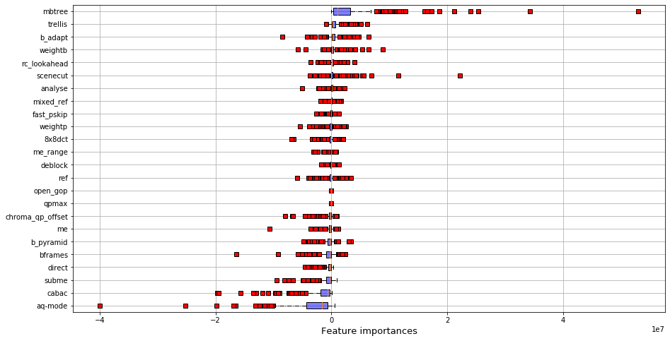
    


    
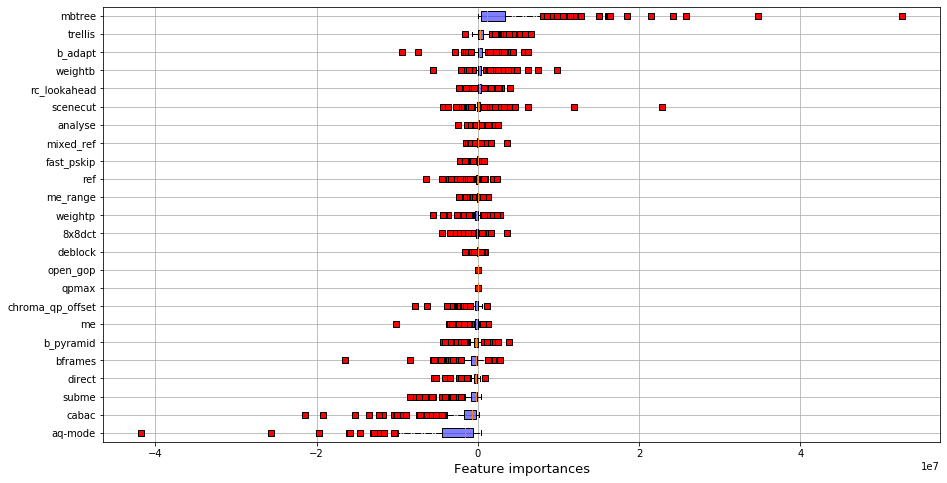
    


    

    


    

    


    
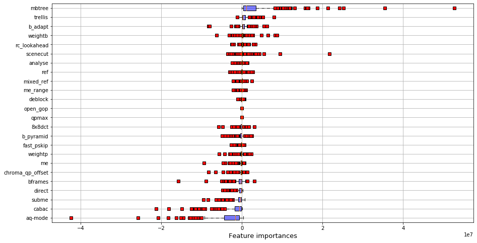
    


    
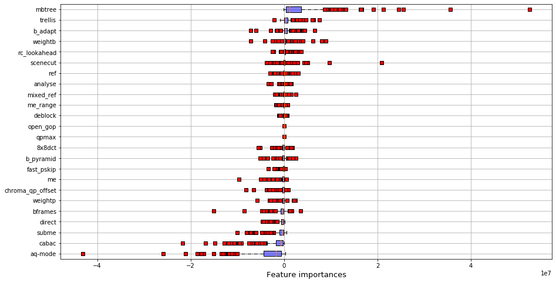
    


    
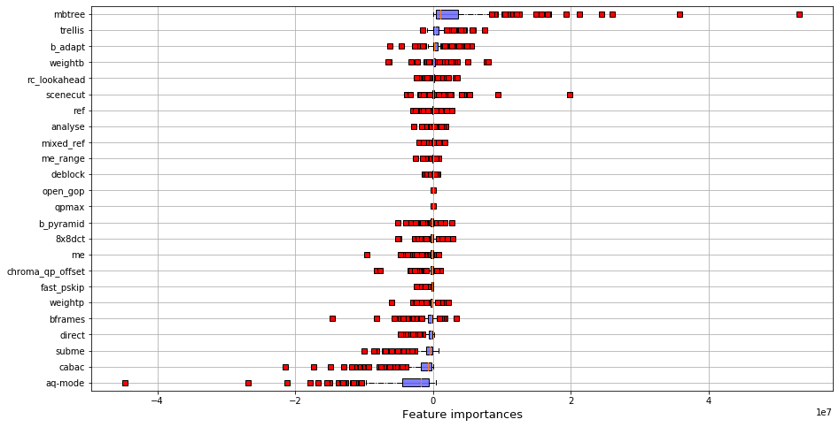
    


    
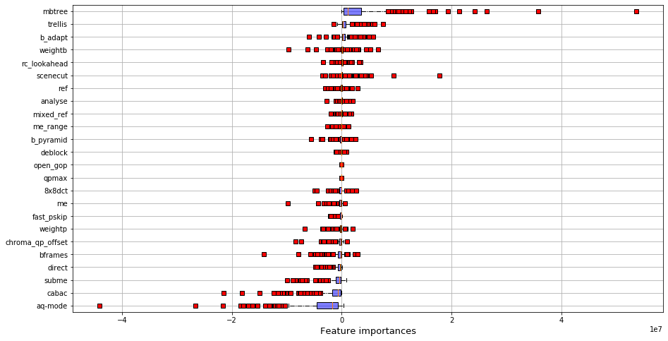
    


## RQ2.2 - Group classification


```python
if 'str_video_cat' in meta_perf.columns:
    del meta_perf['str_video_cat']

accuracy = []

nbLaunches =10
for i in range(nbLaunches):
    X = np.array(meta_perf[[k for k in meta_perf.columns if k !='perf_group']], float)
    y = np.array(meta_perf['perf_group'], float)

    X_train, X_test, y_train, y_test = train_test_split(X, y, test_size=0.25)

    rf = RandomForestClassifier()
    rf.fit(X_train, y_train)
    y_pred = rf.predict(X_test)


    conf = pd.crosstab(y_pred, y_test)#, colnames=[1,2,3], rownames=[1,2,3])
    val = np.sum(np.diag(conf))/len(y_test)
    accuracy.append(val)
    print('Test accuracy : '+ str(val))
    conf.columns = pd.Int64Index([1,2,3], dtype='int64', name='Observed')
    conf.index = pd.Int64Index([1,2,3], dtype='int64', name='Predicted')
    conf
print(np.mean(accuracy))
conf
```

    Test accuracy : 0.772020725388601
    Test accuracy : 0.689119170984456
    Test accuracy : 0.7461139896373057
    Test accuracy : 0.7305699481865285
    Test accuracy : 0.7305699481865285
    Test accuracy : 0.6735751295336787
    Test accuracy : 0.7150259067357513
    Test accuracy : 0.7357512953367875
    Test accuracy : 0.7305699481865285
    Test accuracy : 0.7409326424870466
    0.7264248704663212


<div>
<style scoped>
    .dataframe tbody tr th:only-of-type {
        vertical-align: middle;
    }

    .dataframe tbody tr th {
        vertical-align: top;
    }

    .dataframe thead th {
        text-align: right;
    }
</style>
<table border="1" class="dataframe">
  <thead>
    <tr style="text-align: right;">
      <th>Observed</th>
      <th>1</th>
      <th>2</th>
      <th>3</th>
    </tr>
    <tr>
      <th>Predicted</th>
      <th></th>
      <th></th>
      <th></th>
    </tr>
  </thead>
  <tbody>
    <tr>
      <th>1</th>
      <td>39</td>
      <td>0</td>
      <td>11</td>
    </tr>
    <tr>
      <th>2</th>
      <td>0</td>
      <td>20</td>
      <td>11</td>
    </tr>
    <tr>
      <th>3</th>
      <td>11</td>
      <td>17</td>
      <td>84</td>
    </tr>
  </tbody>
</table>
</div>


```python
meta_perf
```


<div>
<style scoped>
    .dataframe tbody tr th:only-of-type {
        vertical-align: middle;
    }

    .dataframe tbody tr th {
        vertical-align: top;
    }

    .dataframe thead th {
        text-align: right;
    }
</style>
<table border="1" class="dataframe">
  <thead>
    <tr style="text-align: right;">
      <th></th>
      <th>perf_group</th>
      <th>SLEEQ_DMOS</th>
      <th>BANDING_DMOS</th>
      <th>WIDTH</th>
      <th>HEIGHT</th>
      <th>SPATIAL_COMPLEXITY</th>
      <th>TEMPORAL_COMPLEXITY</th>
      <th>CHUNK_COMPLEXITY_VARIATION</th>
      <th>COLOR_COMPLEXITY</th>
      <th>video_category</th>
    </tr>
    <tr>
      <th>FILENAME</th>
      <th></th>
      <th></th>
      <th></th>
      <th></th>
      <th></th>
      <th></th>
      <th></th>
      <th></th>
      <th></th>
      <th></th>
    </tr>
  </thead>
  <tbody>
    <tr>
      <th>Animation_1080P-05f8</th>
      <td>2</td>
      <td>0.843640</td>
      <td>0.742227</td>
      <td>0.380890</td>
      <td>0.330315</td>
      <td>-0.147062</td>
      <td>0.443113</td>
      <td>2.546727</td>
      <td>2.208462</td>
      <td>-1.618994</td>
    </tr>
    <tr>
      <th>Animation_1080P-0c4f</th>
      <td>2</td>
      <td>-0.656518</td>
      <td>-0.377309</td>
      <td>0.380890</td>
      <td>0.330315</td>
      <td>0.422696</td>
      <td>-0.963894</td>
      <td>1.055535</td>
      <td>-1.232585</td>
      <td>-1.618994</td>
    </tr>
    <tr>
      <th>Animation_1080P-0cdf</th>
      <td>0</td>
      <td>-0.294941</td>
      <td>-0.059125</td>
      <td>0.380890</td>
      <td>0.330315</td>
      <td>-0.028411</td>
      <td>0.429840</td>
      <td>-0.102867</td>
      <td>-0.448165</td>
      <td>-1.618994</td>
    </tr>
    <tr>
      <th>Animation_1080P-18f5</th>
      <td>0</td>
      <td>-0.479576</td>
      <td>-0.377309</td>
      <td>0.380890</td>
      <td>0.330315</td>
      <td>1.289667</td>
      <td>-0.959469</td>
      <td>-0.050889</td>
      <td>0.193239</td>
      <td>-1.618994</td>
    </tr>
    <tr>
      <th>Animation_1080P-209f</th>
      <td>2</td>
      <td>6.282675</td>
      <td>-0.377309</td>
      <td>0.380890</td>
      <td>0.330315</td>
      <td>2.315231</td>
      <td>-1.512538</td>
      <td>-0.622865</td>
      <td>-1.232585</td>
      <td>-1.618994</td>
    </tr>
    <tr>
      <th>...</th>
      <td>...</td>
      <td>...</td>
      <td>...</td>
      <td>...</td>
      <td>...</td>
      <td>...</td>
      <td>...</td>
      <td>...</td>
      <td>...</td>
      <td>...</td>
    </tr>
    <tr>
      <th>Vlog_720P-561e</th>
      <td>2</td>
      <td>-0.679597</td>
      <td>-0.377309</td>
      <td>-0.241046</td>
      <td>-0.334452</td>
      <td>0.979531</td>
      <td>-1.415198</td>
      <td>-0.652628</td>
      <td>0.457602</td>
      <td>1.494285</td>
    </tr>
    <tr>
      <th>Vlog_720P-5d08</th>
      <td>0</td>
      <td>-0.679597</td>
      <td>-0.377309</td>
      <td>-0.773579</td>
      <td>-0.334452</td>
      <td>3.258561</td>
      <td>-0.304636</td>
      <td>-0.437382</td>
      <td>-0.157800</td>
      <td>1.494285</td>
    </tr>
    <tr>
      <th>Vlog_720P-60f8</th>
      <td>0</td>
      <td>0.443598</td>
      <td>0.624381</td>
      <td>-0.241046</td>
      <td>-0.334452</td>
      <td>0.234735</td>
      <td>-0.043587</td>
      <td>-0.364052</td>
      <td>-0.149132</td>
      <td>1.494285</td>
    </tr>
    <tr>
      <th>Vlog_720P-6410</th>
      <td>1</td>
      <td>-0.456497</td>
      <td>3.770868</td>
      <td>-0.241046</td>
      <td>-0.334452</td>
      <td>-0.770858</td>
      <td>2.120018</td>
      <td>1.971948</td>
      <td>-0.240142</td>
      <td>1.494285</td>
    </tr>
    <tr>
      <th>Vlog_720P-6d56</th>
      <td>2</td>
      <td>0.628233</td>
      <td>-0.353740</td>
      <td>-0.241046</td>
      <td>-0.334452</td>
      <td>-0.329149</td>
      <td>0.328075</td>
      <td>1.647785</td>
      <td>0.565947</td>
      <td>1.494285</td>
    </tr>
  </tbody>
</table>
<p>769 rows × 10 columns</p>
</div>


```python
pd.DataFrame({'Random forest importance' : rf.feature_importances_,
              'name' : meta_perf.columns[1:]}).set_index('name')
```


<div>
<style scoped>
    .dataframe tbody tr th:only-of-type {
        vertical-align: middle;
    }

    .dataframe tbody tr th {
        vertical-align: top;
    }

    .dataframe thead th {
        text-align: right;
    }
</style>
<table border="1" class="dataframe">
  <thead>
    <tr style="text-align: right;">
      <th></th>
      <th>Random forest importance</th>
    </tr>
    <tr>
      <th>name</th>
      <th></th>
    </tr>
  </thead>
  <tbody>
    <tr>
      <th>SLEEQ_DMOS</th>
      <td>0.072091</td>
    </tr>
    <tr>
      <th>BANDING_DMOS</th>
      <td>0.046348</td>
    </tr>
    <tr>
      <th>WIDTH</th>
      <td>0.045705</td>
    </tr>
    <tr>
      <th>HEIGHT</th>
      <td>0.034997</td>
    </tr>
    <tr>
      <th>SPATIAL_COMPLEXITY</th>
      <td>0.289946</td>
    </tr>
    <tr>
      <th>TEMPORAL_COMPLEXITY</th>
      <td>0.209568</td>
    </tr>
    <tr>
      <th>CHUNK_COMPLEXITY_VARIATION</th>
      <td>0.148379</td>
    </tr>
    <tr>
      <th>COLOR_COMPLEXITY</th>
      <td>0.097515</td>
    </tr>
    <tr>
      <th>video_category</th>
      <td>0.055450</td>
    </tr>
  </tbody>
</table>
</div>


```python
meta_perf.groupby(['perf_group']).mean()
```


<div>
<style scoped>
    .dataframe tbody tr th:only-of-type {
        vertical-align: middle;
    }

    .dataframe tbody tr th {
        vertical-align: top;
    }

    .dataframe thead th {
        text-align: right;
    }
</style>
<table border="1" class="dataframe">
  <thead>
    <tr style="text-align: right;">
      <th></th>
      <th>SLEEQ_DMOS</th>
      <th>BANDING_DMOS</th>
      <th>WIDTH</th>
      <th>HEIGHT</th>
      <th>SPATIAL_COMPLEXITY</th>
      <th>TEMPORAL_COMPLEXITY</th>
      <th>CHUNK_COMPLEXITY_VARIATION</th>
      <th>COLOR_COMPLEXITY</th>
      <th>video_category</th>
    </tr>
    <tr>
      <th>perf_group</th>
      <th></th>
      <th></th>
      <th></th>
      <th></th>
      <th></th>
      <th></th>
      <th></th>
      <th></th>
      <th></th>
    </tr>
  </thead>
  <tbody>
    <tr>
      <th>0</th>
      <td>-0.078311</td>
      <td>-0.229780</td>
      <td>-0.116496</td>
      <td>-0.135671</td>
      <td>0.804723</td>
      <td>0.289698</td>
      <td>0.717640</td>
      <td>-0.082420</td>
      <td>0.043716</td>
    </tr>
    <tr>
      <th>1</th>
      <td>0.081870</td>
      <td>0.122683</td>
      <td>0.607173</td>
      <td>0.537666</td>
      <td>-0.891920</td>
      <td>0.661285</td>
      <td>-0.297182</td>
      <td>0.188592</td>
      <td>-0.008223</td>
    </tr>
    <tr>
      <th>2</th>
      <td>-0.071027</td>
      <td>0.103646</td>
      <td>-0.271269</td>
      <td>-0.301448</td>
      <td>-0.223278</td>
      <td>-0.461625</td>
      <td>-0.203138</td>
      <td>0.048928</td>
      <td>-0.386508</td>
    </tr>
  </tbody>
</table>
</div>


```python

```

## RQ2.3 - Auto-tune


```python
import tensorflow as tf
import tensorflow.keras as kr
print(tf.__version__)
```


```python
import tensorflow.compat.v1 as tf
tf.disable_v2_behavior() 
import numpy as np
import seaborn as sb
import matplotlib.pyplot as plt
sb.set()

def get_y(x):
    return 10 + x*x

def sample_data(n=10000, scale=100):
    data = []

    x = scale*(np.random.random_sample((n,))-0.5)

    for i in range(n):
        yi = get_y(x[i])
        data.append([x[i], yi])

    return np.array(data)

def sample_Z(m, n):
    return np.random.uniform(-1., 1., size=[m, n])

def generator(Z,hsize=[16, 16],reuse=False):
    with tf.variable_scope("GAN/Generator",reuse=reuse):
        h1 = tf.layers.dense(Z,hsize[0],activation=tf.nn.leaky_relu)
        h2 = tf.layers.dense(h1,hsize[1],activation=tf.nn.leaky_relu)
        out = tf.layers.dense(h2,2)

    return out

def discriminator(X,hsize=[16, 16],reuse=False):
    with tf.variable_scope("GAN/Discriminator",reuse=reuse):
        h1 = tf.layers.dense(X,hsize[0],activation=tf.nn.leaky_relu)
        h2 = tf.layers.dense(h1,hsize[1],activation=tf.nn.leaky_relu)
        h3 = tf.layers.dense(h2,2)
        out = tf.layers.dense(h3,1)

    return out, h3


X = tf.placeholder(tf.float32,[None,2])
Z = tf.placeholder(tf.float32,[None,2])

G_sample = generator(Z)
r_logits, r_rep = discriminator(X)
f_logits, g_rep = discriminator(G_sample,reuse=True)

disc_loss = tf.reduce_mean(tf.nn.sigmoid_cross_entropy_with_logits(logits=r_logits,labels=tf.ones_like(r_logits)) + tf.nn.sigmoid_cross_entropy_with_logits(logits=f_logits,labels=tf.zeros_like(f_logits)))
gen_loss = tf.reduce_mean(tf.nn.sigmoid_cross_entropy_with_logits(logits=f_logits,labels=tf.ones_like(f_logits)))

gen_vars = tf.get_collection(tf.GraphKeys.GLOBAL_VARIABLES,scope="GAN/Generator")
disc_vars = tf.get_collection(tf.GraphKeys.GLOBAL_VARIABLES,scope="GAN/Discriminator")

gen_step = tf.train.RMSPropOptimizer(learning_rate=0.001).minimize(gen_loss,var_list = gen_vars) # G Train step
disc_step = tf.train.RMSPropOptimizer(learning_rate=0.001).minimize(disc_loss,var_list = disc_vars) # D Train step


# sess = tf.Session(config=config)
sess = tf.Session()
tf.global_variables_initializer().run(session=sess)

batch_size = 256
nd_steps = 10
ng_steps = 10

x_plot = sample_data(n=batch_size)

f = open('loss_logs.csv','w')
f.write('Iteration,Discriminator Loss,Generator Loss\n')

for i in range(10001):
    X_batch = sample_data(n=batch_size)
    Z_batch = sample_Z(batch_size, 2)

    for _ in range(nd_steps):
        _, dloss = sess.run([disc_step, disc_loss], feed_dict={X: X_batch, Z: Z_batch})
    rrep_dstep, grep_dstep = sess.run([r_rep, g_rep], feed_dict={X: X_batch, Z: Z_batch})

    for _ in range(ng_steps):
        _, gloss = sess.run([gen_step, gen_loss], feed_dict={Z: Z_batch})

    rrep_gstep, grep_gstep = sess.run([r_rep, g_rep], feed_dict={X: X_batch, Z: Z_batch})
    
    if i%1000 == 0:
        print("Iterations: %d\t Discriminator loss: %.4f\t Generator loss: %.4f"%(i,dloss,gloss))
        f.write("%d,%f,%f\n"%(i,dloss,gloss))

    if i%1000 == 0:
        plt.figure()
        g_plot = sess.run(G_sample, feed_dict={Z: Z_batch})
        xax = plt.scatter(x_plot[:,0], x_plot[:,1])
        gax = plt.scatter(g_plot[:,0],g_plot[:,1])

        plt.legend((xax,gax), ("Real Data","Generated Data"))
        plt.title('Samples at Iteration %d'%i)
        plt.tight_layout()
        plt.savefig('../iteration/iteration_%d.png'%i)
        plt.close()

        plt.figure()
        rrd = plt.scatter(rrep_dstep[:,0], rrep_dstep[:,1], alpha=0.5)
        rrg = plt.scatter(rrep_gstep[:,0], rrep_gstep[:,1], alpha=0.5)
        grd = plt.scatter(grep_dstep[:,0], grep_dstep[:,1], alpha=0.5)
        grg = plt.scatter(grep_gstep[:,0], grep_gstep[:,1], alpha=0.5)


        plt.legend((rrd, rrg, grd, grg), ("Real Data Before G step","Real Data After G step",
                               "Generated Data Before G step","Generated Data After G step"))
        plt.title('Transformed Features at Iteration %d'%i)
        plt.tight_layout()
        plt.savefig('../iteration/feature_transform_%d.png'%i)
        plt.close()

        plt.figure()

        rrdc = plt.scatter(np.mean(rrep_dstep[:,0]), np.mean(rrep_dstep[:,1]),s=100, alpha=0.5)
        rrgc = plt.scatter(np.mean(rrep_gstep[:,0]), np.mean(rrep_gstep[:,1]),s=100, alpha=0.5)
        grdc = plt.scatter(np.mean(grep_dstep[:,0]), np.mean(grep_dstep[:,1]),s=100, alpha=0.5)
        grgc = plt.scatter(np.mean(grep_gstep[:,0]), np.mean(grep_gstep[:,1]),s=100, alpha=0.5)

        plt.legend((rrdc, rrgc, grdc, grgc), ("Real Data Before G step","Real Data After G step",
                               "Generated Data Before G step","Generated Data After G step"))

        plt.title('Centroid of Transformed Features at Iteration %d'%i)
        plt.tight_layout()
        plt.savefig('../iteration/feature_transform_centroid_%d.png'%i)
        plt.close()

f.close()
```


```python

```


```python

```


```python

```


```python

```


```python

```


```python

```


```python
import numpy as np
import time
import tensorflow.compat.v1 as tf
tf.disable_v2_behavior() 

from tensorflow.examples.tutorials.mnist import input_data

from keras.models import Sequential
from keras.layers import Dense, Activation, Flatten, Reshape
from keras.layers import Conv2D, Conv2DTranspose, UpSampling2D
from keras.layers import LeakyReLU, Dropout
from keras.layers import BatchNormalization
from keras.optimizers import Adam, RMSprop

import matplotlib.pyplot as plt

class ElapsedTimer(object):
    def __init__(self):
        self.start_time = time.time()
    def elapsed(self,sec):
        if sec < 60:
            return str(sec) + " sec"
        elif sec < (60 * 60):
            return str(sec / 60) + " min"
        else:
            return str(sec / (60 * 60)) + " hr"
    def elapsed_time(self):
        print("Elapsed: %s " % self.elapsed(time.time() - self.start_time) )

class DCGAN(object):
    def __init__(self, img_rows=28, img_cols=28, channel=1):

        self.img_rows = img_rows
        self.img_cols = img_cols
        self.channel = channel
        self.D = None   # discriminator
        self.G = None   # generator
        self.AM = None  # adversarial model
        self.DM = None  # discriminator model

    # (W−F+2P)/S+1
    def discriminator(self):
        if self.D:
            return self.D
        self.D = Sequential()
        depth = 64
        dropout = 0.4
        # In: 28 x 28 x 1, depth = 1
        # Out: 14 x 14 x 1, depth=64
        input_shape = (self.img_rows, self.img_cols, self.channel)
        self.D.add(Conv2D(depth*1, 5, strides=2, input_shape=input_shape,\
            padding='same'))
        self.D.add(LeakyReLU(alpha=0.2))
        self.D.add(Dropout(dropout))

        self.D.add(Conv2D(depth*2, 5, strides=2, padding='same'))
        self.D.add(LeakyReLU(alpha=0.2))
        self.D.add(Dropout(dropout))

        self.D.add(Conv2D(depth*4, 5, strides=2, padding='same'))
        self.D.add(LeakyReLU(alpha=0.2))
        self.D.add(Dropout(dropout))

        self.D.add(Conv2D(depth*8, 5, strides=1, padding='same'))
        self.D.add(LeakyReLU(alpha=0.2))
        self.D.add(Dropout(dropout))

        # Out: 1-dim probability
        self.D.add(Flatten())
        self.D.add(Dense(1))
        self.D.add(Activation('sigmoid'))
        self.D.summary()
        return self.D

    def generator(self):
        if self.G:
            return self.G
        self.G = Sequential()
        dropout = 0.4
        depth = 64+64+64+64
        dim = 7
        # In: 100
        # Out: dim x dim x depth
        self.G.add(Dense(dim*dim*depth, input_dim=100))
        self.G.add(BatchNormalization(momentum=0.9))
        self.G.add(Activation('relu'))
        self.G.add(Reshape((dim, dim, depth)))
        self.G.add(Dropout(dropout))

        # In: dim x dim x depth
        # Out: 2*dim x 2*dim x depth/2
        self.G.add(UpSampling2D())
        self.G.add(Conv2DTranspose(int(depth/2), 5, padding='same'))
        self.G.add(BatchNormalization(momentum=0.9))
        self.G.add(Activation('relu'))

        self.G.add(UpSampling2D())
        self.G.add(Conv2DTranspose(int(depth/4), 5, padding='same'))
        self.G.add(BatchNormalization(momentum=0.9))
        self.G.add(Activation('relu'))

        self.G.add(Conv2DTranspose(int(depth/8), 5, padding='same'))
        self.G.add(BatchNormalization(momentum=0.9))
        self.G.add(Activation('relu'))

        # Out: 28 x 28 x 1 grayscale image [0.0,1.0] per pix
        self.G.add(Conv2DTranspose(1, 5, padding='same'))
        self.G.add(Activation('sigmoid'))
        self.G.summary()
        return self.G

    def discriminator_model(self):
        if self.DM:
            return self.DM
        optimizer = RMSprop(lr=0.0002, decay=6e-8)
        self.DM = Sequential()
        self.DM.add(self.discriminator())
        self.DM.compile(loss='binary_crossentropy', optimizer=optimizer,\
            metrics=['accuracy'])
        return self.DM

    def adversarial_model(self):
        if self.AM:
            return self.AM
        optimizer = RMSprop(lr=0.0001, decay=3e-8)
        self.AM = Sequential()
        self.AM.add(self.generator())
        self.AM.add(self.discriminator())
        self.AM.compile(loss='binary_crossentropy', optimizer=optimizer,\
            metrics=['accuracy'])
        return self.AM

class MNIST_DCGAN(object):
    def __init__(self):
        self.img_rows = 28
        self.img_cols = 28
        self.channel = 1

        self.x_train = input_data.read_data_sets("mnist",\
        	one_hot=True).train.images
        self.x_train = self.x_train.reshape(-1, self.img_rows,\
        	self.img_cols, 1).astype(np.float32)

        self.DCGAN = DCGAN()
        self.discriminator =  self.DCGAN.discriminator_model()
        self.adversarial = self.DCGAN.adversarial_model()
        self.generator = self.DCGAN.generator()

    def train(self, train_steps=2000, batch_size=256, save_interval=0):
        noise_input = None
        if save_interval>0:
            noise_input = np.random.uniform(-1.0, 1.0, size=[16, 100])
        for i in range(train_steps):
            images_train = self.x_train[np.random.randint(0,
                self.x_train.shape[0], size=batch_size), :, :, :]
            noise = np.random.uniform(-1.0, 1.0, size=[batch_size, 100])
            images_fake = self.generator.predict(noise)
            x = np.concatenate((images_train, images_fake))
            y = np.ones([2*batch_size, 1])
            y[batch_size:, :] = 0
            d_loss = self.discriminator.train_on_batch(x, y)

            y = np.ones([batch_size, 1])
            noise = np.random.uniform(-1.0, 1.0, size=[batch_size, 100])
            a_loss = self.adversarial.train_on_batch(noise, y)
            log_mesg = "%d: [D loss: %f, acc: %f]" % (i, d_loss[0], d_loss[1])
            log_mesg = "%s  [A loss: %f, acc: %f]" % (log_mesg, a_loss[0], a_loss[1])
            print(log_mesg)
            if save_interval>0:
                if (i+1)%save_interval==0:
                    self.plot_images(save2file=True, samples=noise_input.shape[0],\
                        noise=noise_input, step=(i+1))

    def plot_images(self, save2file=False, fake=True, samples=16, noise=None, step=0):
        filename = 'mnist.png'
        if fake:
            if noise is None:
                noise = np.random.uniform(-1.0, 1.0, size=[samples, 100])
            else:
                filename = "mnist_%d.png" % step
            images = self.generator.predict(noise)
        else:
            i = np.random.randint(0, self.x_train.shape[0], samples)
            images = self.x_train[i, :, :, :]

        plt.figure(figsize=(10,10))
        for i in range(images.shape[0]):
            plt.subplot(4, 4, i+1)
            image = images[i, :, :, :]
            image = np.reshape(image, [self.img_rows, self.img_cols])
            plt.imshow(image, cmap='gray')
            plt.axis('off')
        plt.tight_layout()
        if save2file:
            plt.savefig(filename)
            plt.close('all')
        else:
            plt.show()

mnist_dcgan = MNIST_DCGAN()
timer = ElapsedTimer()
mnist_dcgan.train(train_steps=10000, batch_size=256, save_interval=500)
timer.elapsed_time()
mnist_dcgan.plot_images(fake=True)
mnist_dcgan.plot_images(fake=False, save2file=True)
```

# PCA 


```python

```


```python

df_std_meta = meta[['SPATIAL_COMPLEXITY', 'TEMPORAL_COMPLEXITY', 
                          'CHUNK_COMPLEXITY_VARIATION','COLOR_COMPLEXITY']]
std_meta = np.array(df_std_meta)

kmeans = KMeans(n_clusters=3)
kmeans.fit(std_meta)
meta['clusters'] = kmeans.labels_
meta['category']=[str(meta.index[i]).split('_')[0] for i in range(meta.shape[0])]
meta['quality']=[str(meta.index[i]).split('_')[1].split('-')[0] for i in range(meta.shape[0])]


pca = PCA(n_components=2, svd_solver='full')
tab = pca.fit_transform(std_meta)
x = [tab[i][0] for i in range(len(tab))]
y = [tab[i][1] for i in range(len(tab))]

col = ['gray','red','green','black']

plt.figure(figsize=(16,8))
plt.title("Axis (PCA) Color Kmeans classes")
plt.scatter(x, y, color = [col[k] for k in meta['clusters']])
lab=np.array(meta.index,str)
#for i in range(len(x)):
#    plt.text(x[i], y[i], lab[i])
plt.show()
```


```python
pd.crosstab(meta_perf['perf_group'], meta['clusters'])
```


```python
meta_perf
```


```python

```


```python

```
