```python
import numpy as np

import pandas as pd

import matplotlib.pyplot as plt
import seaborn as sns

import scipy.stats as sc
from scipy.cluster.hierarchy import linkage, cut_tree, leaves_list

from sklearn.decomposition import PCA
from sklearn.ensemble import RandomForestRegressor, RandomForestClassifier, GradientBoostingClassifier
from sklearn.preprocessing import PolynomialFeatures
from sklearn.linear_model import LinearRegression, ElasticNet
from sklearn.model_selection import train_test_split
from sklearn.cluster import KMeans

import os

import keras
from keras.models import Sequential,Input,Model
from keras.layers import Dense, Dropout, Flatten
from keras.layers import Conv2D, MaxPooling2D, Activation
from keras.layers.normalization import BatchNormalization
from keras.preprocessing.image import ImageDataGenerator
from keras import regularizers
```

    Using TensorFlow backend.


```python
def elapsedtime_to_sec(el):
    tab = el.split(":")
    return float(tab[0])*60+float(tab[1])
#because x264 output is "m:s", where m is the number of minutes and s the number of seconds 

res_dir = "../../data/res_ugc/"

v_names = sorted(os.listdir(res_dir)) # so we keep the same ids between two launches

listVideo = []

for v in v_names:
    data = pd.read_table(res_dir+v, delimiter = ',')
    data['etime'] = [*map(elapsedtime_to_sec, data['elapsedtime'])]
    assert data.shape == (201,34), v
    listVideo.append(data)

input_sizes = pd.read_csv("../../data/sizes.csv", delimiter=',').set_index('name')
#input_sizes.columns = ['path','name','size']
input_sizes

for i in range(len(listVideo)):
    input_video_size = input_sizes.loc[v_names[i][:-4]]['size']
    listVideo[i]['crate'] = listVideo[i]['size']/input_video_size
```


```python
len(listVideo)
```


    1397


```python
totalTime = np.sum([np.sum(vid["etime"]) for vid in listVideo])
print("Hours : "+str(totalTime/(3600)))
print("Days : "+str(totalTime/(24*3600)))
```

    Hours : 810.7560972222223
    Days : 33.781504050925925


```python
#our variable of interest
predDimension = "size"

for i in range(len(listVideo)):
    sizes = listVideo[i][predDimension]
    ind = sorted(range(len(sizes)), key=lambda k: sizes[k])
    listVideo[i]['ranking'] = ind
```

# Introduction


```python
ratio_placebo_ultrafast = []
for j in range(len(listVideo)):
    ratio_placebo_ultrafast.append(listVideo[j].loc[0][predDimension]/listVideo[j].loc[10][predDimension])
print(np.mean(ratio_placebo_ultrafast))
```

    1.9596497685729535


```python
listVideo[0]
```


<div>
<style scoped>
    .dataframe tbody tr th:only-of-type {
        vertical-align: middle;
    }

    .dataframe tbody tr th {
        vertical-align: top;
    }

    .dataframe thead th {
        text-align: right;
    }
</style>
<table border="1" class="dataframe">
  <thead>
    <tr style="text-align: right;">
      <th></th>
      <th>configurationID</th>
      <th>cabac</th>
      <th>ref</th>
      <th>deblock</th>
      <th>analyse</th>
      <th>me</th>
      <th>subme</th>
      <th>mixed_ref</th>
      <th>me_range</th>
      <th>trellis</th>
      <th>...</th>
      <th>usertime</th>
      <th>systemtime</th>
      <th>elapsedtime</th>
      <th>cpu</th>
      <th>frames</th>
      <th>fps</th>
      <th>kbs</th>
      <th>etime</th>
      <th>crate</th>
      <th>ranking</th>
    </tr>
  </thead>
  <tbody>
    <tr>
      <th>0</th>
      <td>1</td>
      <td>0</td>
      <td>1</td>
      <td>0:0:0</td>
      <td>0:0</td>
      <td>dia</td>
      <td>0</td>
      <td>0</td>
      <td>16</td>
      <td>0</td>
      <td>...</td>
      <td>7.94</td>
      <td>1.36</td>
      <td>0:02.14</td>
      <td>434</td>
      <td>600</td>
      <td>375.22</td>
      <td>161.07</td>
      <td>2.14</td>
      <td>0.000216</td>
      <td>166</td>
    </tr>
    <tr>
      <th>1</th>
      <td>101</td>
      <td>1</td>
      <td>2</td>
      <td>1:0:0</td>
      <td>0x3:0x113</td>
      <td>hex</td>
      <td>6</td>
      <td>1</td>
      <td>16</td>
      <td>1</td>
      <td>...</td>
      <td>23.17</td>
      <td>1.79</td>
      <td>0:03.40</td>
      <td>734</td>
      <td>600</td>
      <td>217.07</td>
      <td>93.57</td>
      <td>3.40</td>
      <td>0.000125</td>
      <td>164</td>
    </tr>
    <tr>
      <th>2</th>
      <td>102</td>
      <td>1</td>
      <td>2</td>
      <td>1:0:0</td>
      <td>0x3:0x113</td>
      <td>hex</td>
      <td>6</td>
      <td>1</td>
      <td>16</td>
      <td>1</td>
      <td>...</td>
      <td>18.42</td>
      <td>1.66</td>
      <td>0:02.71</td>
      <td>739</td>
      <td>600</td>
      <td>293.42</td>
      <td>63.87</td>
      <td>2.71</td>
      <td>0.000086</td>
      <td>169</td>
    </tr>
    <tr>
      <th>3</th>
      <td>103</td>
      <td>1</td>
      <td>2</td>
      <td>0:0:0</td>
      <td>0x3:0x3</td>
      <td>umh</td>
      <td>6</td>
      <td>1</td>
      <td>16</td>
      <td>1</td>
      <td>...</td>
      <td>22.39</td>
      <td>1.53</td>
      <td>0:02.78</td>
      <td>858</td>
      <td>600</td>
      <td>276.79</td>
      <td>65.37</td>
      <td>2.78</td>
      <td>0.000088</td>
      <td>165</td>
    </tr>
    <tr>
      <th>4</th>
      <td>104</td>
      <td>1</td>
      <td>16</td>
      <td>1:0:0</td>
      <td>0x3:0x113</td>
      <td>hex</td>
      <td>6</td>
      <td>1</td>
      <td>24</td>
      <td>1</td>
      <td>...</td>
      <td>17.40</td>
      <td>1.76</td>
      <td>0:02.74</td>
      <td>699</td>
      <td>600</td>
      <td>287.79</td>
      <td>87.27</td>
      <td>2.74</td>
      <td>0.000117</td>
      <td>168</td>
    </tr>
    <tr>
      <th>...</th>
      <td>...</td>
      <td>...</td>
      <td>...</td>
      <td>...</td>
      <td>...</td>
      <td>...</td>
      <td>...</td>
      <td>...</td>
      <td>...</td>
      <td>...</td>
      <td>...</td>
      <td>...</td>
      <td>...</td>
      <td>...</td>
      <td>...</td>
      <td>...</td>
      <td>...</td>
      <td>...</td>
      <td>...</td>
      <td>...</td>
      <td>...</td>
    </tr>
    <tr>
      <th>196</th>
      <td>97</td>
      <td>1</td>
      <td>2</td>
      <td>1:0:0</td>
      <td>0x3:0x113</td>
      <td>hex</td>
      <td>4</td>
      <td>1</td>
      <td>16</td>
      <td>0</td>
      <td>...</td>
      <td>19.26</td>
      <td>2.34</td>
      <td>0:03.01</td>
      <td>716</td>
      <td>600</td>
      <td>254.20</td>
      <td>73.20</td>
      <td>3.01</td>
      <td>0.000098</td>
      <td>7</td>
    </tr>
    <tr>
      <th>197</th>
      <td>98</td>
      <td>1</td>
      <td>2</td>
      <td>0:0:0</td>
      <td>0x3:0x113</td>
      <td>hex</td>
      <td>4</td>
      <td>0</td>
      <td>24</td>
      <td>0</td>
      <td>...</td>
      <td>16.79</td>
      <td>1.77</td>
      <td>0:02.88</td>
      <td>644</td>
      <td>600</td>
      <td>269.38</td>
      <td>78.21</td>
      <td>2.88</td>
      <td>0.000105</td>
      <td>148</td>
    </tr>
    <tr>
      <th>198</th>
      <td>99</td>
      <td>1</td>
      <td>5</td>
      <td>1:0:0</td>
      <td>0x3:0x113</td>
      <td>hex</td>
      <td>6</td>
      <td>1</td>
      <td>16</td>
      <td>1</td>
      <td>...</td>
      <td>25.74</td>
      <td>1.40</td>
      <td>0:02.92</td>
      <td>927</td>
      <td>600</td>
      <td>263.64</td>
      <td>71.19</td>
      <td>2.92</td>
      <td>0.000095</td>
      <td>147</td>
    </tr>
    <tr>
      <th>199</th>
      <td>100</td>
      <td>0</td>
      <td>3</td>
      <td>0:0:0</td>
      <td>0x113:0x113</td>
      <td>hex</td>
      <td>6</td>
      <td>1</td>
      <td>16</td>
      <td>1</td>
      <td>...</td>
      <td>18.11</td>
      <td>1.74</td>
      <td>0:02.89</td>
      <td>685</td>
      <td>600</td>
      <td>267.21</td>
      <td>93.51</td>
      <td>2.89</td>
      <td>0.000125</td>
      <td>188</td>
    </tr>
    <tr>
      <th>200</th>
      <td>10</td>
      <td>1</td>
      <td>16</td>
      <td>1:0:0</td>
      <td>0x3:0x133</td>
      <td>tesa</td>
      <td>11</td>
      <td>1</td>
      <td>24</td>
      <td>2</td>
      <td>...</td>
      <td>75.93</td>
      <td>7.10</td>
      <td>0:09.41</td>
      <td>882</td>
      <td>600</td>
      <td>68.69</td>
      <td>76.77</td>
      <td>9.41</td>
      <td>0.000103</td>
      <td>125</td>
    </tr>
  </tbody>
</table>
<p>201 rows × 36 columns</p>
</div>


```python
np.mean(listVideo[np.argmax([np.mean(vid["etime"]) for vid in listVideo])]["etime"])
#v_names[np.argmax([np.mean(vid["etime"]) for vid in listVideo])]
```


    188.70930348258707


# RQ1 - Input sensitivity

## RQ1.1 - Do the same options have the same effect on all inputs?


```python
nbVideos = len(listVideo)
corrSpearman = [[0 for x in range(nbVideos)] for y in range(nbVideos)]

for i in range(nbVideos):
    for j in range(nbVideos):
        if (i == j):
            corrSpearman[i][j] = 1
        else:
            corrSpearman[i][j] = sc.spearmanr(listVideo[i][predDimension],
                                            listVideo[j][predDimension]).correlation
```


```python
pd.Series([v[0] for v in np.array(corrSpearman).reshape(-1,1)]).describe()
```


    count    1.951609e+06
    mean     5.669115e-01
    std      2.890195e-01
    min     -6.938364e-01
    25%      3.948932e-01
    50%      6.306038e-01
    75%      7.950499e-01
    max      1.000000e+00
    dtype: float64


```python
nbVideos = len(listVideo)
corrSpearman_bitrate = [[0 for x in range(nbVideos)] for y in range(nbVideos)]

for i in range(nbVideos):
    for j in range(nbVideos):
        if (i == j):
            corrSpearman_bitrate[i][j] = 1
        else:
            corrSpearman_bitrate[i][j] = sc.spearmanr(listVideo[i]["kbs"],
                                            listVideo[j]["kbs"]).correlation
```


```python
pd.Series([v[0] for v in np.array(corrSpearman_bitrate).reshape(-1,1)]).describe()
```


    count    1.951609e+06
    mean     5.669058e-01
    std      2.890228e-01
    min     -6.943146e-01
    25%      3.948834e-01
    50%      6.306008e-01
    75%      7.950466e-01
    max      1.000000e+00
    dtype: float64


```python
nbVideos = len(listVideo)
corrSpearman_time = [[0 for x in range(nbVideos)] for y in range(nbVideos)]

for i in range(nbVideos):
    for j in range(nbVideos):
        if (i == j):
            corrSpearman_time[i][j] = 1
        else:
            corrSpearman_time[i][j] = sc.spearmanr(listVideo[i]["etime"],
                                            listVideo[j]["etime"]).correlation
```


```python
pd.Series([v[0] for v in np.array(corrSpearman_time).reshape(-1,1)]).describe()
```


    count    1.951609e+06
    mean     9.314774e-01
    std      8.263434e-02
    min      1.551509e-02
    25%      9.255695e-01
    50%      9.568104e-01
    75%      9.731580e-01
    max      1.000000e+00
    dtype: float64


```python
nbVideos = len(listVideo)
corrSpearman_fps = [[0 for x in range(nbVideos)] for y in range(nbVideos)]

for i in range(nbVideos):
    for j in range(nbVideos):
        if (i == j):
            corrSpearman_fps[i][j] = 1
        else:
            corrSpearman_fps[i][j] = sc.spearmanr(listVideo[i]["fps"],
                                            listVideo[j]["fps"]).correlation
```


```python
pd.Series([v[0] for v in np.array(corrSpearman_fps).reshape(-1,1)]).describe()
```


    count    1.951609e+06
    mean     9.333825e-01
    std      8.288619e-02
    min      5.050602e-03
    25%      9.279746e-01
    50%      9.582400e-01
    75%      9.740509e-01
    max      1.000000e+00
    dtype: float64


```python
nbVideos = len(listVideo)
corrSpearman_cpu = [[0 for x in range(nbVideos)] for y in range(nbVideos)]

for i in range(nbVideos):
    for j in range(nbVideos):
        if (i == j):
            corrSpearman_cpu[i][j] = 1
        else:
            corrSpearman_cpu[i][j] = sc.spearmanr(listVideo[i]["cpu"],
                                            listVideo[j]["cpu"]).correlation
```


```python
pd.Series([v[0] for v in np.array(corrSpearman_cpu).reshape(-1,1)]).describe()
```


    count    1.951609e+06
    mean     7.933057e-01
    std      1.255748e-01
    min     -3.102149e-01
    25%      7.389348e-01
    50%      8.180508e-01
    75%      8.784928e-01
    max      1.000000e+00
    dtype: float64


```python

```


```python

```


```python

```


```python

```


```python
min_val = 1
ind_i = 0
ind_j = 0
for i in range(len(corrSpearman)):
    for j in range(len(corrSpearman[0])):
        if corrSpearman[i][j] < min_val:
            min_val = corrSpearman[i][j]
            ind_i = i
            ind_j = j

print("Value : ", min_val)
print("i : ", ind_i, ", j : ", ind_j)
```

    Value :  -0.6938364419242731
    i :  9 , j :  1166


```python
corrSpearman[57][1192]
```


    0.4635936732198079


```python
corrSpearman[689][1192]
```


    0.26545041275184017


```python
corrSpearman[57][689]
```


    0.8149430902074406


```python
argm = [np.max([k for k in corrSpearman[i] if k <1]) for i in range(len(corrSpearman))]
pd.Series(argm).describe()
```


    count    1397.000000
    mean        0.969512
    std         0.022921
    min         0.803562
    25%         0.963100
    50%         0.975897
    75%         0.983899
    max         0.997228
    dtype: float64


```python
np.percentile(argm, 5)
```


    0.9216475343513424


```python
result_dir = "../../results/"

def plot_correlationmatrix_dendogram(corr, img_name, ticks, method= 'ward', div=False):

    df = pd.DataFrame(corr)
    
    # group the videos
    links = linkage(df, method=method,)
    order = leaves_list(links)
    
    # Generate a mask for the upper triangle
    mask = np.zeros_like(corr, dtype=np.bool)
    
    for i in range(nbVideos):
        for j in range(nbVideos):
            if i>j:
                mask[order[i]][order[j]] = True
    
    g = sns.clustermap(df, cmap="vlag", mask=mask, method=method,
                   linewidths=0, figsize=(13, 13), cbar_kws={"ticks":ticks}, vmin =-1)
    g.ax_heatmap.set_yticklabels([])
    g.ax_heatmap.set_xticklabels([])
    g.ax_heatmap.tick_params(right=False, bottom=False)
    g.ax_heatmap.set_xlabel("Input videos", fontsize = 18)
    g.ax_heatmap.set_ylabel("Input videos", fontsize = 18)
    plt.savefig(result_dir+img_name)
    plt.show()
    
    return cut_tree(links, n_clusters = 4)

group_no_ordered = plot_correlationmatrix_dendogram(corrSpearman, 
                                 "corrmatrix-ugc-dendo-Spearman-" + predDimension + ".pdf",
                                 [k/5 for k in np.arange(-10,10,1)], method='ward')
```


    
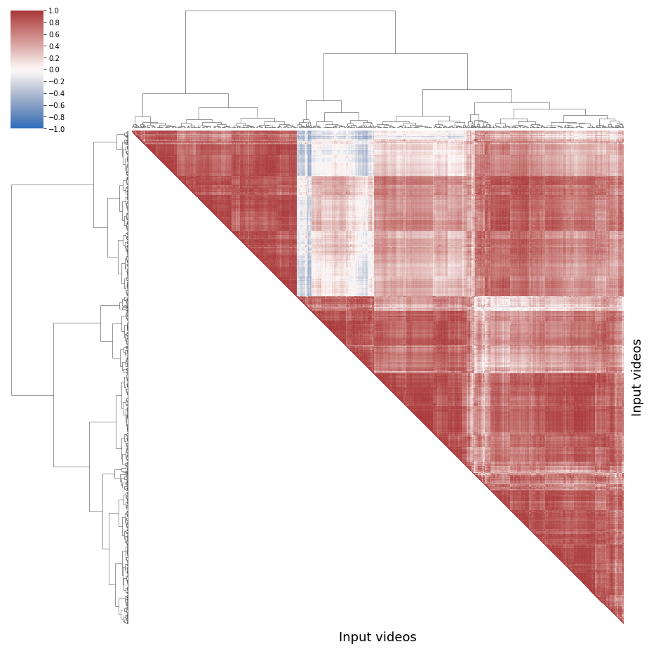
    


```python
map_group = [0, 1, 2, 3]

def f(gr):
    return map_group[int(gr)]

groups = np.array([*map(f, group_no_ordered)],int)

print(sum(groups==0))
print(sum(groups==1))
print(sum(groups==2))
print(sum(groups==3))
```

    262
    470
    446
    219


```python
corrDescription = [corrSpearman[i][j] for i in range(nbVideos) for j in range(nbVideos) if i >j]
pd.Series(corrDescription).describe()
```


    count    975106.000000
    mean          0.566601
    std           0.288890
    min          -0.693836
    25%           0.394660
    50%           0.630341
    75%           0.794691
    max           0.997228
    dtype: float64


```python
def plot_simple_correlationmatrix_dendogram(corr, img_name, ticks, id_names, method='ward'):

    df = pd.DataFrame(corr)
    
    # Generate a mask for the upper triangle
    mask = np.zeros_like(corr, dtype=np.bool)
    
    for i in range(shortnbVideos):
        for j in range(shortnbVideos):
            if i>j:
                mask[i][j] = True
    fig = plt.figure(figsize=(10, 8.5))
    ax = fig.add_subplot(1,1,1)
    sns.heatmap(df, cmap="vlag", mask=mask,
               linewidths=.75, cbar_kws={"ticks":ticks})
    plt.yticks(np.arange(0,len(id_names),1)+0.5, id_names)
    plt.xticks(np.arange(0,len(id_names),1)+0.5, id_names)
    plt.savefig(result_dir+img_name)
    plt.show()
```


```python
id_short = [10, 14, 23, 26, 31, 41, 55, 66, 67, 125]
short_v_names = [v_names[k] for k in id_short]

shortlistVideo = []
for v in short_v_names:
    data = pd.read_table(res_dir+v, delimiter = ',')
    data['etime'] = [*map(elapsedtime_to_sec, data['elapsedtime'])]
    input_video_size = input_sizes.loc[v[:-4]]['size']
    data['crate'] = data['size']/input_video_size
    shortlistVideo.append(data)
    
shortnbVideos = len(shortlistVideo)

shortcorrSpearman= [[0 for x in range(shortnbVideos)] for y in range(shortnbVideos)]


for i in range(shortnbVideos):
    for j in range(shortnbVideos):
        if (i == j):
            shortcorrSpearman[i][j] = 1
        else:
            shortcorrSpearman[i][j] = sc.spearmanr(listVideo[id_short[i]][predDimension],listVideo[id_short[j]][predDimension]).correlation

plot_simple_correlationmatrix_dendogram(shortcorrSpearman, 
                     "../../results/corrmatrix-ugc-dendo-Spearman-short-" + predDimension + ".png", 
                     [k/5 for k in np.arange(-10,10,1)],
                                      id_short)
```


    
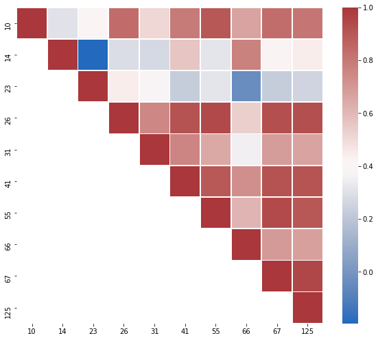
    


# RQ1-2

### Shortlist


```python
id_short
```


    [10, 14, 23, 26, 31, 41, 55, 66, 67, 125]


```python
shortlistVideo[0] # video 10
```


<div>
<style scoped>
    .dataframe tbody tr th:only-of-type {
        vertical-align: middle;
    }

    .dataframe tbody tr th {
        vertical-align: top;
    }

    .dataframe thead th {
        text-align: right;
    }
</style>
<table border="1" class="dataframe">
  <thead>
    <tr style="text-align: right;">
      <th></th>
      <th>configurationID</th>
      <th>cabac</th>
      <th>ref</th>
      <th>deblock</th>
      <th>analyse</th>
      <th>me</th>
      <th>subme</th>
      <th>mixed_ref</th>
      <th>me_range</th>
      <th>trellis</th>
      <th>...</th>
      <th>size</th>
      <th>usertime</th>
      <th>systemtime</th>
      <th>elapsedtime</th>
      <th>cpu</th>
      <th>frames</th>
      <th>fps</th>
      <th>kbs</th>
      <th>etime</th>
      <th>crate</th>
    </tr>
  </thead>
  <tbody>
    <tr>
      <th>0</th>
      <td>1</td>
      <td>0</td>
      <td>1</td>
      <td>0:0:0</td>
      <td>0:0</td>
      <td>dia</td>
      <td>0</td>
      <td>0</td>
      <td>16</td>
      <td>0</td>
      <td>...</td>
      <td>19188344</td>
      <td>8.69</td>
      <td>0.92</td>
      <td>0:01.75</td>
      <td>549</td>
      <td>480</td>
      <td>379.18</td>
      <td>7675.34</td>
      <td>1.75</td>
      <td>0.012852</td>
    </tr>
    <tr>
      <th>1</th>
      <td>101</td>
      <td>1</td>
      <td>2</td>
      <td>1:0:0</td>
      <td>0x3:0x113</td>
      <td>hex</td>
      <td>6</td>
      <td>1</td>
      <td>16</td>
      <td>1</td>
      <td>...</td>
      <td>6805614</td>
      <td>29.88</td>
      <td>1.56</td>
      <td>0:04.08</td>
      <td>770</td>
      <td>480</td>
      <td>137.35</td>
      <td>2722.25</td>
      <td>4.08</td>
      <td>0.004558</td>
    </tr>
    <tr>
      <th>2</th>
      <td>102</td>
      <td>1</td>
      <td>2</td>
      <td>1:0:0</td>
      <td>0x3:0x113</td>
      <td>hex</td>
      <td>6</td>
      <td>1</td>
      <td>16</td>
      <td>1</td>
      <td>...</td>
      <td>7948383</td>
      <td>26.00</td>
      <td>1.58</td>
      <td>0:03.04</td>
      <td>905</td>
      <td>480</td>
      <td>194.98</td>
      <td>3179.35</td>
      <td>3.04</td>
      <td>0.005324</td>
    </tr>
    <tr>
      <th>3</th>
      <td>103</td>
      <td>1</td>
      <td>2</td>
      <td>0:0:0</td>
      <td>0x3:0x3</td>
      <td>umh</td>
      <td>6</td>
      <td>1</td>
      <td>16</td>
      <td>1</td>
      <td>...</td>
      <td>7857313</td>
      <td>32.80</td>
      <td>1.37</td>
      <td>0:02.89</td>
      <td>1181</td>
      <td>480</td>
      <td>206.63</td>
      <td>3142.93</td>
      <td>2.89</td>
      <td>0.005263</td>
    </tr>
    <tr>
      <th>4</th>
      <td>104</td>
      <td>1</td>
      <td>16</td>
      <td>1:0:0</td>
      <td>0x3:0x113</td>
      <td>hex</td>
      <td>6</td>
      <td>1</td>
      <td>24</td>
      <td>1</td>
      <td>...</td>
      <td>6448461</td>
      <td>39.70</td>
      <td>1.41</td>
      <td>0:03.29</td>
      <td>1249</td>
      <td>480</td>
      <td>176.69</td>
      <td>2579.38</td>
      <td>3.29</td>
      <td>0.004319</td>
    </tr>
    <tr>
      <th>...</th>
      <td>...</td>
      <td>...</td>
      <td>...</td>
      <td>...</td>
      <td>...</td>
      <td>...</td>
      <td>...</td>
      <td>...</td>
      <td>...</td>
      <td>...</td>
      <td>...</td>
      <td>...</td>
      <td>...</td>
      <td>...</td>
      <td>...</td>
      <td>...</td>
      <td>...</td>
      <td>...</td>
      <td>...</td>
      <td>...</td>
      <td>...</td>
    </tr>
    <tr>
      <th>196</th>
      <td>97</td>
      <td>1</td>
      <td>2</td>
      <td>1:0:0</td>
      <td>0x3:0x113</td>
      <td>hex</td>
      <td>4</td>
      <td>1</td>
      <td>16</td>
      <td>0</td>
      <td>...</td>
      <td>6868554</td>
      <td>24.80</td>
      <td>1.67</td>
      <td>0:03.55</td>
      <td>745</td>
      <td>480</td>
      <td>160.70</td>
      <td>2747.42</td>
      <td>3.55</td>
      <td>0.004600</td>
    </tr>
    <tr>
      <th>197</th>
      <td>98</td>
      <td>1</td>
      <td>2</td>
      <td>0:0:0</td>
      <td>0x3:0x113</td>
      <td>hex</td>
      <td>4</td>
      <td>0</td>
      <td>24</td>
      <td>0</td>
      <td>...</td>
      <td>7014505</td>
      <td>21.85</td>
      <td>1.59</td>
      <td>0:03.06</td>
      <td>766</td>
      <td>480</td>
      <td>192.69</td>
      <td>2805.80</td>
      <td>3.06</td>
      <td>0.004698</td>
    </tr>
    <tr>
      <th>198</th>
      <td>99</td>
      <td>1</td>
      <td>5</td>
      <td>1:0:0</td>
      <td>0x3:0x113</td>
      <td>hex</td>
      <td>6</td>
      <td>1</td>
      <td>16</td>
      <td>1</td>
      <td>...</td>
      <td>6455932</td>
      <td>32.95</td>
      <td>1.42</td>
      <td>0:03.45</td>
      <td>996</td>
      <td>480</td>
      <td>166.61</td>
      <td>2582.37</td>
      <td>3.45</td>
      <td>0.004324</td>
    </tr>
    <tr>
      <th>199</th>
      <td>100</td>
      <td>0</td>
      <td>3</td>
      <td>0:0:0</td>
      <td>0x113:0x113</td>
      <td>hex</td>
      <td>6</td>
      <td>1</td>
      <td>16</td>
      <td>1</td>
      <td>...</td>
      <td>8448726</td>
      <td>26.68</td>
      <td>1.56</td>
      <td>0:02.76</td>
      <td>1022</td>
      <td>480</td>
      <td>218.91</td>
      <td>3379.49</td>
      <td>2.76</td>
      <td>0.005659</td>
    </tr>
    <tr>
      <th>200</th>
      <td>10</td>
      <td>1</td>
      <td>16</td>
      <td>1:0:0</td>
      <td>0x3:0x133</td>
      <td>tesa</td>
      <td>11</td>
      <td>1</td>
      <td>24</td>
      <td>2</td>
      <td>...</td>
      <td>5575828</td>
      <td>479.12</td>
      <td>6.38</td>
      <td>0:31.19</td>
      <td>1556</td>
      <td>480</td>
      <td>15.69</td>
      <td>2230.33</td>
      <td>31.19</td>
      <td>0.003735</td>
    </tr>
  </tbody>
</table>
<p>201 rows × 35 columns</p>
</div>


```python
listFeatures = ["cabac", "ref", "deblock", "analyse", "me", "subme", "mixed_ref", "me_range", "trellis", "8x8dct", "fast_pskip", "chroma_qp_offset", "bframes", "b_pyramid", "b_adapt", "direct", "weightb", "open_gop", "weightp", "scenecut", "rc_lookahead", "mbtree", "qpmax", "aq-mode"]

to_keep = [k for k in listFeatures]
to_keep.append(predDimension)

categorial = ['analyse', 'me', 'direct']

def compute_Importances(listVid, id_short=None):
    
    if not id_short:
        id_short = np.arange(0,len(listVid),1)
        
    listImportances = []

    for id_video in range(len(listVid)):

        df = listVid[id_video][to_keep].replace(to_replace ="None",value='0')

        df['deblock'] =[int(val[0]) for val in df['deblock']]

        for col in df.columns:
            if col not in categorial:
                arr_col = np.array(df[col],int)
                arr_col = (arr_col-np.mean(arr_col))/(np.std(arr_col)+1e-5)
                df[col] = arr_col
            else:
                if col not in [predDimension,'ranking']:
                    df[col] = [np.where(k==df[col].unique())[0][0] for k in df[col]]
                    arr_col = np.array(df[col],int)
                    arr_col = (arr_col-np.mean(arr_col))/(np.std(arr_col)+1e-5)
                    df[col] = arr_col

        clf = RandomForestRegressor(n_estimators=200)
        X = df.drop([predDimension],axis=1)
        y = df[predDimension]
        clf.fit(X,y)

        listImportances.append(clf.feature_importances_)

    res = pd.DataFrame({'features' : listFeatures})

    cs = 100

    for id_video in range(len(listImportances)):
        res['video_'+str(id_short[id_video])] = np.round(cs*listImportances[id_video])/cs

    res = res.set_index('features').transpose().drop(['open_gop','qpmax'],axis=1)
    return res

res = compute_Importances(listVideo)
res.to_csv("../../results/list_features_importances"+predDimension+".csv")
```

### Boxplot


```python
res_imp = compute_Importances(listVideo)
```


```python

```


```python
def boxplot_imp(res, xlim = None, criteria = 'max', name = None, xname='Feature importances'):
    if criteria == 'max':
        listImp = [(np.percentile(res[col],75), res[col], col) 
                   for col in res.columns]
        listImp.sort(key=lambda tup: tup[0])
    elif criteria == 'range':
        listImp = [(np.abs(np.percentile(res[col],75)-np.percentile(res[col],25)),res[col], col) 
                   for col in res.columns]
        listImp.sort(key=lambda tup: tup[0])
    elif criteria == 'name':
        listImp = [(np.abs(np.percentile(res[col],75)-np.percentile(res[col],25)),res[col], col) 
                   for col in res.columns]
        listImp.sort(key=lambda tup: tup[2], reverse=True)

    red_square = dict(markerfacecolor='r', marker='s')
    plt.figure(figsize=(15,8))
    plt.grid()
    plt.boxplot([l[1] for l in listImp], flierprops=red_square, 
              vert=False, patch_artist=True, #widths=0.25,
              boxprops=dict(facecolor=(0,0,1,0.5),linewidth=1,edgecolor='k'),
              whiskerprops = dict(linestyle='-.',linewidth=1.0, color='black'))
    plt.xlabel(xname, size=13)
    if xlim:
        plt.xlim(xlim)
    plt.yticks(range(1, len(listImp) + 1), [l[2] for l in listImp])
    if name:
        plt.savefig(name)
    plt.show()
    
boxplot_imp(res_imp,
            criteria = 'name', 
            name = "../../results/boxplot_features_imp_rf_"+predDimension+".png")
```


    
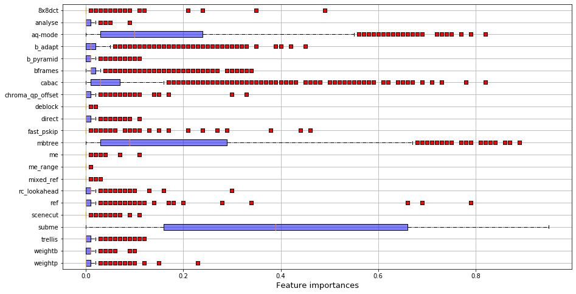
    


### Regression


```python
def compute_poly(listVid, id_short=None):
    
    if not id_short:
        id_short = np.arange(0,len(listVid),1)
    
    listImportances = []
    
    #listFeatures = ['subme','aq-mode','mbtree','cabac']
    
    to_keep = [k for k in listFeatures]
    to_keep.append(predDimension)
    
    names = listFeatures
    final_names = []
    final_names.append('constant')
    for n in names:
        final_names.append(n)
    for n1 in range(len(names)):
        for n2 in range(len(names)):
            if n1>=n2:
                final_names.append(str(names[n1])+'*'+str(names[n2]))
    
    for id_video in range(len(listVid)):

        df = listVid[id_video][to_keep].replace(to_replace ="None",value='0')
        df['deblock'] =[int(val[0]) for val in df['deblock']]

        for col in df.columns:
            if col not in categorial:
                arr_col = np.array(df[col],int)
                arr_col = (arr_col-np.mean(arr_col))/(np.std(arr_col)+1e-5)
                df[col] = arr_col
            else:
                df[col] = [np.where(k==df[col].unique())[0][0] for k in df[col]]
                arr_col = np.array(df[col],int)
                arr_col = (arr_col-np.mean(arr_col))/(np.std(arr_col)+1e-5)
                df[col] = arr_col

        clf = LinearRegression()
        X = df.drop([predDimension],axis=1)

        y = df[predDimension]
        #poly = PolynomialFeatures(degree=1, interaction_only = False, include_bias = True)    
        #X_interact = pd.DataFrame(poly.fit_transform(X))#, columns=final_names)
        #kept_names = ['subme','aq-mode','mbtree','cabac','cabac*mbtree','aq-mode*subme','cabac*subme']
        clf.fit(X,y)
        listImportances.append(clf.coef_)

    res = pd.DataFrame({'features' : listFeatures})

    cs = 100

    for id_video in range(len(listImportances)):
        res['video_'+str(id_short[id_video])] = np.round(cs*listImportances[id_video])/cs

    res = res.set_index('features').drop(['open_gop','qpmax']).transpose()
    return res

res_coef = compute_poly(listVideo)
res_coef.to_csv("../../results/list_features_importances_poly_"+predDimension+".csv")
res_coef
```


<div>
<style scoped>
    .dataframe tbody tr th:only-of-type {
        vertical-align: middle;
    }

    .dataframe tbody tr th {
        vertical-align: top;
    }

    .dataframe thead th {
        text-align: right;
    }
</style>
<table border="1" class="dataframe">
  <thead>
    <tr style="text-align: right;">
      <th>features</th>
      <th>cabac</th>
      <th>ref</th>
      <th>deblock</th>
      <th>analyse</th>
      <th>me</th>
      <th>subme</th>
      <th>mixed_ref</th>
      <th>me_range</th>
      <th>trellis</th>
      <th>8x8dct</th>
      <th>...</th>
      <th>bframes</th>
      <th>b_pyramid</th>
      <th>b_adapt</th>
      <th>direct</th>
      <th>weightb</th>
      <th>weightp</th>
      <th>scenecut</th>
      <th>rc_lookahead</th>
      <th>mbtree</th>
      <th>aq-mode</th>
    </tr>
  </thead>
  <tbody>
    <tr>
      <th>video_0</th>
      <td>-0.18</td>
      <td>-0.00</td>
      <td>0.06</td>
      <td>-0.07</td>
      <td>-0.07</td>
      <td>-0.03</td>
      <td>-0.03</td>
      <td>-0.06</td>
      <td>-0.09</td>
      <td>-0.01</td>
      <td>...</td>
      <td>-0.05</td>
      <td>0.16</td>
      <td>0.05</td>
      <td>-0.02</td>
      <td>-0.18</td>
      <td>-0.13</td>
      <td>-0.15</td>
      <td>-0.01</td>
      <td>-0.05</td>
      <td>0.00</td>
    </tr>
    <tr>
      <th>video_1</th>
      <td>-0.25</td>
      <td>-0.15</td>
      <td>-0.04</td>
      <td>-0.04</td>
      <td>-0.17</td>
      <td>-0.28</td>
      <td>0.00</td>
      <td>-0.04</td>
      <td>0.04</td>
      <td>-0.19</td>
      <td>...</td>
      <td>-0.09</td>
      <td>0.07</td>
      <td>0.04</td>
      <td>-0.01</td>
      <td>-0.14</td>
      <td>-0.06</td>
      <td>0.03</td>
      <td>-0.01</td>
      <td>0.13</td>
      <td>-0.43</td>
    </tr>
    <tr>
      <th>video_2</th>
      <td>-0.19</td>
      <td>0.00</td>
      <td>-0.05</td>
      <td>-0.03</td>
      <td>-0.07</td>
      <td>-0.30</td>
      <td>-0.05</td>
      <td>-0.03</td>
      <td>0.03</td>
      <td>-0.11</td>
      <td>...</td>
      <td>-0.07</td>
      <td>-0.09</td>
      <td>0.06</td>
      <td>-0.02</td>
      <td>-0.34</td>
      <td>0.04</td>
      <td>-0.04</td>
      <td>0.05</td>
      <td>-0.02</td>
      <td>-0.27</td>
    </tr>
    <tr>
      <th>video_3</th>
      <td>-0.15</td>
      <td>0.07</td>
      <td>-0.09</td>
      <td>-0.04</td>
      <td>-0.06</td>
      <td>-0.32</td>
      <td>-0.01</td>
      <td>-0.05</td>
      <td>0.11</td>
      <td>-0.17</td>
      <td>...</td>
      <td>-0.06</td>
      <td>-0.17</td>
      <td>0.12</td>
      <td>-0.01</td>
      <td>-0.33</td>
      <td>0.03</td>
      <td>-0.01</td>
      <td>0.05</td>
      <td>0.27</td>
      <td>-0.43</td>
    </tr>
    <tr>
      <th>video_4</th>
      <td>-0.14</td>
      <td>0.02</td>
      <td>-0.05</td>
      <td>-0.00</td>
      <td>-0.10</td>
      <td>-0.26</td>
      <td>-0.01</td>
      <td>-0.04</td>
      <td>0.06</td>
      <td>-0.20</td>
      <td>...</td>
      <td>-0.10</td>
      <td>-0.00</td>
      <td>0.13</td>
      <td>-0.04</td>
      <td>-0.33</td>
      <td>0.01</td>
      <td>0.01</td>
      <td>0.03</td>
      <td>0.11</td>
      <td>-0.50</td>
    </tr>
    <tr>
      <th>...</th>
      <td>...</td>
      <td>...</td>
      <td>...</td>
      <td>...</td>
      <td>...</td>
      <td>...</td>
      <td>...</td>
      <td>...</td>
      <td>...</td>
      <td>...</td>
      <td>...</td>
      <td>...</td>
      <td>...</td>
      <td>...</td>
      <td>...</td>
      <td>...</td>
      <td>...</td>
      <td>...</td>
      <td>...</td>
      <td>...</td>
      <td>...</td>
    </tr>
    <tr>
      <th>video_1392</th>
      <td>-0.16</td>
      <td>0.05</td>
      <td>-0.09</td>
      <td>-0.05</td>
      <td>-0.06</td>
      <td>-0.33</td>
      <td>-0.01</td>
      <td>-0.06</td>
      <td>0.05</td>
      <td>-0.20</td>
      <td>...</td>
      <td>-0.04</td>
      <td>-0.06</td>
      <td>0.19</td>
      <td>-0.02</td>
      <td>-0.36</td>
      <td>0.06</td>
      <td>-0.04</td>
      <td>0.11</td>
      <td>-0.13</td>
      <td>-0.29</td>
    </tr>
    <tr>
      <th>video_1393</th>
      <td>-0.06</td>
      <td>0.11</td>
      <td>-0.13</td>
      <td>-0.08</td>
      <td>-0.05</td>
      <td>-0.37</td>
      <td>-0.02</td>
      <td>-0.06</td>
      <td>0.11</td>
      <td>-0.21</td>
      <td>...</td>
      <td>-0.08</td>
      <td>-0.05</td>
      <td>0.08</td>
      <td>-0.00</td>
      <td>-0.33</td>
      <td>0.03</td>
      <td>0.00</td>
      <td>0.06</td>
      <td>0.42</td>
      <td>-0.47</td>
    </tr>
    <tr>
      <th>video_1394</th>
      <td>-0.14</td>
      <td>0.07</td>
      <td>-0.12</td>
      <td>-0.06</td>
      <td>-0.06</td>
      <td>-0.41</td>
      <td>-0.01</td>
      <td>-0.06</td>
      <td>0.10</td>
      <td>-0.21</td>
      <td>...</td>
      <td>-0.07</td>
      <td>-0.08</td>
      <td>0.16</td>
      <td>0.00</td>
      <td>-0.31</td>
      <td>0.02</td>
      <td>0.00</td>
      <td>0.05</td>
      <td>0.09</td>
      <td>-0.35</td>
    </tr>
    <tr>
      <th>video_1395</th>
      <td>-0.44</td>
      <td>0.01</td>
      <td>-0.07</td>
      <td>-0.05</td>
      <td>-0.10</td>
      <td>-0.12</td>
      <td>-0.00</td>
      <td>-0.02</td>
      <td>0.10</td>
      <td>-0.04</td>
      <td>...</td>
      <td>-0.07</td>
      <td>0.12</td>
      <td>-0.06</td>
      <td>0.02</td>
      <td>0.03</td>
      <td>0.03</td>
      <td>0.17</td>
      <td>0.05</td>
      <td>-0.79</td>
      <td>0.46</td>
    </tr>
    <tr>
      <th>video_1396</th>
      <td>-0.35</td>
      <td>0.05</td>
      <td>-0.11</td>
      <td>-0.04</td>
      <td>-0.08</td>
      <td>-0.36</td>
      <td>0.07</td>
      <td>-0.10</td>
      <td>0.20</td>
      <td>-0.21</td>
      <td>...</td>
      <td>-0.04</td>
      <td>-0.13</td>
      <td>-0.01</td>
      <td>0.01</td>
      <td>-0.14</td>
      <td>0.01</td>
      <td>0.01</td>
      <td>0.06</td>
      <td>0.02</td>
      <td>-0.25</td>
    </tr>
  </tbody>
</table>
<p>1397 rows × 22 columns</p>
</div>


```python
boxplot_imp(res_coef, 
            criteria ='name', 
            name ="../../results/boxplot_features_imp_linear_"+predDimension+".png", 
            xlim = (-1.1,1.1), 
            xname = 'Coeficients')
```


    
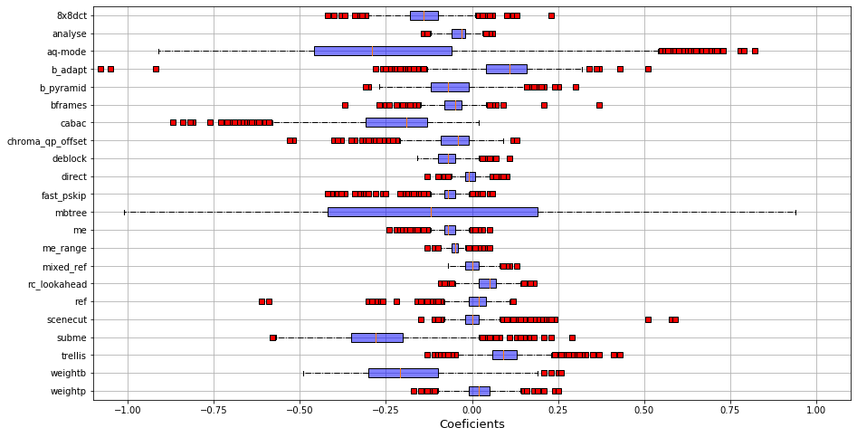
    


## RQ1.3 - Ranking and accuracy comparison

### A- Accuracy

def compute_accuracies(listVid, id_short=None):
    
    if not id_short:
        id_short = np.arange(0,len(listVid),1)
        
    listAccuracies = []

    for id_video in range(len(listVid)):

        acc_vid = []
        df = listVid[id_video][to_keep].replace(to_replace ="None",value='0')
        
        df['deblock'] =[int(val[0]) for val in df['deblock']]
        
        for col in df.columns:
            if col not in categorial:
                arr_col = np.array(df[col],int)
                arr_col = (arr_col-np.mean(arr_col))/(np.std(arr_col)+1e-5)
                df[col] = arr_col
            else:
                df[col] = [np.where(k==df[col].unique())[0][0] for k in df[col]]
                arr_col = np.array(df[col],int)
                arr_col = (arr_col-np.mean(arr_col))/(np.std(arr_col)+1e-5)
                df[col] = arr_col
        
        X = df.drop([predDimension], axis=1)
        y = df[predDimension]
        
        for i in range(5):
            
            clf = RandomForestRegressor(n_estimators=200)
            
            X_train, X_test, y_train, y_test = train_test_split(X, y, test_size=0.25)

            clf.fit(X_train, y_train)

            y_pred = clf.predict(X_test)
            
            acc_vid.append(np.mean(np.abs((y_test - y_pred) / (y_test + 1e-5)))*100)

        listAccuracies.append(np.mean(acc_vid))

    res = pd.DataFrame({ 'inputs' : v_names, 
                         'accuracy' : listAccuracies})

    return res

res = compute_accuracies(listVideo)
res.to_csv("../../results/shortlist_accuracies"+predDimension+".csv")

pd.Series(res['accuracy']).describe()

df = listVideo[1][to_keep].replace(to_replace ="None",value='0')

df['deblock'] =[int(val[0]) for val in df['deblock']]

for col in df.columns:
    if col not in categorial:
        arr_col = np.array(df[col],int)
        arr_col = (arr_col-np.mean(arr_col))/(np.std(arr_col)+1e-5)
        df[col] = arr_col
    else:
        df[col] = [np.where(k==df[col].unique())[0][0] for k in df[col]]
        arr_col = np.array(df[col],int)
        arr_col = (arr_col-np.mean(arr_col))/(np.std(arr_col)+1e-5)
        df[col] = arr_col

clf = RandomForestRegressor(n_estimators=200)
X = df.drop([predDimension], axis=1)
y = df[predDimension]

X_train, X_test, y_train, y_test = train_test_split(X, y, test_size=0.25)

clf.fit(X_train, y_train)

y_pred = clf.predict(X_test)

np.mean(np.abs((y_test - y_pred) / y_test)) * 100

### B - Ranking

to_keep = [k for k in listFeatures]
to_keep.append(predDimension)
to_keep.append("ranking")

def compute_ranking(listVid, id_short=None):
    
    if not id_short:
        id_short = np.arange(0,len(listVid),1)
    
    listAccuracies = []

    for id_video in range(len(listVid)):
        
        df = listVid[id_video][to_keep].replace(to_replace ="None",value='0')
        
        df['deblock'] = [int(val[0]) for val in df['deblock']]
        
        for col in df.columns:
            if col not in categorial:
                arr_col = np.array(df[col],int)
                arr_col = (arr_col-np.mean(arr_col))/(np.std(arr_col)+1e-5)
                df[col] = arr_col
            else:
                df[col] = [np.where(k==df[col].unique())[0][0] for k in df[col]]
                arr_col = np.array(df[col],int)
                arr_col = (arr_col-np.mean(arr_col))/(np.std(arr_col)+1e-5)
                df[col] = arr_col
        
        X = df.drop([predDimension, "ranking"], axis=1)
        y = df["ranking"]
            
        clf = RandomForestRegressor(n_estimators=200)

        X_train, X_test, y_train, y_test = train_test_split(X, y, test_size=0.25)

        clf.fit(X_train, y_train)

        y_pred = clf.predict(X_test)

        listAccuracies.append(np.mean(np.abs(y_test - y_pred)))

    res = pd.DataFrame({ 'inputs' : v_names, 
                         'MRD' : listAccuracies})

    return res

ranks_prediction = compute_ranking(listVideo)

np.max(ranks_prediction["MRD"])

listVideo[0]


```python
sizes = listVideo[0][predDimension]
ind = sorted(range(len(sizes)), key=lambda k: sizes[k])
df = pd.DataFrame({"index" : range(201), "video0" : ind}).set_index("index")

for i in np.arange(1,len(listVideo),1):
    sizes = listVideo[i][predDimension]
    ind = sorted(range(len(sizes)), key=lambda k: sizes[k])
    df["video"+str(i)] = ind

df.head()
```


<div>
<style scoped>
    .dataframe tbody tr th:only-of-type {
        vertical-align: middle;
    }

    .dataframe tbody tr th {
        vertical-align: top;
    }

    .dataframe thead th {
        text-align: right;
    }
</style>
<table border="1" class="dataframe">
  <thead>
    <tr style="text-align: right;">
      <th></th>
      <th>video0</th>
      <th>video1</th>
      <th>video2</th>
      <th>video3</th>
      <th>video4</th>
      <th>video5</th>
      <th>video6</th>
      <th>video7</th>
      <th>video8</th>
      <th>video9</th>
      <th>...</th>
      <th>video1387</th>
      <th>video1388</th>
      <th>video1389</th>
      <th>video1390</th>
      <th>video1391</th>
      <th>video1392</th>
      <th>video1393</th>
      <th>video1394</th>
      <th>video1395</th>
      <th>video1396</th>
    </tr>
    <tr>
      <th>index</th>
      <th></th>
      <th></th>
      <th></th>
      <th></th>
      <th></th>
      <th></th>
      <th></th>
      <th></th>
      <th></th>
      <th></th>
      <th></th>
      <th></th>
      <th></th>
      <th></th>
      <th></th>
      <th></th>
      <th></th>
      <th></th>
      <th></th>
      <th></th>
      <th></th>
    </tr>
  </thead>
  <tbody>
    <tr>
      <th>0</th>
      <td>166</td>
      <td>91</td>
      <td>104</td>
      <td>171</td>
      <td>169</td>
      <td>89</td>
      <td>26</td>
      <td>161</td>
      <td>171</td>
      <td>104</td>
      <td>...</td>
      <td>104</td>
      <td>169</td>
      <td>104</td>
      <td>164</td>
      <td>170</td>
      <td>169</td>
      <td>104</td>
      <td>170</td>
      <td>175</td>
      <td>169</td>
    </tr>
    <tr>
      <th>1</th>
      <td>164</td>
      <td>104</td>
      <td>105</td>
      <td>130</td>
      <td>168</td>
      <td>170</td>
      <td>27</td>
      <td>160</td>
      <td>32</td>
      <td>171</td>
      <td>...</td>
      <td>32</td>
      <td>166</td>
      <td>46</td>
      <td>175</td>
      <td>171</td>
      <td>168</td>
      <td>171</td>
      <td>171</td>
      <td>193</td>
      <td>168</td>
    </tr>
    <tr>
      <th>2</th>
      <td>169</td>
      <td>100</td>
      <td>100</td>
      <td>131</td>
      <td>170</td>
      <td>169</td>
      <td>28</td>
      <td>163</td>
      <td>161</td>
      <td>60</td>
      <td>...</td>
      <td>171</td>
      <td>170</td>
      <td>190</td>
      <td>193</td>
      <td>169</td>
      <td>165</td>
      <td>60</td>
      <td>169</td>
      <td>164</td>
      <td>123</td>
    </tr>
    <tr>
      <th>3</th>
      <td>165</td>
      <td>102</td>
      <td>102</td>
      <td>132</td>
      <td>165</td>
      <td>168</td>
      <td>21</td>
      <td>171</td>
      <td>160</td>
      <td>32</td>
      <td>...</td>
      <td>36</td>
      <td>165</td>
      <td>176</td>
      <td>92</td>
      <td>184</td>
      <td>123</td>
      <td>32</td>
      <td>60</td>
      <td>39</td>
      <td>159</td>
    </tr>
    <tr>
      <th>4</th>
      <td>168</td>
      <td>108</td>
      <td>108</td>
      <td>32</td>
      <td>123</td>
      <td>165</td>
      <td>20</td>
      <td>130</td>
      <td>163</td>
      <td>130</td>
      <td>...</td>
      <td>35</td>
      <td>168</td>
      <td>187</td>
      <td>112</td>
      <td>179</td>
      <td>159</td>
      <td>4</td>
      <td>177</td>
      <td>23</td>
      <td>170</td>
    </tr>
  </tbody>
</table>
<p>5 rows × 1397 columns</p>
</div>


```python
stds = [np.std(df.loc[i,:]) for i in range(len(df.index))]
print("Config min std : ", np.argmin(stds))
print("Config max std : ", np.argmax(stds))

print("Config med std : ", np.median(stds))

plt.scatter(range(len(df.columns)), df.loc[np.argmin(stds), :])
plt.ylabel("Rank")
plt.xlabel("Video id")
plt.title("Configuration "+str(np.argmin(stds))+" : std = "+str(int(np.round(np.min(stds)))))
plt.savefig("../../results/config_min_std_ranking.png")
plt.show()

plt.scatter(range(len(df.columns)), df.loc[np.argmax(stds), :])
plt.ylabel("Rank")
plt.xlabel("Video id")
plt.title("Configuration "+str(np.argmax(stds))+" : std = "+str(int(np.round(np.max(stds)))))
plt.savefig("../../results/config_max_std_ranking.png")
plt.show()
```

    Config min std :  200
    Config max std :  16
    Config med std :  58.678078128140996


    

    


    
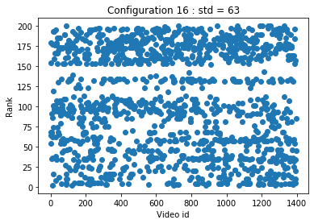
    


```python
print(np.min(stds))
print(np.max(stds))
```

    19.605143021374648
    62.887600399821864


```python
print(np.sum([1  for j in range(len(df.loc[np.argmin(stds),:])) 
              if df.loc[np.argmin(stds),:][j] > 105 and df.loc[np.argmin(stds),:][j] < 130])
      /len(df.loc[np.argmin(stds),:]))
```

    0.9248389405869721


```python
np.where(df.loc[np.argmin(stds),:] == np.min(df.loc[np.argmin(stds),:]))
```


    (array([ 897, 1289, 1311, 1387]),)


```python
np.max(df.loc[np.argmax(stds),:])
```


    200


```python
np.where(df.loc[np.argmax(stds),:] == np.min(df.loc[np.argmax(stds),:]))
```


    (array([  11,  121,  698,  883, 1071, 1279]),)


```python
np.max(df.loc[np.argmax(stds),:])
```


    200


```python
pd.Series(df.loc[np.argmax(stds),:]).describe()
```


    count    1397.000000
    mean      107.672155
    std        62.910121
    min         2.000000
    25%        54.000000
    50%       103.000000
    75%       171.000000
    max       200.000000
    Name: 16, dtype: float64


# RQ2

## RQ2.1 - Group of performances


```python
def plot_corr_matrix(corr, method = 'ward', title=''):

    df = pd.DataFrame(corr)
    
    links = linkage(df, method=method,)
    order = leaves_list(links)
    
    mask = np.zeros_like(corr, dtype=np.bool)
    
    for i in range(len(corr)):
        for j in range(len(corr)):
            if i>j:
                mask[order[i]][order[j]] = True
    
    g = sns.clustermap(df, cmap="vlag", mask=mask, method=method,
                   linewidths=0, figsize=(13, 13), vmin=-1)
    g.ax_heatmap.set_yticklabels([])
    g.ax_heatmap.set_xticklabels([])
    plt.title(title)
    plt.show()
    
    corrDescription = [corr[i][j] for i in range(len(corr)) for j in range(len(corr)) if i >j]
    return pd.Series(corrDescription).describe()

def plot_group(group_index):
    ind = np.array([k for k in range(len(corrSpearman)) if groups[k] == group_index], dtype=int)
    group = np.copy([[corrSpearman[k][j] for j in ind] for k in ind])
    print(plot_corr_matrix(group,title="group "+str(group_index)+" : "+str(len(group))))

for i in range(4):
    plot_group(i)
```


    
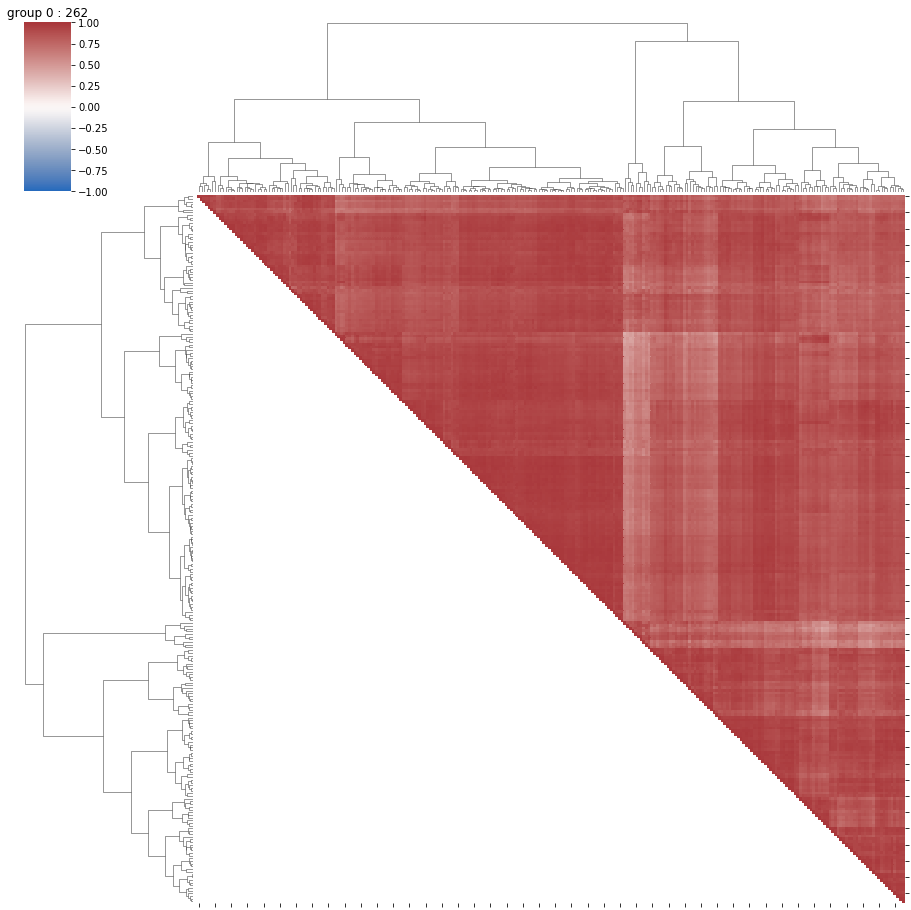
    


    count    34191.000000
    mean         0.864382
    std          0.084244
    min          0.388822
    25%          0.821387
    50%          0.881748
    75%          0.927229
    max          0.996812
    dtype: float64


    
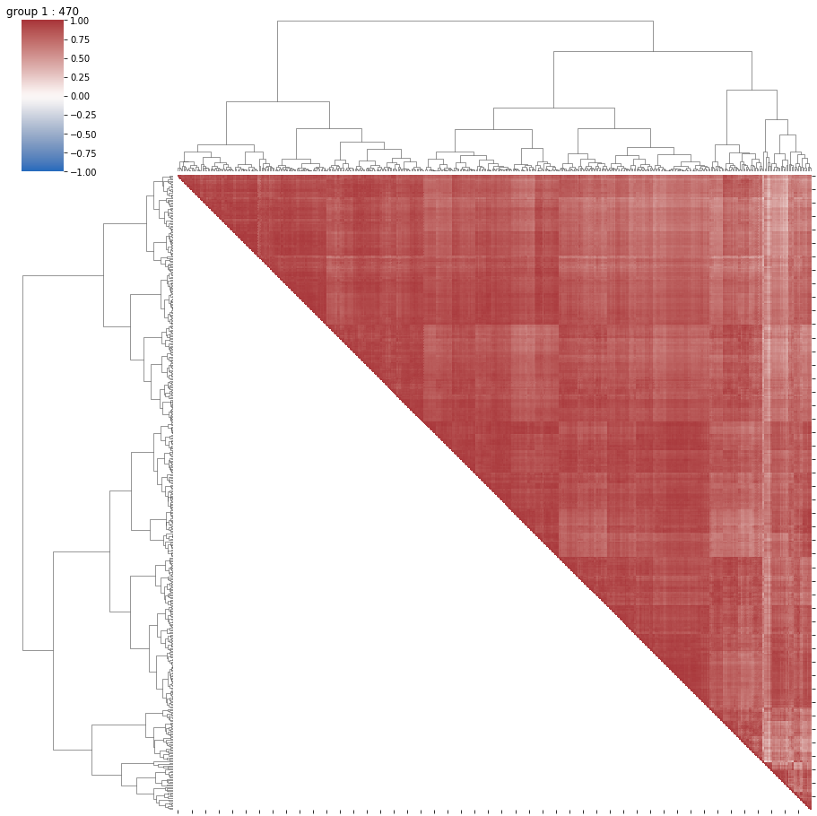
    


    count    110215.000000
    mean          0.817088
    std           0.105819
    min           0.150029
    25%           0.758130
    50%           0.837072
    75%           0.896803
    max           0.996081
    dtype: float64


    
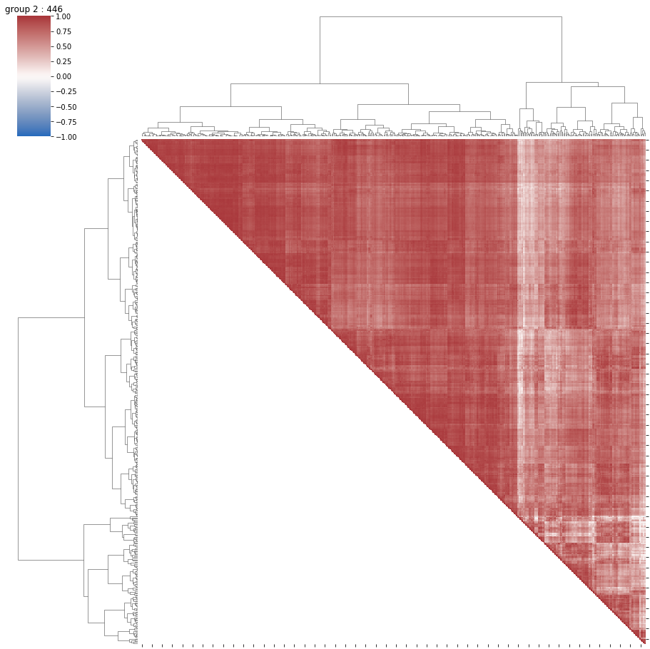
    


    count    99235.000000
    mean         0.734612
    std          0.167970
    min         -0.157552
    25%          0.640684
    50%          0.772087
    75%          0.863354
    max          0.994118
    dtype: float64


    

    


    count    23871.000000
    mean         0.791402
    std          0.138792
    min         -0.069959
    25%          0.727151
    50%          0.823678
    75%          0.890600
    max          0.997228
    dtype: float64


## Summary per group


```python
meta = pd.read_csv("../../data/ugc_meta/all_features.csv").set_index('FILENAME')
meta['category']=[str(meta.index[i]).split('_')[0] for i in range(meta.shape[0])]
del meta['NOISE_DMOS']
meta = meta.fillna(0)
cat_tab = pd.Series(meta['category'].values).unique()
meta['video_category'] = [np.where(cat_tab==meta['category'][i])[0][0] for i in range(len(meta['category']))]
del meta['category']
for col in meta.columns:#[:len(meta.columns)-1]:
    inter = np.array(meta[col],float)
    meta[col] = (inter-np.mean(inter))/np.std(inter)
perf = pd.DataFrame({'FILENAME': np.array([v_names[k][:-4] for k in range(len(v_names))]),
              'perf_group' : np.array([k for k in groups])}).set_index('FILENAME')
meta_perf = perf.join(meta)
meta_perf
```


<div>
<style scoped>
    .dataframe tbody tr th:only-of-type {
        vertical-align: middle;
    }

    .dataframe tbody tr th {
        vertical-align: top;
    }

    .dataframe thead th {
        text-align: right;
    }
</style>
<table border="1" class="dataframe">
  <thead>
    <tr style="text-align: right;">
      <th></th>
      <th>perf_group</th>
      <th>SLEEQ_DMOS</th>
      <th>BANDING_DMOS</th>
      <th>WIDTH</th>
      <th>HEIGHT</th>
      <th>SPATIAL_COMPLEXITY</th>
      <th>TEMPORAL_COMPLEXITY</th>
      <th>CHUNK_COMPLEXITY_VARIATION</th>
      <th>COLOR_COMPLEXITY</th>
      <th>video_category</th>
    </tr>
    <tr>
      <th>FILENAME</th>
      <th></th>
      <th></th>
      <th></th>
      <th></th>
      <th></th>
      <th></th>
      <th></th>
      <th></th>
      <th></th>
      <th></th>
    </tr>
  </thead>
  <tbody>
    <tr>
      <th>Animation_1080P-01b3</th>
      <td>0</td>
      <td>-0.678859</td>
      <td>4.653015</td>
      <td>0.383054</td>
      <td>0.332504</td>
      <td>-1.475487</td>
      <td>-1.547345</td>
      <td>-0.892454</td>
      <td>-1.210798</td>
      <td>-1.618194</td>
    </tr>
    <tr>
      <th>Animation_1080P-05f8</th>
      <td>1</td>
      <td>0.844509</td>
      <td>0.741729</td>
      <td>0.383054</td>
      <td>0.332504</td>
      <td>-0.147257</td>
      <td>0.444086</td>
      <td>2.545710</td>
      <td>2.207516</td>
      <td>-1.618194</td>
    </tr>
    <tr>
      <th>Animation_1080P-0c4f</th>
      <td>2</td>
      <td>-0.655778</td>
      <td>-0.377464</td>
      <td>0.383054</td>
      <td>0.332504</td>
      <td>0.422320</td>
      <td>-0.963192</td>
      <td>1.054868</td>
      <td>-1.232460</td>
      <td>-1.618194</td>
    </tr>
    <tr>
      <th>Animation_1080P-0cdf</th>
      <td>1</td>
      <td>-0.294170</td>
      <td>-0.059377</td>
      <td>0.383054</td>
      <td>0.332504</td>
      <td>-0.028644</td>
      <td>0.430810</td>
      <td>-0.103261</td>
      <td>-0.448284</td>
      <td>-1.618194</td>
    </tr>
    <tr>
      <th>Animation_1080P-18f5</th>
      <td>1</td>
      <td>-0.478821</td>
      <td>-0.377464</td>
      <td>0.383054</td>
      <td>0.332504</td>
      <td>1.289017</td>
      <td>-0.958767</td>
      <td>-0.051295</td>
      <td>0.192920</td>
      <td>-1.618194</td>
    </tr>
    <tr>
      <th>...</th>
      <td>...</td>
      <td>...</td>
      <td>...</td>
      <td>...</td>
      <td>...</td>
      <td>...</td>
      <td>...</td>
      <td>...</td>
      <td>...</td>
      <td>...</td>
    </tr>
    <tr>
      <th>Vlog_720P-561e</th>
      <td>2</td>
      <td>-0.678859</td>
      <td>-0.377464</td>
      <td>-0.239786</td>
      <td>-0.333314</td>
      <td>0.978979</td>
      <td>-1.414583</td>
      <td>-0.652893</td>
      <td>0.457201</td>
      <td>1.494379</td>
    </tr>
    <tr>
      <th>Vlog_720P-5d08</th>
      <td>1</td>
      <td>-0.678859</td>
      <td>-0.377464</td>
      <td>-0.773092</td>
      <td>-0.333314</td>
      <td>3.257287</td>
      <td>-0.303807</td>
      <td>-0.437698</td>
      <td>-0.158009</td>
      <td>1.494379</td>
    </tr>
    <tr>
      <th>Vlog_720P-60f8</th>
      <td>1</td>
      <td>0.444433</td>
      <td>0.623920</td>
      <td>-0.239786</td>
      <td>-0.333314</td>
      <td>0.234418</td>
      <td>-0.042708</td>
      <td>-0.364385</td>
      <td>-0.149344</td>
      <td>1.494379</td>
    </tr>
    <tr>
      <th>Vlog_720P-6410</th>
      <td>3</td>
      <td>-0.455739</td>
      <td>3.769441</td>
      <td>-0.239786</td>
      <td>-0.333314</td>
      <td>-0.770856</td>
      <td>2.121314</td>
      <td>1.971065</td>
      <td>-0.240326</td>
      <td>1.494379</td>
    </tr>
    <tr>
      <th>Vlog_720P-6d56</th>
      <td>2</td>
      <td>0.629083</td>
      <td>-0.353902</td>
      <td>-0.239786</td>
      <td>-0.333314</td>
      <td>-0.329287</td>
      <td>0.329026</td>
      <td>1.646979</td>
      <td>0.565512</td>
      <td>1.494379</td>
    </tr>
  </tbody>
</table>
<p>1397 rows × 10 columns</p>
</div>


```python
meta_perf['str_video_cat'] = [str(meta_perf.index[i]).split('_')[0] for i in range(meta_perf.shape[0])]
total_cat = meta_perf.groupby('str_video_cat').count()['perf_group']
group_perf = np.array([gr for gr in groups])
group_perf
```


    array([0, 1, 2, ..., 1, 3, 2])


```python
listFeatures = ["cabac", "ref", "deblock", "analyse", "me", "subme", "mixed_ref", "me_range", "trellis", "8x8dct", "fast_pskip", "chroma_qp_offset", "bframes", "b_pyramid", "b_adapt", "direct", "weightb", "open_gop", "weightp", "scenecut", "rc_lookahead", "mbtree", "qpmax", "aq-mode"]

to_keep = [k for k in listFeatures]
to_keep.append(predDimension)

categorial = ['analyse', 'me', 'direct']

def summary_group(id_group):
            
    id_list = [i for i in range(len(listVideo)) if group_perf[i]==id_group]
    v_names_group = [v_names[i][:-4] for i in range(len(v_names)) if i in id_list]
    listVideoGroup = [listVideo[i] for i in range(len(listVideo)) if i in id_list]
    
    print('Group '+str(id_group)+' : '+str(len(listVideoGroup))+' videos!')
    
    print('\n')
    
    video_size = [input_sizes.loc[index_vid]['size'] for index_vid in v_names_group]
    
    print("input avg size :", np.mean(video_size))
    print("input std size :", np.std(video_size))
    
    print('\n')

    # features importances
    res_imp = compute_Importances(listVideoGroup)
    
    print('\n')
    
    print('Imp mbtree:', np.mean(res_imp['mbtree']))
    print('Imp std mbtree:', np.std(res_imp['mbtree']))
    
    print('Imp aq-mode:', np.mean(res_imp['aq-mode']))
    print('Imp std aq-mode:', np.std(res_imp['aq-mode']))
    
    print('Imp subme:', np.mean(res_imp['subme']))
    print('Imp std subme:', np.std(res_imp['subme']))
    
    boxplot_imp(res_imp, criteria = 'name', xlim= (0, 1),
               name ="../../results/boxplot_imp_group"+str(id_group)+".png")

    # features effects
    res_poly = compute_poly(listVideoGroup)
    
    print('\n')
        
    print('Coef mbtree:', np.mean(res_poly['mbtree']))
    print('Coef mbtree std :', np.std(res_poly['mbtree']))
    print('Coef aq-mode:', np.mean(res_poly['aq-mode']))
    print('Coef aq_mode std :', np.std(res_poly['aq-mode']))
    print('Coef subme:', np.mean(res_poly['subme']))
    print('Coef subme std:', np.std(res_poly['subme']))
    
    boxplot_imp(res_poly, criteria = 'name', xlim = (-1, 1),
               name ="../../results/boxplot_effect_group"+str(id_group)+".png", xname = 'Coefficients')

    print('\n')

    interest_var = ['cpu', 'etime', 'fps', 'kbs', 'size']

    for iv in interest_var:
        pred = [np.mean(lv[iv]) for lv in listVideoGroup]
        print('Mean '+iv+' in the group: '+str(np.round(np.mean(pred),1)))
        print('Std dev : '+iv+' in the group: '+str(np.round(np.std(pred),1)))

    print('\n')

    # percentage of the videos present in the group par category

    meta_perf_group = meta_perf.query('perf_group=='+str(id_group))
    meta_perf_group['str_video_cat'] = [str(meta_perf_group.index[i]).split('_')[0] for i in range(meta_perf_group.shape[0])]
    val_group = meta_perf_group.groupby('str_video_cat').count()['perf_group']
    df_res_cat_group = pd.DataFrame({'val': val_group, 'total': total_cat})
    print(df_res_cat_group['val']/df_res_cat_group['total'])

    print('\n')

    # Mean of the videos of the group per properties

    for col in meta_perf_group.columns:
        if col not in ['str_video_cat', 'video_category']:
            print('Mean '+col+' : '+str(meta_perf_group[col].mean()))
            print('std '+col+' : '+str(meta_perf_group[col].std()))

    print('\n')

    corrGroup = np.array([corrSpearman[i][j] for i in range(len(corrSpearman)) if i in id_list 
                 for j in range(len(corrSpearman)) if j in id_list],float)

    print("Correlations intra-group: \n" + str(pd.Series(corrGroup).describe())+'\n')
```


```python
summary_group(0)
```

    Group 0 : 262 videos!
    
    
    input avg size : 2141132249.8625953
    input std size : 4106673691.0127487
    
    
    
    
    Imp mbtree: 0.37038167938931305
    Imp std mbtree: 0.21856193623249848
    Imp aq-mode: 0.04374045801526718
    Imp std aq-mode: 0.06829813268336475
    Imp subme: 0.34030534351145036
    Imp std subme: 0.23723096914091651


    
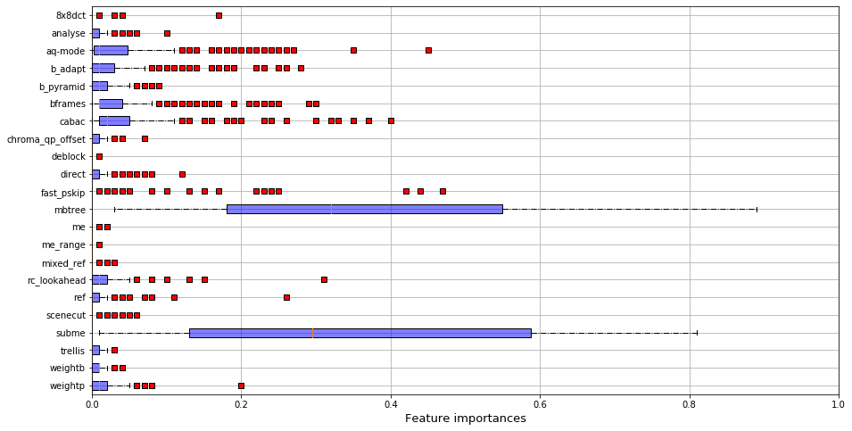
    


    
    
    Coef mbtree: -0.4388167938931298
    Coef mbtree std : 0.13879708411079755
    Coef aq-mode: -0.13419847328244275
    Coef aq_mode std : 0.13958747400262136
    Coef subme: -0.22740458015267176
    Coef subme std: 0.10141056892884777


    
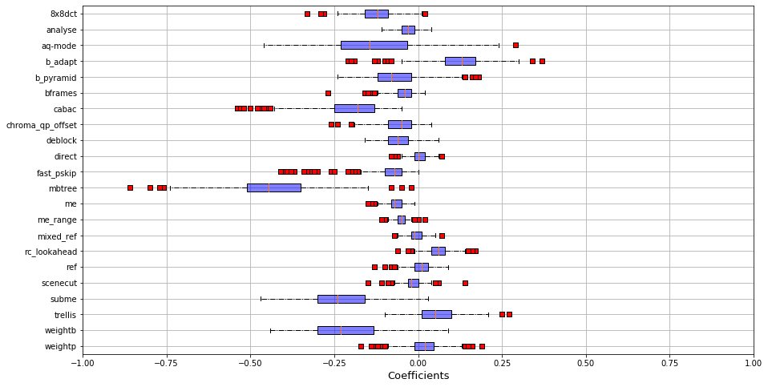
    


    
    
    Mean cpu in the group: 795.9
    Std dev : cpu in the group: 335.4
    Mean etime in the group: 8.5
    Std dev : etime in the group: 17.2
    Mean fps in the group: 560.9
    Std dev : fps in the group: 444.3
    Mean kbs in the group: 4570.8
    Std dev : kbs in the group: 8610.9
    Mean size in the group: 11285335.8
    Std dev : size in the group: 21465060.3
    
    
    str_video_cat
    Animation         0.298851
    CoverSong         0.240964
    Gaming            0.132867
    HDR               0.211538
    HowTo             0.333333
    Lecture           0.355769
    LiveMusic         0.148649
    LyricVideo        0.300000
    MusicVideo        0.166667
    NewsClip          0.114583
    Sports            0.090323
    TelevisionClip    0.327273
    VR                0.134831
    VerticalVideo     0.144737
    Vlog              0.075949
    dtype: float64
    
    
    Mean perf_group : 0.0
    std perf_group : 0.0
    Mean SLEEQ_DMOS : 0.010585855723199852
    std SLEEQ_DMOS : 1.1992390715184256
    Mean BANDING_DMOS : 0.2759311078452877
    std BANDING_DMOS : 1.481394223882173
    Mean WIDTH : -0.0828277760388681
    std WIDTH : 1.0258235471282116
    Mean HEIGHT : -0.06554687593887887
    std HEIGHT : 1.054409129986225
    Mean SPATIAL_COMPLEXITY : -0.5069374819223292
    std SPATIAL_COMPLEXITY : 0.6721289787192075
    Mean TEMPORAL_COMPLEXITY : -0.6834794486547504
    std TEMPORAL_COMPLEXITY : 0.8136091175369006
    Mean CHUNK_COMPLEXITY_VARIATION : -0.5357661742027967
    std CHUNK_COMPLEXITY_VARIATION : 0.44405462303707854
    Mean COLOR_COMPLEXITY : -0.07169077959472776
    std COLOR_COMPLEXITY : 0.9783370198851954
    
    


    /home/llesoil/anaconda3/envs/x264/lib/python3.7/site-packages/ipykernel_launcher.py:71: SettingWithCopyWarning: 
    A value is trying to be set on a copy of a slice from a DataFrame.
    Try using .loc[row_indexer,col_indexer] = value instead
    
    See the caveats in the documentation: https://pandas.pydata.org/pandas-docs/stable/user_guide/indexing.html#returning-a-view-versus-a-copy


    Correlations intra-group: 
    count    68644.000000
    mean         0.864899
    std          0.084497
    min          0.388822
    25%          0.821671
    50%          0.882167
    75%          0.927773
    max          1.000000
    dtype: float64
    


```python
summary_group(1)
```

    Group 1 : 470 videos!
    
    
    input avg size : 1637205973.9170213
    input std size : 2438557837.558484
    
    
    
    
    Imp mbtree: 0.09002127659574469
    Imp std mbtree: 0.09443786415206744
    Imp aq-mode: 0.2752553191489362
    Imp std aq-mode: 0.19401425348879148
    Imp subme: 0.4858510638297872
    Imp std subme: 0.24580397645134588


    
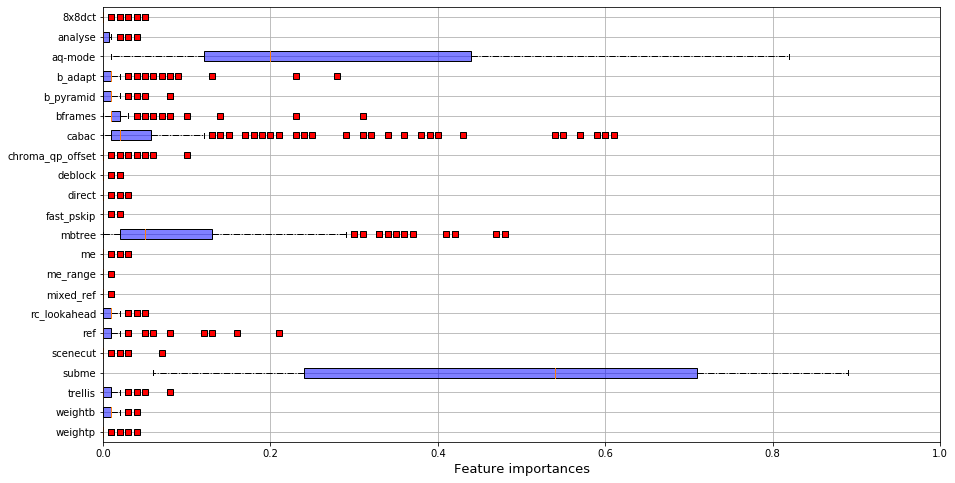
    


    
    
    Coef mbtree: 0.3331063829787234
    Coef mbtree std : 0.19396788877067048
    Coef aq-mode: -0.5040851063829788
    Coef aq_mode std : 0.13980804922909124
    Coef subme: -0.3180851063829787
    Coef subme std: 0.09194212559556819


    
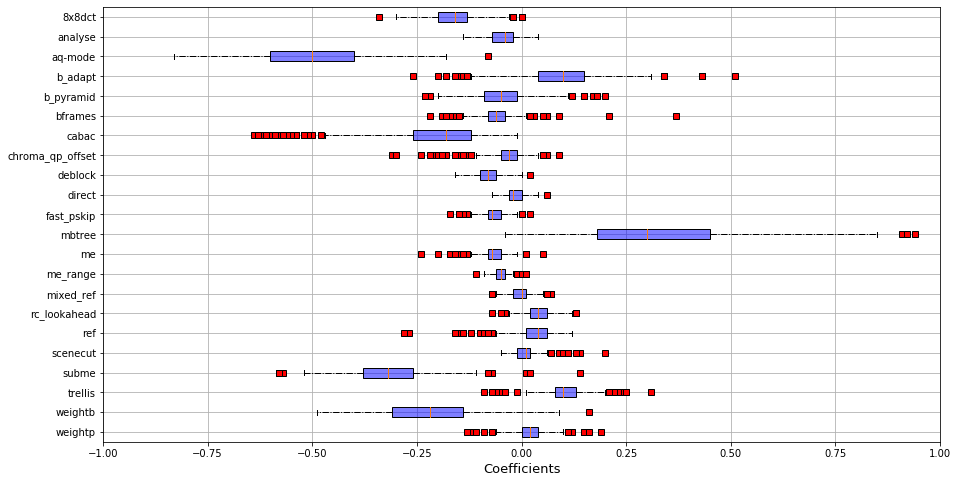
    


    
    
    Mean cpu in the group: 1074.5
    Std dev : cpu in the group: 398.9
    Mean etime in the group: 8.9
    Std dev : etime in the group: 10.7
    Mean fps in the group: 389.4
    Std dev : fps in the group: 302.9
    Mean kbs in the group: 15015.6
    Std dev : kbs in the group: 19927.0
    Mean size in the group: 37383809.7
    Std dev : size in the group: 49629655.1
    
    
    str_video_cat
    Animation         0.252874
    CoverSong         0.277108
    Gaming            0.363636
    HDR               0.057692
    HowTo             0.252874
    Lecture           0.086538
    LiveMusic         0.324324
    LyricVideo        0.216667
    MusicVideo        0.282051
    NewsClip          0.489583
    Sports            0.567742
    TelevisionClip    0.254545
    VR                0.426966
    VerticalVideo     0.289474
    Vlog              0.449367
    dtype: float64
    
    
    Mean perf_group : 1.0
    std perf_group : 0.0
    Mean SLEEQ_DMOS : -0.029323948203180957
    std SLEEQ_DMOS : 0.9164326353194944
    Mean BANDING_DMOS : -0.1830523651266118
    std BANDING_DMOS : 0.5248708286866567
    Mean WIDTH : -0.06749438276653899
    std WIDTH : 0.9073123854036537
    Mean HEIGHT : -0.08048432049239089
    std HEIGHT : 0.9052824339899326
    Mean SPATIAL_COMPLEXITY : 0.7962067871438034
    std SPATIAL_COMPLEXITY : 0.8957660811284948
    Mean TEMPORAL_COMPLEXITY : 0.2400374302535763
    std TEMPORAL_COMPLEXITY : 0.8396682455969656
    Mean CHUNK_COMPLEXITY_VARIATION : 0.5913149635812424
    std CHUNK_COMPLEXITY_VARIATION : 1.2310288951280874
    Mean COLOR_COMPLEXITY : -0.08257837385744365
    std COLOR_COMPLEXITY : 0.7750806293391255
    
    


    /home/llesoil/anaconda3/envs/x264/lib/python3.7/site-packages/ipykernel_launcher.py:71: SettingWithCopyWarning: 
    A value is trying to be set on a copy of a slice from a DataFrame.
    Try using .loc[row_indexer,col_indexer] = value instead
    
    See the caveats in the documentation: https://pandas.pydata.org/pandas-docs/stable/user_guide/indexing.html#returning-a-view-versus-a-copy


    Correlations intra-group: 
    count    220900.000000
    mean          0.817477
    std           0.106042
    min           0.150029
    25%           0.758339
    50%           0.837350
    75%           0.897184
    max           1.000000
    dtype: float64
    


```python
summary_group(2)
```

    Group 2 : 446 videos!
    
    
    input avg size : 1912740394.618834
    input std size : 4485849929.210282
    
    
    
    
    Imp mbtree: 0.057556053811659194
    Imp std mbtree: 0.07028826134627535
    Imp aq-mode: 0.14681614349775782
    Imp std aq-mode: 0.18013621480114772
    Imp subme: 0.5138340807174888
    Imp std subme: 0.24234071428083634


    
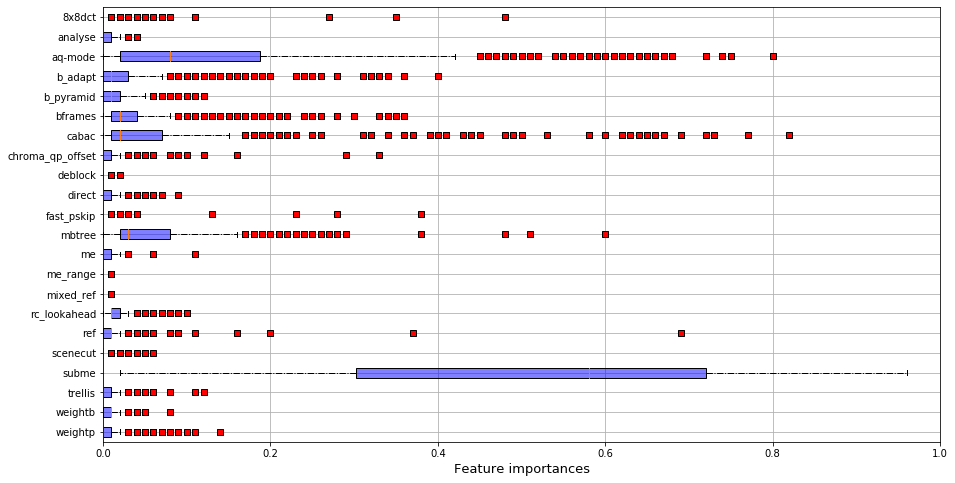
    


    
    
    Coef mbtree: -0.12002242152466368
    Coef mbtree std : 0.148267270001769
    Coef aq-mode: -0.27849775784753367
    Coef aq_mode std : 0.18165712971210848
    Coef subme: -0.2888565022421524
    Coef subme std: 0.10825684472962907


    
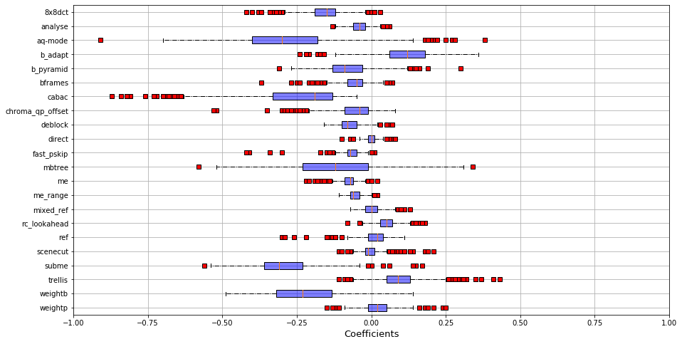
    


    
    
    Mean cpu in the group: 916.9
    Std dev : cpu in the group: 357.9
    Mean etime in the group: 8.8
    Std dev : etime in the group: 19.3
    Mean fps in the group: 475.7
    Std dev : fps in the group: 358.2
    Mean kbs in the group: 7472.1
    Std dev : kbs in the group: 11682.3
    Mean size in the group: 18442636.1
    Std dev : size in the group: 28996660.7
    
    
    str_video_cat
    Animation         0.321839
    CoverSong         0.265060
    Gaming            0.363636
    HDR               0.211538
    HowTo             0.310345
    Lecture           0.317308
    LiveMusic         0.391892
    LyricVideo        0.300000
    MusicVideo        0.397436
    NewsClip          0.333333
    Sports            0.277419
    TelevisionClip    0.345455
    VR                0.348315
    VerticalVideo     0.368421
    Vlog              0.265823
    dtype: float64
    
    
    Mean perf_group : 2.0
    std perf_group : 0.0
    Mean SLEEQ_DMOS : 0.02205119993363216
    std SLEEQ_DMOS : 1.007966622413751
    Mean BANDING_DMOS : -0.05208667635743455
    std BANDING_DMOS : 0.8682899951397716
    Mean WIDTH : -0.1364359113106732
    std WIDTH : 0.9153484440730446
    Mean HEIGHT : -0.12478573823747643
    std HEIGHT : 0.9325441155272736
    Mean SPATIAL_COMPLEXITY : -0.07386073362822868
    std SPATIAL_COMPLEXITY : 0.8225077005679219
    Mean TEMPORAL_COMPLEXITY : -0.11604481067614586
    std TEMPORAL_COMPLEXITY : 0.9564027790138773
    Mean CHUNK_COMPLEXITY_VARIATION : -0.08499847937963713
    std CHUNK_COMPLEXITY_VARIATION : 0.7880542865188301
    Mean COLOR_COMPLEXITY : 0.07234952686027743
    std COLOR_COMPLEXITY : 1.0340396972071837
    
    


    /home/llesoil/anaconda3/envs/x264/lib/python3.7/site-packages/ipykernel_launcher.py:71: SettingWithCopyWarning: 
    A value is trying to be set on a copy of a slice from a DataFrame.
    Try using .loc[row_indexer,col_indexer] = value instead
    
    See the caveats in the documentation: https://pandas.pydata.org/pandas-docs/stable/user_guide/indexing.html#returning-a-view-versus-a-copy


    Correlations intra-group: 
    count    198916.000000
    mean          0.735207
    std           0.168250
    min          -0.157552
    25%           0.641021
    50%           0.772543
    75%           0.863975
    max           1.000000
    dtype: float64
    


```python
summary_group(3)
```

    Group 3 : 219 videos!
    
    
    input avg size : 4415585852.876713
    input std size : 7212521059.6005535
    
    
    
    
    Imp mbtree: 0.47342465753424645
    Imp std mbtree: 0.195353928973855
    Imp aq-mode: 0.13438356164383564
    Imp std aq-mode: 0.12689102542150163
    Imp subme: 0.14461187214611873
    Imp std subme: 0.14376925337225804


    
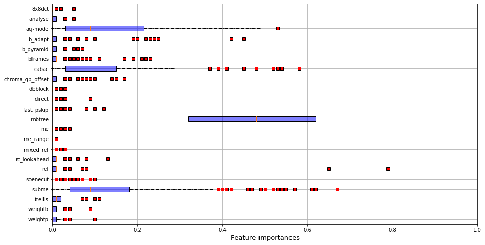
    


    
    
    Coef mbtree: -0.6810502283105022
    Coef mbtree std : 0.1800641494960555
    Coef aq-mode: 0.35538812785388135
    Coef aq_mode std : 0.20981446477958007
    Coef subme: -0.16118721461187216
    Coef subme std: 0.1238590177374664


    
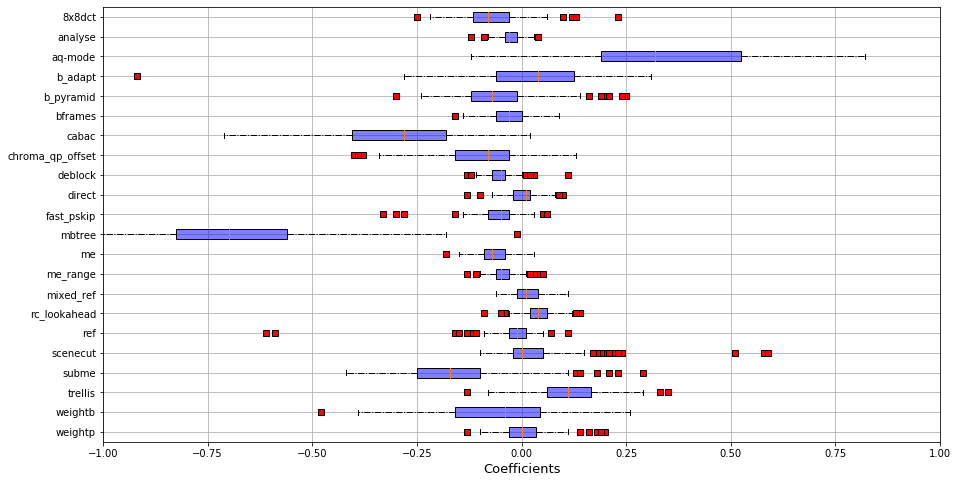
    


    
    
    Mean cpu in the group: 1029.7
    Std dev : cpu in the group: 377.2
    Mean etime in the group: 19.1
    Std dev : etime in the group: 30.4
    Mean fps in the group: 244.2
    Std dev : fps in the group: 256.7
    Mean kbs in the group: 9223.9
    Std dev : kbs in the group: 11328.4
    Mean size in the group: 22805170.5
    Std dev : size in the group: 28350618.9
    
    
    str_video_cat
    Animation         0.126437
    CoverSong         0.216867
    Gaming            0.139860
    HDR               0.519231
    HowTo             0.103448
    Lecture           0.240385
    LiveMusic         0.135135
    LyricVideo        0.183333
    MusicVideo        0.153846
    NewsClip          0.062500
    Sports            0.064516
    TelevisionClip    0.072727
    VR                0.089888
    VerticalVideo     0.197368
    Vlog              0.208861
    dtype: float64
    
    
    Mean perf_group : 3.0
    std perf_group : 0.0
    Mean SLEEQ_DMOS : 0.005360393998249836
    std SLEEQ_DMOS : 0.8958933053763064
    Mean BANDING_DMOS : 0.1688188082623658
    std BANDING_DMOS : 1.20468743040557
    Mean WIDTH : 0.521797505328845
    std WIDTH : 1.15643497785651
    Mean HEIGHT : 0.5052755770836741
    std HEIGHT : 1.1096896137917487
    Mean SPATIAL_COMPLEXITY : -0.9518615639075219
    std SPATIAL_COMPLEXITY : 0.40397004942488374
    Mean TEMPORAL_COMPLEXITY : 0.5388584880818494
    std TEMPORAL_COMPLEXITY : 1.1076262376057906
    Mean CHUNK_COMPLEXITY_VARIATION : -0.45496791524535657
    std CHUNK_COMPLEXITY_VARIATION : 0.5680391006251411
    Mean COLOR_COMPLEXITY : 0.11564808669923886
    std COLOR_COMPLEXITY : 1.3199383771341777
    
    


    /home/llesoil/anaconda3/envs/x264/lib/python3.7/site-packages/ipykernel_launcher.py:71: SettingWithCopyWarning: 
    A value is trying to be set on a copy of a slice from a DataFrame.
    Try using .loc[row_indexer,col_indexer] = value instead
    
    See the caveats in the documentation: https://pandas.pydata.org/pandas-docs/stable/user_guide/indexing.html#returning-a-view-versus-a-copy


    Correlations intra-group: 
    count    47961.000000
    mean         0.792355
    std          0.139186
    min         -0.069959
    25%          0.727816
    50%          0.824228
    75%          0.891512
    max          1.000000
    dtype: float64
    


### Inter-group correlogram


```python
group_perf =groups
id_list_0 = [i for i in range(len(listVideo)) if group_perf[i]==1]
id_list_1 = [i for i in range(len(listVideo)) if group_perf[i]==3]
id_list_2 = [i for i in range(len(listVideo)) if group_perf[i]==0]
id_list_3 = [i for i in range(len(listVideo)) if group_perf[i]==2]

res = np.zeros(16).reshape(4,4)
stds = np.zeros(16).reshape(4,4)
res_med = np.zeros(16).reshape(4,4)

tab = []
for id0 in id_list_0:
    for id1 in id_list_1:
        tab.append(corrSpearman[id0][id1])
res[0][1] = np.mean(tab)
stds[0][1] = np.std(tab)
res_med[0][1] = np.median(tab)

tab = []
for id0 in id_list_0:
    for id2 in id_list_2:
        tab.append(corrSpearman[id0][id2])
res[0][2] = np.mean(tab)
stds[0][2] = np.std(tab)
res_med[0][2] = np.median(tab)

tab = []
for id0 in id_list_0:
    for id3 in id_list_3:
        tab.append(corrSpearman[id0][id3])
res[0][3] = np.mean(tab)
stds[0][3] = np.std(tab)
res_med[0][3] = np.median(tab)

tab = []
for id1 in id_list_1:
    for id2 in id_list_2:
        tab.append(corrSpearman[id1][id2])
res[1][2] = np.mean(tab)
stds[1][2] = np.std(tab)
res_med[1][2] = np.median(tab)

tab = []
for id1 in id_list_1:
    for id3 in id_list_3:
        tab.append(corrSpearman[id1][id3])
res[1][3] = np.mean(tab)
stds[1][3] = np.std(tab)
res_med[1][3] = np.median(tab)

tab = []
for id2 in id_list_2:
    for id3 in id_list_3:
        tab.append(corrSpearman[id2][id3])
res[2][3] = np.mean(tab)
stds[2][3] = np.std(tab)
res_med[2][3] = np.median(tab)


res[0][0] = np.mean([[corrSpearman[id1][id2] for id1 in id_list_0] for id2 in id_list_0])
res[1][1] = np.mean([[corrSpearman[id1][id2] for id1 in id_list_1] for id2 in id_list_1])
res[2][2] = np.mean([[corrSpearman[id1][id2] for id1 in id_list_2] for id2 in id_list_2])
res[3][3] = np.mean([[corrSpearman[id1][id2] for id1 in id_list_3] for id2 in id_list_3])

print("AVG")
print(res)
print("STD")
print(stds)
print('MEDIAN')
print(res_med)
```

    AVG
    [[0.81747714 0.04144966 0.36253517 0.59097558]
     [0.         0.79235455 0.68081324 0.46116805]
     [0.         0.         0.8648994  0.72056058]
     [0.         0.         0.         0.73520697]]
    STD
    [[0.         0.21617253 0.18632293 0.17803149]
     [0.         0.         0.1739558  0.20649183]
     [0.         0.         0.         0.15524317]
     [0.         0.         0.         0.        ]]
    MEDIAN
    [[0.         0.04818101 0.36961349 0.60762731]
     [0.         0.         0.71799915 0.48859154]
     [0.         0.         0.         0.74609453]
     [0.         0.         0.         0.        ]]


```python
tab = [v_names[i].split("_")[1].split("-")[0] for i in id_list_1]
resolutions = ['360P','480P','720P','1080P', '2160P']
for r in resolutions:
    print(r, " : ", tab.count(r))
(89+52)/len(tab)
```

    360P  :  14
    480P  :  24
    720P  :  40
    1080P  :  89
    2160P  :  52


    0.6438356164383562


```python
tab = [v_names[i].split("_")[1].split("-")[0] for i in id_list_3]
resolutions = ['360P','480P','720P','1080P', '2160P']
for r in resolutions:
    print(r, " : ", tab.count(r))
(88+108+96)/len(tab)
```

    360P  :  88
    480P  :  108
    720P  :  96
    1080P  :  114
    2160P  :  40


    0.6547085201793722


```python
tab = [v_names[i].split("_")[1].split("-")[0] for i in id_list_2]
resolutions = ['360P','480P','720P','1080P', '2160P']
for r in resolutions:
    print(r, " : ", tab.count(r))
```

    360P  :  59
    480P  :  59
    720P  :  56
    1080P  :  56
    2160P  :  32


```python
tab = [v_names[i].split("_")[1].split("-")[0] for i in id_list_0]
resolutions = ['360P','480P','720P','1080P', '2160P']
for r in resolutions:
    print(r, " : ", tab.count(r))
```

    360P  :  75
    480P  :  104
    720P  :  110
    1080P  :  136
    2160P  :  45


## RQ2.2 - Group classification


```python
if 'str_video_cat' in meta_perf.columns:
    del meta_perf['str_video_cat']

accuracy = []

nbLaunches = 10
for i in range(nbLaunches):
    X = np.array(meta_perf[[k for k in meta_perf.columns if k !='perf_group']], float)
    y = np.array(meta_perf['perf_group'], float)

    X_train, X_test, y_train, y_test = train_test_split(X, y, test_size=0.3)

    rf = RandomForestClassifier()
    rf.fit(X_train, y_train)
    y_pred = rf.predict(X_test)


    conf = pd.crosstab(y_pred, y_test)#, colnames=[1,2,3], rownames=[1,2,3])
    val = np.sum(np.diag(conf))/len(y_test)
    accuracy.append(val)
    print('Test accuracy : '+ str(val))
    conf.columns = pd.Int64Index([1,2,3,4], dtype='int64', name='Observed')
    conf.index = pd.Int64Index([1,2,3,4], dtype='int64', name='Predicted')
    conf
print(np.mean(accuracy))
conf
```

    Test accuracy : 0.6523809523809524
    Test accuracy : 0.6261904761904762
    Test accuracy : 0.6761904761904762
    Test accuracy : 0.6523809523809524
    Test accuracy : 0.6642857142857143
    Test accuracy : 0.6547619047619048
    Test accuracy : 0.6714285714285714
    Test accuracy : 0.65
    Test accuracy : 0.6547619047619048
    Test accuracy : 0.6714285714285714
    0.6573809523809524


<div>
<style scoped>
    .dataframe tbody tr th:only-of-type {
        vertical-align: middle;
    }

    .dataframe tbody tr th {
        vertical-align: top;
    }

    .dataframe thead th {
        text-align: right;
    }
</style>
<table border="1" class="dataframe">
  <thead>
    <tr style="text-align: right;">
      <th>Observed</th>
      <th>1</th>
      <th>2</th>
      <th>3</th>
      <th>4</th>
    </tr>
    <tr>
      <th>Predicted</th>
      <th></th>
      <th></th>
      <th></th>
      <th></th>
    </tr>
  </thead>
  <tbody>
    <tr>
      <th>1</th>
      <td>39</td>
      <td>0</td>
      <td>11</td>
      <td>8</td>
    </tr>
    <tr>
      <th>2</th>
      <td>2</td>
      <td>123</td>
      <td>34</td>
      <td>2</td>
    </tr>
    <tr>
      <th>3</th>
      <td>15</td>
      <td>28</td>
      <td>81</td>
      <td>12</td>
    </tr>
    <tr>
      <th>4</th>
      <td>13</td>
      <td>1</td>
      <td>12</td>
      <td>39</td>
    </tr>
  </tbody>
</table>
</div>


```python
meta_perf
```


<div>
<style scoped>
    .dataframe tbody tr th:only-of-type {
        vertical-align: middle;
    }

    .dataframe tbody tr th {
        vertical-align: top;
    }

    .dataframe thead th {
        text-align: right;
    }
</style>
<table border="1" class="dataframe">
  <thead>
    <tr style="text-align: right;">
      <th></th>
      <th>perf_group</th>
      <th>SLEEQ_DMOS</th>
      <th>BANDING_DMOS</th>
      <th>WIDTH</th>
      <th>HEIGHT</th>
      <th>SPATIAL_COMPLEXITY</th>
      <th>TEMPORAL_COMPLEXITY</th>
      <th>CHUNK_COMPLEXITY_VARIATION</th>
      <th>COLOR_COMPLEXITY</th>
      <th>video_category</th>
    </tr>
    <tr>
      <th>FILENAME</th>
      <th></th>
      <th></th>
      <th></th>
      <th></th>
      <th></th>
      <th></th>
      <th></th>
      <th></th>
      <th></th>
      <th></th>
    </tr>
  </thead>
  <tbody>
    <tr>
      <th>Animation_1080P-01b3</th>
      <td>0</td>
      <td>-0.678859</td>
      <td>4.653015</td>
      <td>0.383054</td>
      <td>0.332504</td>
      <td>-1.475487</td>
      <td>-1.547345</td>
      <td>-0.892454</td>
      <td>-1.210798</td>
      <td>-1.618194</td>
    </tr>
    <tr>
      <th>Animation_1080P-05f8</th>
      <td>1</td>
      <td>0.844509</td>
      <td>0.741729</td>
      <td>0.383054</td>
      <td>0.332504</td>
      <td>-0.147257</td>
      <td>0.444086</td>
      <td>2.545710</td>
      <td>2.207516</td>
      <td>-1.618194</td>
    </tr>
    <tr>
      <th>Animation_1080P-0c4f</th>
      <td>2</td>
      <td>-0.655778</td>
      <td>-0.377464</td>
      <td>0.383054</td>
      <td>0.332504</td>
      <td>0.422320</td>
      <td>-0.963192</td>
      <td>1.054868</td>
      <td>-1.232460</td>
      <td>-1.618194</td>
    </tr>
    <tr>
      <th>Animation_1080P-0cdf</th>
      <td>1</td>
      <td>-0.294170</td>
      <td>-0.059377</td>
      <td>0.383054</td>
      <td>0.332504</td>
      <td>-0.028644</td>
      <td>0.430810</td>
      <td>-0.103261</td>
      <td>-0.448284</td>
      <td>-1.618194</td>
    </tr>
    <tr>
      <th>Animation_1080P-18f5</th>
      <td>1</td>
      <td>-0.478821</td>
      <td>-0.377464</td>
      <td>0.383054</td>
      <td>0.332504</td>
      <td>1.289017</td>
      <td>-0.958767</td>
      <td>-0.051295</td>
      <td>0.192920</td>
      <td>-1.618194</td>
    </tr>
    <tr>
      <th>...</th>
      <td>...</td>
      <td>...</td>
      <td>...</td>
      <td>...</td>
      <td>...</td>
      <td>...</td>
      <td>...</td>
      <td>...</td>
      <td>...</td>
      <td>...</td>
    </tr>
    <tr>
      <th>Vlog_720P-561e</th>
      <td>2</td>
      <td>-0.678859</td>
      <td>-0.377464</td>
      <td>-0.239786</td>
      <td>-0.333314</td>
      <td>0.978979</td>
      <td>-1.414583</td>
      <td>-0.652893</td>
      <td>0.457201</td>
      <td>1.494379</td>
    </tr>
    <tr>
      <th>Vlog_720P-5d08</th>
      <td>1</td>
      <td>-0.678859</td>
      <td>-0.377464</td>
      <td>-0.773092</td>
      <td>-0.333314</td>
      <td>3.257287</td>
      <td>-0.303807</td>
      <td>-0.437698</td>
      <td>-0.158009</td>
      <td>1.494379</td>
    </tr>
    <tr>
      <th>Vlog_720P-60f8</th>
      <td>1</td>
      <td>0.444433</td>
      <td>0.623920</td>
      <td>-0.239786</td>
      <td>-0.333314</td>
      <td>0.234418</td>
      <td>-0.042708</td>
      <td>-0.364385</td>
      <td>-0.149344</td>
      <td>1.494379</td>
    </tr>
    <tr>
      <th>Vlog_720P-6410</th>
      <td>3</td>
      <td>-0.455739</td>
      <td>3.769441</td>
      <td>-0.239786</td>
      <td>-0.333314</td>
      <td>-0.770856</td>
      <td>2.121314</td>
      <td>1.971065</td>
      <td>-0.240326</td>
      <td>1.494379</td>
    </tr>
    <tr>
      <th>Vlog_720P-6d56</th>
      <td>2</td>
      <td>0.629083</td>
      <td>-0.353902</td>
      <td>-0.239786</td>
      <td>-0.333314</td>
      <td>-0.329287</td>
      <td>0.329026</td>
      <td>1.646979</td>
      <td>0.565512</td>
      <td>1.494379</td>
    </tr>
  </tbody>
</table>
<p>1397 rows × 10 columns</p>
</div>


```python
feat_imp = pd.DataFrame({'Random forest importance' : rf.feature_importances_,
              'name' : meta_perf.columns[1:]}).set_index('name')
```


```python
feat_imp
```


<div>
<style scoped>
    .dataframe tbody tr th:only-of-type {
        vertical-align: middle;
    }

    .dataframe tbody tr th {
        vertical-align: top;
    }

    .dataframe thead th {
        text-align: right;
    }
</style>
<table border="1" class="dataframe">
  <thead>
    <tr style="text-align: right;">
      <th></th>
      <th>Random forest importance</th>
    </tr>
    <tr>
      <th>name</th>
      <th></th>
    </tr>
  </thead>
  <tbody>
    <tr>
      <th>SLEEQ_DMOS</th>
      <td>0.070970</td>
    </tr>
    <tr>
      <th>BANDING_DMOS</th>
      <td>0.052596</td>
    </tr>
    <tr>
      <th>WIDTH</th>
      <td>0.040441</td>
    </tr>
    <tr>
      <th>HEIGHT</th>
      <td>0.037925</td>
    </tr>
    <tr>
      <th>SPATIAL_COMPLEXITY</th>
      <td>0.305647</td>
    </tr>
    <tr>
      <th>TEMPORAL_COMPLEXITY</th>
      <td>0.177238</td>
    </tr>
    <tr>
      <th>CHUNK_COMPLEXITY_VARIATION</th>
      <td>0.150123</td>
    </tr>
    <tr>
      <th>COLOR_COMPLEXITY</th>
      <td>0.103310</td>
    </tr>
    <tr>
      <th>video_category</th>
      <td>0.061749</td>
    </tr>
  </tbody>
</table>
</div>


```python
meta_perf.groupby(['perf_group']).mean()
```


<div>
<style scoped>
    .dataframe tbody tr th:only-of-type {
        vertical-align: middle;
    }

    .dataframe tbody tr th {
        vertical-align: top;
    }

    .dataframe thead th {
        text-align: right;
    }
</style>
<table border="1" class="dataframe">
  <thead>
    <tr style="text-align: right;">
      <th></th>
      <th>SLEEQ_DMOS</th>
      <th>BANDING_DMOS</th>
      <th>WIDTH</th>
      <th>HEIGHT</th>
      <th>SPATIAL_COMPLEXITY</th>
      <th>TEMPORAL_COMPLEXITY</th>
      <th>CHUNK_COMPLEXITY_VARIATION</th>
      <th>COLOR_COMPLEXITY</th>
      <th>video_category</th>
    </tr>
    <tr>
      <th>perf_group</th>
      <th></th>
      <th></th>
      <th></th>
      <th></th>
      <th></th>
      <th></th>
      <th></th>
      <th></th>
      <th></th>
    </tr>
  </thead>
  <tbody>
    <tr>
      <th>0</th>
      <td>0.010586</td>
      <td>0.275931</td>
      <td>-0.082828</td>
      <td>-0.065547</td>
      <td>-0.506937</td>
      <td>-0.683479</td>
      <td>-0.535766</td>
      <td>-0.071691</td>
      <td>-0.277446</td>
    </tr>
    <tr>
      <th>1</th>
      <td>-0.029324</td>
      <td>-0.183052</td>
      <td>-0.067494</td>
      <td>-0.080484</td>
      <td>0.796207</td>
      <td>0.240037</td>
      <td>0.591315</td>
      <td>-0.082578</td>
      <td>0.213872</td>
    </tr>
    <tr>
      <th>2</th>
      <td>0.022051</td>
      <td>-0.052087</td>
      <td>-0.136436</td>
      <td>-0.124786</td>
      <td>-0.073861</td>
      <td>-0.116045</td>
      <td>-0.084998</td>
      <td>0.072350</td>
      <td>-0.007572</td>
    </tr>
    <tr>
      <th>3</th>
      <td>0.005360</td>
      <td>0.168819</td>
      <td>0.521798</td>
      <td>0.505276</td>
      <td>-0.951862</td>
      <td>0.538858</td>
      <td>-0.454968</td>
      <td>0.115648</td>
      <td>-0.111652</td>
    </tr>
  </tbody>
</table>
</div>


## RQ2.3 - Generate a configuration

# With input properties


```python
listFeatures = ["cabac", "ref", "deblock", "analyse", "me", "subme", "mixed_ref", "me_range", "trellis", 
                "8x8dct", "fast_pskip", "chroma_qp_offset", "bframes", "b_pyramid", 
                "b_adapt", "direct", "weightb", "open_gop", "weightp", "scenecut", "rc_lookahead", 
                "mbtree", "qpmax", "aq-mode"]
categorial = ['analyse', 'me', 'direct']
val_config = listVideo[0][listFeatures].replace(to_replace ="None",value='0')
val_config['deblock'] =[int(val[0]) for val in val_config['deblock']]

for col in val_config.columns:
    if col not in categorial:
        arr_col = np.array(val_config[col],int)
        arr_col = (arr_col-np.mean(arr_col))/(np.std(arr_col)+1e-5)
        val_config[col] = arr_col
    else:
        if col not in [predDimension,'ranking']:
            val_config[col] = [np.where(k==val_config[col].unique())[0][0] for k in val_config[col]]
            arr_col = np.array(val_config[col],int)
            arr_col = (arr_col-np.mean(arr_col))/(np.std(arr_col)+1e-5)
            val_config[col] = arr_col
```

## Inputec


```python
train_ind, test_ind = train_test_split([k for k in range(len(listVideo))], test_size = 0.25)
test_index = [v_names[k][:-4] for k in test_ind]
train_index = [v_names[k][:-4] for k in train_ind]

name_col = list(meta_perf.columns)[1:]

for vcc in val_config.columns:
    name_col.append(vcc)

name_col.append("config_size")

nb_col = len(name_col)
nb_config = 201

def gen_dataset(inputs_names):

    res = pd.DataFrame(np.zeros(nb_config*len(inputs_names)*nb_col).reshape(nb_config*len(inputs_names), nb_col))
    res.columns = name_col

    for i in range(len(inputs_names)):
        video_name = inputs_names[i]
        index_video = np.where(np.array([v[:-4] for v in v_names], str)==video_name)[0][0]
        sizes = listVideo[index_video][predDimension]
        sorted_config = sorted(range(len(sizes)), key=lambda k: sizes[k])
        video_prop = np.array(meta_perf.loc[video_name][1:], float)
        moy = np.mean(sizes)
        std = np.std(sizes)            
        for config_id in range(len(sorted_config)):
            config_rank = sorted_config[config_id]
            val = list(tuple(video_prop) + tuple(val_config.loc[config_id]))
            val.append((sizes[config_id]-moy)/std)
            res.loc[i*nb_config+config_id] = val
    return res

training_data = gen_dataset(train_index)
test_data = gen_dataset(test_index)

print("Training size : ", training_data.shape[0])
print("Test size : ", test_data.shape[0])

test_data
```

    Training size :  210447
    Test size :  70350


<div>
<style scoped>
    .dataframe tbody tr th:only-of-type {
        vertical-align: middle;
    }

    .dataframe tbody tr th {
        vertical-align: top;
    }

    .dataframe thead th {
        text-align: right;
    }
</style>
<table border="1" class="dataframe">
  <thead>
    <tr style="text-align: right;">
      <th></th>
      <th>SLEEQ_DMOS</th>
      <th>BANDING_DMOS</th>
      <th>WIDTH</th>
      <th>HEIGHT</th>
      <th>SPATIAL_COMPLEXITY</th>
      <th>TEMPORAL_COMPLEXITY</th>
      <th>CHUNK_COMPLEXITY_VARIATION</th>
      <th>COLOR_COMPLEXITY</th>
      <th>video_category</th>
      <th>cabac</th>
      <th>...</th>
      <th>direct</th>
      <th>weightb</th>
      <th>open_gop</th>
      <th>weightp</th>
      <th>scenecut</th>
      <th>rc_lookahead</th>
      <th>mbtree</th>
      <th>qpmax</th>
      <th>aq-mode</th>
      <th>config_size</th>
    </tr>
  </thead>
  <tbody>
    <tr>
      <th>0</th>
      <td>0.021275</td>
      <td>1.978732</td>
      <td>2.251573</td>
      <td>2.329959</td>
      <td>-1.220646</td>
      <td>1.661072</td>
      <td>-0.803832</td>
      <td>-0.261988</td>
      <td>1.272052</td>
      <td>-1.463056</td>
      <td>...</td>
      <td>-1.676144</td>
      <td>-2.038047</td>
      <td>0.0</td>
      <td>-1.652973</td>
      <td>-1.737814</td>
      <td>-1.112186</td>
      <td>-1.168183</td>
      <td>0.0</td>
      <td>-1.479994</td>
      <td>1.705850</td>
    </tr>
    <tr>
      <th>1</th>
      <td>0.021275</td>
      <td>1.978732</td>
      <td>2.251573</td>
      <td>2.329959</td>
      <td>-1.220646</td>
      <td>1.661072</td>
      <td>-0.803832</td>
      <td>-0.261988</td>
      <td>1.272052</td>
      <td>0.683471</td>
      <td>...</td>
      <td>-0.333893</td>
      <td>0.490641</td>
      <td>0.0</td>
      <td>-0.339741</td>
      <td>-1.737814</td>
      <td>1.522974</td>
      <td>0.855996</td>
      <td>0.0</td>
      <td>0.675649</td>
      <td>-0.748201</td>
    </tr>
    <tr>
      <th>2</th>
      <td>0.021275</td>
      <td>1.978732</td>
      <td>2.251573</td>
      <td>2.329959</td>
      <td>-1.220646</td>
      <td>1.661072</td>
      <td>-0.803832</td>
      <td>-0.261988</td>
      <td>1.272052</td>
      <td>0.683471</td>
      <td>...</td>
      <td>1.008358</td>
      <td>0.490641</td>
      <td>0.0</td>
      <td>-0.339741</td>
      <td>-1.737814</td>
      <td>-0.672993</td>
      <td>0.855996</td>
      <td>0.0</td>
      <td>-1.479994</td>
      <td>-1.383297</td>
    </tr>
    <tr>
      <th>3</th>
      <td>0.021275</td>
      <td>1.978732</td>
      <td>2.251573</td>
      <td>2.329959</td>
      <td>-1.220646</td>
      <td>1.661072</td>
      <td>-0.803832</td>
      <td>-0.261988</td>
      <td>1.272052</td>
      <td>0.683471</td>
      <td>...</td>
      <td>-0.333893</td>
      <td>0.490641</td>
      <td>0.0</td>
      <td>-0.339741</td>
      <td>-1.737814</td>
      <td>-0.672993</td>
      <td>0.855996</td>
      <td>0.0</td>
      <td>-1.479994</td>
      <td>-1.347452</td>
    </tr>
    <tr>
      <th>4</th>
      <td>0.021275</td>
      <td>1.978732</td>
      <td>2.251573</td>
      <td>2.329959</td>
      <td>-1.220646</td>
      <td>1.661072</td>
      <td>-0.803832</td>
      <td>-0.261988</td>
      <td>1.272052</td>
      <td>0.683471</td>
      <td>...</td>
      <td>1.008358</td>
      <td>0.490641</td>
      <td>0.0</td>
      <td>-0.339741</td>
      <td>0.575435</td>
      <td>0.205394</td>
      <td>-1.168183</td>
      <td>0.0</td>
      <td>0.675649</td>
      <td>0.749207</td>
    </tr>
    <tr>
      <th>...</th>
      <td>...</td>
      <td>...</td>
      <td>...</td>
      <td>...</td>
      <td>...</td>
      <td>...</td>
      <td>...</td>
      <td>...</td>
      <td>...</td>
      <td>...</td>
      <td>...</td>
      <td>...</td>
      <td>...</td>
      <td>...</td>
      <td>...</td>
      <td>...</td>
      <td>...</td>
      <td>...</td>
      <td>...</td>
      <td>...</td>
      <td>...</td>
    </tr>
    <tr>
      <th>70345</th>
      <td>-0.678859</td>
      <td>-0.377464</td>
      <td>0.383054</td>
      <td>0.332504</td>
      <td>-1.564741</td>
      <td>-1.295097</td>
      <td>-0.889004</td>
      <td>4.547047</td>
      <td>-0.951214</td>
      <td>0.683471</td>
      <td>...</td>
      <td>1.008358</td>
      <td>0.490641</td>
      <td>0.0</td>
      <td>-0.339741</td>
      <td>0.575435</td>
      <td>-0.233799</td>
      <td>0.855996</td>
      <td>0.0</td>
      <td>0.675649</td>
      <td>-0.374491</td>
    </tr>
    <tr>
      <th>70346</th>
      <td>-0.678859</td>
      <td>-0.377464</td>
      <td>0.383054</td>
      <td>0.332504</td>
      <td>-1.564741</td>
      <td>-1.295097</td>
      <td>-0.889004</td>
      <td>4.547047</td>
      <td>-0.951214</td>
      <td>0.683471</td>
      <td>...</td>
      <td>1.008358</td>
      <td>0.490641</td>
      <td>0.0</td>
      <td>-0.339741</td>
      <td>0.575435</td>
      <td>0.205394</td>
      <td>0.855996</td>
      <td>0.0</td>
      <td>0.675649</td>
      <td>-0.363558</td>
    </tr>
    <tr>
      <th>70347</th>
      <td>-0.678859</td>
      <td>-0.377464</td>
      <td>0.383054</td>
      <td>0.332504</td>
      <td>-1.564741</td>
      <td>-1.295097</td>
      <td>-0.889004</td>
      <td>4.547047</td>
      <td>-0.951214</td>
      <td>0.683471</td>
      <td>...</td>
      <td>-0.333893</td>
      <td>0.490641</td>
      <td>0.0</td>
      <td>-0.339741</td>
      <td>0.575435</td>
      <td>0.205394</td>
      <td>0.855996</td>
      <td>0.0</td>
      <td>0.675649</td>
      <td>-0.290469</td>
    </tr>
    <tr>
      <th>70348</th>
      <td>-0.678859</td>
      <td>-0.377464</td>
      <td>0.383054</td>
      <td>0.332504</td>
      <td>-1.564741</td>
      <td>-1.295097</td>
      <td>-0.889004</td>
      <td>4.547047</td>
      <td>-0.951214</td>
      <td>-1.463056</td>
      <td>...</td>
      <td>1.008358</td>
      <td>0.490641</td>
      <td>0.0</td>
      <td>0.973490</td>
      <td>0.575435</td>
      <td>0.205394</td>
      <td>-1.168183</td>
      <td>0.0</td>
      <td>0.675649</td>
      <td>0.173841</td>
    </tr>
    <tr>
      <th>70349</th>
      <td>-0.678859</td>
      <td>-0.377464</td>
      <td>0.383054</td>
      <td>0.332504</td>
      <td>-1.564741</td>
      <td>-1.295097</td>
      <td>-0.889004</td>
      <td>4.547047</td>
      <td>-0.951214</td>
      <td>0.683471</td>
      <td>...</td>
      <td>-0.333893</td>
      <td>0.490641</td>
      <td>0.0</td>
      <td>0.973490</td>
      <td>0.575435</td>
      <td>1.522974</td>
      <td>0.855996</td>
      <td>0.0</td>
      <td>0.675649</td>
      <td>-0.321167</td>
    </tr>
  </tbody>
</table>
<p>70350 rows × 34 columns</p>
</div>


```python
X_train = np.array(training_data.drop(["config_size"],axis=1), float)
y_train = np.array(training_data["config_size"], float)

X_test = np.array(test_data.drop(["config_size"],axis=1), float)
y_test = np.array(test_data["config_size"], float)
```


```python
clf = RandomForestRegressor()

clf.fit(X_train, y_train)

y_pred = clf.predict(X_test)
```


```python
print(clf.feature_importances_)
```

    [1.87961780e-02 9.15156355e-03 7.15212698e-03 5.98007774e-03
     1.00692570e-01 6.55169671e-02 2.94691487e-02 2.90464425e-02
     1.41611731e-02 4.27148246e-02 2.57993690e-03 6.47771845e-04
     3.02989172e-03 2.28474918e-03 5.01687835e-01 8.98226273e-04
     4.64662659e-04 6.91122340e-03 9.54960640e-04 2.75889383e-03
     3.71701232e-03 9.37219875e-03 7.86219870e-03 8.99264840e-03
     2.43572590e-03 1.07367676e-02 0.00000000e+00 1.53955457e-03
     1.11225783e-03 4.74994687e-03 3.95190805e-02 0.00000000e+00
     6.50633851e-02]


```python
np.mean(np.abs(y_pred-y_test))
```


    0.2712275402973142


## B5 - Cost effective Inputec


```python
nb_config_ce = 20

def gen_dataset_ce(inputs_names):

    res = pd.DataFrame(np.zeros(nb_config_ce*len(inputs_names)*nb_col)
                       .reshape(nb_config_ce*len(inputs_names), nb_col))
    res.columns = name_col

    for i in range(len(inputs_names)):
        video_name = inputs_names[i]
        index_video = np.where(np.array([v[:-4] for v in v_names], str)==video_name)[0][0]
        sizes = listVideo[index_video][predDimension]
        video_prop = np.array(meta_perf.loc[video_name][1:], float)
        moy = np.mean(sizes)
        std = np.std(sizes)
        for config_id in range(nb_config_ce):
            #config_rank = sorted_config[config_id]
            val = list(tuple(video_prop) + tuple(val_config.loc[config_id]))
            val.append((sizes[config_id]-moy)/std)
            res.loc[i*nb_config_ce+config_id] = val
    return res

training_data_ce = gen_dataset_ce(train_index)
test_data_ce = gen_dataset_ce(test_index)

print("Training size : ", training_data_ce.shape[0])
print("Test size : ", test_data_ce.shape[0])

test_data_ce
```

    Training size :  20940
    Test size :  7000


<div>
<style scoped>
    .dataframe tbody tr th:only-of-type {
        vertical-align: middle;
    }

    .dataframe tbody tr th {
        vertical-align: top;
    }

    .dataframe thead th {
        text-align: right;
    }
</style>
<table border="1" class="dataframe">
  <thead>
    <tr style="text-align: right;">
      <th></th>
      <th>SLEEQ_DMOS</th>
      <th>BANDING_DMOS</th>
      <th>WIDTH</th>
      <th>HEIGHT</th>
      <th>SPATIAL_COMPLEXITY</th>
      <th>TEMPORAL_COMPLEXITY</th>
      <th>CHUNK_COMPLEXITY_VARIATION</th>
      <th>COLOR_COMPLEXITY</th>
      <th>video_category</th>
      <th>cabac</th>
      <th>...</th>
      <th>direct</th>
      <th>weightb</th>
      <th>open_gop</th>
      <th>weightp</th>
      <th>scenecut</th>
      <th>rc_lookahead</th>
      <th>mbtree</th>
      <th>qpmax</th>
      <th>aq-mode</th>
      <th>config_size</th>
    </tr>
  </thead>
  <tbody>
    <tr>
      <th>0</th>
      <td>0.021275</td>
      <td>1.978732</td>
      <td>2.251573</td>
      <td>2.329959</td>
      <td>-1.220646</td>
      <td>1.661072</td>
      <td>-0.803832</td>
      <td>-0.261988</td>
      <td>1.272052</td>
      <td>-1.463056</td>
      <td>...</td>
      <td>-1.676144</td>
      <td>-2.038047</td>
      <td>0.0</td>
      <td>-1.652973</td>
      <td>-1.737814</td>
      <td>-1.112186</td>
      <td>-1.168183</td>
      <td>0.0</td>
      <td>-1.479994</td>
      <td>1.705850</td>
    </tr>
    <tr>
      <th>1</th>
      <td>0.021275</td>
      <td>1.978732</td>
      <td>2.251573</td>
      <td>2.329959</td>
      <td>-1.220646</td>
      <td>1.661072</td>
      <td>-0.803832</td>
      <td>-0.261988</td>
      <td>1.272052</td>
      <td>0.683471</td>
      <td>...</td>
      <td>-0.333893</td>
      <td>0.490641</td>
      <td>0.0</td>
      <td>-0.339741</td>
      <td>-1.737814</td>
      <td>1.522974</td>
      <td>0.855996</td>
      <td>0.0</td>
      <td>0.675649</td>
      <td>-0.748201</td>
    </tr>
    <tr>
      <th>2</th>
      <td>0.021275</td>
      <td>1.978732</td>
      <td>2.251573</td>
      <td>2.329959</td>
      <td>-1.220646</td>
      <td>1.661072</td>
      <td>-0.803832</td>
      <td>-0.261988</td>
      <td>1.272052</td>
      <td>0.683471</td>
      <td>...</td>
      <td>1.008358</td>
      <td>0.490641</td>
      <td>0.0</td>
      <td>-0.339741</td>
      <td>-1.737814</td>
      <td>-0.672993</td>
      <td>0.855996</td>
      <td>0.0</td>
      <td>-1.479994</td>
      <td>-1.383297</td>
    </tr>
    <tr>
      <th>3</th>
      <td>0.021275</td>
      <td>1.978732</td>
      <td>2.251573</td>
      <td>2.329959</td>
      <td>-1.220646</td>
      <td>1.661072</td>
      <td>-0.803832</td>
      <td>-0.261988</td>
      <td>1.272052</td>
      <td>0.683471</td>
      <td>...</td>
      <td>-0.333893</td>
      <td>0.490641</td>
      <td>0.0</td>
      <td>-0.339741</td>
      <td>-1.737814</td>
      <td>-0.672993</td>
      <td>0.855996</td>
      <td>0.0</td>
      <td>-1.479994</td>
      <td>-1.347452</td>
    </tr>
    <tr>
      <th>4</th>
      <td>0.021275</td>
      <td>1.978732</td>
      <td>2.251573</td>
      <td>2.329959</td>
      <td>-1.220646</td>
      <td>1.661072</td>
      <td>-0.803832</td>
      <td>-0.261988</td>
      <td>1.272052</td>
      <td>0.683471</td>
      <td>...</td>
      <td>1.008358</td>
      <td>0.490641</td>
      <td>0.0</td>
      <td>-0.339741</td>
      <td>0.575435</td>
      <td>0.205394</td>
      <td>-1.168183</td>
      <td>0.0</td>
      <td>0.675649</td>
      <td>0.749207</td>
    </tr>
    <tr>
      <th>...</th>
      <td>...</td>
      <td>...</td>
      <td>...</td>
      <td>...</td>
      <td>...</td>
      <td>...</td>
      <td>...</td>
      <td>...</td>
      <td>...</td>
      <td>...</td>
      <td>...</td>
      <td>...</td>
      <td>...</td>
      <td>...</td>
      <td>...</td>
      <td>...</td>
      <td>...</td>
      <td>...</td>
      <td>...</td>
      <td>...</td>
      <td>...</td>
    </tr>
    <tr>
      <th>6995</th>
      <td>-0.678859</td>
      <td>-0.377464</td>
      <td>0.383054</td>
      <td>0.332504</td>
      <td>-1.564741</td>
      <td>-1.295097</td>
      <td>-0.889004</td>
      <td>4.547047</td>
      <td>-0.951214</td>
      <td>0.683471</td>
      <td>...</td>
      <td>-0.333893</td>
      <td>0.490641</td>
      <td>0.0</td>
      <td>0.973490</td>
      <td>0.575435</td>
      <td>0.644587</td>
      <td>0.855996</td>
      <td>0.0</td>
      <td>0.675649</td>
      <td>-0.288866</td>
    </tr>
    <tr>
      <th>6996</th>
      <td>-0.678859</td>
      <td>-0.377464</td>
      <td>0.383054</td>
      <td>0.332504</td>
      <td>-1.564741</td>
      <td>-1.295097</td>
      <td>-0.889004</td>
      <td>4.547047</td>
      <td>-0.951214</td>
      <td>0.683471</td>
      <td>...</td>
      <td>1.008358</td>
      <td>0.490641</td>
      <td>0.0</td>
      <td>0.973490</td>
      <td>0.575435</td>
      <td>0.644587</td>
      <td>0.855996</td>
      <td>0.0</td>
      <td>-1.479994</td>
      <td>-0.343102</td>
    </tr>
    <tr>
      <th>6997</th>
      <td>-0.678859</td>
      <td>-0.377464</td>
      <td>0.383054</td>
      <td>0.332504</td>
      <td>-1.564741</td>
      <td>-1.295097</td>
      <td>-0.889004</td>
      <td>4.547047</td>
      <td>-0.951214</td>
      <td>0.683471</td>
      <td>...</td>
      <td>1.008358</td>
      <td>0.490641</td>
      <td>0.0</td>
      <td>-0.339741</td>
      <td>0.575435</td>
      <td>0.644587</td>
      <td>0.855996</td>
      <td>0.0</td>
      <td>0.675649</td>
      <td>-0.332915</td>
    </tr>
    <tr>
      <th>6998</th>
      <td>-0.678859</td>
      <td>-0.377464</td>
      <td>0.383054</td>
      <td>0.332504</td>
      <td>-1.564741</td>
      <td>-1.295097</td>
      <td>-0.889004</td>
      <td>4.547047</td>
      <td>-0.951214</td>
      <td>0.683471</td>
      <td>...</td>
      <td>1.008358</td>
      <td>0.490641</td>
      <td>0.0</td>
      <td>0.973490</td>
      <td>0.575435</td>
      <td>0.644587</td>
      <td>0.855996</td>
      <td>0.0</td>
      <td>0.675649</td>
      <td>-0.294063</td>
    </tr>
    <tr>
      <th>6999</th>
      <td>-0.678859</td>
      <td>-0.377464</td>
      <td>0.383054</td>
      <td>0.332504</td>
      <td>-1.564741</td>
      <td>-1.295097</td>
      <td>-0.889004</td>
      <td>4.547047</td>
      <td>-0.951214</td>
      <td>-1.463056</td>
      <td>...</td>
      <td>1.008358</td>
      <td>0.490641</td>
      <td>0.0</td>
      <td>0.973490</td>
      <td>0.575435</td>
      <td>0.644587</td>
      <td>0.855996</td>
      <td>0.0</td>
      <td>0.675649</td>
      <td>-0.028743</td>
    </tr>
  </tbody>
</table>
<p>7000 rows × 34 columns</p>
</div>


```python
X_train_ce = np.array(training_data_ce.drop(["config_size"],axis=1), float)
y_train_ce = np.array(training_data_ce["config_size"], float)

X_test_ce = np.array(test_data_ce.drop(["config_size"],axis=1), float)
y_test_ce = np.array(test_data_ce["config_size"], float)
```


```python
clf_ce = RandomForestRegressor()

clf_ce.fit(X_train_ce, y_train_ce)

y_pred_ce = clf.predict(X_test_ce)
```


```python
print(clf_ce.feature_importances_)
```

    [2.57347947e-02 1.33136137e-02 8.86376516e-03 7.98798961e-03
     1.62961141e-01 8.35436325e-02 4.71156647e-02 4.18443639e-02
     1.98081320e-02 1.55320610e-02 1.18470621e-03 1.71859912e-01
     1.58129136e-03 1.79751611e-03 3.50104892e-01 2.53337837e-04
     6.25573222e-04 3.36380582e-03 5.09458548e-04 7.34160476e-04
     3.84207476e-03 2.92239723e-03 2.97677653e-04 3.18399276e-04
     5.41966590e-04 3.31099494e-04 0.00000000e+00 1.14637384e-03
     2.84329150e-03 3.01403058e-03 1.07330615e-02 0.00000000e+00
     1.52898160e-02]


```python
np.mean(np.abs(y_pred_ce-y_test_ce))
```


    0.26274550489125537


```python

```

# B2 - Best compromise


```python
keep_vid = ['video'+str(np.where(np.array([v[:-4] for v in v_names], str)==ti)[0][0]) for ti in test_index]

best_compromise = np.argmin([np.sum(np.array(df[keep_vid].loc[i], int)) for i in range(df.shape[0])])
best_compromise
```


    190


# B4 - Model reuse


```python
source_video = listVideo[np.where(np.array([v[:-4] for v in v_names], str)==
                                  train_index[np.random.randint(0, len(train_index))])[0][0]]

index_b4_config = np.argmin(source_video[predDimension])
index_b4_config
```


    161


## B1 and B3

# Ratios


```python
res_tot = []
val_compromise = []
val_mins = []
val_b4 = []
cost_eff = []
for ti in test_index:
    index_video = np.where(np.array([v[:-4] for v in v_names], str)==ti)[0][0]
    config_pred_rank = []
    config_pred_rank_ce = []
    for i in range(nb_config):
        video_prop = list(meta_perf.loc[ti][1:])
        for vc in val_config.loc[i]:
            video_prop.append(vc)
        tab = np.array(video_prop, float).reshape(1,33)
        rank_prediction = clf.predict(tab)
        config_pred_rank.append(rank_prediction)
        rank_prediction_ce = clf_ce.predict(tab)
        config_pred_rank_ce.append(rank_prediction_ce)
    val_min = listVideo[index_video].loc[np.argmin(config_pred_rank)][predDimension]
    val_min_ce = listVideo[index_video].loc[np.argmin(config_pred_rank_ce)][predDimension]
    res_tot.append(val_min/np.mean(listVideo[index_video][predDimension]))
    val_compromise.append(val_min/listVideo[index_video][predDimension][best_compromise])
    val_b4.append(val_min/listVideo[index_video][predDimension][index_b4_config])
    val_mins.append(val_min/np.min(listVideo[index_video][predDimension]))
    cost_eff.append(val_min/val_min_ce)
```


```python
pd.Series(res_tot).describe()
```


    count    350.000000
    mean       0.653671
    std        0.148057
    min        0.235707
    25%        0.555953
    50%        0.659254
    75%        0.754208
    max        1.178625
    dtype: float64


```python
pd.Series(val_compromise).describe()
```


    count    350.000000
    mean       0.752125
    std        0.305301
    min        0.094909
    25%        0.552181
    50%        0.745349
    75%        0.935519
    max        4.135978
    dtype: float64


```python
pd.Series(val_mins).describe()
```


    count    350.000000
    mean       1.114652
    std        0.333582
    min        1.000000
    25%        1.000000
    50%        1.024511
    75%        1.111126
    max        5.971329
    dtype: float64


```python
pd.Series(val_b4).describe()
```


    count    350.000000
    mean       0.768869
    std        0.218082
    min        0.120574
    25%        0.600740
    50%        0.811280
    75%        0.949120
    max        1.397277
    dtype: float64


```python
pd.Series(cost_eff).describe()
```


    count    350.000000
    mean       0.906895
    std        0.169864
    min        0.358340
    25%        0.831901
    50%        0.913825
    75%        0.972467
    max        2.119256
    dtype: float64


```python
box_res = np.transpose(pd.DataFrame({"mean" : res_tot,
                                     "compromise" : val_compromise,
                                     "model reuse" : val_b4,
                                     "cost eff" : cost_eff,
                                     "min" : val_mins}))

red_square = dict(markerfacecolor='r', marker='s')
plt.figure(figsize=(16,8))
plt.grid()
plt.boxplot(box_res, flierprops=red_square, 
          vert=False, patch_artist=True, #widths=0.25,
          boxprops=dict(facecolor=(0,0,1,0.5),linewidth=1,edgecolor='k'),
          whiskerprops = dict(linestyle='-.',linewidth=1.0, color='black'))
plt.scatter(np.array([np.mean(box_res.iloc[i]) for i in range(5)]), np.arange(1, 6, 1), 
            marker="x", color = "red", alpha = 1, s = 100)
plt.vlines(x=1, ymin=0.5, ymax=4.5, linestyle='-.', color='green')
plt.ylim(0,6)
plt.xlim(0,2)
plt.text(s = "Approach < Baseline", x = 1.25, y = 0.3, size = 20, color = 'green')
plt.text(s = "Approach > Baseline", x = 0.25, y = 0.3, size = 20, color = 'green')
plt.xlabel("Ratio M1/baseline for encoding size", size = 20)
#plt.ylabel("Baseline", size = 14)
plt.arrow(x = 1.75, y = 1.5, dx= 0, dy = 2, head_width = .05, head_length = .15, color="orange")
plt.text(s = "Better", x = 1.80, y = 2.5, size = 20, color = 'orange')
plt.yticks([1, 2, 3, 4, 5], 
           ['B3 - Average', 'B2 - Preset', 'B1 - Model reuse', 'M2 - Cost-effective', 'B5 - Best'],
          size = 20)
plt.xticks(size = 20)
plt.savefig("../../results/res_box_baseline.png")
plt.show()
```


    
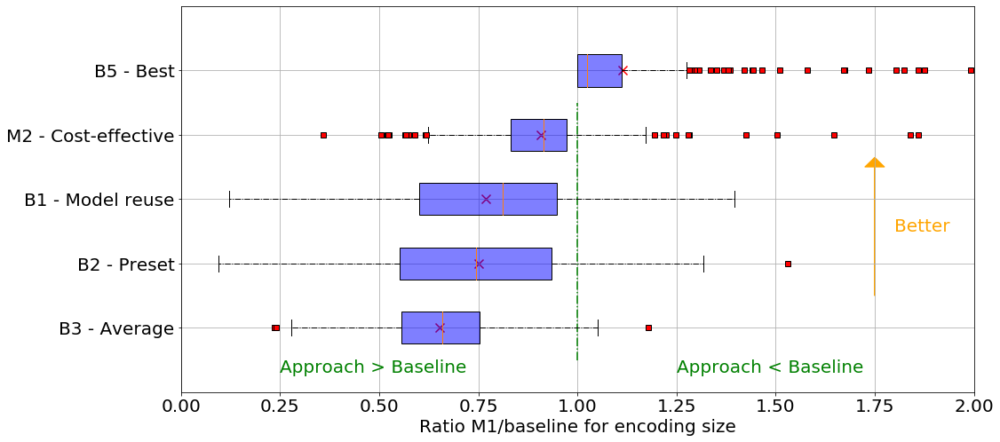
    


# Mean Absolute Rank error


```python
inputec_mar = []
avg_mar = []
val_compromise_mar = []
val_mins_mar = []
val_model_reuse_mar = []
cost_eff_mar = []
for ti in test_index:
    index_video = np.where(np.array([v[:-4] for v in v_names], str)==ti)[0][0]
    config_pred_rank = []
    config_pred_rank_ce = []
    for i in range(nb_config):
        video_prop = list(meta_perf.loc[ti][1:])
        for vc in val_config.loc[i]:
            video_prop.append(vc)
        tab = np.array(video_prop, float).reshape(1,33)
        rank_prediction = clf.predict(tab)
        config_pred_rank.append(rank_prediction)
        rank_prediction_ce = clf_ce.predict(tab)
        config_pred_rank_ce.append(rank_prediction_ce)
    val_min = listVideo[index_video].loc[np.argmin(config_pred_rank)][predDimension]
    val_min_ce = listVideo[index_video].loc[np.argmin(config_pred_rank_ce)][predDimension]
    inputec_mar.append(val_min)
    avg_mar.append(np.mean(listVideo[index_video][predDimension]))
    val_compromise_mar.append(listVideo[index_video][predDimension][best_compromise])
    val_model_reuse_mar.append(listVideo[index_video][predDimension][index_b4_config])
    val_mins_mar.append(np.min(listVideo[index_video][predDimension]))
    cost_eff_mar.append(val_min_ce)
```


```python
def find_rank(listSizes, stop, val):
    rank = 0
    while val > sorted_sizes[rank] and rank < stop:
        rank+=1
    return rank

res_rank_inputec = []
res_rank_avg = []
res_rank_compromise = []
res_rank_model_reuse = []
res_rank_mins_mar = []
res_rank_cost_eff_mar = []
for i in range(len(test_index)):
    ti = test_index[i]
    index_video = np.where(np.array([v[:-4] for v in v_names], str)==ti)[0][0]
    sizes = np.array(listVideo[index_video][predDimension], int)
    sorted_sizes = sorted(sizes)
    res_rank_inputec.append(find_rank(sorted_sizes, nb_config-1, inputec_mar[i]))
    res_rank_avg.append(find_rank(sorted_sizes, nb_config-1, avg_mar[i]))
    res_rank_compromise.append(find_rank(sorted_sizes, nb_config-1, val_compromise_mar[i]))
    res_rank_model_reuse.append(find_rank(sorted_sizes, nb_config-1, val_model_reuse_mar[i]))
    res_rank_mins_mar.append(find_rank(sorted_sizes, nb_config-1, val_mins_mar[i]))
    res_rank_cost_eff_mar.append(find_rank(sorted_sizes, nb_config-1, cost_eff_mar[i]))
```


```python
res_rank_val_min
```


    [7, 1, 3, 84, 11]


```python
pd.Series(res_rank_inputec).describe()
```


    count    350.000000
    mean      13.091429
    std       25.345920
    min        0.000000
    25%        0.000000
    50%        1.000000
    75%       14.000000
    max      155.000000
    dtype: float64


```python
pd.Series(res_rank_avg).describe()
```


    count    350.000000
    mean     129.568571
    std       11.462141
    min       95.000000
    25%      121.000000
    50%      130.000000
    75%      137.750000
    max      164.000000
    dtype: float64


```python
pd.Series(res_rank_compromise).describe()
```


    count    350.000000
    mean      85.651429
    std       56.122805
    min        0.000000
    25%       27.000000
    50%       98.000000
    75%      133.000000
    max      196.000000
    dtype: float64


```python
pd.Series(res_rank_model_reuse).describe()
```


    count    350.000000
    mean      76.497143
    std       54.564215
    min        0.000000
    25%       19.000000
    50%       87.000000
    75%      123.750000
    max      179.000000
    dtype: float64


```python
pd.Series(res_rank_mins_mar).describe()
```


    count    350.0
    mean       0.0
    std        0.0
    min        0.0
    25%        0.0
    50%        0.0
    75%        0.0
    max        0.0
    dtype: float64


```python
pd.Series(res_rank_cost_eff_mar).describe()
```


    count    350.000000
    mean      36.991429
    std       31.247280
    min        0.000000
    25%       11.250000
    50%       29.000000
    75%       54.000000
    max      156.000000
    dtype: float64


```python
box_res = np.transpose(pd.DataFrame({"mean" : res_rank_avg,
                                     "compromise" : res_rank_compromise,
                                     "model reuse" : res_rank_model_reuse,
                                     "cost eff" : res_rank_cost_eff_mar,
                                     "inputec" : res_rank_inputec,
                                     "min" : res_rank_mins_mar}))
red_square = dict(markerfacecolor='r', marker='s')
plt.figure(figsize=(16,8))
plt.grid()
plt.boxplot(box_res, flierprops=red_square, 
          vert=False, patch_artist=True, #widths=0.25,
          boxprops=dict(facecolor=(0,0,1,0.5),linewidth=1,edgecolor='k'),
          whiskerprops = dict(linestyle='-.',linewidth=1.0, color='black'))
plt.scatter(np.array([np.mean(box_res.iloc[i]) for i in range(5)]), np.arange(1, 6, 1), 
            marker="x", color = "red", alpha = 1, s = 100)
plt.ylim(0,7)
plt.xlim(0,200)
plt.xlabel("Ranking of configurations", size = 20)
#plt.ylabel("Baseline", size = 14)
plt.arrow(x = 175, y = 3.5, dx= 0, dy = 2, head_width = 4, head_length = .15, color="orange")
plt.text(s = "Better", x = 180, y = 4.5, size = 20, color = 'orange')
plt.arrow(x = 155, y = 6.25, dx= -30, dy = 0, head_width = .15, head_length = 3, color="orange")
plt.text(s = "Better", x = 130, y = 6.5, size = 20, color = 'orange')
plt.yticks([1, 2, 3, 4, 5, 6], 
           ['B3 - Average', 'B2 - Preset', 'B1 - Model reuse',  
            'M2 - Cost-effective', 'M1 - Inputec', 'B5 - Best'], 
           size=20)
plt.xticks(size=20)
plt.savefig("../../results/res_box_baseline_rank.png")
plt.show()
```


    
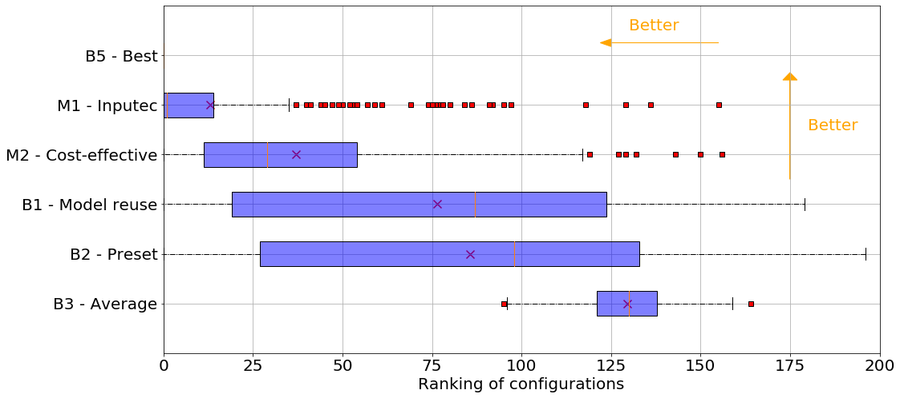
    


```python

```


```python

```


```python

```


```python

```


```python

```


```python

```


```python

```


```python

```

# Without input properties


```python
listFeatures = ["cabac", "ref", "deblock", "analyse", "me", "subme", "mixed_ref", "me_range", "trellis", 
                "8x8dct", "fast_pskip", "chroma_qp_offset", "bframes", "b_pyramid", 
                "b_adapt", "direct", "weightb", "open_gop", "weightp", "scenecut", "rc_lookahead", 
                "mbtree", "qpmax", "aq-mode"]
categorial = ['analyse', 'me', 'direct']
val_config = listVideo[0][listFeatures].replace(to_replace ="None",value='0')
val_config['deblock'] =[int(val[0]) for val in val_config['deblock']]

for col in val_config.columns:
    if col not in categorial:
        arr_col = np.array(val_config[col],int)
        arr_col = (arr_col-np.mean(arr_col))/(np.std(arr_col)+1e-5)
        val_config[col] = arr_col
    else:
        if col not in [predDimension,'ranking']:
            val_config[col] = [np.where(k==val_config[col].unique())[0][0] for k in val_config[col]]
            arr_col = np.array(val_config[col],int)
            arr_col = (arr_col-np.mean(arr_col))/(np.std(arr_col)+1e-5)
            val_config[col] = arr_col
```


```python
keep_vid = ['video'+str(np.where(np.array([v[:-4] for v in v_names], str)==ti)[0][0]) for ti in test_index]

best_compromise = np.argmin([np.sum(np.array(df[keep_vid].loc[i], int)) for i in range(df.shape[0])])
best_compromise
```


    190


```python
train_ind, test_ind = train_test_split([k for k in range(len(listVideo))], test_size = 0.25)
test_index = [v_names[k][:-4] for k in test_ind]
train_index = [v_names[k][:-4] for k in train_ind]

name_col = [] #list(meta_perf.columns)
for vcc in val_config.columns:
    name_col.append(vcc)
name_col.append("config_size")

nb_col = len(name_col)
nb_config = 201

def gen_dataset(inputs_names):

    res = pd.DataFrame(np.zeros(nb_config*len(inputs_names)*nb_col).reshape(nb_config*len(inputs_names), nb_col))
    res.columns = name_col

    for i in range(len(inputs_names)):
        video_name = inputs_names[i]
        #print(video_name)
        index_video = np.where(np.array([v[:-4] for v in v_names], str)==video_name)[0][0]
        sizes = listVideo[index_video][predDimension]
        sorted_config = sorted(range(len(sizes)), key=lambda k: sizes[k])
        moy = np.mean(sizes)
        std = np.std(sizes)
        for config_id in range(len(sorted_config)):
            val = list(val_config.loc[config_id])
            val.append((sizes[config_id]-moy)/std)
            res.loc[i*nb_config+config_id] = val
    return res

training_data = gen_dataset(train_index)
test_data = gen_dataset(test_index)

print("Training size : ", training_data.shape[0])
print("Test size : ", test_data.shape[0])

test_data
```

    Training size :  210447
    Test size :  70350


<div>
<style scoped>
    .dataframe tbody tr th:only-of-type {
        vertical-align: middle;
    }

    .dataframe tbody tr th {
        vertical-align: top;
    }

    .dataframe thead th {
        text-align: right;
    }
</style>
<table border="1" class="dataframe">
  <thead>
    <tr style="text-align: right;">
      <th></th>
      <th>cabac</th>
      <th>ref</th>
      <th>deblock</th>
      <th>analyse</th>
      <th>me</th>
      <th>subme</th>
      <th>mixed_ref</th>
      <th>me_range</th>
      <th>trellis</th>
      <th>8x8dct</th>
      <th>...</th>
      <th>direct</th>
      <th>weightb</th>
      <th>open_gop</th>
      <th>weightp</th>
      <th>scenecut</th>
      <th>rc_lookahead</th>
      <th>mbtree</th>
      <th>qpmax</th>
      <th>aq-mode</th>
      <th>config_size</th>
    </tr>
  </thead>
  <tbody>
    <tr>
      <th>0</th>
      <td>-1.463056</td>
      <td>-0.773348</td>
      <td>-1.551346</td>
      <td>-1.401072</td>
      <td>-1.202298</td>
      <td>-1.440666</td>
      <td>-1.156354</td>
      <td>-0.552443</td>
      <td>-0.959510</td>
      <td>-1.945643</td>
      <td>...</td>
      <td>-1.676144</td>
      <td>-2.038047</td>
      <td>0.0</td>
      <td>-1.652973</td>
      <td>-1.737814</td>
      <td>-1.112186</td>
      <td>-1.168183</td>
      <td>0.0</td>
      <td>-1.479994</td>
      <td>0.564461</td>
    </tr>
    <tr>
      <th>1</th>
      <td>0.683471</td>
      <td>-0.585615</td>
      <td>0.644573</td>
      <td>-0.474705</td>
      <td>-0.093757</td>
      <td>0.196886</td>
      <td>0.864752</td>
      <td>-0.552443</td>
      <td>0.202306</td>
      <td>0.513944</td>
      <td>...</td>
      <td>-0.333893</td>
      <td>0.490641</td>
      <td>0.0</td>
      <td>-0.339741</td>
      <td>-1.737814</td>
      <td>1.522974</td>
      <td>0.855996</td>
      <td>0.0</td>
      <td>0.675649</td>
      <td>-0.353534</td>
    </tr>
    <tr>
      <th>2</th>
      <td>0.683471</td>
      <td>-0.585615</td>
      <td>0.644573</td>
      <td>-0.474705</td>
      <td>-0.093757</td>
      <td>0.196886</td>
      <td>0.864752</td>
      <td>-0.552443</td>
      <td>0.202306</td>
      <td>0.513944</td>
      <td>...</td>
      <td>1.008358</td>
      <td>0.490641</td>
      <td>0.0</td>
      <td>-0.339741</td>
      <td>-1.737814</td>
      <td>-0.672993</td>
      <td>0.855996</td>
      <td>0.0</td>
      <td>-1.479994</td>
      <td>-1.739351</td>
    </tr>
    <tr>
      <th>3</th>
      <td>0.683471</td>
      <td>-0.585615</td>
      <td>-1.551346</td>
      <td>0.451661</td>
      <td>1.014784</td>
      <td>0.196886</td>
      <td>0.864752</td>
      <td>-0.552443</td>
      <td>0.202306</td>
      <td>0.513944</td>
      <td>...</td>
      <td>-0.333893</td>
      <td>0.490641</td>
      <td>0.0</td>
      <td>-0.339741</td>
      <td>-1.737814</td>
      <td>-0.672993</td>
      <td>0.855996</td>
      <td>0.0</td>
      <td>-1.479994</td>
      <td>-1.478025</td>
    </tr>
    <tr>
      <th>4</th>
      <td>0.683471</td>
      <td>2.042646</td>
      <td>0.644573</td>
      <td>-0.474705</td>
      <td>-0.093757</td>
      <td>0.196886</td>
      <td>0.864752</td>
      <td>1.810132</td>
      <td>0.202306</td>
      <td>0.513944</td>
      <td>...</td>
      <td>1.008358</td>
      <td>0.490641</td>
      <td>0.0</td>
      <td>-0.339741</td>
      <td>0.575435</td>
      <td>0.205394</td>
      <td>-1.168183</td>
      <td>0.0</td>
      <td>0.675649</td>
      <td>1.995439</td>
    </tr>
    <tr>
      <th>...</th>
      <td>...</td>
      <td>...</td>
      <td>...</td>
      <td>...</td>
      <td>...</td>
      <td>...</td>
      <td>...</td>
      <td>...</td>
      <td>...</td>
      <td>...</td>
      <td>...</td>
      <td>...</td>
      <td>...</td>
      <td>...</td>
      <td>...</td>
      <td>...</td>
      <td>...</td>
      <td>...</td>
      <td>...</td>
      <td>...</td>
      <td>...</td>
    </tr>
    <tr>
      <th>70345</th>
      <td>0.683471</td>
      <td>-0.585615</td>
      <td>0.644573</td>
      <td>-0.474705</td>
      <td>-0.093757</td>
      <td>-0.348964</td>
      <td>0.864752</td>
      <td>-0.552443</td>
      <td>-0.959510</td>
      <td>0.513944</td>
      <td>...</td>
      <td>1.008358</td>
      <td>0.490641</td>
      <td>0.0</td>
      <td>-0.339741</td>
      <td>0.575435</td>
      <td>-0.233799</td>
      <td>0.855996</td>
      <td>0.0</td>
      <td>0.675649</td>
      <td>-0.451074</td>
    </tr>
    <tr>
      <th>70346</th>
      <td>0.683471</td>
      <td>-0.585615</td>
      <td>-1.551346</td>
      <td>-0.474705</td>
      <td>-0.093757</td>
      <td>-0.348964</td>
      <td>-1.156354</td>
      <td>1.810132</td>
      <td>-0.959510</td>
      <td>0.513944</td>
      <td>...</td>
      <td>1.008358</td>
      <td>0.490641</td>
      <td>0.0</td>
      <td>-0.339741</td>
      <td>0.575435</td>
      <td>0.205394</td>
      <td>0.855996</td>
      <td>0.0</td>
      <td>0.675649</td>
      <td>-0.428456</td>
    </tr>
    <tr>
      <th>70347</th>
      <td>0.683471</td>
      <td>-0.022416</td>
      <td>0.644573</td>
      <td>-0.474705</td>
      <td>-0.093757</td>
      <td>0.196886</td>
      <td>0.864752</td>
      <td>-0.552443</td>
      <td>0.202306</td>
      <td>0.513944</td>
      <td>...</td>
      <td>-0.333893</td>
      <td>0.490641</td>
      <td>0.0</td>
      <td>-0.339741</td>
      <td>0.575435</td>
      <td>0.205394</td>
      <td>0.855996</td>
      <td>0.0</td>
      <td>0.675649</td>
      <td>-0.422442</td>
    </tr>
    <tr>
      <th>70348</th>
      <td>-1.463056</td>
      <td>-0.397882</td>
      <td>-1.551346</td>
      <td>1.378028</td>
      <td>-0.093757</td>
      <td>0.196886</td>
      <td>0.864752</td>
      <td>-0.552443</td>
      <td>0.202306</td>
      <td>0.513944</td>
      <td>...</td>
      <td>1.008358</td>
      <td>0.490641</td>
      <td>0.0</td>
      <td>0.973490</td>
      <td>0.575435</td>
      <td>0.205394</td>
      <td>-1.168183</td>
      <td>0.0</td>
      <td>0.675649</td>
      <td>-0.571553</td>
    </tr>
    <tr>
      <th>70349</th>
      <td>0.683471</td>
      <td>2.042646</td>
      <td>0.644573</td>
      <td>2.304395</td>
      <td>2.123325</td>
      <td>1.561513</td>
      <td>0.864752</td>
      <td>1.810132</td>
      <td>1.364123</td>
      <td>0.513944</td>
      <td>...</td>
      <td>-0.333893</td>
      <td>0.490641</td>
      <td>0.0</td>
      <td>0.973490</td>
      <td>0.575435</td>
      <td>1.522974</td>
      <td>0.855996</td>
      <td>0.0</td>
      <td>0.675649</td>
      <td>-0.487391</td>
    </tr>
  </tbody>
</table>
<p>70350 rows × 25 columns</p>
</div>


```python
X_train = np.array(training_data.drop(["config_size"],axis=1), float)
y_train = np.array(training_data["config_size"], float)

X_test = np.array(test_data.drop(["config_size"],axis=1), float)
y_test = np.array(test_data["config_size"], float)
```


```python
clf = RandomForestRegressor()

clf.fit(X_train,y_train)

y_pred = clf.predict(X_test)
```


```python
np.mean(np.abs(y_pred-y_test))
```


    0.400177029657703


```python
res_tot = []
val_mins = []
val_compromise = []
for ti in test_index:
    index_video = np.where(np.array([v[:-4] for v in v_names], str)==ti)[0][0]
    config_pred_size_argmin = np.argmin([clf.predict(np.array(val_config.loc[i], float).reshape(1,24)) 
                                         for i in range(nbconfig)])
    val_min = listVideo[index_video].loc[config_pred_size_argmin][predDimension]
    res_tot.append(val_min/np.mean(listVideo[index_video][predDimension]))
    val_compromise.append(val_min/listVideo[index_video][predDimension][best_compromise])
    val_mins.append(val_min/np.min(listVideo[index_video][predDimension]))
```


```python
pd.Series(res_tot).describe()
```


    count    350.000000
    mean       0.688135
    std        0.144639
    min        0.211904
    25%        0.586034
    50%        0.707432
    75%        0.800126
    max        1.010669
    dtype: float64


```python
pd.Series(val_compromise).describe()
```


    count    350.000000
    mean       0.801963
    std        0.276459
    min        0.127441
    25%        0.606119
    50%        0.769391
    75%        0.996270
    max        1.640434
    dtype: float64


```python
pd.Series(val_mins).describe()
```


    count    350.000000
    mean       1.175885
    std        0.276378
    min        1.000000
    25%        1.000000
    50%        1.063573
    75%        1.230086
    max        2.847471
    dtype: float64


```python
box_res = np.transpose(pd.DataFrame({"mean" : res_tot, 
              "min": val_mins,
            "compromise" : val_compromise,}))

red_square = dict(markerfacecolor='r', marker='s')
plt.figure(figsize=(15,8))
plt.grid()
plt.boxplot(box_res, flierprops=red_square, 
          vert=False, patch_artist=True, #widths=0.25,
          boxprops=dict(facecolor=(0,0,1,0.5),linewidth=1,edgecolor='k'),
          whiskerprops = dict(linestyle='-.',linewidth=1.0, color='black'))
plt.savefig("../../results/res_box_baseline.png")
plt.ylim(0,4)
plt.xlim(0,2)
plt.xlabel("Size - ratio approach/baseline", size = 14)
plt.ylabel("Baseline", size = 14)
plt.yticks([1, 2, 3], ['B1- Random','B2 - Compromise', 'B3 - Best'])
plt.show()
```


    
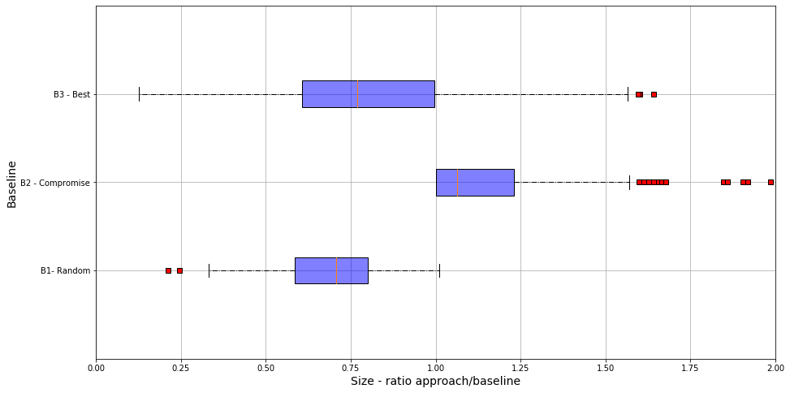
    


```python
sns.set_style('whitegrid')
sns.kdeplot(np.array(res_tot), bw=0.5, label="B1")
print("Shapiro-wilk B1 : ", shapiro(np.array(res_tot)))
sns.kdeplot(np.array(val_mins), bw=0.5, label ="B2")
print("Shapiro-wilk B2 : ", shapiro(np.array(val_mins)))
sns.kdeplot(np.array(val_compromise), bw=0.5, label="B3")
print("Shapiro-wilk B3 : ", shapiro(np.array(val_compromise)))
plt.show()
```

    Shapiro-wilk B1 :  (0.980633020401001, 0.0001186790905194357)
    Shapiro-wilk B2 :  (0.6616829633712769, 8.193078546746318e-26)
    Shapiro-wilk B3 :  (0.9868126511573792, 0.0028308096807450056)


    
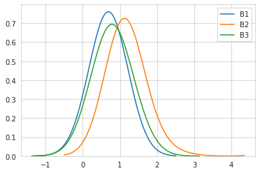
    


```python
print("Shapiro-wilk B2 : ", shapiro(np.random.normal(1,2,1000)))
```

    Shapiro-wilk B2 :  (0.9981587529182434, 0.35559362173080444)


```python

```


```python

```


```python

```


```python

```


```python

```


```python

```


```python

```


```python

```


```python

```


```python

```


```python

```


```python

```

# OLD

## Just with the minimal amount of information; input properties -> min ranking


```python
meta_perf["min_rank"] = [np.argmin(listVideo[np.where(np.array([v[:-4] 
                                                            for v in v_names], 
                                                               str)==meta_perf.index[k])[0][0]][predDimension])
                        for k in range(meta_perf.shape[0])]
```


```python
X = meta_perf.drop("min_rank", axis=1)
y = meta_perf["min_rank"]

X_train, X_test, y_train, y_test = train_test_split(X, y, test_size = 0.3)
clf = RandomForestRegressor(n_estimators=200)
clf.fit(X_train, y_train)

y_pred = clf.predict(X_test)

print(np.mean(np.abs(y_pred-y_test)))

pd.Series(y).describe()
```

    39.42539285714286


    count    1397.000000
    mean      136.461704
    std        51.959658
    min         2.000000
    25%       104.000000
    50%       168.000000
    75%       169.000000
    max       196.000000
    Name: min_rank, dtype: float64


```python
res_tot = []
for ti in test_index:
    index_video = np.where(np.array([v[:-4] for v in v_names], str)==ti)[0][0]
    config_pred_rank = []
    video_prop = list(meta_perf.loc[ti][:-1])
    tab = np.array(video_prop, float).reshape(1,10)
    rank_prediction = clf.predict(tab)
    val_min = listVideo[index_video].iloc[int(np.round(rank_prediction))][predDimension]
    res_tot.append(val_min/np.mean(listVideo[index_video][predDimension]))
print(np.mean(res_tot))
```

    0.9695475075307184


```python

```


```python

```


```python

```


```python

```

### Learning the encoding size

 #### 1. Aggregation

#input properties name
input_prop = ['SLEEQ_DMOS', 'BANDING_DMOS', 'WIDTH', 'HEIGHT', 
              'SPATIAL_COMPLEXITY', 'TEMPORAL_COMPLEXITY', 'CHUNK_COMPLEXITY_VARIATION', 'COLOR_COMPLEXITY']

#list of software features
listFeatures = ["cabac", "ref", "deblock", "analyse", "me", "subme", "mixed_ref", "me_range", 
                "trellis", "8x8dct", "fast_pskip", "chroma_qp_offset", "bframes", "b_pyramid", 
                "b_adapt", "direct", "weightb", "open_gop", "weightp", "scenecut", "rc_lookahead", 
                "mbtree", "qpmax", "aq-mode"]

#we add the dimension to predict, here the encoding size of the output video
to_keep = [k for k in listFeatures]
to_keep.append(predDimension)

#the categorial feature we have to transform
categorial = ['analyse', 'me', 'direct']

#here, 1 config = 1 set of input properties + 1 software configuration options set
configs = []

#we aggregate the different input video csvs
for input_index in range(len(v_names)):
    input_name = v_names[input_index][:-4]
    input_data = listVideo[input_index][to_keep].replace(to_replace ="None",value='0')
    input_data['deblock'] =[int(val[0]) for val in input_data['deblock']]
    for col in input_data.columns:
        if col not in categorial:
            arr_col = np.array(input_data[col],int)
            arr_col = (arr_col-np.mean(arr_col))/(np.std(arr_col)+1e-5)
            input_data[col] = arr_col
        else:
            input_data[col] = [np.where(k==input_data[col].unique())[0][0] for k in input_data[col]]
            arr_col = np.array(input_data[col],int)
            arr_col = (arr_col-np.mean(arr_col))/(np.std(arr_col)+1e-5)
            input_data[col] = arr_col
    for i in range(len(input_data.index)):
        configs.append(tuple(meta_perf.loc[input_name].loc[input_prop])+tuple(input_data.loc[i]))

df = pd.DataFrame(configs)
df.columns = tuple(input_prop)+tuple(to_keep)
df

clf = RandomForestRegressor(n_estimators=200)
X = df.drop([predDimension],axis=1)
y = df[predDimension]
X_train, X_test, y_train, y_test = train_test_split(X, y, test_size=0.3)
clf.fit(X_train, y_train)

y_pred = clf.predict(X_test)

def median_absolute_percentage_error(y_true, y_pred): 
    y_true, y_pred = np.array(y_true), np.array(y_pred)
    return np.median(np.abs((y_true - y_pred) / y_true)) * 100

median_absolute_percentage_error(y_test, y_pred)

def mean_absolute_error(y_true, y_pred):
    y_true, y_pred = np.array(y_true), np.array(y_pred)
    return np.mean(np.abs(y_true - y_pred))

mean_absolute_error(y_test, y_pred)

s = pd.Series(clf.feature_importances_)
s.index = tuple(input_prop)+tuple(listFeatures)
s

#### 2.  Video per video

def compute_accuracies(listVid, id_short=None):
    
    if not id_short:
        id_short = np.arange(0,len(listVid),1)
        
    listAccuracies = []

    for id_video in range(len(listVid)):

        acc_vid = []
        df = listVid[id_video][to_keep].replace(to_replace ="None",value='0')
        
        df['deblock'] =[int(val[0]) for val in df['deblock']]
        
        for col in df.columns:
            if col not in categorial:
                arr_col = np.array(df[col],int)
                arr_col = (arr_col-np.mean(arr_col))/(np.std(arr_col)+1e-5)
                df[col] = arr_col
            else:
                df[col] = [np.where(k==df[col].unique())[0][0] for k in df[col]]
                arr_col = np.array(df[col],int)
                arr_col = (arr_col-np.mean(arr_col))/(np.std(arr_col)+1e-5)
                df[col] = arr_col
        
        X = df.drop([predDimension], axis=1)
        y = df[predDimension]
            
        clf = RandomForestRegressor(n_estimators=200)

        X_train, X_test, y_train, y_test = train_test_split(X, y, test_size=0.3)

        clf.fit(X_train, y_train)

        y_pred = clf.predict(X_test)
        
        listAccuracies.append(median_absolute_percentage_error(y_test, y_pred))

    return listAccuracies

res = compute_accuracies(listVideo)

np.median(res)


```python

```


```python

```


```python

```


```python

```


```python

```

#### Tune table


```python
for i in range(len(v_names)):
    #i=0
    v = v_names[1][:-4]
    if v in meta_perf.index:
        meta_data = meta_perf.loc[v]
        vid = listVideo[i]
        sizes = vid[predDimension]
        listVideo[i]["order"] = sorted(range(len(sizes)), key=lambda k: sizes[k])
vid.groupby("cabac").mean()["order"]
```


    cabac
    0     95.812500
    1    101.956204
    Name: order, dtype: float64


```python
list_properties = ['SLEEQ_DMOS', 'BANDING_DMOS', 'WIDTH', 'HEIGHT', 
                   'SPATIAL_COMPLEXITY', 'TEMPORAL_COMPLEXITY', 
                   'CHUNK_COMPLEXITY_VARIATION', 'COLOR_COMPLEXITY']
listFeatures = ["cabac", "ref", "deblock", "analyse", "me", "subme", "mixed_ref", 
                "me_range", "trellis", "8x8dct", "fast_pskip", "chroma_qp_offset", "bframes", 
                "b_pyramid", "b_adapt", "direct", "weightb", "open_gop", "weightp", "scenecut", 
                "rc_lookahead", "mbtree", "qpmax", "aq-mode"]

list_video_train, list_video_test = train_test_split(v_names, test_size=0.3)

vid = listVideo[0]

feature_labels = dict()

for lf in listFeatures:
    feature_labels[lf] = tuple(vid.groupby(lf).mean()["order"].index)

prop = dict()

for index_prop in range(len(list_properties)):
    prop_name = list_properties[index_prop]
    # get all input properties
    var = meta_perf[prop_name]
    # separate videos into 4 classes delimited by perc 25%, 50%, 75%
    prop[prop_name] = [np.percentile(var, 25), np.median(var), np.percentile(var, 75)]

vid_prop = dict()

for i in range(len(v_names)):
    # each input name
    v = v_names[i][:-4]
    # without .csv
    if v in meta_perf.index:
        vid = meta_perf.loc[v]
        prop_indexes = []
        for index_prop in range(len(list_properties)):
            prop_name = list_properties[index_prop]
            ref_quartile_prop = prop[prop_name]
            index_quartile = 0
            break_cond = False
            while index_quartile < 3 and not break_cond:
                if vid[prop_name] > ref_quartile_prop[index_quartile]:
                    index_quartile+=1
                else:
                    break_cond = True
            prop_indexes.append(index_quartile)
        #prop_indexes.append(v.split('_')[0])
        vid_prop[v] = prop_indexes 
#print(vid_prop)

tune_table = dict()

for p in range(len(list_properties)):
    for f in listFeatures:
        for p_index in range(4):
            list_video_pf = [tuple(listVideo[k].groupby(f).mean()["order"])
                           for k in range(len(v_names)) if v_names[k][:-4] in meta_perf.index 
                             and v_names[k] in list_video_train
                           and vid_prop[v_names[k][:-4]][p] == p_index]
            tune_table_element = []
            for j in range(len(list_video_pf[0])):
                tune_table_element.append(np.mean([k[j] for k in list_video_pf]))
            tune_table[(f, list_properties[p], p_index)] = tune_table_element
tune_table
```


    {('cabac', 'SLEEQ_DMOS', 0): [98.44045064377683, 100.72854860436703],
     ('cabac', 'SLEEQ_DMOS', 1): [98.98197115384616, 100.47557551937113],
     ('cabac', 'SLEEQ_DMOS', 2): [99.35553385416667, 100.30106447688564],
     ('cabac', 'SLEEQ_DMOS', 3): [99.49896643968872, 100.2340594734301],
     ('ref', 'SLEEQ_DMOS', 0): [97.08798283261804,
      102.94710931582935,
      107.83004291845494,
      108.65858369098713,
      120.44349070100144,
      88.38340486409156,
      94.70701842968948],
     ('ref', 'SLEEQ_DMOS', 1): [99.66475120804493,
      99.241366992141,
      106.01201079622132,
      107.22408906882592,
      111.48178137651821,
      90.15002249212776,
      96.01738509168848],
     ('ref', 'SLEEQ_DMOS', 2): [100.33877688172042,
      100.3513480392157,
      104.50402777777778,
      104.71499999999999,
      110.09027777777779,
      87.52708333333334,
      97.99620098039216],
     ('ref', 'SLEEQ_DMOS', 3): [101.25611899083721,
      101.10963607232776,
      102.87016861219195,
      104.85875486381323,
      108.45395590142672,
      86.80782533506269,
      97.44735637445639],
     ('deblock', 'SLEEQ_DMOS', 0): [100.2734414781407, 99.88638699147675],
     ('deblock', 'SLEEQ_DMOS', 1): [101.45103959376931, 99.39710326737755],
     ('deblock', 'SLEEQ_DMOS', 2): [102.24533898305086, 99.06707746478872],
     ('deblock', 'SLEEQ_DMOS', 3): [100.94572314185847, 99.60705869457993],
     ('analyse', 'SLEEQ_DMOS', 0): [97.57955242182712,
      103.31965665236051,
      99.64400756841572,
      93.40937603169364,
      102.46586960964643],
     ('analyse', 'SLEEQ_DMOS', 1): [99.44375361480624,
      102.74315789473684,
      98.71755691959426,
      96.24976642790406,
      102.7384808174282],
     ('analyse', 'SLEEQ_DMOS', 2): [101.82633928571428,
      101.04416666666665,
      97.28288530465949,
      101.22051282051281,
      103.79960317460318],
     ('analyse', 'SLEEQ_DMOS', 3): [100.31197887715398,
      99.09603112840468,
      98.54692272289863,
      101.00029931158335,
      103.23800259403374],
     ('me', 'SLEEQ_DMOS', 0): [99.70577866339669,
      103.2350023843586,
      97.68073438245112,
      93.70467463171326],
     ('me', 'SLEEQ_DMOS', 1): [101.87984384037016,
      101.10706252811516,
      97.2399910031489,
      95.80468322573586],
     ('me', 'SLEEQ_DMOS', 2): [102.22254464285716,
      100.4426388888889,
      102.81180555555557,
      94.19155405405405],
     ('me', 'SLEEQ_DMOS', 3): [102.61902445803224,
      100.58292261132728,
      102.18785127539992,
      93.55379114523085],
     ('subme', 'SLEEQ_DMOS', 0): [99.79935622317596,
      95.29782342121398,
      101.37489270386266,
      96.84904543436437,
      111.76716738197425,
      113.14434154054663,
      97.02119098712447,
      91.81016837240013,
      97.35925271396111,
      95.44680370454032],
     ('subme', 'SLEEQ_DMOS', 1): [102.24655870445345,
      97.74696356275304,
      101.53522267206479,
      92.92642747452186,
      110.55910931174088,
      107.97187300234391,
      98.19913967611336,
      94.0588601681719,
      99.2803048344844,
      97.27466439377797],
     ('subme', 'SLEEQ_DMOS', 2): [103.45104166666667,
      99.8075892857143,
      99.12354166666667,
      93.88448275862068,
      109.18895833333333,
      107.42872807017544,
      95.30234375,
      92.19038461538462,
      96.83529411764705,
      101.93728070175439],
     ('subme', 'SLEEQ_DMOS', 3): [102.084046692607,
      100.58476931628682,
      102.18151750972763,
      95.436602710318,
      107.01108949416343,
      104.82674585295925,
      96.87791828793775,
      90.79616881173301,
      96.40901808194096,
      101.54597583452797],
     ('mixed_ref', 'SLEEQ_DMOS', 0): [96.16558538776324, 102.86747527523792],
     ('mixed_ref', 'SLEEQ_DMOS', 1): [96.53172959231712, 102.5936630874846],
     ('mixed_ref', 'SLEEQ_DMOS', 2): [96.92315891472869, 102.3009420289855],
     ('mixed_ref', 'SLEEQ_DMOS', 3): [98.08524115464662, 101.43190661478597],
     ('me_range', 'SLEEQ_DMOS', 0): [100.18638871857756, 99.38927951785226],
     ('me_range', 'SLEEQ_DMOS', 1): [100.17834796782167, 99.41562580756312],
     ('me_range', 'SLEEQ_DMOS', 2): [100.08704004329005, 99.714804964539],
     ('me_range', 'SLEEQ_DMOS', 3): [100.03519632118855, 99.88467588376521],
     ('trellis', 'SLEEQ_DMOS', 0): [97.6632934266998,
      114.0549542825154,
      92.92432045779687],
     ('trellis', 'SLEEQ_DMOS', 1): [97.74072022160665,
      110.81886991726809,
      95.28272604588393],
     ('trellis', 'SLEEQ_DMOS', 2): [97.98359649122807,
      110.02635869565216,
      95.5057638888889],
     ('trellis', 'SLEEQ_DMOS', 3): [99.28097481056727,
      107.34596514972085,
      95.50654993514917],
     ('8x8dct', 'SLEEQ_DMOS', 0): [104.04036378499899, 98.93273409452856],
     ('8x8dct', 'SLEEQ_DMOS', 1): [104.87468671679197, 98.71234690499834],
     ('8x8dct', 'SLEEQ_DMOS', 2): [105.37271825396826, 98.58079140461217],
     ('8x8dct', 'SLEEQ_DMOS', 3): [103.9461738002594, 98.957614467856],
     ('fast_pskip', 'SLEEQ_DMOS', 0): [96.58052319640304, 100.90325802359165],
     ('fast_pskip', 'SLEEQ_DMOS', 1): [98.6554848660112, 100.35515494105367],
     ('fast_pskip', 'SLEEQ_DMOS', 2): [99.98164682539684, 100.00484800838575],
     ('fast_pskip', 'SLEEQ_DMOS', 3): [100.11450806003336, 99.96975258791572],
     ('chroma_qp_offset', 'SLEEQ_DMOS', 0): [100.8029370701691, 99.4352222303048],
     ('chroma_qp_offset', 'SLEEQ_DMOS', 1): [100.8739085898249, 99.38530158512316],
     ('chroma_qp_offset', 'SLEEQ_DMOS', 2): [100.76345381526104, 99.4629943502825],
     ('chroma_qp_offset', 'SLEEQ_DMOS', 3): [99.79785289015986,
      100.14218822132823],
     ('bframes', 'SLEEQ_DMOS', 0): [95.54494838185825,
      101.20026124276917,
      99.77879113018598,
      101.28463519313304],
     ('bframes', 'SLEEQ_DMOS', 1): [97.13808950651055,
      101.06875550079212,
      98.1656545209177,
      101.08032388663969],
     ('bframes', 'SLEEQ_DMOS', 2): [97.18096846846848,
      100.63003623188406,
      96.68767361111112,
      104.45383333333332],
     ('bframes', 'SLEEQ_DMOS', 3): [95.69018824271741,
      100.4229064456099,
      100.4022373540856,
      104.0470038910506],
     ('b_pyramid', 'SLEEQ_DMOS', 0): [96.18884120171674,
      101.13451474456596,
      96.17472328890896],
     ('b_pyramid', 'SLEEQ_DMOS', 1): [93.24848178137651,
      100.9438683557529,
      97.57138291071809],
     ('b_pyramid', 'SLEEQ_DMOS', 2): [92.09270833333333,
      100.9644623655914,
      97.73070175438598],
     ('b_pyramid', 'SLEEQ_DMOS', 3): [96.99513618677042,
      101.10894941634241,
      96.10925660454637],
     ('b_adapt', 'SLEEQ_DMOS', 0): [104.62635266497928,
      91.99050315039722,
      95.54494838185825],
     ('b_adapt', 'SLEEQ_DMOS', 1): [103.2598705837572,
      94.13799638211732,
      97.13808950651055],
     ('b_adapt', 'SLEEQ_DMOS', 2): [102.76940883190883,
      95.32517730496453,
      97.18096846846848],
     ('b_adapt', 'SLEEQ_DMOS', 3): [103.17436562572748,
      95.4906863150923,
      95.69018824271741],
     ('direct', 'SLEEQ_DMOS', 0): [95.29834125971465,
      104.2726061861773,
      97.43174850900174],
     ('direct', 'SLEEQ_DMOS', 1): [96.8976912134807,
      102.90879054399926,
      98.20416425679583],
     ('direct', 'SLEEQ_DMOS', 2): [97.3712837837838,
      102.6712643678161,
      98.24496753246754],
     ('direct', 'SLEEQ_DMOS', 3): [95.92291513303186,
      103.36066013685763,
      98.16200919702865],
     ('weightb', 'SLEEQ_DMOS', 0): [101.09367880040269, 95.4570265214042],
     ('weightb', 'SLEEQ_DMOS', 1): [100.69110811216073, 97.1292432264092],
     ('weightb', 'SLEEQ_DMOS', 2): [100.70699588477368, 97.06324786324785],
     ('weightb', 'SLEEQ_DMOS', 3): [101.06499495604554, 95.57617479796468],
     ('open_gop', 'SLEEQ_DMOS', 0): [101.06024381895259, 95.45211203975603],
     ('open_gop', 'SLEEQ_DMOS', 1): [100.6629740940364, 97.15619007031749],
     ('open_gop', 'SLEEQ_DMOS', 2): [100.62883435582823, 97.30263157894736],
     ('open_gop', 'SLEEQ_DMOS', 3): [100.94273232913991, 95.95617448289985],
     ('weightp', 'SLEEQ_DMOS', 0): [95.28997468911632,
      103.2963791331681,
      99.44668207329151],
     ('weightp', 'SLEEQ_DMOS', 1): [97.0943631267518,
      102.0702514683241,
      99.63002180006228],
     ('weightp', 'SLEEQ_DMOS', 2): [97.03418803418802,
      102.3212441314554,
      99.45998168498167],
     ('weightp', 'SLEEQ_DMOS', 3): [95.46353387209419,
      103.52863484408397,
      99.19108906657544],
     ('scenecut', 'SLEEQ_DMOS', 0): [98.83743540334589,
      100.31742602961658,
      109.0343347639485],
     ('scenecut', 'SLEEQ_DMOS', 1): [99.73684210526316,
      100.03107488537951,
      108.20242914979757],
     ('scenecut', 'SLEEQ_DMOS', 2): [99.81590136054423,
      100.02786975717439,
      104.8125],
     ('scenecut', 'SLEEQ_DMOS', 3): [98.64345271182403,
      100.44296132141109,
      99.58365758754864],
     ('rc_lookahead', 'SLEEQ_DMOS', 0): [100.3301761136599,
      98.34628416534899,
      116.21798057375197,
      111.04334763948498,
      99.55500338829908,
      92.85052115266708,
      95.85872675250357],
     ('rc_lookahead', 'SLEEQ_DMOS', 1): [99.16180371352787,
      95.9737907521841,
      111.75601960366502,
      107.0757085020243,
      100.50543362454721,
      95.0362058993638,
      98.33427800269905],
     ('rc_lookahead', 'SLEEQ_DMOS', 2): [96.56709770114942,
      97.36535087719297,
      111.21271929824562,
      107.21854166666667,
      98.93092105263159,
      96.31130952380954,
      99.02694444444445],
     ('rc_lookahead', 'SLEEQ_DMOS', 3): [100.6523547564739,
      98.0839647757526,
      108.26295310260086,
      105.93073929961088,
      97.55764898627892,
      96.66303501945526,
      98.41789883268483],
     ('mbtree', 'SLEEQ_DMOS', 0): [98.09305730876042, 101.39732869616691],
     ('mbtree', 'SLEEQ_DMOS', 1): [99.33984281971898, 100.48373586486109],
     ('mbtree', 'SLEEQ_DMOS', 2): [99.24558823529411, 100.55280172413792],
     ('mbtree', 'SLEEQ_DMOS', 3): [99.21391622796979, 100.57600966053937],
     ('qpmax', 'SLEEQ_DMOS', 0): [100.0],
     ('qpmax', 'SLEEQ_DMOS', 1): [100.0],
     ('qpmax', 'SLEEQ_DMOS', 2): [100.0],
     ('qpmax', 'SLEEQ_DMOS', 3): [100.0],
     ('aq-mode', 'SLEEQ_DMOS', 0): [99.53191634307512, 100.21369036511787],
     ('aq-mode', 'SLEEQ_DMOS', 1): [100.96491228070174, 99.55949656750572],
     ('aq-mode', 'SLEEQ_DMOS', 2): [101.09722222222221, 99.49909420289855],
     ('aq-mode', 'SLEEQ_DMOS', 3): [100.4146130566364, 99.81072012631816],
     ('cabac', 'BANDING_DMOS', 0): [98.723822167756, 100.59617066615779],
     ('cabac', 'BANDING_DMOS', 1): [99.60620777027027, 100.18396133359637],
     ('cabac', 'BANDING_DMOS', 2): [99.42537434895833, 100.26843826034063],
     ('cabac', 'BANDING_DMOS', 3): [99.31336805555556, 100.32076236820761],
     ('ref', 'BANDING_DMOS', 0): [98.40719657038443,
      101.32045367166474,
      106.42490922294844,
      107.09248366013071,
      114.35003631082064,
      89.7121762285161,
      95.92329873125722],
     ('ref', 'BANDING_DMOS', 1): [101.61050566695727,
      98.04531001589825,
      105.26171171171171,
      106.94662162162163,
      111.4054054054054,
      86.90690690690691,
      96.21422893481717],
     ('ref', 'BANDING_DMOS', 2): [102.0022681451613,
      99.70036764705883,
      103.31215277777778,
      105.91041666666666,
      111.03645833333333,
      86.69646990740739,
      96.3184742647059],
     ('ref', 'BANDING_DMOS', 3): [99.48534306195596,
      101.84477124183006,
      104.57791005291004,
      105.07063492063493,
      110.4920634920635,
      86.99118165784834,
      98.0329131652661],
     ('deblock', 'BANDING_DMOS', 0): [100.875669288431, 99.63616557734204],
     ('deblock', 'BANDING_DMOS', 1): [101.81333027943197, 99.24657403882755],
     ('deblock', 'BANDING_DMOS', 2): [102.1604872881356, 99.10233274647885],
     ('deblock', 'BANDING_DMOS', 3): [101.0044390637611, 99.5826626425218],
     ('analyse', 'BANDING_DMOS', 0): [98.40180516651105,
      103.35198257080611,
      99.30379272378006,
      95.05982905982906,
      102.14093785662412],
     ('analyse', 'BANDING_DMOS', 1): [101.30598455598455,
      98.3972972972973,
      97.57744841615809,
      101.5031185031185,
      104.98230373230375],
     ('analyse', 'BANDING_DMOS', 2): [101.64713541666667,
      100.32208333333334,
      97.14840949820787,
      98.94991987179488,
      105.34945436507935],
     ('analyse', 'BANDING_DMOS', 3): [100.546910430839,
      99.9504761904762,
      98.4963304318143,
      101.76984126984127,
      102.44661753590324],
     ('me', 'BANDING_DMOS', 0): [100.17787114845937,
      101.8921084483176,
      98.72379569111594,
      95.74921980804334],
     ('me', 'BANDING_DMOS', 1): [104.68991312741312,
      99.93933933933934,
      99.48573573573573,
      93.29948867786706],
     ('me', 'BANDING_DMOS', 2): [104.26813616071428,
      100.51828703703704,
      100.0859375,
      92.23761261261261],
     ('me', 'BANDING_DMOS', 3): [101.40511621315191,
      101.26882716049383,
      102.46957671957674,
      93.58558558558558],
     ('subme', 'BANDING_DMOS', 0): [101.42516339869282,
      96.8255524431995,
      101.310348583878,
      94.61197505822254,
      111.16971677559914,
      108.72101823185415,
      98.21023965141612,
      93.9780459192224,
      98.70767653466615,
      96.3276000458663],
     ('subme', 'BANDING_DMOS', 1): [103.80337837837838,
      102.51061776061775,
      100.49932432432433,
      93.99021435228333,
      106.73243243243243,
      107.82432432432432,
      96.1579391891892,
      88.42515592515593,
      97.8489666136725,
      99.11237553342816],
     ('subme', 'BANDING_DMOS', 2): [103.4484375,
      101.36067708333333,
      101.03541666666668,
      94.12913074712644,
      108.69374999999998,
      107.43037280701755,
      95.1708984375,
      90.03445512820512,
      95.25551470588236,
      100.78426535087719],
     ('subme', 'BANDING_DMOS', 3): [101.08849206349205,
      97.86522108843539,
      100.84384920634922,
      95.72687465790914,
      108.18551587301587,
      108.12092731829574,
      95.89012896825396,
      91.74053724053724,
      96.77707749766574,
      102.89264828738513],
     ('mixed_ref', 'BANDING_DMOS', 0): [96.32132542939657, 102.75100880932082],
     ('mixed_ref', 'BANDING_DMOS', 1): [98.09600879949717, 101.42385428907168],
     ('mixed_ref', 'BANDING_DMOS', 2): [97.81601259689921, 101.63324275362321],
     ('mixed_ref', 'BANDING_DMOS', 3): [97.09569952011812, 102.17191166321601],
     ('me_range', 'BANDING_DMOS', 0): [100.2795461618991, 99.08404023547953],
     ('me_range', 'BANDING_DMOS', 1): [100.27395577395578, 99.10235767682575],
     ('me_range', 'BANDING_DMOS', 2): [100.24113906926407, 99.20988475177306],
     ('me_range', 'BANDING_DMOS', 3): [99.69258915687486, 101.00726106045256],
     ('trellis', 'BANDING_DMOS', 0): [97.61823185414518,
      111.56038647342996,
      94.90816993464054],
     ('trellis', 'BANDING_DMOS', 1): [98.32446657183499,
      109.96122209165688,
      95.01599099099099],
     ('trellis', 'BANDING_DMOS', 2): [99.39819078947369,
      109.69157608695652,
      93.52265625],
     ('trellis', 'BANDING_DMOS', 3): [98.26010860484544,
      109.27449965493443,
      95.6443783068783],
     ('8x8dct', 'BANDING_DMOS', 0): [103.79043469239548, 98.99875310012196],
     ('8x8dct', 'BANDING_DMOS', 1): [105.22104247104248, 98.62085670576236],
     ('8x8dct', 'BANDING_DMOS', 2): [105.99541170634922, 98.41630634171908],
     ('8x8dct', 'BANDING_DMOS', 3): [104.6499433106576, 98.77171308775083],
     ('fast_pskip', 'BANDING_DMOS', 0): [98.08009129577758, 100.507145695455],
     ('fast_pskip', 'BANDING_DMOS', 1): [101.1335263835264, 99.70057793642698],
     ('fast_pskip', 'BANDING_DMOS', 2): [99.22445436507935, 100.2048611111111],
     ('fast_pskip', 'BANDING_DMOS', 3): [99.37481103552533, 100.1651442547669],
     ('chroma_qp_offset', 'BANDING_DMOS', 0): [100.85468672073917,
      99.39882205236144],
     ('chroma_qp_offset', 'BANDING_DMOS', 1): [99.83979159882774,
      100.11268896014658],
     ('chroma_qp_offset', 'BANDING_DMOS', 2): [99.73017068273093,
      100.18979519774011],
     ('chroma_qp_offset', 'BANDING_DMOS', 3): [100.81578695735323,
      99.42618375033629],
     ('bframes', 'BANDING_DMOS', 0): [95.87658246481774,
      101.44878279814343,
      98.64161220043573,
      100.74230936819173],
     ('bframes', 'BANDING_DMOS', 1): [97.30715850986121,
      100.53901292596946,
      97.11655405405405,
      104.27405405405406],
     ('bframes', 'BANDING_DMOS', 2): [97.94453828828829,
      100.66363224637682,
      96.86848958333333,
      102.995625],
     ('bframes', 'BANDING_DMOS', 3): [95.86293436293437,
      99.8858868184955,
      100.95998677248676,
      105.72619047619048],
     ('b_pyramid', 'BANDING_DMOS', 0): [93.45152505446623,
      101.22863166772086,
      96.36710239651416],
     ('b_pyramid', 'BANDING_DMOS', 1): [94.11148648648648,
      100.8859633827376,
      97.62588904694168],
     ('b_pyramid', 'BANDING_DMOS', 2): [92.05403645833333,
      100.80551075268818,
      98.38719846491229],
     ('b_pyramid', 'BANDING_DMOS', 3): [98.97420634920636,
      100.91185355862775,
      96.49655388471179],
     ('b_adapt', 'BANDING_DMOS', 0): [103.70366646183639,
      94.02632920780604,
      95.87658246481774],
     ('b_adapt', 'BANDING_DMOS', 1): [103.44409794409793,
      93.54629097182288,
      97.30715850986121],
     ('b_adapt', 'BANDING_DMOS', 2): [103.46238425925925,
      92.99900265957446,
      97.94453828828829],
     ('b_adapt', 'BANDING_DMOS', 3): [102.9522792022792,
      95.90754812563323,
      95.86293436293437],
     ('direct', 'BANDING_DMOS', 0): [95.56980509921685,
      103.46467833621315,
      98.21415839062898],
     ('direct', 'BANDING_DMOS', 1): [98.03396639883127,
      103.01056228642435,
      97.54317304317306],
     ('direct', 'BANDING_DMOS', 2): [97.96311936936938,
      103.26251197318008,
      97.292545995671],
     ('direct', 'BANDING_DMOS', 3): [96.14907764907764,
      103.09250136836343,
      98.3563182848897],
     ('weightb', 'BANDING_DMOS', 0): [101.00462626751661, 95.82693704262333],
     ('weightb', 'BANDING_DMOS', 1): [100.61044377711045, 97.46431046431047],
     ('weightb', 'BANDING_DMOS', 2): [100.49260545267491, 97.95379273504273],
     ('weightb', 'BANDING_DMOS', 3): [101.06363903586126, 95.58180708180709],
     ('open_gop', 'BANDING_DMOS', 0): [100.97485865511848, 95.81836945304438],
     ('open_gop', 'BANDING_DMOS', 1): [100.57735035649145, 97.5234708392603],
     ('open_gop', 'BANDING_DMOS', 2): [100.44746932515336, 98.08059210526316],
     ('open_gop', 'BANDING_DMOS', 3): [100.9043480377836, 96.12082289055974],
     ('weightp', 'BANDING_DMOS', 0): [95.66487905703592,
      102.76393875233975,
      99.70142928966459],
     ('weightp', 'BANDING_DMOS', 1): [97.65835065835067,
      102.16140083745718,
      99.31719631719632],
     ('weightp', 'BANDING_DMOS', 2): [97.52297008547009,
      103.54489436619718,
      98.29578754578756],
     ('weightp', 'BANDING_DMOS', 3): [95.81705331705332,
      102.51648781578358,
      99.82927786499215],
     ('scenecut', 'BANDING_DMOS', 0): [98.8858209950647,
      100.2848547807644,
      111.58169934640523],
     ('scenecut', 'BANDING_DMOS', 1): [100.09873138444567,
      99.94979416502595,
      102.74324324324324],
     ('scenecut', 'BANDING_DMOS', 2): [100.31058673469387,
      99.88669288079468,
      101.890625],
     ('scenecut', 'BANDING_DMOS', 3): [98.87212504049239,
      100.38447387785138,
      97.21031746031746],
     ('rc_lookahead', 'BANDING_DMOS', 0): [99.39508677034033,
      98.12865497076024,
      113.32633872262355,
      108.04771241830066,
      101.11512441233803,
      94.38879551820729,
      96.90246913580248],
     ('rc_lookahead', 'BANDING_DMOS', 1): [98.66775396085741,
      94.98577524893312,
      106.32788051209104,
      107.66216216216216,
      98.5149359886202,
      95.01274131274133,
      101.05337837837837],
     ('rc_lookahead', 'BANDING_DMOS', 2): [98.01059626436783,
      97.09018640350877,
      110.79879385964914,
      107.04661458333334,
      95.9904057017544,
      95.3889880952381,
      100.07395833333334],
     ('rc_lookahead', 'BANDING_DMOS', 3): [99.88834154351395,
      97.15935672514621,
      111.26482873851293,
      107.7920634920635,
      98.03487886382625,
      96.80612244897958,
      97.27433862433861],
     ('mbtree', 'BANDING_DMOS', 0): [98.39566833269257, 101.17558785966493],
     ('mbtree', 'BANDING_DMOS', 1): [101.08267090620032, 99.20666356011183],
     ('mbtree', 'BANDING_DMOS', 2): [100.30808823529412, 99.77424568965517],
     ('mbtree', 'BANDING_DMOS', 3): [98.4391223155929, 101.1437465790914],
     ('qpmax', 'BANDING_DMOS', 0): [100.0],
     ('qpmax', 'BANDING_DMOS', 1): [100.0],
     ('qpmax', 'BANDING_DMOS', 2): [100.0],
     ('qpmax', 'BANDING_DMOS', 3): [100.0],
     ('aq-mode', 'BANDING_DMOS', 0): [100.49707784348307, 99.7730731584099],
     ('aq-mode', 'BANDING_DMOS', 1): [100.38803088803091, 99.82285546415982],
     ('aq-mode', 'BANDING_DMOS', 2): [100.99007936507935, 99.54800724637681],
     ('aq-mode', 'BANDING_DMOS', 3): [100.20710506424791, 99.90545203588682],
     ('cabac', 'WIDTH', 0): [98.38673349056604, 100.75364274893266],
     ('cabac', 'WIDTH', 1): [98.99193399705015, 100.47092134444371],
     ('cabac', 'WIDTH', 2): [99.77472933070867, 100.1052359330996],
     ('cabac', 'WIDTH', 3): [99.39666491596638, 100.28184996626385],
     ('ref', 'WIDTH', 0): [98.49817407181985,
      102.30788013318534,
      107.43786163522013,
      106.17358490566038,
      120.39622641509433,
      87.64234800838575,
      94.97902330743618],
     ('ref', 'WIDTH', 1): [99.54486630507185,
      101.20241193822662,
      105.53756145526059,
      105.84631268436581,
      112.03048180924287,
      87.89183874139626,
      96.65113656081901],
     ('ref', 'WIDTH', 2): [100.50749301498603,
      99.39323761000462,
      103.23753280839895,
      108.6234251968504,
      108.7729658792651,
      88.21391076115485,
      97.21769337656325],
     ('ref', 'WIDTH', 3): [100.55624830577393,
      100.03114186851211,
      103.8434173669468,
      103.14159663865544,
      104.05042016806723,
      90.33286647992531,
      98.47577854671282],
     ('deblock', 'WIDTH', 0): [100.9000319795331, 99.62604305075737],
     ('deblock', 'WIDTH', 1): [101.24973751312434, 99.48074286426524],
     ('deblock', 'WIDTH', 2): [101.4937942079274, 99.37933902628369],
     ('deblock', 'WIDTH', 3): [101.36519014385414, 99.43277310924368],
     ('analyse', 'WIDTH', 0): [98.60646900269542,
      101.4851320754717,
      98.82815987015621,
      96.24063860667636,
      103.80341419586703],
     ('analyse', 'WIDTH', 1): [99.31163084702906,
      103.29097345132743,
      98.52066482697369,
      95.8545495802133,
      103.05878634639694],
     ('analyse', 'WIDTH', 2): [101.158183352081,
      100.66440944881889,
      98.51066802133604,
      100.41701998788614,
      102.00112485939256],
     ('analyse', 'WIDTH', 3): [101.05552220888357,
      98.24672268907564,
      98.02575223637842,
      103.22430510665806,
      103.71348539415769],
     ('me', 'WIDTH', 0): [101.24555256064691,
      102.13220125786164,
      97.62976939203355,
      94.08148903620602],
     ('me', 'WIDTH', 1): [101.3201643489254,
      101.41350376925597,
      99.23893805309734,
      94.93390735868611],
     ('me', 'WIDTH', 2): [102.35559617547806,
      100.55319335083115,
      102.27340332458442,
      93.98318791232177],
     ('me', 'WIDTH', 3): [101.90201080432175,
      100.82791783380019,
      102.71988795518209,
      93.7842380195321],
     ('subme', 'WIDTH', 0): [101.95471698113208,
      96.89811320754717,
      100.51490566037737,
      95.0978529603123,
      111.82792452830188,
      112.26216484607745,
      95.64740566037736,
      91.53642960812773,
      96.56803551609323,
      97.26812313803377],
     ('subme', 'WIDTH', 1): [101.16755162241888,
      98.89380530973452,
      100.8137168141593,
      93.89583969077408,
      111.03687315634218,
      108.49588573202918,
      96.21312684365782,
      91.78057635579759,
      99.3685580426861,
      98.1256016146561],
     ('subme', 'WIDTH', 2): [102.78188976377952,
      99.02685601799774,
      101.70433070866142,
      95.11458050502308,
      107.71023622047245,
      104.94571073352672,
      99.27140748031496,
      92.2389460932768,
      96.24965261695229,
      100.38603398259428],
     ('subme', 'WIDTH', 3): [102.1142857142857,
      99.12755102040815,
      101.71974789915966,
      95.69255288322226,
      104.39285714285714,
      105.62406015037594,
      96.2484243697479,
      94.83322559793147,
      96.64409293129015,
      103.2733303847855],
     ('mixed_ref', 'WIDTH', 0): [96.3049144361562, 102.76328137817885],
     ('mixed_ref', 'WIDTH', 1): [96.497633257872, 102.61916121585226],
     ('mixed_ref', 'WIDTH', 2): [97.6426936458524, 101.76285518657994],
     ('mixed_ref', 'WIDTH', 3): [98.19024819230019, 101.35337961271462],
     ('me_range', 'WIDTH', 0): [100.12381769174222, 99.59429947812121],
     ('me_range', 'WIDTH', 1): [100.00061295636516, 99.99799158978219],
     ('me_range', 'WIDTH', 2): [100.22118826055835, 99.2752554866812],
     ('me_range', 'WIDTH', 3): [100.23709483793516, 99.2231360629358],
     ('trellis', 'WIDTH', 0): [98.07054617676265,
      113.31337161607877,
      92.84805031446541],
     ('trellis', 'WIDTH', 1): [97.8606117062568,
      110.83019109914072,
      95.08421828908556],
     ('trellis', 'WIDTH', 2): [98.4940737670949,
      108.40071893187265,
      95.94383202099738],
     ('trellis', 'WIDTH', 3): [98.72136222910216,
      107.63061746437707,
      96.17436974789918],
     ('8x8dct', 'WIDTH', 0): [104.80862533692722, 98.72979708081168],
     ('8x8dct', 'WIDTH', 1): [104.69497120382076, 98.75981892729263],
     ('8x8dct', 'WIDTH', 2): [104.06702287214098, 98.92569207150994],
     ('8x8dct', 'WIDTH', 3): [104.62324929971989, 98.77876433592304],
     ('fast_pskip', 'WIDTH', 0): [98.37825696316263, 100.42838495312685],
     ('fast_pskip', 'WIDTH', 1): [98.42133726646999, 100.41700525036642],
     ('fast_pskip', 'WIDTH', 2): [99.67219722534684, 100.08658941217253],
     ('fast_pskip', 'WIDTH', 3): [99.53261304521808, 100.12346070503672],
     ('chroma_qp_offset', 'WIDTH', 0): [100.91279836326439, 99.35794691397506],
     ('chroma_qp_offset', 'WIDTH', 1): [101.04119131392828, 99.2676366181691],
     ('chroma_qp_offset', 'WIDTH', 2): [99.91765487145433, 100.05792072601095],
     ('chroma_qp_offset', 'WIDTH', 3): [99.66619418851879, 100.23479561316054],
     ('bframes', 'WIDTH', 0): [95.4979092299847,
      101.02352748154225,
      99.44261006289307,
      102.48996226415095],
     ('bframes', 'WIDTH', 1): [96.56246511998725,
      101.01572399640888,
      98.59095378564403,
      101.76790560471976],
     ('bframes', 'WIDTH', 2): [96.93753990210682,
      100.73074289626841,
      98.2623031496063,
      102.83921259842518],
     ('bframes', 'WIDTH', 3): [96.6986145809675,
      100.01987577639751,
      98.91211484593838,
      105.83899159663864],
     ('b_pyramid', 'WIDTH', 0): [95.48113207547169,
      101.20684114424833,
      96.0286991062562],
     ('b_pyramid', 'WIDTH', 1): [93.11061946902655,
      101.07943667332762,
      97.04743052321068],
     ('b_pyramid', 'WIDTH', 2): [95.36368110236221,
      100.85842011684024,
      97.47461665975963],
     ('b_pyramid', 'WIDTH', 3): [95.67226890756302,
      100.92577934399566,
      97.13489606368861],
     ('b_adapt', 'WIDTH', 0): [104.31691662635059,
      92.79783219590524,
      95.4979092299847],
     ('b_adapt', 'WIDTH', 1): [103.52661170360282,
      93.92713236678593,
      96.56246511998725],
     ('b_adapt', 'WIDTH', 2): [102.91214079009355,
      95.16150108895964,
      96.93753990210682],
     ('b_adapt', 'WIDTH', 3): [102.39000215470803,
      96.64938315751834,
      96.6986145809675],
     ('direct', 'WIDTH', 0): [95.31953085160633,
      104.38291043157666,
      97.2969370252389],
     ('direct', 'WIDTH', 1): [96.66937734194372,
      103.31010748313157,
      97.86043749760563],
     ('direct', 'WIDTH', 2): [97.06490742711215,
      102.45126255769753,
      98.64076081398915],
     ('direct', 'WIDTH', 3): [96.4240290710879,
      102.62658166714961,
      98.75062752373677],
     ('weightb', 'WIDTH', 0): [101.07600745399488, 95.5304305757136],
     ('weightb', 'WIDTH', 1): [100.85461961469828, 96.45004160048407],
     ('weightb', 'WIDTH', 2): [100.76098473801886, 96.83898647284474],
     ('weightb', 'WIDTH', 3): [100.84676833696442, 96.48265460030166],
     ('open_gop', 'WIDTH', 0): [101.06389628429216, 95.4364448857994],
     ('open_gop', 'WIDTH', 1): [100.75890837359972, 96.74468250271697],
     ('open_gop', 'WIDTH', 2): [100.69733346215159, 97.00880646498136],
     ('open_gop', 'WIDTH', 3): [100.73671186265916, 96.83989385227774],
     ('weightp', 'WIDTH', 0): [95.35133043057571,
      103.48046771193196,
      99.27675720505908],
     ('weightp', 'WIDTH', 1): [96.39747371605777,
      102.93115625908844,
      99.2569937437194],
     ('weightp', 'WIDTH', 2): [96.77609529578032,
      102.11733392480869,
      99.72968763519945],
     ('weightp', 'WIDTH', 3): [96.46412411118294,
      102.43342407385488,
      99.61676978483702],
     ('scenecut', 'WIDTH', 0): [98.99853677319985,
      100.27599650131201,
      107.39622641509433],
     ('scenecut', 'WIDTH', 1): [99.45788935043043,
      100.14301900799,
      104.96755162241888],
     ('scenecut', 'WIDTH', 2): [99.15032942310782,
      100.25413255462271,
      103.25984251968504],
     ('scenecut', 'WIDTH', 3): [99.46458583433375,
      100.13439813011298,
      105.94117647058823],
     ('rc_lookahead', 'WIDTH', 0): [98.6594664931685,
      97.37000993048659,
      115.24409136047667,
      110.91000000000001,
      97.60814299900694,
      94.07309973045822,
      97.23157232704403],
     ('rc_lookahead', 'WIDTH', 1): [98.58234157257655,
      97.02002794597111,
      112.81058841794753,
      107.57241887905606,
      100.19065362521349,
      94.86228402865572,
      97.98466076696167],
     ('rc_lookahead', 'WIDTH', 2): [100.09150149334782,
      97.73767094902611,
      109.2221301284708,
      105.00019685039369,
      99.90696228760879,
      96.0368953880765,
      98.4263779527559],
     ('rc_lookahead', 'WIDTH', 3): [100.2205157925239,
      98.12826183104822,
      106.48960636886333,
      107.13613445378151,
      97.72888102609467,
      97.34597839135655,
      98.31974789915968],
     ('mbtree', 'WIDTH', 0): [98.84918978912319, 100.84326610279766],
     ('mbtree', 'WIDTH', 1): [98.9647405865001, 100.75859525989218],
     ('mbtree', 'WIDTH', 2): [99.51936081519224, 100.35219250610915],
     ('mbtree', 'WIDTH', 3): [98.21463173504695, 101.30824398725007],
     ('qpmax', 'WIDTH', 0): [100.0],
     ('qpmax', 'WIDTH', 1): [100.0],
     ('qpmax', 'WIDTH', 2): [100.0],
     ('qpmax', 'WIDTH', 3): [100.0],
     ('aq-mode', 'WIDTH', 0): [99.60353399221324, 100.18099535138091],
     ('aq-mode', 'WIDTH', 1): [100.87535702579952, 99.60038048822197],
     ('aq-mode', 'WIDTH', 2): [100.61242344706912, 99.72041538285974],
     ('aq-mode', 'WIDTH', 3): [101.27664399092968, 99.41718426501035],
     ('cabac', 'HEIGHT', 0): [98.45005419075144, 100.72406227585334],
     ('cabac', 'HEIGHT', 1): [98.98329274891775, 100.47495813189245],
     ('cabac', 'HEIGHT', 2): [99.68698489010988, 100.14622603673698],
     ('cabac', 'HEIGHT', 3): [99.671875, 100.15328467153282],
     ('ref', 'HEIGHT', 0): [98.58078500839083,
      102.04479768786128,
      107.34402697495184,
      106.04609826589595,
      119.93448940269751,
      87.39161849710983,
      95.42273036382181],
     ('ref', 'HEIGHT', 1): [99.69236140203883,
      101.03654188948306,
      105.14126984126983,
      106.28463203463204,
      110.42279942279943,
      88.18422318422319,
      96.6269416857652],
     ('ref', 'HEIGHT', 2): [100.26881720430109,
      99.71342383107088,
      103.61721611721612,
      108.31098901098902,
      110.64590964590965,
      88.05087505087506,
      97.1025641025641],
     ('ref', 'HEIGHT', 3): [101.03581407162815,
      100.0006947660954,
      103.24251968503938,
      102.90944881889764,
      99.86089238845143,
      90.79177602799649,
      98.42519685039372],
     ('deblock', 'HEIGHT', 0): [100.83398647986674, 99.6534844907596],
     ('deblock', 'HEIGHT', 1): [101.50840120331645, 99.37326992256568],
     ('deblock', 'HEIGHT', 2): [101.33283665487055, 99.4462157560749],
     ('deblock', 'HEIGHT', 3): [101.59989323368475, 99.33525562825774],
     ('analyse', 'HEIGHT', 0): [98.49514863748968,
      102.4106358381503,
      98.66278202498603,
      95.59648732770118,
      103.89230663363611],
     ('analyse', 'HEIGHT', 1): [99.50123685837971,
      103.04225108225108,
      98.72392124005027,
      95.84915084915085,
      102.63203463203463],
     ('analyse', 'HEIGHT', 2): [100.67804814233385,
      100.57010989010989,
      98.55669778250423,
      100.51761059453368,
      102.24428745857317],
     ('analyse', 'HEIGHT', 3): [102.10967379077616,
      98.24283464566929,
      97.84421302175937,
      103.37976983646276,
      103.3668916385452],
     ('me', 'HEIGHT', 0): [101.0391205615194,
      102.11910725754657,
      97.88840719332049,
      94.29995313232308],
     ('me', 'HEIGHT', 1): [101.82173778602353,
      101.31630591630591,
      98.49013949013947,
      94.77547677547676],
     ('me', 'HEIGHT', 2): [102.08137100994243,
      100.71310541310541,
      102.37382987382988,
      93.96039996039997],
     ('me', 'HEIGHT', 3): [101.99760967379078,
      100.40384951881013,
      103.51443569553807,
      94.28452862311127],
     ('subme', 'HEIGHT', 0): [101.15606936416185,
      97.77786952931461,
      100.26820809248555,
      94.3914690053817,
      111.82095375722544,
      111.5558259811378,
      96.1871387283237,
      91.58714984437528,
      97.74243454607276,
      97.32385153635533],
     ('subme', 'HEIGHT', 1): [101.57142857142857,
      98.4918058132344,
      101.31017316017316,
      94.50753843857292,
      110.76060606060608,
      108.09045340624289,
      95.77759740259741,
      91.78687978687977,
      99.1693404634581,
      98.07359307359307],
     ('subme', 'HEIGHT', 2): [102.52747252747253,
      98.69531658817372,
      101.68589743589743,
      95.09144878110395,
      108.27362637362636,
      105.80393290919606,
      98.86813186813187,
      91.89630881938575,
      96.2225813402284,
      100.34412955465588],
     ('subme', 'HEIGHT', 3): [103.2992125984252,
      99.41282339707536,
      101.52874015748031,
      95.49199022535976,
      104.11496062992124,
      104.75093244923332,
      96.3380905511811,
      95.31496062992126,
      96.28948587308938,
      103.19063406547865],
     ('mixed_ref', 'HEIGHT', 0): [96.17394811130528, 102.86122141241518],
     ('mixed_ref', 'HEIGHT', 1): [96.75052854122622, 102.4300395256917],
     ('mixed_ref', 'HEIGHT', 2): [97.42005281540165, 101.92935180761268],
     ('mixed_ref', 'HEIGHT', 3): [98.41063907709211, 101.1885655597398],
     ('me_range', 'HEIGHT', 0): [100.0415321672547, 99.86391587750585],
     ('me_range', 'HEIGHT', 1): [100.09464777646595, 99.68987749838813],
     ('me_range', 'HEIGHT', 2): [100.15327529613243, 99.49777881692775],
     ('me_range', 'HEIGHT', 3): [100.30974537273748, 98.98508962975373],
     ('trellis', 'HEIGHT', 0): [97.75101916641314,
      113.0921713998492,
      93.5235549132948],
     ('trellis', 'HEIGHT', 1): [98.30986557302346,
      110.35234330886506,
      94.73924963924964],
     ('trellis', 'HEIGHT', 2): [98.30534027376132,
      109.16308329351807,
      95.65818070818071],
     ('trellis', 'HEIGHT', 3): [98.89755491089929,
      106.44488188976379,
      96.80446194225723],
     ('8x8dct', 'HEIGHT', 0): [104.79624277456648, 98.73306794634092],
     ('8x8dct', 'HEIGHT', 1): [104.69954648526078, 98.75861036238393],
     ('8x8dct', 'HEIGHT', 2): [103.85914878772022, 98.9806022070173],
     ('8x8dct', 'HEIGHT', 3): [105.12148481439819, 98.64715495468725],
     ('fast_pskip', 'HEIGHT', 0): [98.21050096339114, 100.47269785872689],
     ('fast_pskip', 'HEIGHT', 1): [98.35621521335808, 100.43420730213184],
     ('fast_pskip', 'HEIGHT', 2): [99.80088958660386, 100.05259520353859],
     ('fast_pskip', 'HEIGHT', 3): [99.60179977502811, 100.1051849650869],
     ('chroma_qp_offset', 'HEIGHT', 0): [101.09802214638901, 99.22766238855688],
     ('chroma_qp_offset', 'HEIGHT', 1): [100.74052052365307, 99.47912539437962],
     ('chroma_qp_offset', 'HEIGHT', 2): [100.11430336731542, 99.91960017383747],
     ('chroma_qp_offset', 'HEIGHT', 3): [99.62233184707334, 100.26564793807555],
     ('bframes', 'HEIGHT', 0): [95.3618184658647,
      101.18668007036942,
      99.12969653179191,
      102.24127167630057],
     ('bframes', 'HEIGHT', 1): [97.22113022113024,
      100.93359683794466,
      98.51911976911975,
      101.23982683982685],
     ('bframes', 'HEIGHT', 2): [96.51282051282051,
      100.75311355311356,
      98.6376678876679,
      103.00454212454211],
     ('bframes', 'HEIGHT', 3): [97.39859544583953,
      99.77706264977746,
      98.57414698162731,
      106.24440944881889],
     ('b_pyramid', 'HEIGHT', 0): [95.1842485549133,
      101.25220958418797,
      95.90614542135685],
     ('b_pyramid', 'HEIGHT', 1): [92.5211038961039,
      100.9622678396872,
      97.6494645705172],
     ('b_pyramid', 'HEIGHT', 2): [95.37912087912088,
      100.95850171334042,
      97.0631386157702],
     ('b_pyramid', 'HEIGHT', 3): [95.50984251968504,
      100.76164592329182,
      97.83858267716533],
     ('b_adapt', 'HEIGHT', 0): [104.35203300232203,
      92.8175501168368,
      95.3618184658647],
     ('b_adapt', 'HEIGHT', 1): [103.3004403004403,
      93.97163120567377,
      97.22113022113024],
     ('b_adapt', 'HEIGHT', 2): [103.08816254970101,
      95.05767282363027,
      96.51282051282051],
     ('b_adapt', 'HEIGHT', 3): [101.98680934114003,
      97.10202714022451,
      97.39859544583953],
     ('direct', 'HEIGHT', 0): [95.3935322605843,
      104.20490332868248,
      97.46250281510399],
     ('direct', 'HEIGHT', 1): [97.2060372060372,
      103.20092551127034,
      97.72592342722213],
     ('direct', 'HEIGHT', 2): [96.51777051777053,
      102.82383899625279,
      98.48270776842205],
     ('direct', 'HEIGHT', 3): [97.23962545222388,
      101.99656077473075,
      99.07055936189795],
     ('weightb', 'HEIGHT', 0): [101.10347534432313, 95.41633318511931],
     ('weightb', 'HEIGHT', 1): [100.71733205066538, 97.02031302031303],
     ('weightb', 'HEIGHT', 2): [100.8700085922308, 96.38611815534892],
     ('weightb', 'HEIGHT', 3): [100.66059103723147, 97.25600646073086],
     ('open_gop', 'HEIGHT', 0): [101.0711195432462, 95.40546090660175],
     ('open_gop', 'HEIGHT', 1): [100.60316575040501, 97.4127363864206],
     ('open_gop', 'HEIGHT', 2): [100.80482707476573, 96.54771544245229],
     ('open_gop', 'HEIGHT', 3): [100.58533404183373, 97.48922503108165],
     ('weightp', 'HEIGHT', 0): [95.35260115606937,
      103.38333469022227,
      99.3519977132694],
     ('weightp', 'HEIGHT', 1): [96.9138639138639,
      102.8667764160722,
      99.0859140859141],
     ('weightp', 'HEIGHT', 2): [96.3001784540246,
      102.37496775524944,
      99.73264098538824],
     ('weightp', 'HEIGHT', 3): [97.15081768625075,
      102.06410114228677,
      99.61062559487758],
     ('scenecut', 'HEIGHT', 0): [98.83478825056034,
      100.33014967653027,
      107.24277456647398],
     ('scenecut', 'HEIGHT', 1): [99.98056365403305,
      99.9731372380379,
      105.008658008658],
     ('scenecut', 'HEIGHT', 2): [98.81303730283322,
      100.36979356184654,
      102.32234432234432],
     ('scenecut', 'HEIGHT', 3): [100.02362204724407,
      99.94634197215414,
      106.94488188976378],
     ('rc_lookahead', 'HEIGHT', 0): [98.40332868247955,
      96.65104958929113,
      115.7328871311226,
      109.98323699421964,
      98.82978399756617,
      93.84194880264243,
      97.48516377649327],
     ('rc_lookahead', 'HEIGHT', 1): [98.98462457083147,
      97.99863294600135,
      111.09728867623605,
      107.96536796536796,
      99.34951013898383,
      95.12529375386518,
      98.00483405483405],
     ('rc_lookahead', 'HEIGHT', 2): [99.76822028546167,
      97.88972431077694,
      110.00925390399074,
      105.70787545787546,
      99.57393483709274,
      96.11972789115646,
      98.1064713064713],
     ('rc_lookahead', 'HEIGHT', 3): [100.50339397230518,
      97.57977621218402,
      105.96518856195608,
      105.70866141732283,
      98.49108992954831,
      97.49043869516312,
      98.67296587926509],
     ('mbtree', 'HEIGHT', 0): [98.93611016661, 100.7795744468806],
     ('mbtree', 'HEIGHT', 1): [99.07201426024956, 100.67998955067921],
     ('mbtree', 'HEIGHT', 2): [99.20672268907563, 100.58128078817734],
     ('mbtree', 'HEIGHT', 3): [98.492728114868, 101.1044664675536],
     ('qpmax', 'HEIGHT', 0): [100.0],
     ('qpmax', 'HEIGHT', 1): [100.0],
     ('qpmax', 'HEIGHT', 2): [100.0],
     ('qpmax', 'HEIGHT', 3): [100.0],
     ('aq-mode', 'HEIGHT', 0): [99.84131571703826, 100.07244282483036],
     ('aq-mode', 'HEIGHT', 1): [101.23246066103208, 99.43735491561577],
     ('aq-mode', 'HEIGHT', 2): [100.31804174661318, 99.85480702872007],
     ('aq-mode', 'HEIGHT', 3): [101.43732033495813, 99.34383202099738],
     ('cabac', 'SPATIAL_COMPLEXITY', 0): [99.2123888339921, 100.36793514324458],
     ('cabac', 'SPATIAL_COMPLEXITY', 1): [98.50224156118144, 100.69968277433858],
     ('cabac', 'SPATIAL_COMPLEXITY', 2): [98.82399644308943, 100.54937392439615],
     ('cabac', 'SPATIAL_COMPLEXITY', 3): [99.77288641078839, 100.10609685919376],
     ('ref', 'SPATIAL_COMPLEXITY', 0): [98.98559224786433,
      101.47977214601255,
      103.43860342555995,
      106.08577075098815,
      106.9459815546772,
      90.31071585419413,
      98.27284352476168],
     ('ref', 'SPATIAL_COMPLEXITY', 1): [99.15400843881856,
      104.04976420948127,
      106.53600562587904,
      104.73924050632911,
      118.60337552742617,
      85.1910454758556,
      95.13663440059567],
     ('ref', 'SPATIAL_COMPLEXITY', 2): [99.6457513768686,
      102.10891917742707,
      106.09173441734417,
      106.45264227642276,
      117.68563685636857,
      86.35501355013551,
      95.02965088474414],
     ('ref', 'SPATIAL_COMPLEXITY', 3): [100.7764020880739,
      95.91628020502807,
      105.02240663900416,
      108.01597510373443,
      106.95712309820195,
      90.84762563393268,
      97.75262387112521],
     ('deblock', 'SPATIAL_COMPLEXITY', 0): [100.83278622630134, 99.65398318766354],
     ('deblock', 'SPATIAL_COMPLEXITY', 1): [99.65000357577058, 100.14542104950378],
     ('deblock', 'SPATIAL_COMPLEXITY', 2): [101.6202976436544, 99.32677773960836],
     ('deblock', 'SPATIAL_COMPLEXITY', 3): [102.8120824249244, 98.83159955584125],
     ('analyse', 'SPATIAL_COMPLEXITY', 0): [100.69494635798983,
      98.5503557312253,
      98.72863275107315,
      102.02736394040743,
      102.58723884810841],
     ('analyse', 'SPATIAL_COMPLEXITY', 1): [99.01160337552743,
      102.09637130801688,
      98.51925956172586,
      97.40116845180137,
      103.49427365883062],
     ('analyse', 'SPATIAL_COMPLEXITY', 2): [100.1951219512195,
      101.37739837398372,
      98.67619547163214,
      95.5356472795497,
      103.36314363143633],
     ('analyse', 'SPATIAL_COMPLEXITY', 3): [99.28452874925904,
      104.15103734439835,
      98.22817115067149,
      97.0510692626875,
      102.84222485674768],
     ('me', 'SPATIAL_COMPLEXITY', 0): [101.54009034443816,
      100.92481335090031,
      103.23298199385157,
      93.8467044119218],
     ('me', 'SPATIAL_COMPLEXITY', 1): [100.43580470162748,
      102.79198312236288,
      99.10056258790435,
      92.98665754361956],
     ('me', 'SPATIAL_COMPLEXITY', 2): [102.24027293844368,
      101.71607949412827,
      97.59530261969287,
      93.6049219951659],
     ('me', 'SPATIAL_COMPLEXITY', 3): [102.31631594546533,
      99.8564776394652,
      100.0073766712771,
      96.83974430862398],
     ('subme', 'SPATIAL_COMPLEXITY', 0): [100.68280632411067,
      97.43407679277244,
      100.1693675889328,
      99.39811912225704,
      104.5600790513834,
      107.48616600790514,
      94.66897233201581,
      93.7190635451505,
      97.18577075098815,
      102.82151029748283],
     ('subme', 'SPATIAL_COMPLEXITY', 1): [100.65126582278481,
      96.85216998191683,
      102.91308016877637,
      95.0673650516514,
      113.60400843881857,
      113.87541638907395,
      92.3040611814346,
      89.1574164232392,
      95.82377761231075,
      97.85631801021542],
     ('subme', 'SPATIAL_COMPLEXITY', 2): [102.77560975609757,
      98.45063879210221,
      102.04532520325203,
      93.99172974488366,
      111.71951219512195,
      109.21694480102697,
      95.72002032520325,
      90.64040025015635,
      97.69583931133428,
      96.89559264013693],
     ('subme', 'SPATIAL_COMPLEXITY', 3): [103.5771784232365,
      100.94754001185537,
      99.2259336099585,
      90.3629989984261,
      108.6979253112033,
      102.51124699716094,
      104.8003112033195,
      95.21097989147782,
      99.1415670002441,
      98.69753221227342],
     ('mixed_ref', 'SPATIAL_COMPLEXITY', 0): [98.47963967276405,
      101.13696511428081],
     ('mixed_ref', 'SPATIAL_COMPLEXITY', 1): [96.31174565793347,
      102.75817281232803],
     ('mixed_ref', 'SPATIAL_COMPLEXITY', 2): [96.94015882019288,
      102.2882290562036],
     ('mixed_ref', 'SPATIAL_COMPLEXITY', 3): [95.97872237768986,
      103.00721630885802],
     ('me_range', 'SPATIAL_COMPLEXITY', 0): [99.82395667573533,
      100.57682280716507],
     ('me_range', 'SPATIAL_COMPLEXITY', 1): [100.08342922899885,
      99.72663614328037],
     ('me_range', 'SPATIAL_COMPLEXITY', 2): [100.22077922077922,
      99.27659574468085],
     ('me_range', 'SPATIAL_COMPLEXITY', 3): [100.36460634800883,
      98.80533239163061],
     ('trellis', 'SPATIAL_COMPLEXITY', 0): [98.52843769502809,
      108.30254339233545,
      95.96469038208168],
     ('trellis', 'SPATIAL_COMPLEXITY', 1): [98.43104596935376,
      113.58915795266923,
      92.06582278481012],
     ('trellis', 'SPATIAL_COMPLEXITY', 2): [98.36110397946084,
      112.52447861435138,
      92.99281842818426],
     ('trellis', 'SPATIAL_COMPLEXITY', 3): [97.41118148067262,
      107.63115641349451,
      98.24840940525588],
     ('8x8dct', 'SPATIAL_COMPLEXITY', 0): [104.95435723696593, 98.69130186193352],
     ('8x8dct', 'SPATIAL_COMPLEXITY', 1): [104.98091219610207, 98.68428734442587],
     ('8x8dct', 'SPATIAL_COMPLEXITY', 2): [105.02380952380952, 98.67295597484276],
     ('8x8dct', 'SPATIAL_COMPLEXITY', 3): [103.23355068168347, 99.14585453691379],
     ('fast_pskip', 'SPATIAL_COMPLEXITY', 0): [98.64831545266328,
      100.3570487483531],
     ('fast_pskip', 'SPATIAL_COMPLEXITY', 1): [96.98935101466748,
      100.79526576971048],
     ('fast_pskip', 'SPATIAL_COMPLEXITY', 2): [97.76287262872627,
      100.59093930561946],
     ('fast_pskip', 'SPATIAL_COMPLEXITY', 3): [102.08308634657182,
      99.44975077637724],
     ('chroma_qp_offset', 'SPATIAL_COMPLEXITY', 0): [100.06219343778275,
      99.95625376833925],
     ('chroma_qp_offset', 'SPATIAL_COMPLEXITY', 1): [100.76915255960553,
      99.45898591146393],
     ('chroma_qp_offset', 'SPATIAL_COMPLEXITY', 2): [100.43828974434324,
      99.69171145101282],
     ('chroma_qp_offset', 'SPATIAL_COMPLEXITY', 3): [100.94760785882119,
      99.33346226879529],
     ('bframes', 'SPATIAL_COMPLEXITY', 0): [96.32806324110672,
      99.01780374634816,
      102.14262187088275,
      107.89565217391305],
     ('bframes', 'SPATIAL_COMPLEXITY', 1): [95.06203672026456,
      101.04113006787745,
      99.71888185654008,
      102.78886075949367],
     ('bframes', 'SPATIAL_COMPLEXITY', 2): [96.06756756756758,
      101.35266878755745,
      99.16649728997291,
      100.39788617886178],
     ('bframes', 'SPATIAL_COMPLEXITY', 3): [98.08119322642145,
      101.9607071982681,
      93.91441908713693,
      99.66273858921163],
     ('b_pyramid', 'SPATIAL_COMPLEXITY', 0): [100.71343873517786,
      100.68119342088487,
      97.07125026003744],
     ('b_pyramid', 'SPATIAL_COMPLEXITY', 1): [98.35548523206751,
      101.13992105621342,
      95.69653564290472],
     ('b_pyramid', 'SPATIAL_COMPLEXITY', 2): [93.91819105691057,
      101.16063467086283,
      96.5462130937099],
     ('b_pyramid', 'SPATIAL_COMPLEXITY', 3): [85.39315352697095,
      101.186427519743,
      98.23575016379124],
     ('b_adapt', 'SPATIAL_COMPLEXITY', 0): [102.40427688253774,
      96.90555882600285,
      96.32806324110672],
     ('b_adapt', 'SPATIAL_COMPLEXITY', 1): [104.63283926575066,
      92.35452015441243,
      95.06203672026456],
     ('b_adapt', 'SPATIAL_COMPLEXITY', 2): [104.23486901535682,
      92.55362394049472,
      96.06756756756758],
     ('b_adapt', 'SPATIAL_COMPLEXITY', 3): [102.55417242969109,
      95.15229098613932,
      98.08119322642145],
     ('direct', 'SPATIAL_COMPLEXITY', 0): [96.61168678559983,
      102.95007041933577,
      98.29495405779991],
     ('direct', 'SPATIAL_COMPLEXITY', 1): [95.28178811723116,
      105.43784858625538,
      96.12313003452245],
     ('direct', 'SPATIAL_COMPLEXITY', 2): [96.1484289167216,
      103.95164003364172,
      97.38591489811002],
     ('direct', 'SPATIAL_COMPLEXITY', 3): [97.4377032634294,
      100.8777602899795,
      100.23947836395969],
     ('weightb', 'SPATIAL_COMPLEXITY', 0): [100.93990630947152, 96.09577379142596],
     ('weightb', 'SPATIAL_COMPLEXITY', 1): [101.21440850132835, 94.95553391755924],
     ('weightb', 'SPATIAL_COMPLEXITY', 2): [100.96459399779184, 95.99322493224933],
     ('weightb', 'SPATIAL_COMPLEXITY', 3): [100.43988525178014, 98.17278433875946],
     ('open_gop', 'SPATIAL_COMPLEXITY', 0): [100.83391934818982,
      96.42292490118577],
     ('open_gop', 'SPATIAL_COMPLEXITY', 1): [101.1148300587611, 95.2179658005774],
     ('open_gop', 'SPATIAL_COMPLEXITY', 2): [100.89049329143597,
      96.18025246041934],
     ('open_gop', 'SPATIAL_COMPLEXITY', 3): [100.4553369141868, 98.04684428914611],
     ('weightp', 'SPATIAL_COMPLEXITY', 0): [95.99250025336981,
      101.79262929354785,
      100.3188550579855],
     ('weightp', 'SPATIAL_COMPLEXITY', 1): [94.99058747160015,
      104.95673619777736,
      98.27954745676263],
     ('weightp', 'SPATIAL_COMPLEXITY', 2): [96.01959558057118,
      104.09315241039735,
      98.51232913428035],
     ('weightp', 'SPATIAL_COMPLEXITY', 3): [97.87349718055113,
      100.4488340833382,
      100.56116912133508],
     ('scenecut', 'SPATIAL_COMPLEXITY', 0): [99.3792046462854,
      100.19440881606157,
      101.06324110671937],
     ('scenecut', 'SPATIAL_COMPLEXITY', 1): [98.90200637216913,
      100.37128007376981,
      97.73839662447257],
     ('scenecut', 'SPATIAL_COMPLEXITY', 2): [99.24929483988717,
      100.19697948635115,
      107.04065040650407],
     ('scenecut', 'SPATIAL_COMPLEXITY', 3): [99.47412990092302,
      100.0685883872386,
      115.41078838174273],
     ('rc_lookahead', 'SPATIAL_COMPLEXITY', 0): [100.53795829358049,
      100.40128978572915,
      107.46723528188058,
      106.86758893280633,
      98.43811108799665,
      97.2542066629023,
      97.05540184453228],
     ('rc_lookahead', 'SPATIAL_COMPLEXITY', 1): [99.94951258547941,
      97.01154785698422,
      117.05929380413059,
      112.8018987341772,
      96.39884521430157,
      93.23423749246534,
      96.38839662447259],
     ('rc_lookahead', 'SPATIAL_COMPLEXITY', 2): [99.2938043173535,
      97.1221651690201,
      115.06183140778776,
      109.2239837398374,
      98.00342319212666,
      93.35632984901277,
      97.91612466124663],
     ('rc_lookahead', 'SPATIAL_COMPLEXITY', 3): [96.94291028759477,
      95.06289582878357,
      107.71653199388513,
      102.22738589211619,
      103.63769381961126,
      97.08606994665087,
      100.40283540802214],
     ('mbtree', 'SPATIAL_COMPLEXITY', 0): [97.82213438735178, 101.59584980237155],
     ('mbtree', 'SPATIAL_COMPLEXITY', 1): [98.04944154877141, 101.42928852029681],
     ('mbtree', 'SPATIAL_COMPLEXITY', 2): [99.27656623625059, 100.53010232688534],
     ('mbtree', 'SPATIAL_COMPLEXITY', 3): [100.83314620453991, 99.38950493632852],
     ('qpmax', 'SPATIAL_COMPLEXITY', 0): [100.0],
     ('qpmax', 'SPATIAL_COMPLEXITY', 1): [100.0],
     ('qpmax', 'SPATIAL_COMPLEXITY', 2): [100.0],
     ('qpmax', 'SPATIAL_COMPLEXITY', 3): [100.0],
     ('aq-mode', 'SPATIAL_COMPLEXITY', 0): [99.60913482652613, 100.1784384487598],
     ('aq-mode', 'SPATIAL_COMPLEXITY', 1): [99.89505056593664, 100.04791169815935],
     ('aq-mode', 'SPATIAL_COMPLEXITY', 2): [100.51477610014194, 99.76499351950042],
     ('aq-mode', 'SPATIAL_COMPLEXITY', 3): [102.0592768227623, 99.05989536352156],
     ('cabac', 'TEMPORAL_COMPLEXITY', 0): [97.21182598039216, 101.30250465149564],
     ('cabac', 'TEMPORAL_COMPLEXITY', 1): [98.88042091836735, 100.52301504543424],
     ('cabac', 'TEMPORAL_COMPLEXITY', 2): [99.90461956521739, 100.0445572834021],
     ('cabac', 'TEMPORAL_COMPLEXITY', 3): [100.44110576923077, 99.79393599101628],
     ('ref', 'TEMPORAL_COMPLEXITY', 0): [95.70942441492726,
      108.19930795847752,
      110.12745098039215,
      108.80411764705882,
      130.74640522875816,
      84.75708061002179,
      90.86666666666666],
     ('ref', 'TEMPORAL_COMPLEXITY', 1): [98.97715602369982,
      101.2827130852341,
      105.8882993197279,
      106.52408163265306,
      112.50340136054423,
      88.34149659863945,
      96.61812725090036],
     ('ref', 'TEMPORAL_COMPLEXITY', 2): [100.44873772791024,
      98.0814578005115,
      103.6972463768116,
      105.36152173913044,
      104.64347826086957,
      90.381884057971,
      99.36636828644501],
     ('ref', 'TEMPORAL_COMPLEXITY', 3): [103.58018806321013,
      95.56668254346275,
      101.0221322537112,
      104.47570850202429,
      100.89878542510121,
      89.60301394511922,
      99.79507025482258],
     ('deblock', 'TEMPORAL_COMPLEXITY', 0): [98.6159521435693, 100.57506213753106],
     ('deblock', 'TEMPORAL_COMPLEXITY', 1): [101.49768246281562, 99.3777234837597],
     ('deblock', 'TEMPORAL_COMPLEXITY', 2): [102.56042741341194,
      98.93616044090629],
     ('deblock', 'TEMPORAL_COMPLEXITY', 3): [102.43381596102381,
      98.98876660774363],
     ('analyse', 'TEMPORAL_COMPLEXITY', 0): [95.40868347338936,
      102.45741176470588,
      101.07459413873077,
      89.8817496229261,
      102.35051353874884],
     ('analyse', 'TEMPORAL_COMPLEXITY', 1): [100.5173469387755,
      103.18448979591835,
      98.68746982664034,
      96.68540031397174,
      101.69183673469388],
     ('analyse', 'TEMPORAL_COMPLEXITY', 2): [102.30108695652174,
      101.25513043478261,
      97.08326320710614,
      101.93177257525083,
      103.57939958592132],
     ('analyse', 'TEMPORAL_COMPLEXITY', 3): [101.34384037015616,
      99.0842105263158,
      97.13821775281878,
      104.19433198380567,
      104.68777713514555],
     ('me', 'TEMPORAL_COMPLEXITY', 0): [98.22689075630252,
      105.33128540305012,
      94.77908496732026,
      92.25553789083202],
     ('me', 'TEMPORAL_COMPLEXITY', 1): [100.58389212827989,
      101.91410430839002,
      99.6628117913832,
      94.62437948152234],
     ('me', 'TEMPORAL_COMPLEXITY', 2): [102.9495341614907,
      99.14449275362318,
      102.86545893719807,
      96.22279670975321],
     ('me', 'TEMPORAL_COMPLEXITY', 3): [104.99175824175825,
      98.5893837156995,
      103.11695906432749,
      94.35977678082939],
     ('subme', 'TEMPORAL_COMPLEXITY', 0): [97.71333333333334,
      92.73669467787114,
      104.64666666666668,
      98.51007437457741,
      114.20725490196078,
      120.9391124871001,
      92.17573529411764,
      89.11794871794872,
      96.22975778546711,
      92.00743034055726],
     ('subme', 'TEMPORAL_COMPLEXITY', 1): [100.98244897959185,
      96.92900874635568,
      100.9634693877551,
      94.28838845883182,
      110.61469387755102,
      108.28571428571429,
      98.40357142857142,
      93.29010989010989,
      97.88955582232893,
      99.5596133190118],
     ('subme', 'TEMPORAL_COMPLEXITY', 2): [103.99652173913044,
      99.7498447204969,
      98.51826086956522,
      93.06821589205397,
      108.29391304347826,
      104.44187643020595,
      97.56983695652174,
      94.14816053511706,
      99.16496163682864,
      101.9267734553776],
     ('subme', 'TEMPORAL_COMPLEXITY', 3): [105.24372469635627,
      104.51041064198958,
      99.8773279352227,
      92.92196007259528,
      104.96356275303644,
      98.63946303004475,
      99.50025303643724,
      92.50763002180005,
      96.74112884020005,
      103.36458555295123],
     ('mixed_ref', 'TEMPORAL_COMPLEXITY', 0): [95.7952576379389,
      103.14441602728047],
     ('mixed_ref', 'TEMPORAL_COMPLEXITY', 1): [96.11314665401045,
      102.90669032830523],
     ('mixed_ref', 'TEMPORAL_COMPLEXITY', 2): [97.17082912032356,
      102.11572778827978],
     ('mixed_ref', 'TEMPORAL_COMPLEXITY', 3): [98.7634874305621,
      100.9246963562753],
     ('me_range', 'TEMPORAL_COMPLEXITY', 0): [100.45490196078431,
      98.50947017104716],
     ('me_range', 'TEMPORAL_COMPLEXITY', 1): [99.95483699973497,
      100.14798089448544],
     ('me_range', 'TEMPORAL_COMPLEXITY', 2): [99.59229249011858,
      101.3358926919519],
     ('me_range', 'TEMPORAL_COMPLEXITY', 3): [100.43017508806982,
      98.5904901369627],
     ('trellis', 'TEMPORAL_COMPLEXITY', 0): [98.06357069143445,
      118.60588235294118,
      88.80150326797384],
     ('trellis', 'TEMPORAL_COMPLEXITY', 1): [97.41795918367347,
      111.13842058562554,
      95.54877551020408],
     ('trellis', 'TEMPORAL_COMPLEXITY', 2): [97.69661327231121,
      107.7821361058601,
      97.68072463768115],
     ('trellis', 'TEMPORAL_COMPLEXITY', 3): [99.53419987215,
      103.95951417004049,
      97.70188933873145],
     ('8x8dct', 'TEMPORAL_COMPLEXITY', 0): [104.5033613445378, 98.81043285238624],
     ('8x8dct', 'TEMPORAL_COMPLEXITY', 1): [104.68901846452864, 98.76139134899242],
     ('8x8dct', 'TEMPORAL_COMPLEXITY', 2): [104.82650103519669, 98.72507519824993],
     ('8x8dct', 'TEMPORAL_COMPLEXITY', 3): [104.21785232311547, 98.88585032974309],
     ('fast_pskip', 'TEMPORAL_COMPLEXITY', 0): [93.52633053221288,
      101.71002589715131],
     ('fast_pskip', 'TEMPORAL_COMPLEXITY', 1): [98.8022351797862,
      100.3163907072263],
     ('fast_pskip', 'TEMPORAL_COMPLEXITY', 2): [100.9628364389234,
      99.7456658463221],
     ('fast_pskip', 'TEMPORAL_COMPLEXITY', 3): [102.50597647966069,
      99.33804394876887],
     ('chroma_qp_offset', 'TEMPORAL_COMPLEXITY', 0): [101.02546657217103,
      99.27869724160851],
     ('chroma_qp_offset', 'TEMPORAL_COMPLEXITY', 1): [101.27519055815097,
      99.10304392943618],
     ('chroma_qp_offset', 'TEMPORAL_COMPLEXITY', 2): [100.7859088528025,
      99.44719970523214],
     ('chroma_qp_offset', 'TEMPORAL_COMPLEXITY', 3): [99.10745817277207,
      100.62780484457556],
     ('bframes', 'TEMPORAL_COMPLEXITY', 0): [92.65267620561738,
      101.63727195225916,
      103.15130718954248,
      100.31733333333332],
     ('bframes', 'TEMPORAL_COMPLEXITY', 1): [96.09917264202977,
      101.10878438331856,
      98.1139455782313,
      102.48342857142858],
     ('bframes', 'TEMPORAL_COMPLEXITY', 2): [98.09259694477086,
      99.75844990548205,
      98.1074275362319,
      105.75095652173914],
     ('bframes', 'TEMPORAL_COMPLEXITY', 3): [98.94277273224641,
      100.68801267382503,
      95.5367746288799,
      102.68453441295547],
     ('b_pyramid', 'TEMPORAL_COMPLEXITY', 0): [101.15882352941176,
      101.59084123972168,
      93.26707946336428],
     ('b_pyramid', 'TEMPORAL_COMPLEXITY', 1): [95.7234693877551,
      101.02754443712969,
      96.70902255639098],
     ('b_pyramid', 'TEMPORAL_COMPLEXITY', 2): [92.40978260869565,
      100.71884992987376,
      98.6657894736842],
     ('b_pyramid', 'TEMPORAL_COMPLEXITY', 3): [88.95698380566802,
      100.77408906882592,
      99.16737694438527],
     ('b_adapt', 'TEMPORAL_COMPLEXITY', 0): [106.77891737891737,
      88.90888610763454,
      92.65267620561738],
     ('b_adapt', 'TEMPORAL_COMPLEXITY', 1): [103.36459096459097,
      94.69518019973947,
      96.09917264202977],
     ('b_adapt', 'TEMPORAL_COMPLEXITY', 2): [101.8415458937198,
      96.91729879740981,
      98.09259694477086],
     ('b_adapt', 'TEMPORAL_COMPLEXITY', 3): [101.56718225544135,
      96.93100180894135,
      98.94277273224641],
     ('direct', 'TEMPORAL_COMPLEXITY', 0): [92.53873873873874,
      107.39679963939598,
      95.2278584160937],
     ('direct', 'TEMPORAL_COMPLEXITY', 1): [96.22592388306676,
      103.08533896317148,
      98.32748476013782],
     ('direct', 'TEMPORAL_COMPLEXITY', 2): [98.01786133960047,
      101.60434782608695,
      99.13975155279503],
     ('direct', 'TEMPORAL_COMPLEXITY', 3): [98.95831053725792,
      100.84084880636604,
      99.55050212944951],
     ('weightb', 'TEMPORAL_COMPLEXITY', 0): [101.8096828854999, 92.48285570638512],
     ('weightb', 'TEMPORAL_COMPLEXITY', 1): [100.9055681531872, 96.23840920983778],
     ('weightb', 'TEMPORAL_COMPLEXITY', 2): [100.47651637144392,
      98.02062430323302],
     ('weightb', 'TEMPORAL_COMPLEXITY', 3): [100.30761733393312, 98.7222049205855],
     ('open_gop', 'TEMPORAL_COMPLEXITY', 0): [101.72257909298688,
      92.61104231166152],
     ('open_gop', 'TEMPORAL_COMPLEXITY', 1): [100.88533867534744,
      96.20236305048334],
     ('open_gop', 'TEMPORAL_COMPLEXITY', 2): [100.41856495065352,
      98.20457665903892],
     ('open_gop', 'TEMPORAL_COMPLEXITY', 3): [100.20873798465016,
      99.10462390794801],
     ('weightp', 'TEMPORAL_COMPLEXITY', 0): [92.63267973856209,
      106.43308478320905,
      98.13820297349709],
     ('weightp', 'TEMPORAL_COMPLEXITY', 1): [95.98723181580326,
      102.2201782121299,
      99.98753083651043],
     ('weightp', 'TEMPORAL_COMPLEXITY', 2): [98.08338907469343,
      100.67317819963257,
      100.29617773530816],
     ('weightp', 'TEMPORAL_COMPLEXITY', 3): [98.42032596283609,
      101.63625477561727,
      99.40036481736887],
     ('scenecut', 'TEMPORAL_COMPLEXITY', 0): [97.96622649059624,
      100.66334242306193,
      99.49019607843137],
     ('scenecut', 'TEMPORAL_COMPLEXITY', 1): [98.84248229904209,
      100.33696445465603,
      105.83673469387755],
     ('scenecut', 'TEMPORAL_COMPLEXITY', 2): [100.20771960958297,
      99.87126403685575,
      109.26086956521739],
     ('scenecut', 'TEMPORAL_COMPLEXITY', 3): [100.10418904403865,
      99.91929645816016,
      107.08097165991903],
     ('rc_lookahead', 'TEMPORAL_COMPLEXITY', 0): [102.30209601081813,
      98.89019607843137,
      122.25758513931888,
      119.57843137254902,
      96.55913312693498,
      88.65019607843136,
      93.37470588235294],
     ('rc_lookahead', 'TEMPORAL_COMPLEXITY', 1): [99.43363828289935,
      97.20408163265306,
      112.53490870032223,
      107.70673469387755,
      101.68399570354457,
      95.28314868804665,
      96.83904761904762],
     ('rc_lookahead', 'TEMPORAL_COMPLEXITY', 2): [97.3359820089955,
      96.65903890160183,
      108.04691075514874,
      103.595,
      99.06590389016019,
      99.0311801242236,
      99.45999999999998],
     ('rc_lookahead', 'TEMPORAL_COMPLEXITY', 3): [97.48220019544887,
      96.89026209247815,
      103.64223311314723,
      99.47348178137653,
      99.25740464521627,
      98.53395026026605,
      102.31417004048582],
     ('mbtree', 'TEMPORAL_COMPLEXITY', 0): [96.15081891580162, 102.82052062204191],
     ('mbtree', 'TEMPORAL_COMPLEXITY', 1): [98.86607442977191, 100.83089373680505],
     ('mbtree', 'TEMPORAL_COMPLEXITY', 2): [99.59427109974425, 100.29730134932534],
     ('mbtree', 'TEMPORAL_COMPLEXITY', 3): [101.4664443915218, 98.92545023035042],
     ('qpmax', 'TEMPORAL_COMPLEXITY', 0): [100.0],
     ('qpmax', 'TEMPORAL_COMPLEXITY', 1): [100.0],
     ('qpmax', 'TEMPORAL_COMPLEXITY', 2): [100.0],
     ('qpmax', 'TEMPORAL_COMPLEXITY', 3): [100.0],
     ('aq-mode', 'TEMPORAL_COMPLEXITY', 0): [98.35014005602241,
      100.75319693094629],
     ('aq-mode', 'TEMPORAL_COMPLEXITY', 1): [100.60161969549725,
      99.72534753031647],
     ('aq-mode', 'TEMPORAL_COMPLEXITY', 2): [101.28530020703933,
      99.41323251417771],
     ('aq-mode', 'TEMPORAL_COMPLEXITY', 3): [101.93059572006942,
      99.11864108431614],
     ('cabac', 'CHUNK_COMPLEXITY_VARIATION', 0): [97.96490575396825,
      100.95070096164986],
     ('cabac', 'CHUNK_COMPLEXITY_VARIATION', 1): [99.07261385658914,
      100.43323148305325],
     ('cabac', 'CHUNK_COMPLEXITY_VARIATION', 2): [99.27946820175438,
      100.3365987962607],
     ('cabac', 'CHUNK_COMPLEXITY_VARIATION', 3): [100.07583682008368,
      99.96457258039887],
     ('ref', 'CHUNK_COMPLEXITY_VARIATION', 0): [95.97081413210446,
      104.72700746965452,
      108.59457671957674,
      108.64940476190475,
      121.3015873015873,
      88.11331569664902,
      94.36239495798318],
     ('ref', 'CHUNK_COMPLEXITY_VARIATION', 1): [99.81376594148536,
      102.01174190606476,
      106.14909560723514,
      105.53158914728682,
      113.83204134366926,
      86.28660637381567,
      95.68787049703602],
     ('ref', 'CHUNK_COMPLEXITY_VARIATION', 2): [100.02907470288625,
      100.72755417956658,
      103.21388888888889,
      105.9203947368421,
      109.9356725146199,
      89.54507797270956,
      97.5593395252838],
     ('ref', 'CHUNK_COMPLEXITY_VARIATION', 3): [102.92718315562153,
      95.78525719911397,
      102.68995815899581,
      105.1274058577406,
      104.14923291492327,
      89.0950720595072,
      98.89441299532363],
     ('deblock', 'CHUNK_COMPLEXITY_VARIATION', 0): [100.15799031476999,
      99.93435613682092],
     ('deblock', 'CHUNK_COMPLEXITY_VARIATION', 1): [100.01589804230719,
      99.99339447537942],
     ('deblock', 'CHUNK_COMPLEXITY_VARIATION', 2): [101.7920011894142,
      99.25543612552508],
     ('deblock', 'CHUNK_COMPLEXITY_VARIATION', 3): [103.144599673782,
      98.69344098061173],
     ('analyse', 'CHUNK_COMPLEXITY_VARIATION', 0): [96.70890022675738,
      102.75063492063491,
      100.22956135859363,
      93.72191697191698,
      101.99168556311415],
     ('analyse', 'CHUNK_COMPLEXITY_VARIATION', 1): [99.6749723145072,
      100.82263565891473,
      98.59519046428275,
      97.81961836613,
      103.5125507567368],
     ('analyse', 'CHUNK_COMPLEXITY_VARIATION', 2): [100.92277568922304,
      100.62859649122807,
      98.19152046783624,
      100.92948717948718,
      102.72744360902257],
     ('analyse', 'CHUNK_COMPLEXITY_VARIATION', 3): [102.17558278541541,
      101.75983263598327,
      97.03626220362622,
      100.08690054715159,
      104.03775652520422],
     ('me', 'CHUNK_COMPLEXITY_VARIATION', 0): [98.91177721088435,
      103.61371252204584,
      97.22663139329805,
      94.2061347061347],
     ('me', 'CHUNK_COMPLEXITY_VARIATION', 1): [101.03190753045403,
      102.42777777777778,
      100.39556416881997,
      92.34035197988686],
     ('me', 'CHUNK_COMPLEXITY_VARIATION', 2): [102.16298558897245,
      100.4377680311891,
      101.51608187134502,
      94.92389758179233],
     ('me', 'CHUNK_COMPLEXITY_VARIATION', 3): [104.67408846383742,
      98.52054858205486,
      101.1136680613668,
      95.98258509555582],
     ('subme', 'CHUNK_COMPLEXITY_VARIATION', 0): [98.36884920634922,
      94.23441043083899,
      100.83015873015871,
      98.66256157635469,
      111.91150793650795,
      114.82790309106099,
      95.39136904761905,
      91.26617826617826,
      97.5359477124183,
      96.07623224728488],
     ('subme', 'CHUNK_COMPLEXITY_VARIATION', 1): [101.34903100775192,
      97.66002214839425,
      103.4279069767442,
      95.72774659182036,
      109.13798449612403,
      110.88963688290494,
      95.23498062015504,
      90.38252832438877,
      96.09621523027815,
      98.51815585475315],
     ('subme', 'CHUNK_COMPLEXITY_VARIATION', 2): [103.23859649122808,
      98.42841478696741,
      100.1043859649123,
      93.90880217785845,
      109.07916666666668,
      105.90350877192982,
      96.68229166666667,
      93.96659919028339,
      97.77579979360165,
      101.54570637119114],
     ('subme', 'CHUNK_COMPLEXITY_VARIATION', 3): [105.00669456066949,
      103.62746563060372,
      99.71736401673641,
      90.402539316116,
      108.06569037656902,
      100.68156793657785,
      100.32845188284519,
      93.48310267138719,
      98.57642136352447,
      100.6146223298833],
     ('mixed_ref', 'CHUNK_COMPLEXITY_VARIATION', 0): [95.89128829826504,
      103.07260179434091],
     ('mixed_ref', 'CHUNK_COMPLEXITY_VARIATION', 1): [97.37074094104922,
      101.96622851365015],
     ('mixed_ref', 'CHUNK_COMPLEXITY_VARIATION', 2): [97.14096287229701,
      102.13806254767351],
     ('mixed_ref', 'CHUNK_COMPLEXITY_VARIATION', 3): [97.42672959034738,
      101.92435874113153],
     ('me_range', 'CHUNK_COMPLEXITY_VARIATION', 0): [100.08209647495363,
      99.73100303951368],
     ('me_range', 'CHUNK_COMPLEXITY_VARIATION', 1): [100.24031007751938,
      99.21260102259608],
     ('me_range', 'CHUNK_COMPLEXITY_VARIATION', 2): [99.85027910685805,
      100.49057484135872],
     ('me_range', 'CHUNK_COMPLEXITY_VARIATION', 3): [100.28813236972232,
      99.05590670346302],
     ('trellis', 'CHUNK_COMPLEXITY_VARIATION', 0): [97.35321637426901,
      115.23749137336092,
      92.50866402116402],
     ('trellis', 'CHUNK_COMPLEXITY_VARIATION', 1): [98.81383108935128,
      111.10119649477586,
      93.3671834625323],
     ('trellis', 'CHUNK_COMPLEXITY_VARIATION', 2): [97.92950138504156,
      109.1896453089245,
      96.2328947368421],
     ('trellis', 'CHUNK_COMPLEXITY_VARIATION', 3): [98.63545474565073,
      106.03392759687102,
      97.53451882845188],
     ('8x8dct', 'CHUNK_COMPLEXITY_VARIATION', 0): [104.45890022675736,
      98.8221772985924],
     ('8x8dct', 'CHUNK_COMPLEXITY_VARIATION', 1): [105.12421557770395,
      98.64643362098386],
     ('8x8dct', 'CHUNK_COMPLEXITY_VARIATION', 2): [104.43640350877193,
      98.82811982787157],
     ('8x8dct', 'CHUNK_COMPLEXITY_VARIATION', 3): [104.1501295078701,
      98.90373937527959],
     ('fast_pskip', 'CHUNK_COMPLEXITY_VARIATION', 0): [96.62150415721845,
      100.89243286413097],
     ('fast_pskip', 'CHUNK_COMPLEXITY_VARIATION', 1): [98.16214470284238,
      100.48547121056994],
     ('fast_pskip', 'CHUNK_COMPLEXITY_VARIATION', 2): [99.08991228070175,
      100.24040052962594],
     ('fast_pskip', 'CHUNK_COMPLEXITY_VARIATION', 3): [101.79597529388325,
      99.52559143180443],
     ('chroma_qp_offset', 'CHUNK_COMPLEXITY_VARIATION', 0): [101.1986039395678,
      99.15691417810062],
     ('chroma_qp_offset', 'CHUNK_COMPLEXITY_VARIATION', 1): [99.6749789857103,
      100.22861647615294],
     ('chroma_qp_offset', 'CHUNK_COMPLEXITY_VARIATION', 2): [101.29729444092158,
      99.08749628308058],
     ('chroma_qp_offset', 'CHUNK_COMPLEXITY_VARIATION', 3): [100.0846902253365,
      99.94042975675484],
     ('bframes', 'CHUNK_COMPLEXITY_VARIATION', 0): [94.46492921492921,
      100.92867494824014,
      101.10069444444444,
      102.86333333333334],
     ('bframes', 'CHUNK_COMPLEXITY_VARIATION', 1): [95.23779593547036,
      100.65136501516683,
      100.12709948320412,
      103.92976744186045],
     ('bframes', 'CHUNK_COMPLEXITY_VARIATION', 2): [96.99715504978664,
      100.37589626239513,
      99.02814327485382,
      103.6480701754386],
     ('bframes', 'CHUNK_COMPLEXITY_VARIATION', 3): [99.07542689132647,
      101.3211569947244,
      94.62430264993027,
      100.45171548117155],
     ('b_pyramid', 'CHUNK_COMPLEXITY_VARIATION', 0): [97.81498015873017,
      101.29784946236559,
      95.16614452798663],
     ('b_pyramid', 'CHUNK_COMPLEXITY_VARIATION', 1): [98.91569767441861,
      101.09384846211555,
      95.76652386780907],
     ('b_pyramid', 'CHUNK_COMPLEXITY_VARIATION', 2): [94.17489035087719,
      100.91935483870968,
      97.47633887349954],
     ('b_pyramid', 'CHUNK_COMPLEXITY_VARIATION', 3): [87.1668410041841,
      100.81616952355245,
      99.37260515305],
     ('b_adapt', 'CHUNK_COMPLEXITY_VARIATION', 0): [104.83821733821732,
      92.31332320162107,
      94.46492921492921],
     ('b_adapt', 'CHUNK_COMPLEXITY_VARIATION', 1): [104.2517392168555,
      93.1648523833086,
      95.23779593547036],
     ('b_adapt', 'CHUNK_COMPLEXITY_VARIATION', 2): [102.57549857549857,
      95.9525942515864,
      96.99715504978664],
     ('b_adapt', 'CHUNK_COMPLEXITY_VARIATION', 3): [101.92554446947752,
      95.93447876791598,
      99.07542689132647],
     ('direct', 'CHUNK_COMPLEXITY_VARIATION', 0): [94.24495924495925,
      105.03557744937055,
      97.07586064728922],
     ('direct', 'CHUNK_COMPLEXITY_VARIATION', 1): [95.20270270270271,
      104.7380379577653,
      96.95182724252493],
     ('direct', 'CHUNK_COMPLEXITY_VARIATION', 2): [97.25118539592223,
      102.47660818713449,
      98.52261335156072],
     ('direct', 'CHUNK_COMPLEXITY_VARIATION', 3): [99.05541105959517,
      100.68090222671093,
      99.68456229962507],
     ('weightb', 'CHUNK_COMPLEXITY_VARIATION', 0): [101.40091612776799,
      94.18080993080993],
     ('weightb', 'CHUNK_COMPLEXITY_VARIATION', 1): [101.12793090247871,
      95.31474855893461],
     ('weightb', 'CHUNK_COMPLEXITY_VARIATION', 2): [100.73917045700672,
      96.92959964012596],
     ('weightb', 'CHUNK_COMPLEXITY_VARIATION', 3): [100.23575597913116,
      99.02070593283983],
     ('open_gop', 'CHUNK_COMPLEXITY_VARIATION', 0): [101.31246956860456,
      94.37019632414369],
     ('open_gop', 'CHUNK_COMPLEXITY_VARIATION', 1): [101.09159651876159,
      95.31762545899633],
     ('open_gop', 'CHUNK_COMPLEXITY_VARIATION', 2): [100.6718060488645,
      97.11830563250231],
     ('open_gop', 'CHUNK_COMPLEXITY_VARIATION', 3): [100.16086967682315,
      99.30995375467958],
     ('weightp', 'CHUNK_COMPLEXITY_VARIATION', 0): [94.31084656084657,
      103.65442655935614,
      99.58695272980988],
     ('weightp', 'CHUNK_COMPLEXITY_VARIATION', 1): [94.99095607235142,
      104.2756851184627,
      98.81075900843344],
     ('weightp', 'CHUNK_COMPLEXITY_VARIATION', 2): [96.96243814664868,
      102.27977514208055,
      99.52308656256022],
     ('weightp', 'CHUNK_COMPLEXITY_VARIATION', 3): [98.85259092372064,
      100.83487536095232,
      99.84036047634375],
     ('scenecut', 'CHUNK_COMPLEXITY_VARIATION', 0): [98.53020732102364,
      100.424813413224,
      107.87301587301587],
     ('scenecut', 'CHUNK_COMPLEXITY_VARIATION', 1): [98.86331276696725,
      100.37345346270342,
      99.3062015503876],
     ('scenecut', 'CHUNK_COMPLEXITY_VARIATION', 2): [99.63865019692088,
      100.08034158243291,
      105.57456140350877],
     ('scenecut', 'CHUNK_COMPLEXITY_VARIATION', 3): [100.07258133378873,
      99.9181745130095,
      108.79916317991632],
     ('rc_lookahead', 'CHUNK_COMPLEXITY_VARIATION', 0): [99.21729611384784,
      100.96658312447785,
      116.57309941520468,
      114.50059523809524,
      100.18274853801171,
      92.39172335600907,
      94.37083333333334],
     ('rc_lookahead', 'CHUNK_COMPLEXITY_VARIATION', 1): [102.26303127506013,
      96.58792329661361,
      111.60097919216646,
      109.45968992248062,
      97.08180334557323,
      94.86954595791805,
      97.0766795865633],
     ('rc_lookahead', 'CHUNK_COMPLEXITY_VARIATION', 2): [98.39957652752571,
      97.79132040627886,
      111.49399815327793,
      105.2561403508772,
      98.43905817174515,
      96.75802005012532,
      98.46659356725145],
     ('rc_lookahead', 'CHUNK_COMPLEXITY_VARIATION', 3): [96.61895830327515,
      94.29200616604273,
      107.14247963003743,
      101.18953974895398,
      100.83527857300153,
      97.26084877465631,
      102.11673640167363],
     ('mbtree', 'CHUNK_COMPLEXITY_VARIATION', 0): [97.27913165266106,
      101.99373973727423],
     ('mbtree', 'CHUNK_COMPLEXITY_VARIATION', 1): [98.22749658002735,
      101.29881716118685],
     ('mbtree', 'CHUNK_COMPLEXITY_VARIATION', 2): [98.5795665634675,
      101.04083484573503],
     ('mbtree', 'CHUNK_COMPLEXITY_VARIATION', 3): [101.99315776519813,
      98.53949646515655],
     ('qpmax', 'CHUNK_COMPLEXITY_VARIATION', 0): [100.0],
     ('qpmax', 'CHUNK_COMPLEXITY_VARIATION', 1): [100.0],
     ('qpmax', 'CHUNK_COMPLEXITY_VARIATION', 2): [100.0],
     ('qpmax', 'CHUNK_COMPLEXITY_VARIATION', 3): [100.0],
     ('aq-mode', 'CHUNK_COMPLEXITY_VARIATION', 0): [99.70855379188713,
      100.13305152979066],
     ('aq-mode', 'CHUNK_COMPLEXITY_VARIATION', 1): [99.49329395841025,
      100.23132232333445],
     ('aq-mode', 'CHUNK_COMPLEXITY_VARIATION', 2): [100.23809523809526,
      99.8913043478261],
     ('aq-mode', 'CHUNK_COMPLEXITY_VARIATION', 3): [102.71568041442518,
      98.76023285428417],
     ('cabac', 'COLOR_COMPLEXITY', 0): [98.69965277777777, 100.60746147607462],
     ('cabac', 'COLOR_COMPLEXITY', 1): [99.26782935684648, 100.34203592088922],
     ('cabac', 'COLOR_COMPLEXITY', 2): [99.54989919354838, 100.21026607016718],
     ('cabac', 'COLOR_COMPLEXITY', 3): [98.80296610169492, 100.55919831745638],
     ('ref', 'COLOR_COMPLEXITY', 0): [99.86514336917563,
      101.1188141923436,
      103.80066137566139,
      106.25337301587301,
      108.42724867724868,
      87.78593474426808,
      97.81781045751633],
     ('ref', 'COLOR_COMPLEXITY', 1): [100.50883415874715,
      101.10824993897975,
      104.4192254495159,
      105.89605809128629,
      109.87828492392808,
      88.47256800368834,
      95.82743470832315],
     ('ref', 'COLOR_COMPLEXITY', 2): [100.30261446409989,
      99.91354364326376,
      105.0983870967742,
      106.93568548387096,
      112.34811827956989,
      89.0318100358423,
      95.67338709677419],
     ('ref', 'COLOR_COMPLEXITY', 3): [97.79291962821213,
      101.44578763708874,
      107.79985875706213,
      106.20868644067797,
      119.60593220338983,
      87.51129943502825,
      96.92622133599203],
     ('deblock', 'COLOR_COMPLEXITY', 0): [100.23863330642992, 99.90084954169461],
     ('deblock', 'COLOR_COMPLEXITY', 1): [101.30698361347491, 99.45695751271114],
     ('deblock', 'COLOR_COMPLEXITY', 2): [102.21056588299616, 99.08152544298046],
     ('deblock', 'COLOR_COMPLEXITY', 3): [101.18945705257109, 99.50578897111482],
     ('analyse', 'COLOR_COMPLEXITY', 0): [98.88775510204081,
      100.15984126984127,
      99.39733742959551,
      99.14285714285714,
      102.24612622826909],
     ('analyse', 'COLOR_COMPLEXITY', 1): [100.09128630705395,
      101.57626556016596,
      98.31115870253872,
      97.36195339929779,
      103.5570045445564],
     ('analyse', 'COLOR_COMPLEXITY', 2): [100.47263824884793,
      101.20064516129032,
      98.3111775927853,
      97.91470223325061,
      103.35522273425498],
     ('analyse', 'COLOR_COMPLEXITY', 3): [99.82294188861987,
      103.18389830508475,
      98.10360852925096,
      97.69915254237289,
      103.13418079096044],
     ('me', 'COLOR_COMPLEXITY', 0): [101.07079081632654,
      101.76172839506174,
      101.0405643738977,
      93.58783783783784],
     ('me', 'COLOR_COMPLEXITY', 1): [102.52778601066983,
      100.9040571692024,
      99.89810972798524,
      94.02467197487945],
     ('me', 'COLOR_COMPLEXITY', 2): [102.33575748847927,
      101.11939964157706,
      98.30622759856631,
      94.56593286835223],
     ('me', 'COLOR_COMPLEXITY', 3): [100.61001815980632,
      101.45677966101697,
      100.83639359698682,
      95.12631699496107],
     ('subme', 'COLOR_COMPLEXITY', 0): [99.49880952380951,
      98.60274943310658,
      103.34642857142859,
      96.98987411056376,
      105.96944444444445,
      106.24331662489558,
      98.71453373015873,
      92.34737484737485,
      97.71685340802989,
      99.49289891395155],
     ('subme', 'COLOR_COMPLEXITY', 1): [101.58858921161826,
      100.07142857142857,
      101.46763485477177,
      95.85820575189584,
      108.07863070539418,
      106.14195239135184,
      97.75881742738589,
      92.03798276412385,
      97.20771296070296,
      98.18694037999563],
     ('subme', 'COLOR_COMPLEXITY', 2): [104.03004032258065,
      98.97537442396315,
      100.62016129032257,
      93.10483870967742,
      110.65161290322581,
      107.68781833616298,
      96.39818548387096,
      93.10142679900744,
      97.15132827324479,
      98.54117147707979],
     ('subme', 'COLOR_COMPLEXITY', 3): [102.61016949152543,
      95.9364406779661,
      98.7247881355932,
      92.98670368205727,
      113.83135593220338,
      113.11418376449599,
      94.44332627118644,
      91.28292046936113,
      97.79361914257228,
      100.23193577163245],
     ('mixed_ref', 'COLOR_COMPLEXITY', 0): [97.95085825027687, 101.53240165631469],
     ('mixed_ref', 'COLOR_COMPLEXITY', 1): [97.78630705394191, 101.65545733357386],
     ('mixed_ref', 'COLOR_COMPLEXITY', 2): [96.72280570142536, 102.45077138849929],
     ('mixed_ref', 'COLOR_COMPLEXITY', 3): [95.26276113519906, 103.54263080324246],
     ('me_range', 'COLOR_COMPLEXITY', 0): [100.05424139352711, 99.82227288078352],
     ('me_range', 'COLOR_COMPLEXITY', 1): [100.41124642991862, 98.65251169771342],
     ('me_range', 'COLOR_COMPLEXITY', 2): [100.2796397151236, 99.0837336993823],
     ('me_range', 'COLOR_COMPLEXITY', 3): [99.72578692493946, 100.89848539487919],
     ('trellis', 'COLOR_COMPLEXITY', 0): [99.24202172096909,
      107.40329537612148,
      95.52427248677249],
     ('trellis', 'COLOR_COMPLEXITY', 1): [99.06446822450316,
      109.05294966624571,
      94.54066390041494],
     ('trellis', 'COLOR_COMPLEXITY', 2): [97.99257215619693,
      111.27866409537167,
      94.53145161290324],
     ('trellis', 'COLOR_COMPLEXITY', 3): [96.36904549509366,
      114.39323876197494,
      94.71419491525424],
     ('8x8dct', 'COLOR_COMPLEXITY', 0): [102.90967498110356, 99.2314066087651],
     ('8x8dct', 'COLOR_COMPLEXITY', 1): [103.96947243627741, 98.95146011117201],
     ('8x8dct', 'COLOR_COMPLEXITY', 2): [105.84687019969277, 98.45554372083588],
     ('8x8dct', 'COLOR_COMPLEXITY', 3): [105.5473163841808, 98.53467114380129],
     ('fast_pskip', 'COLOR_COMPLEXITY', 0): [98.60449735449735,
      100.36862334032146],
     ('fast_pskip', 'COLOR_COMPLEXITY', 1): [99.50474214582098,
      100.13082282940577],
     ('fast_pskip', 'COLOR_COMPLEXITY', 2): [98.67117895545316, 100.3510093325218],
     ('fast_pskip', 'COLOR_COMPLEXITY', 3): [98.71509281678775, 100.3394094446221],
     ('chroma_qp_offset', 'COLOR_COMPLEXITY', 0): [99.82233696691527,
      100.1249663707291],
     ('chroma_qp_offset', 'COLOR_COMPLEXITY', 1): [99.66310053491976,
      100.23697165764118],
     ('chroma_qp_offset', 'COLOR_COMPLEXITY', 2): [100.6633793237466,
      99.53338572990705],
     ('chroma_qp_offset', 'COLOR_COMPLEXITY', 3): [102.10026546865429,
      98.52269462798047],
     ('bframes', 'COLOR_COMPLEXITY', 0): [95.42535392535393,
      100.7076949620428,
      100.84441137566137,
      102.70444444444445],
     ('bframes', 'COLOR_COMPLEXITY', 1): [96.53829763373332,
      101.1253112033195,
      98.55082987551867,
      101.33809128630705],
     ('bframes', 'COLOR_COMPLEXITY', 2): [97.21403661726242,
      100.98232819074333,
      97.68178763440861,
      101.83],
     ('bframes', 'COLOR_COMPLEXITY', 3): [96.39360971140633,
      100.46772291820191,
      97.94562146892655,
      105.15813559322034],
     ('b_pyramid', 'COLOR_COMPLEXITY', 0): [98.02876984126983,
      101.10417306707629,
      95.91113199665833],
     ('b_pyramid', 'COLOR_COMPLEXITY', 1): [96.4859958506224,
      100.90954356846473,
      97.0298100021839],
     ('b_pyramid', 'COLOR_COMPLEXITY', 2): [91.97227822580645,
      100.96370967741936,
      97.75912563667234],
     ('b_pyramid', 'COLOR_COMPLEXITY', 3): [91.98675847457628,
      101.17583378895571,
      96.89083407671721],
     ('b_adapt', 'COLOR_COMPLEXITY', 0): [103.4424772758106,
      95.03174603174604,
      95.42535392535393],
     ('b_adapt', 'COLOR_COMPLEXITY', 1): [103.65595630740859,
      93.62417233159707,
      96.53829763373332],
     ('b_adapt', 'COLOR_COMPLEXITY', 2): [103.33695202646815,
      93.88632463967056,
      97.21403661726242],
     ('b_adapt', 'COLOR_COMPLEXITY', 3): [103.33662900188324,
      94.5329967544176,
      96.39360971140633],
     ('direct', 'COLOR_COMPLEXITY', 0): [95.27777777777777,
      103.4361886517059,
      98.38667285095858],
     ('direct', 'COLOR_COMPLEXITY', 1): [96.61343501177527,
      103.19363762102351,
      98.01891469526325],
     ('direct', 'COLOR_COMPLEXITY', 2): [97.21817785527462,
      103.07119021134595,
      97.86667364893172],
     ('direct', 'COLOR_COMPLEXITY', 3): [96.4220109940449,
      103.48110266900446,
      97.7860994937266],
     ('weightb', 'COLOR_COMPLEXITY', 0): [101.10880854399372, 95.39417989417989],
     ('weightb', 'COLOR_COMPLEXITY', 1): [100.82769837610778, 96.56186828386],
     ('weightb', 'COLOR_COMPLEXITY', 2): [100.72476105137397, 96.98945409429281],
     ('weightb', 'COLOR_COMPLEXITY', 3): [100.89100753295669, 96.29889178617992],
     ('open_gop', 'COLOR_COMPLEXITY', 0): [101.05441133508617, 95.47713032581453],
     ('open_gop', 'COLOR_COMPLEXITY', 1): [100.7929893338085, 96.59849312076872],
     ('open_gop', 'COLOR_COMPLEXITY', 2): [100.61300217692461, 97.37054329371817],
     ('open_gop', 'COLOR_COMPLEXITY', 3): [100.82689508162629, 96.45305530776093],
     ('weightp', 'COLOR_COMPLEXITY', 0): [95.35113960113961,
      103.53073999552873,
      99.23761555904413],
     ('weightp', 'COLOR_COMPLEXITY', 1): [96.28151931056495,
      103.33487230436562,
      98.99170124481327],
     ('weightp', 'COLOR_COMPLEXITY', 2): [97.15394954507858,
      102.7704452521581,
      99.0581797235023],
     ('weightp', 'COLOR_COMPLEXITY', 3): [96.10462842242504,
      101.53747911195988,
      100.469873346992],
     ('scenecut', 'COLOR_COMPLEXITY', 0): [98.32977000323937,
      100.50465152948597,
      105.63888888888889],
     ('scenecut', 'COLOR_COMPLEXITY', 1): [99.44897959183675,
      100.14371685306807,
      105.29875518672199],
     ('scenecut', 'COLOR_COMPLEXITY', 2): [99.77896642527978,
      100.03145695364238,
      106.08064516129032],
     ('scenecut', 'COLOR_COMPLEXITY', 3): [99.49074714631614,
      100.13795038724885,
      104.12288135593221],
     ('rc_lookahead', 'COLOR_COMPLEXITY', 0): [101.75670498084291,
      99.51754385964912,
      107.1938178780284,
      107.22103174603176,
      97.07309941520468,
      96.77403628117914,
      97.42731481481482],
     ('rc_lookahead', 'COLOR_COMPLEXITY', 1): [99.49649449134353,
      98.3195020746888,
      110.47892552959162,
      105.48547717842325,
      99.06835553614326,
      94.46982809721399,
      99.14965421853388],
     ('rc_lookahead', 'COLOR_COMPLEXITY', 2): [98.28962736373748,
      96.34146859083191,
      113.2268675721562,
      107.6459677419355,
      99.83531409168081,
      94.55023041474655,
      98.47923387096773],
     ('rc_lookahead', 'COLOR_COMPLEXITY', 3): [97.10374050263003,
      95.46342551293489,
      116.4348795718109,
      110.76080508474574,
      100.59255129348797,
      95.18002421307506,
      96.66913841807909],
     ('mbtree', 'COLOR_COMPLEXITY', 0): [98.58930905695611, 101.03369594964424],
     ('mbtree', 'COLOR_COMPLEXITY', 1): [99.79497193068097, 100.15023608527686],
     ('mbtree', 'COLOR_COMPLEXITY', 2): [99.34326375711575, 100.48122914349278],
     ('mbtree', 'COLOR_COMPLEXITY', 3): [98.20897308075772, 101.31239041496202],
     ('qpmax', 'COLOR_COMPLEXITY', 0): [100.0],
     ('qpmax', 'COLOR_COMPLEXITY', 1): [100.0],
     ('qpmax', 'COLOR_COMPLEXITY', 2): [100.0],
     ('qpmax', 'COLOR_COMPLEXITY', 3): [100.0],
     ('aq-mode', 'COLOR_COMPLEXITY', 0): [99.39147140337617, 100.27780653324132],
     ('aq-mode', 'COLOR_COMPLEXITY', 1): [100.63426200355661, 99.71044560707197],
     ('aq-mode', 'COLOR_COMPLEXITY', 2): [101.2315668202765, 99.43776297335204],
     ('aq-mode', 'COLOR_COMPLEXITY', 3): [100.82297551789078, 99.62429378531071]}


```python
generated_config = []

for index_video in range(len(list_video_test)):
    video_test_name = list_video_test[index_video][:-4]
    chosen_features = ['']*len(listFeatures)
    for i in range(len(listFeatures)):
        f = listFeatures[i]
        res = np.zeros(len(feature_labels[f]))
        for j in range(len(list_properties)):
            p = list_properties[j]
            prop_val = vid_prop[video_test_name][j]
            index_vote = np.argmin(tune_table[(f, p, prop_val)])
            res[index_vote] += feat_imp.loc[list_properties[j]][0]
        chosen_features[i] = feature_labels[f][np.argmax(res)]
    generated_config.append(tuple(chosen_features))

generated_config[0]
```


    (0,
     8,
     '1:0:0',
     '0x3:0x133',
     'umh',
     9,
     0,
     24,
     2,
     1,
     0,
     0,
     0,
     'None',
     '2',
     'None',
     'None',
     'None',
     0,
     '0',
     '60',
     0,
     69,
     0)


```python
feature_labels['ref']
```


    (1, 2, 3, 5, 7, 8, 16)


```python
for i in range(len(generated_config[0])):
    print(listFeatures[i])
    print(np.sum([k[i]==generated_config[0][i] for k in generated_config]))
```

    cabac
    420
    ref
    420
    deblock
    391
    analyse
    333
    me
    420
    subme
    376
    mixed_ref
    420
    me_range
    354
    trellis
    420
    8x8dct
    420
    fast_pskip
    366
    chroma_qp_offset
    406
    bframes
    389
    b_pyramid
    119
    b_adapt
    420
    direct
    420
    weightb
    420
    open_gop
    420
    weightp
    420
    scenecut
    406
    rc_lookahead
    359
    mbtree
    392
    qpmax
    420
    aq-mode
    116


```python

```


```python
output_tune = pd.DataFrame(generated_config)
output_tune.index = np.array(list_video_test)
output_tune.columns = listFeatures
```


```python
#output_tune.to_csv("../../results/configs_tune.csv")
output_tune
```


<div>
<style scoped>
    .dataframe tbody tr th:only-of-type {
        vertical-align: middle;
    }

    .dataframe tbody tr th {
        vertical-align: top;
    }

    .dataframe thead th {
        text-align: right;
    }
</style>
<table border="1" class="dataframe">
  <thead>
    <tr style="text-align: right;">
      <th></th>
      <th>cabac</th>
      <th>ref</th>
      <th>deblock</th>
      <th>analyse</th>
      <th>me</th>
      <th>subme</th>
      <th>mixed_ref</th>
      <th>me_range</th>
      <th>trellis</th>
      <th>8x8dct</th>
      <th>...</th>
      <th>b_adapt</th>
      <th>direct</th>
      <th>weightb</th>
      <th>open_gop</th>
      <th>weightp</th>
      <th>scenecut</th>
      <th>rc_lookahead</th>
      <th>mbtree</th>
      <th>qpmax</th>
      <th>aq-mode</th>
    </tr>
  </thead>
  <tbody>
    <tr>
      <th>MusicVideo_360P-4de7.csv</th>
      <td>0</td>
      <td>8</td>
      <td>1:0:0</td>
      <td>0x3:0x133</td>
      <td>umh</td>
      <td>9</td>
      <td>0</td>
      <td>24</td>
      <td>2</td>
      <td>1</td>
      <td>...</td>
      <td>2</td>
      <td>None</td>
      <td>None</td>
      <td>None</td>
      <td>0</td>
      <td>0</td>
      <td>60</td>
      <td>0</td>
      <td>69</td>
      <td>0</td>
    </tr>
    <tr>
      <th>Vlog_1080P-1df9.csv</th>
      <td>0</td>
      <td>8</td>
      <td>1:0:0</td>
      <td>0x3:0x133</td>
      <td>umh</td>
      <td>9</td>
      <td>0</td>
      <td>24</td>
      <td>2</td>
      <td>1</td>
      <td>...</td>
      <td>2</td>
      <td>None</td>
      <td>None</td>
      <td>None</td>
      <td>0</td>
      <td>0</td>
      <td>60</td>
      <td>0</td>
      <td>69</td>
      <td>1</td>
    </tr>
    <tr>
      <th>Gaming_720P-6658.csv</th>
      <td>0</td>
      <td>8</td>
      <td>1:0:0</td>
      <td>0x3:0x133</td>
      <td>umh</td>
      <td>9</td>
      <td>0</td>
      <td>16</td>
      <td>2</td>
      <td>1</td>
      <td>...</td>
      <td>2</td>
      <td>None</td>
      <td>None</td>
      <td>None</td>
      <td>0</td>
      <td>0</td>
      <td>60</td>
      <td>0</td>
      <td>69</td>
      <td>1</td>
    </tr>
    <tr>
      <th>Sports_480P-7f7e.csv</th>
      <td>0</td>
      <td>8</td>
      <td>1:0:0</td>
      <td>0x3:0x133</td>
      <td>umh</td>
      <td>9</td>
      <td>0</td>
      <td>24</td>
      <td>2</td>
      <td>1</td>
      <td>...</td>
      <td>2</td>
      <td>None</td>
      <td>None</td>
      <td>None</td>
      <td>0</td>
      <td>0</td>
      <td>60</td>
      <td>0</td>
      <td>69</td>
      <td>1</td>
    </tr>
    <tr>
      <th>NewsClip_360P-2986.csv</th>
      <td>0</td>
      <td>8</td>
      <td>1:0:0</td>
      <td>0x3:0x133</td>
      <td>umh</td>
      <td>9</td>
      <td>0</td>
      <td>24</td>
      <td>2</td>
      <td>1</td>
      <td>...</td>
      <td>2</td>
      <td>None</td>
      <td>None</td>
      <td>None</td>
      <td>0</td>
      <td>0</td>
      <td>60</td>
      <td>0</td>
      <td>69</td>
      <td>1</td>
    </tr>
    <tr>
      <th>...</th>
      <td>...</td>
      <td>...</td>
      <td>...</td>
      <td>...</td>
      <td>...</td>
      <td>...</td>
      <td>...</td>
      <td>...</td>
      <td>...</td>
      <td>...</td>
      <td>...</td>
      <td>...</td>
      <td>...</td>
      <td>...</td>
      <td>...</td>
      <td>...</td>
      <td>...</td>
      <td>...</td>
      <td>...</td>
      <td>...</td>
      <td>...</td>
    </tr>
    <tr>
      <th>Sports_360P-7f50.csv</th>
      <td>0</td>
      <td>8</td>
      <td>1:0:0</td>
      <td>0x3:0x133</td>
      <td>umh</td>
      <td>4</td>
      <td>0</td>
      <td>24</td>
      <td>2</td>
      <td>1</td>
      <td>...</td>
      <td>2</td>
      <td>None</td>
      <td>None</td>
      <td>None</td>
      <td>0</td>
      <td>0</td>
      <td>20</td>
      <td>0</td>
      <td>69</td>
      <td>1</td>
    </tr>
    <tr>
      <th>MusicVideo_1080P-65c6.csv</th>
      <td>0</td>
      <td>8</td>
      <td>1:0:0</td>
      <td>0x3:0x113</td>
      <td>umh</td>
      <td>9</td>
      <td>0</td>
      <td>16</td>
      <td>2</td>
      <td>1</td>
      <td>...</td>
      <td>2</td>
      <td>None</td>
      <td>None</td>
      <td>None</td>
      <td>0</td>
      <td>0</td>
      <td>60</td>
      <td>0</td>
      <td>69</td>
      <td>1</td>
    </tr>
    <tr>
      <th>Vlog_1080P-45c9.csv</th>
      <td>0</td>
      <td>8</td>
      <td>1:0:0</td>
      <td>0x113:0x113</td>
      <td>umh</td>
      <td>9</td>
      <td>0</td>
      <td>24</td>
      <td>2</td>
      <td>1</td>
      <td>...</td>
      <td>2</td>
      <td>None</td>
      <td>None</td>
      <td>None</td>
      <td>0</td>
      <td>0</td>
      <td>60</td>
      <td>0</td>
      <td>69</td>
      <td>0</td>
    </tr>
    <tr>
      <th>Gaming_480P-6491.csv</th>
      <td>0</td>
      <td>8</td>
      <td>1:0:0</td>
      <td>0x3:0x133</td>
      <td>umh</td>
      <td>9</td>
      <td>0</td>
      <td>24</td>
      <td>2</td>
      <td>1</td>
      <td>...</td>
      <td>2</td>
      <td>None</td>
      <td>None</td>
      <td>None</td>
      <td>0</td>
      <td>0</td>
      <td>20</td>
      <td>1</td>
      <td>69</td>
      <td>1</td>
    </tr>
    <tr>
      <th>NewsClip_360P-22ce.csv</th>
      <td>0</td>
      <td>8</td>
      <td>1:0:0</td>
      <td>0x3:0x133</td>
      <td>umh</td>
      <td>9</td>
      <td>0</td>
      <td>24</td>
      <td>2</td>
      <td>1</td>
      <td>...</td>
      <td>2</td>
      <td>None</td>
      <td>None</td>
      <td>None</td>
      <td>0</td>
      <td>0</td>
      <td>60</td>
      <td>1</td>
      <td>69</td>
      <td>1</td>
    </tr>
  </tbody>
</table>
<p>420 rows × 24 columns</p>
</div>


```python

```


```python
test = pd.read_csv("../../data/test_ordered.csv", delimiter=",")[['name','size']].set_index('name')
test
```


<div>
<style scoped>
    .dataframe tbody tr th:only-of-type {
        vertical-align: middle;
    }

    .dataframe tbody tr th {
        vertical-align: top;
    }

    .dataframe thead th {
        text-align: right;
    }
</style>
<table border="1" class="dataframe">
  <thead>
    <tr style="text-align: right;">
      <th></th>
      <th>size</th>
    </tr>
    <tr>
      <th>name</th>
      <th></th>
    </tr>
  </thead>
  <tbody>
    <tr>
      <th>Sports_480P-3f50.csv</th>
      <td>6135476</td>
    </tr>
    <tr>
      <th>NewsClip_720P-6cde.csv</th>
      <td>7939090</td>
    </tr>
    <tr>
      <th>LiveMusic_720P-289b.csv</th>
      <td>2820436</td>
    </tr>
    <tr>
      <th>NewsClip_720P-2182.csv</th>
      <td>34845663</td>
    </tr>
    <tr>
      <th>CoverSong_720P-7360.csv</th>
      <td>5688576</td>
    </tr>
    <tr>
      <th>...</th>
      <td>...</td>
    </tr>
    <tr>
      <th>VerticalVideo_480P-729c.csv</th>
      <td>767482</td>
    </tr>
    <tr>
      <th>Sports_1080P-49c5.csv</th>
      <td>9646796</td>
    </tr>
    <tr>
      <th>NewsClip_480P-41b1.csv</th>
      <td>2143350</td>
    </tr>
    <tr>
      <th>Vlog_480P-6395.csv</th>
      <td>7700579</td>
    </tr>
    <tr>
      <th>VerticalVideo_480P-572a.csv</th>
      <td>2446837</td>
    </tr>
  </tbody>
</table>
<p>420 rows × 1 columns</p>
</div>


```python

```


```python
moy = []
for vidName in test.index:
    index_vid = np.where(np.array(v_names, str)==vidName)[0][0]
    moy.append(test.loc[vidName]['size']/np.percentile(listVideo[index_vid]['size'], 75))
np.mean(moy)
```


    0.8038226922018679


```python
moy = []
for vidName in test.index:
    index_vid = np.where(np.array(v_names, str)==vidName)[0][0]
    moy.append(np.percentile(listVideo[index_vid]['size'], 25)/np.percentile(listVideo[index_vid]['size'], 75))
np.mean(moy)
```


    0.7118103743619739


```python
moy = []
for vidName in test.index:
    index_vid = np.where(np.array(v_names, str)==vidName)[0][0]
    moy.append(test.loc[vidName]['size']/np.max(listVideo[index_vid]['size']))
np.mean(moy)
```


    0.43922623373081776


```python
moy = []
for vidName in test.index:
    index_vid = np.where(np.array(v_names, str)==vidName)[0][0]
    moy.append(test.loc[vidName]['size']/np.min(listVideo[index_vid]['size']))
np.mean(moy)
```


    1.5759415652880937


```python
moy = []
for vidName in test.index:
    index_vid = np.where(np.array(v_names, str)==vidName)[0][0]
    moy.append(test.loc[vidName]['size']/np.percentile(listVideo[index_vid]['size'], 5))
np.mean(moy)
```


    1.3910632985477303


```python
moy = []
for vidName in test.index:
    index_vid = np.where(np.array(v_names, str)==vidName)[0][0]
    moy.append(np.min(listVideo[index_vid]['size'])/np.max(listVideo[index_vid]['size']))
np.mean(moy)
```


    0.3079270876052926


## Another solution : neural network on input properties +group of performances +  id config 

Change categories with boolean


```python

```


```python

```


```python

```


```python

```


```python
np.where(np.array([v[:-4] for v in v_names], str)==meta_perf.index[1])
```


    (array([1]),)


```python
meta_perf.index[0]
```


    'Animation_1080P-01b3'


```python

```


```python

```


```python

```


```python
clf = RandomForestRegressor(n_estimators=200)

X_train = training_data[["config_id"]]
y_train = training_data["config_rank"]

X_test = test_data[["config_id"]]
y_test = test_data["config_rank"]

clf.fit(X_train,y_train)

y_pred = clf.predict(X_test)
```


```python
np.median(np.abs(y_pred-y_test))
```


    45.7365


It's not obviously better with properties, at least for random forests.


```python
np.median(np.abs(np.random.randint(0, 201, len(y_test))-y_test))
```


    59.0


```python

```


```python

```


```python

```


```python

```


```python

```


```python

```


```python

```


```python

```


```python

```


```python

```


```python

```


```python

```


```python

```


```python

```


```python

```


```python

```


```python

```


```python

```


```python

```


```python

```


```python

```


```python

```


```python

```


```python

```


```python

```


```python

```


```python

```


```python

```


```python

```


```python

```


```python

```


```python

```

import tensorflow as tf
import tensorflow.keras as kr
print(tf.__version__)

import tensorflow.compat.v1 as tf
tf.disable_v2_behavior() 
import numpy as np
import seaborn as sb
import matplotlib.pyplot as plt
sb.set()

def get_y(x):
    return 10 + x*x

def sample_data(n=10000, scale=100):
    data = []

    x = scale*(np.random.random_sample((n,))-0.5)

    for i in range(n):
        yi = get_y(x[i])
        data.append([x[i], yi])

    return np.array(data)

def sample_Z(m, n):
    return np.random.uniform(-1., 1., size=[m, n])

def generator(Z,hsize=[16, 16],reuse=False):
    with tf.variable_scope("GAN/Generator",reuse=reuse):
        h1 = tf.layers.dense(Z,hsize[0],activation=tf.nn.leaky_relu)
        h2 = tf.layers.dense(h1,hsize[1],activation=tf.nn.leaky_relu)
        out = tf.layers.dense(h2,2)

    return out

def discriminator(X,hsize=[16, 16],reuse=False):
    with tf.variable_scope("GAN/Discriminator",reuse=reuse):
        h1 = tf.layers.dense(X,hsize[0],activation=tf.nn.leaky_relu)
        h2 = tf.layers.dense(h1,hsize[1],activation=tf.nn.leaky_relu)
        h3 = tf.layers.dense(h2,2)
        out = tf.layers.dense(h3,1)

    return out, h3


X = tf.placeholder(tf.float32,[None,2])
Z = tf.placeholder(tf.float32,[None,2])

G_sample = generator(Z)
r_logits, r_rep = discriminator(X)
f_logits, g_rep = discriminator(G_sample,reuse=True)

disc_loss = tf.reduce_mean(tf.nn.sigmoid_cross_entropy_with_logits(logits=r_logits,labels=tf.ones_like(r_logits)) + tf.nn.sigmoid_cross_entropy_with_logits(logits=f_logits,labels=tf.zeros_like(f_logits)))
gen_loss = tf.reduce_mean(tf.nn.sigmoid_cross_entropy_with_logits(logits=f_logits,labels=tf.ones_like(f_logits)))

gen_vars = tf.get_collection(tf.GraphKeys.GLOBAL_VARIABLES,scope="GAN/Generator")
disc_vars = tf.get_collection(tf.GraphKeys.GLOBAL_VARIABLES,scope="GAN/Discriminator")

gen_step = tf.train.RMSPropOptimizer(learning_rate=0.001).minimize(gen_loss,var_list = gen_vars) # G Train step
disc_step = tf.train.RMSPropOptimizer(learning_rate=0.001).minimize(disc_loss,var_list = disc_vars) # D Train step


# sess = tf.Session(config=config)
sess = tf.Session()
tf.global_variables_initializer().run(session=sess)

batch_size = 256
nd_steps = 10
ng_steps = 10

x_plot = sample_data(n=batch_size)

f = open('loss_logs.csv','w')
f.write('Iteration,Discriminator Loss,Generator Loss\n')

for i in range(10001):
    X_batch = sample_data(n=batch_size)
    Z_batch = sample_Z(batch_size, 2)

    for _ in range(nd_steps):
        _, dloss = sess.run([disc_step, disc_loss], feed_dict={X: X_batch, Z: Z_batch})
    rrep_dstep, grep_dstep = sess.run([r_rep, g_rep], feed_dict={X: X_batch, Z: Z_batch})

    for _ in range(ng_steps):
        _, gloss = sess.run([gen_step, gen_loss], feed_dict={Z: Z_batch})

    rrep_gstep, grep_gstep = sess.run([r_rep, g_rep], feed_dict={X: X_batch, Z: Z_batch})
    
    if i%1000 == 0:
        print("Iterations: %d\t Discriminator loss: %.4f\t Generator loss: %.4f"%(i,dloss,gloss))
        f.write("%d,%f,%f\n"%(i,dloss,gloss))

    if i%1000 == 0:
        plt.figure()
        g_plot = sess.run(G_sample, feed_dict={Z: Z_batch})
        xax = plt.scatter(x_plot[:,0], x_plot[:,1])
        gax = plt.scatter(g_plot[:,0],g_plot[:,1])

        plt.legend((xax,gax), ("Real Data","Generated Data"))
        plt.title('Samples at Iteration %d'%i)
        plt.tight_layout()
        plt.savefig('../iteration/iteration_%d.png'%i)
        plt.close()

        plt.figure()
        rrd = plt.scatter(rrep_dstep[:,0], rrep_dstep[:,1], alpha=0.5)
        rrg = plt.scatter(rrep_gstep[:,0], rrep_gstep[:,1], alpha=0.5)
        grd = plt.scatter(grep_dstep[:,0], grep_dstep[:,1], alpha=0.5)
        grg = plt.scatter(grep_gstep[:,0], grep_gstep[:,1], alpha=0.5)


        plt.legend((rrd, rrg, grd, grg), ("Real Data Before G step","Real Data After G step",
                               "Generated Data Before G step","Generated Data After G step"))
        plt.title('Transformed Features at Iteration %d'%i)
        plt.tight_layout()
        plt.savefig('../iteration/feature_transform_%d.png'%i)
        plt.close()

        plt.figure()

        rrdc = plt.scatter(np.mean(rrep_dstep[:,0]), np.mean(rrep_dstep[:,1]),s=100, alpha=0.5)
        rrgc = plt.scatter(np.mean(rrep_gstep[:,0]), np.mean(rrep_gstep[:,1]),s=100, alpha=0.5)
        grdc = plt.scatter(np.mean(grep_dstep[:,0]), np.mean(grep_dstep[:,1]),s=100, alpha=0.5)
        grgc = plt.scatter(np.mean(grep_gstep[:,0]), np.mean(grep_gstep[:,1]),s=100, alpha=0.5)

        plt.legend((rrdc, rrgc, grdc, grgc), ("Real Data Before G step","Real Data After G step",
                               "Generated Data Before G step","Generated Data After G step"))

        plt.title('Centroid of Transformed Features at Iteration %d'%i)
        plt.tight_layout()
        plt.savefig('../iteration/feature_transform_centroid_%d.png'%i)
        plt.close()

f.close()


```python

```


```python

```


```python

```


```python

```


```python

```


```python

```

import numpy as np
import time
import tensorflow.compat.v1 as tf
tf.disable_v2_behavior() 

from tensorflow.examples.tutorials.mnist import input_data

from keras.models import Sequential
from keras.layers import Dense, Activation, Flatten, Reshape
from keras.layers import Conv2D, Conv2DTranspose, UpSampling2D
from keras.layers import LeakyReLU, Dropout
from keras.layers import BatchNormalization
from keras.optimizers import Adam, RMSprop

import matplotlib.pyplot as plt

class ElapsedTimer(object):
    def __init__(self):
        self.start_time = time.time()
    def elapsed(self,sec):
        if sec < 60:
            return str(sec) + " sec"
        elif sec < (60 * 60):
            return str(sec / 60) + " min"
        else:
            return str(sec / (60 * 60)) + " hr"
    def elapsed_time(self):
        print("Elapsed: %s " % self.elapsed(time.time() - self.start_time) )

class DCGAN(object):
    def __init__(self, img_rows=28, img_cols=28, channel=1):

        self.img_rows = img_rows
        self.img_cols = img_cols
        self.channel = channel
        self.D = None   # discriminator
        self.G = None   # generator
        self.AM = None  # adversarial model
        self.DM = None  # discriminator model

    # (W−F+2P)/S+1
    def discriminator(self):
        if self.D:
            return self.D
        self.D = Sequential()
        depth = 64
        dropout = 0.4
        # In: 28 x 28 x 1, depth = 1
        # Out: 14 x 14 x 1, depth=64
        input_shape = (self.img_rows, self.img_cols, self.channel)
        self.D.add(Conv2D(depth*1, 5, strides=2, input_shape=input_shape,\
            padding='same'))
        self.D.add(LeakyReLU(alpha=0.2))
        self.D.add(Dropout(dropout))

        self.D.add(Conv2D(depth*2, 5, strides=2, padding='same'))
        self.D.add(LeakyReLU(alpha=0.2))
        self.D.add(Dropout(dropout))

        self.D.add(Conv2D(depth*4, 5, strides=2, padding='same'))
        self.D.add(LeakyReLU(alpha=0.2))
        self.D.add(Dropout(dropout))

        self.D.add(Conv2D(depth*8, 5, strides=1, padding='same'))
        self.D.add(LeakyReLU(alpha=0.2))
        self.D.add(Dropout(dropout))

        # Out: 1-dim probability
        self.D.add(Flatten())
        self.D.add(Dense(1))
        self.D.add(Activation('sigmoid'))
        self.D.summary()
        return self.D

    def generator(self):
        if self.G:
            return self.G
        self.G = Sequential()
        dropout = 0.4
        depth = 64+64+64+64
        dim = 7
        # In: 100
        # Out: dim x dim x depth
        self.G.add(Dense(dim*dim*depth, input_dim=100))
        self.G.add(BatchNormalization(momentum=0.9))
        self.G.add(Activation('relu'))
        self.G.add(Reshape((dim, dim, depth)))
        self.G.add(Dropout(dropout))

        # In: dim x dim x depth
        # Out: 2*dim x 2*dim x depth/2
        self.G.add(UpSampling2D())
        self.G.add(Conv2DTranspose(int(depth/2), 5, padding='same'))
        self.G.add(BatchNormalization(momentum=0.9))
        self.G.add(Activation('relu'))

        self.G.add(UpSampling2D())
        self.G.add(Conv2DTranspose(int(depth/4), 5, padding='same'))
        self.G.add(BatchNormalization(momentum=0.9))
        self.G.add(Activation('relu'))

        self.G.add(Conv2DTranspose(int(depth/8), 5, padding='same'))
        self.G.add(BatchNormalization(momentum=0.9))
        self.G.add(Activation('relu'))

        # Out: 28 x 28 x 1 grayscale image [0.0,1.0] per pix
        self.G.add(Conv2DTranspose(1, 5, padding='same'))
        self.G.add(Activation('sigmoid'))
        self.G.summary()
        return self.G

    def discriminator_model(self):
        if self.DM:
            return self.DM
        optimizer = RMSprop(lr=0.0002, decay=6e-8)
        self.DM = Sequential()
        self.DM.add(self.discriminator())
        self.DM.compile(loss='binary_crossentropy', optimizer=optimizer,\
            metrics=['accuracy'])
        return self.DM

    def adversarial_model(self):
        if self.AM:
            return self.AM
        optimizer = RMSprop(lr=0.0001, decay=3e-8)
        self.AM = Sequential()
        self.AM.add(self.generator())
        self.AM.add(self.discriminator())
        self.AM.compile(loss='binary_crossentropy', optimizer=optimizer,\
            metrics=['accuracy'])
        return self.AM

class MNIST_DCGAN(object):
    def __init__(self):
        self.img_rows = 28
        self.img_cols = 28
        self.channel = 1

        self.x_train = input_data.read_data_sets("mnist",\
        	one_hot=True).train.images
        self.x_train = self.x_train.reshape(-1, self.img_rows,\
        	self.img_cols, 1).astype(np.float32)

        self.DCGAN = DCGAN()
        self.discriminator =  self.DCGAN.discriminator_model()
        self.adversarial = self.DCGAN.adversarial_model()
        self.generator = self.DCGAN.generator()

    def train(self, train_steps=2000, batch_size=256, save_interval=0):
        noise_input = None
        if save_interval>0:
            noise_input = np.random.uniform(-1.0, 1.0, size=[16, 100])
        for i in range(train_steps):
            images_train = self.x_train[np.random.randint(0,
                self.x_train.shape[0], size=batch_size), :, :, :]
            noise = np.random.uniform(-1.0, 1.0, size=[batch_size, 100])
            images_fake = self.generator.predict(noise)
            x = np.concatenate((images_train, images_fake))
            y = np.ones([2*batch_size, 1])
            y[batch_size:, :] = 0
            d_loss = self.discriminator.train_on_batch(x, y)

            y = np.ones([batch_size, 1])
            noise = np.random.uniform(-1.0, 1.0, size=[batch_size, 100])
            a_loss = self.adversarial.train_on_batch(noise, y)
            log_mesg = "%d: [D loss: %f, acc: %f]" % (i, d_loss[0], d_loss[1])
            log_mesg = "%s  [A loss: %f, acc: %f]" % (log_mesg, a_loss[0], a_loss[1])
            print(log_mesg)
            if save_interval>0:
                if (i+1)%save_interval==0:
                    self.plot_images(save2file=True, samples=noise_input.shape[0],\
                        noise=noise_input, step=(i+1))

    def plot_images(self, save2file=False, fake=True, samples=16, noise=None, step=0):
        filename = 'mnist.png'
        if fake:
            if noise is None:
                noise = np.random.uniform(-1.0, 1.0, size=[samples, 100])
            else:
                filename = "mnist_%d.png" % step
            images = self.generator.predict(noise)
        else:
            i = np.random.randint(0, self.x_train.shape[0], samples)
            images = self.x_train[i, :, :, :]

        plt.figure(figsize=(10,10))
        for i in range(images.shape[0]):
            plt.subplot(4, 4, i+1)
            image = images[i, :, :, :]
            image = np.reshape(image, [self.img_rows, self.img_cols])
            plt.imshow(image, cmap='gray')
            plt.axis('off')
        plt.tight_layout()
        if save2file:
            plt.savefig(filename)
            plt.close('all')
        else:
            plt.show()

mnist_dcgan = MNIST_DCGAN()
timer = ElapsedTimer()
mnist_dcgan.train(train_steps=10000, batch_size=256, save_interval=500)
timer.elapsed_time()
mnist_dcgan.plot_images(fake=True)
mnist_dcgan.plot_images(fake=False, save2file=True)


```python

```


```python

```
