```python
import numpy as np

import pandas as pd

import matplotlib.pyplot as plt
import seaborn as sns

import scipy.stats as sc
from scipy.cluster.hierarchy import linkage, cut_tree, leaves_list

from sklearn.decomposition import PCA
from sklearn.ensemble import RandomForestRegressor, RandomForestClassifier, GradientBoostingClassifier
from sklearn.preprocessing import PolynomialFeatures
from sklearn.linear_model import LinearRegression, ElasticNet
from sklearn.model_selection import train_test_split
from sklearn.cluster import KMeans

from qlr import QuantileLinearRegression

import os
```


```python
def elapsedtime_to_sec(el):
    tab = el.split(":")
    return float(tab[0])*60+float(tab[1])
#because x264 output is "m:s", where m is the number of minutes and s the number of seconds 

res_dir = "../../data/res_ugc/"

v_names = sorted(os.listdir(res_dir)) # so we keep the same ids between two launches

listVideo = []

for v in v_names:
    data = pd.read_table(res_dir+v, delimiter = ',')
    data['etime'] = [*map(elapsedtime_to_sec, data['elapsedtime'])]
    assert data.shape == (201,36) or data.shape == (201,34), v
    listVideo.append(data)
```


```python
#our variable of interest
predDimension = "etime"
```

# RQ1 - Input sensitivity

## RQ1.1 - Do the same options have the same effect on all inputs?


```python
nbVideos = len(listVideo)
corrSpearman= [[0 for x in range(nbVideos)] for y in range(nbVideos)]

for i in range(nbVideos):
    for j in range(nbVideos):
        if (i == j):
            corrSpearman[i][j] = 1
        else:
            corrSpearman[i][j] = sc.spearmanr(listVideo[i][predDimension],
                                            listVideo[j][predDimension]).correlation
```


```python
result_dir = "../../results/"

def plot_correlationmatrix_dendogram(corr, img_name, ticks, method= 'ward', div=False):

    df = pd.DataFrame(corr)
    
    # group the videos
    links = linkage(df, method=method,)
    order = leaves_list(links)
    
    # Generate a mask for the upper triangle
    mask = np.zeros_like(corr, dtype=np.bool)
    
    for i in range(nbVideos):
        for j in range(nbVideos):
            if i>j:
                mask[order[i]][order[j]] = True
    
    sns.clustermap(df, cmap="vlag", mask=mask, method=method,
                   linewidths=0, figsize=(13, 13), cbar_kws={"ticks":ticks}, vmin =-0.5)
    plt.savefig(result_dir+img_name)
    plt.show()
    
    return cut_tree(links, n_clusters = 3)

group_no_ordered = plot_correlationmatrix_dendogram(corrSpearman, 
                                 "corrmatrix-ugc-dendo-Spearman-" + predDimension + ".png",
                                 [k/5 for k in np.arange(-10,10,1)], method='ward')
```


    
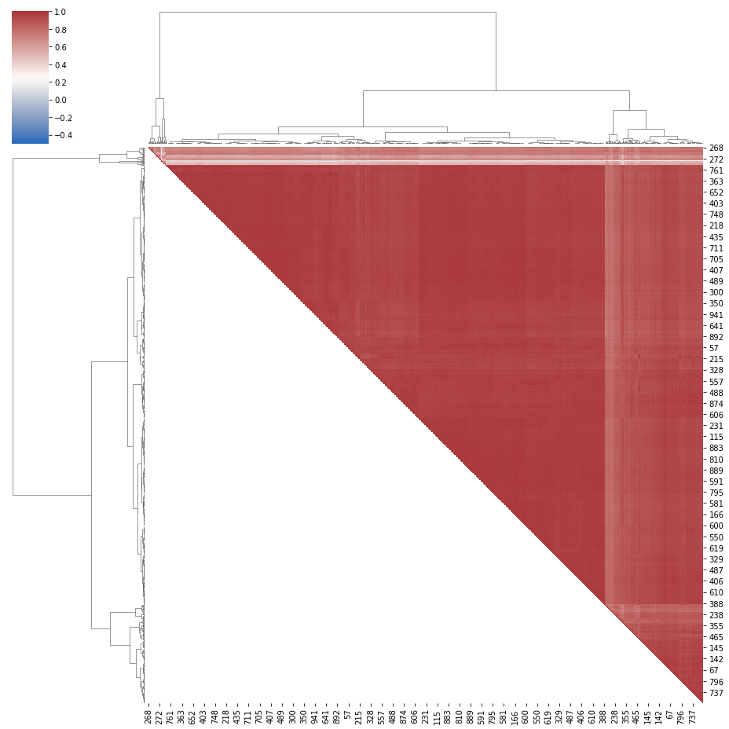
    


```python
map_group = [1, 2, 0]

def f(gr):
    return map_group[int(gr)]

groups = np.array([*map(f, group_no_ordered)],int)

sum(groups==0)
sum(groups==1)
sum(groups==2)
```


    751


```python
corrDescription = [corrSpearman[i][j] for i in range(nbVideos) for j in range(nbVideos) if i >j]
pd.Series(corrDescription).describe()
```


    count    450775.000000
    mean          0.923431
    std           0.094035
    min           0.022957
    25%           0.918656
    50%           0.954455
    75%           0.972099
    max           0.996395
    dtype: float64


```python
def plot_simple_correlationmatrix_dendogram(corr, img_name, ticks, id_names, method='ward'):

    df = pd.DataFrame(corr)
    
    # Generate a mask for the upper triangle
    mask = np.zeros_like(corr, dtype=np.bool)
    
    for i in range(shortnbVideos):
        for j in range(shortnbVideos):
            if i>j:
                mask[i][j] = True
    fig = plt.figure(figsize=(10, 8.5))
    ax = fig.add_subplot(1,1,1)
    sns.heatmap(df, cmap="vlag", mask=mask,
               linewidths=.75, cbar_kws={"ticks":ticks})
    plt.yticks(np.arange(0,len(id_names),1)+0.5, id_names)
    plt.xticks(np.arange(0,len(id_names),1)+0.5, id_names)
    plt.savefig(result_dir+img_name)
    plt.show()
```


```python
id_short = [10, 14, 23, 26, 31, 41, 55, 66, 67, 125]
short_v_names = [v_names[k] for k in id_short]

shortlistVideo = []
for v in short_v_names:
    data = pd.read_table(res_dir+v, delimiter = ',')
    data['etime'] = [*map(elapsedtime_to_sec, data['elapsedtime'])]
    shortlistVideo.append(data)
    
shortnbVideos = len(shortlistVideo)

shortcorrSpearman= [[0 for x in range(shortnbVideos)] for y in range(shortnbVideos)]


for i in range(shortnbVideos):
    for j in range(shortnbVideos):
        if (i == j):
            shortcorrSpearman[i][j] = 1
        else:
            shortcorrSpearman[i][j] = sc.spearmanr(listVideo[id_short[i]][predDimension],listVideo[id_short[j]][predDimension]).correlation

plot_simple_correlationmatrix_dendogram(shortcorrSpearman, 
                     "corrmatrix-ugc-dendo-Spearman-short-" + predDimension + ".png", 
                     [k/5 for k in np.arange(-10,10,1)],
                                      id_short)
```


    
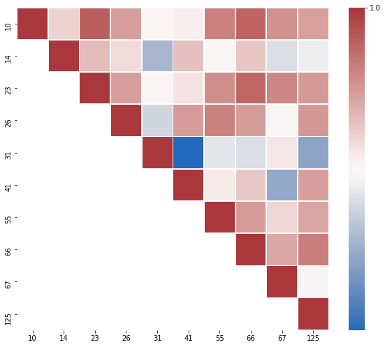
    


# RQ1-2

### Shortlist


```python
id_short
```


    [10, 14, 23, 26, 31, 41, 55, 66, 67, 125]


```python
shortlistVideo[0] # video 10
```


<div>
<style scoped>
    .dataframe tbody tr th:only-of-type {
        vertical-align: middle;
    }

    .dataframe tbody tr th {
        vertical-align: top;
    }

    .dataframe thead th {
        text-align: right;
    }
</style>
<table border="1" class="dataframe">
  <thead>
    <tr style="text-align: right;">
      <th></th>
      <th>configurationID</th>
      <th>cabac</th>
      <th>ref</th>
      <th>deblock</th>
      <th>analyse</th>
      <th>me</th>
      <th>subme</th>
      <th>mixed_ref</th>
      <th>me_range</th>
      <th>trellis</th>
      <th>...</th>
      <th>usertime</th>
      <th>systemtime</th>
      <th>elapsedtime</th>
      <th>cpu</th>
      <th>frames</th>
      <th>fps</th>
      <th>kbs</th>
      <th>ssim</th>
      <th>ssimdb</th>
      <th>etime</th>
    </tr>
  </thead>
  <tbody>
    <tr>
      <th>0</th>
      <td>1</td>
      <td>0</td>
      <td>1</td>
      <td>0:0:0</td>
      <td>0:0</td>
      <td>dia</td>
      <td>0</td>
      <td>0</td>
      <td>16</td>
      <td>0</td>
      <td>...</td>
      <td>8.69</td>
      <td>0.92</td>
      <td>0:01.75</td>
      <td>549</td>
      <td>480</td>
      <td>379.18</td>
      <td>7675.34</td>
      <td>NaN</td>
      <td>NaN</td>
      <td>1.75</td>
    </tr>
    <tr>
      <th>1</th>
      <td>101</td>
      <td>1</td>
      <td>2</td>
      <td>1:0:0</td>
      <td>0x3:0x113</td>
      <td>hex</td>
      <td>6</td>
      <td>1</td>
      <td>16</td>
      <td>1</td>
      <td>...</td>
      <td>29.88</td>
      <td>1.56</td>
      <td>0:04.08</td>
      <td>770</td>
      <td>480</td>
      <td>137.35</td>
      <td>2722.25</td>
      <td>NaN</td>
      <td>NaN</td>
      <td>4.08</td>
    </tr>
    <tr>
      <th>2</th>
      <td>102</td>
      <td>1</td>
      <td>2</td>
      <td>1:0:0</td>
      <td>0x3:0x113</td>
      <td>hex</td>
      <td>6</td>
      <td>1</td>
      <td>16</td>
      <td>1</td>
      <td>...</td>
      <td>26.00</td>
      <td>1.58</td>
      <td>0:03.04</td>
      <td>905</td>
      <td>480</td>
      <td>194.98</td>
      <td>3179.35</td>
      <td>NaN</td>
      <td>NaN</td>
      <td>3.04</td>
    </tr>
    <tr>
      <th>3</th>
      <td>103</td>
      <td>1</td>
      <td>2</td>
      <td>0:0:0</td>
      <td>0x3:0x3</td>
      <td>umh</td>
      <td>6</td>
      <td>1</td>
      <td>16</td>
      <td>1</td>
      <td>...</td>
      <td>32.80</td>
      <td>1.37</td>
      <td>0:02.89</td>
      <td>1181</td>
      <td>480</td>
      <td>206.63</td>
      <td>3142.93</td>
      <td>NaN</td>
      <td>NaN</td>
      <td>2.89</td>
    </tr>
    <tr>
      <th>4</th>
      <td>104</td>
      <td>1</td>
      <td>16</td>
      <td>1:0:0</td>
      <td>0x3:0x113</td>
      <td>hex</td>
      <td>6</td>
      <td>1</td>
      <td>24</td>
      <td>1</td>
      <td>...</td>
      <td>39.70</td>
      <td>1.41</td>
      <td>0:03.29</td>
      <td>1249</td>
      <td>480</td>
      <td>176.69</td>
      <td>2579.38</td>
      <td>NaN</td>
      <td>NaN</td>
      <td>3.29</td>
    </tr>
    <tr>
      <th>...</th>
      <td>...</td>
      <td>...</td>
      <td>...</td>
      <td>...</td>
      <td>...</td>
      <td>...</td>
      <td>...</td>
      <td>...</td>
      <td>...</td>
      <td>...</td>
      <td>...</td>
      <td>...</td>
      <td>...</td>
      <td>...</td>
      <td>...</td>
      <td>...</td>
      <td>...</td>
      <td>...</td>
      <td>...</td>
      <td>...</td>
      <td>...</td>
    </tr>
    <tr>
      <th>196</th>
      <td>97</td>
      <td>1</td>
      <td>2</td>
      <td>1:0:0</td>
      <td>0x3:0x113</td>
      <td>hex</td>
      <td>4</td>
      <td>1</td>
      <td>16</td>
      <td>0</td>
      <td>...</td>
      <td>24.80</td>
      <td>1.67</td>
      <td>0:03.55</td>
      <td>745</td>
      <td>480</td>
      <td>160.70</td>
      <td>2747.42</td>
      <td>NaN</td>
      <td>NaN</td>
      <td>3.55</td>
    </tr>
    <tr>
      <th>197</th>
      <td>98</td>
      <td>1</td>
      <td>2</td>
      <td>0:0:0</td>
      <td>0x3:0x113</td>
      <td>hex</td>
      <td>4</td>
      <td>0</td>
      <td>24</td>
      <td>0</td>
      <td>...</td>
      <td>21.85</td>
      <td>1.59</td>
      <td>0:03.06</td>
      <td>766</td>
      <td>480</td>
      <td>192.69</td>
      <td>2805.80</td>
      <td>NaN</td>
      <td>NaN</td>
      <td>3.06</td>
    </tr>
    <tr>
      <th>198</th>
      <td>99</td>
      <td>1</td>
      <td>5</td>
      <td>1:0:0</td>
      <td>0x3:0x113</td>
      <td>hex</td>
      <td>6</td>
      <td>1</td>
      <td>16</td>
      <td>1</td>
      <td>...</td>
      <td>32.95</td>
      <td>1.42</td>
      <td>0:03.45</td>
      <td>996</td>
      <td>480</td>
      <td>166.61</td>
      <td>2582.37</td>
      <td>NaN</td>
      <td>NaN</td>
      <td>3.45</td>
    </tr>
    <tr>
      <th>199</th>
      <td>100</td>
      <td>0</td>
      <td>3</td>
      <td>0:0:0</td>
      <td>0x113:0x113</td>
      <td>hex</td>
      <td>6</td>
      <td>1</td>
      <td>16</td>
      <td>1</td>
      <td>...</td>
      <td>26.68</td>
      <td>1.56</td>
      <td>0:02.76</td>
      <td>1022</td>
      <td>480</td>
      <td>218.91</td>
      <td>3379.49</td>
      <td>NaN</td>
      <td>NaN</td>
      <td>2.76</td>
    </tr>
    <tr>
      <th>200</th>
      <td>10</td>
      <td>1</td>
      <td>16</td>
      <td>1:0:0</td>
      <td>0x3:0x133</td>
      <td>tesa</td>
      <td>11</td>
      <td>1</td>
      <td>24</td>
      <td>2</td>
      <td>...</td>
      <td>479.12</td>
      <td>6.38</td>
      <td>0:31.19</td>
      <td>1556</td>
      <td>480</td>
      <td>15.69</td>
      <td>2230.33</td>
      <td>NaN</td>
      <td>NaN</td>
      <td>31.19</td>
    </tr>
  </tbody>
</table>
<p>201 rows × 36 columns</p>
</div>


```python
listFeatures = ["cabac", "ref", "deblock", "analyse", "me", "subme", "mixed_ref", "me_range", "trellis", "8x8dct", "fast_pskip", "chroma_qp_offset", "bframes", "b_pyramid", "b_adapt", "direct", "weightb", "open_gop", "weightp", "scenecut", "rc_lookahead", "mbtree", "qpmax", "aq-mode"]

to_keep = [k for k in listFeatures]
to_keep.append(predDimension)

categorial = ['analyse', 'me', 'direct']

def compute_Importances(listVid, id_short=None):
    
    if not id_short:
        id_short = np.arange(0,len(listVid),1)
        
    listImportances = []

    for id_video in range(len(listVid)):

        df = listVid[id_video][to_keep].replace(to_replace ="None",value='0')

        df['deblock'] =[int(val[0]) for val in df['deblock']]

        for col in df.columns:
            if col not in categorial:
                arr_col = np.array(df[col],int)
                arr_col = (arr_col-np.mean(arr_col))/(np.std(arr_col)+1e-5)
                df[col] = arr_col
            else:
                df[col] = [np.where(k==df[col].unique())[0][0] for k in df[col]]
                arr_col = np.array(df[col],int)
                arr_col = (arr_col-np.mean(arr_col))/(np.std(arr_col)+1e-5)
                df[col] = arr_col

        clf = RandomForestRegressor(n_estimators=200)
        X = df.drop([predDimension],axis=1)
        y = df[predDimension]
        clf.fit(X,y)

        listImportances.append(clf.feature_importances_)

    res = pd.DataFrame({'features' : listFeatures})

    cs = 100

    for id_video in range(len(listImportances)):
        res['video_'+str(id_short[id_video])] = np.round(cs*listImportances[id_video])/cs

    res = res.set_index('features').transpose().drop(['open_gop','qpmax'],axis=1)
    return res

res = compute_Importances(shortlistVideo, id_short)
res.to_csv("../../results/shortlist_features_importances"+predDimension+".csv")
```

### Boxplot


```python
res = compute_Importances(listVideo)
```


```python
def boxplot_imp(res, xlim = None, criteria = 'max', name = None):
    if criteria == 'max':
        listImp = [(np.percentile(res[col],75), res[col], col) 
                   for col in res.columns]
        listImp.sort(key=lambda tup: tup[0])
    elif criteria == 'range':
        listImp = [(np.abs(np.percentile(res[col],75)-np.percentile(res[col],25)),res[col], col) 
                   for col in res.columns]
        listImp.sort(key=lambda tup: tup[0])
    elif criteria == 'name':
        listImp = [(np.abs(np.percentile(res[col],75)-np.percentile(res[col],25)),res[col], col) 
                   for col in res.columns]
        listImp.sort(key=lambda tup: tup[2], reverse=True)

    red_square = dict(markerfacecolor='r', marker='s')
    plt.figure(figsize=(15,8))
    plt.grid()
    plt.boxplot([l[1] for l in listImp], flierprops=red_square, 
              vert=False, patch_artist=True, #widths=0.25,
              boxprops=dict(facecolor=(0,0,1,0.5),linewidth=1,edgecolor='k'),
              whiskerprops = dict(linestyle='-.',linewidth=1.0, color='black'))
    plt.xlabel('Feature importances',size=13)
    if xlim:
        plt.xlim(xlim)
    plt.yticks(range(1, len(listImp) + 1), [l[2] for l in listImp])
    if name:
        plt.savefig(name)
    plt.show()
    
boxplot_imp(res, xlim = (-0.01,0.85),
            criteria = 'name', 
            name = "../../results/boxplot_features_imp_rf_"+predDimension+".png")
```


    
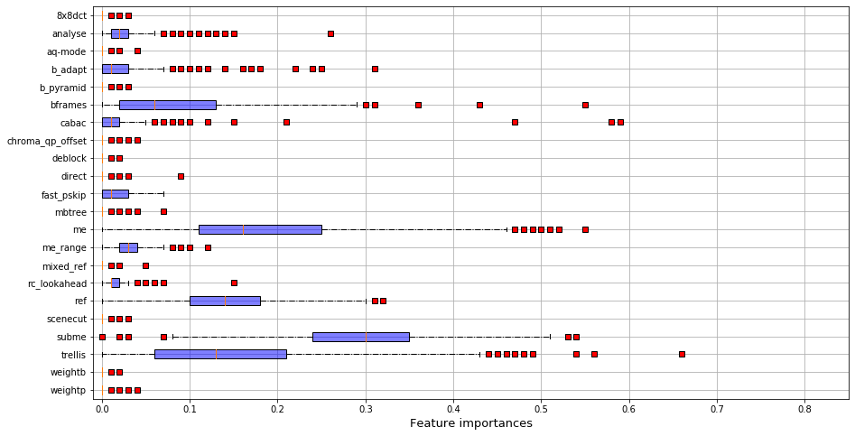
    


### Regression


```python
def compute_poly(listVid, id_short=None):
    
    if not id_short:
        id_short = np.arange(0,len(listVid),1)
    
    listImportances = []
    
    #listFeatures = ['subme','aq-mode','mbtree','cabac']
    
    to_keep = [k for k in listFeatures]
    to_keep.append(predDimension)
    
    names = listFeatures
    final_names = []
    final_names.append('constant')
    for n in names:
        final_names.append(n)
    for n1 in range(len(names)):
        for n2 in range(len(names)):
            if n1>=n2:
                final_names.append(str(names[n1])+'*'+str(names[n2]))
    
    for id_video in range(len(listVid)):

        df = listVid[id_video][to_keep].replace(to_replace ="None",value='0')
        df['deblock'] =[int(val[0]) for val in df['deblock']]

        for col in df.columns:
            if col not in categorial:
                arr_col = np.array(df[col],int)
                arr_col = (arr_col-np.mean(arr_col))/(np.std(arr_col)+1e-5)
                df[col] = arr_col
            else:
                df[col] = [np.where(k==df[col].unique())[0][0] for k in df[col]]
                arr_col = np.array(df[col],int)
                arr_col = (arr_col-np.mean(arr_col))/(np.std(arr_col)+1e-5)
                df[col] = arr_col

        clf = LinearRegression()
        X = df.drop([predDimension],axis=1)

        y = df[predDimension]
        #poly = PolynomialFeatures(degree=1, interaction_only = False, include_bias = True)    
        #X_interact = pd.DataFrame(poly.fit_transform(X))#, columns=final_names)
        #kept_names = ['subme','aq-mode','mbtree','cabac','cabac*mbtree','aq-mode*subme','cabac*subme']
        clf.fit(X,y)
        listImportances.append(clf.coef_)

    res = pd.DataFrame({'features' : listFeatures})

    cs = 100

    for id_video in range(len(listImportances)):
        res['video_'+str(id_short[id_video])] = np.round(cs*listImportances[id_video])/cs

    res = res.set_index('features').drop(['open_gop','qpmax']).transpose()
    return res

res = compute_poly(listVideo)
res.to_csv("../../results/list_features_importances_poly_"+predDimension+".csv")
res
```


<div>
<style scoped>
    .dataframe tbody tr th:only-of-type {
        vertical-align: middle;
    }

    .dataframe tbody tr th {
        vertical-align: top;
    }

    .dataframe thead th {
        text-align: right;
    }
</style>
<table border="1" class="dataframe">
  <thead>
    <tr style="text-align: right;">
      <th>features</th>
      <th>cabac</th>
      <th>ref</th>
      <th>deblock</th>
      <th>analyse</th>
      <th>me</th>
      <th>subme</th>
      <th>mixed_ref</th>
      <th>me_range</th>
      <th>trellis</th>
      <th>8x8dct</th>
      <th>...</th>
      <th>bframes</th>
      <th>b_pyramid</th>
      <th>b_adapt</th>
      <th>direct</th>
      <th>weightb</th>
      <th>weightp</th>
      <th>scenecut</th>
      <th>rc_lookahead</th>
      <th>mbtree</th>
      <th>aq-mode</th>
    </tr>
  </thead>
  <tbody>
    <tr>
      <th>video_0</th>
      <td>-0.02</td>
      <td>0.10</td>
      <td>0.02</td>
      <td>0.01</td>
      <td>0.11</td>
      <td>0.04</td>
      <td>-0.16</td>
      <td>0.12</td>
      <td>0.09</td>
      <td>0.03</td>
      <td>...</td>
      <td>0.44</td>
      <td>0.12</td>
      <td>0.30</td>
      <td>-0.13</td>
      <td>-0.38</td>
      <td>-0.02</td>
      <td>0.03</td>
      <td>0.02</td>
      <td>0.08</td>
      <td>0.00</td>
    </tr>
    <tr>
      <th>video_1</th>
      <td>-0.05</td>
      <td>0.28</td>
      <td>-0.02</td>
      <td>0.04</td>
      <td>0.21</td>
      <td>0.15</td>
      <td>-0.13</td>
      <td>0.10</td>
      <td>0.08</td>
      <td>-0.01</td>
      <td>...</td>
      <td>0.35</td>
      <td>0.16</td>
      <td>0.13</td>
      <td>-0.08</td>
      <td>-0.31</td>
      <td>-0.10</td>
      <td>0.09</td>
      <td>0.01</td>
      <td>-0.00</td>
      <td>-0.00</td>
    </tr>
    <tr>
      <th>video_2</th>
      <td>-0.08</td>
      <td>0.26</td>
      <td>-0.01</td>
      <td>0.06</td>
      <td>0.24</td>
      <td>0.12</td>
      <td>-0.13</td>
      <td>0.14</td>
      <td>0.10</td>
      <td>-0.03</td>
      <td>...</td>
      <td>0.26</td>
      <td>0.22</td>
      <td>0.02</td>
      <td>-0.12</td>
      <td>-0.26</td>
      <td>-0.07</td>
      <td>0.11</td>
      <td>0.01</td>
      <td>0.01</td>
      <td>-0.00</td>
    </tr>
    <tr>
      <th>video_3</th>
      <td>-0.05</td>
      <td>0.27</td>
      <td>-0.01</td>
      <td>0.04</td>
      <td>0.21</td>
      <td>0.13</td>
      <td>-0.15</td>
      <td>0.13</td>
      <td>0.09</td>
      <td>-0.02</td>
      <td>...</td>
      <td>0.30</td>
      <td>0.17</td>
      <td>0.12</td>
      <td>-0.11</td>
      <td>-0.27</td>
      <td>-0.08</td>
      <td>0.07</td>
      <td>0.01</td>
      <td>0.02</td>
      <td>-0.01</td>
    </tr>
    <tr>
      <th>video_4</th>
      <td>-0.09</td>
      <td>0.28</td>
      <td>-0.01</td>
      <td>0.03</td>
      <td>0.17</td>
      <td>0.16</td>
      <td>-0.15</td>
      <td>0.14</td>
      <td>0.15</td>
      <td>-0.01</td>
      <td>...</td>
      <td>0.26</td>
      <td>0.19</td>
      <td>0.11</td>
      <td>-0.09</td>
      <td>-0.29</td>
      <td>-0.10</td>
      <td>0.09</td>
      <td>0.00</td>
      <td>0.03</td>
      <td>-0.01</td>
    </tr>
    <tr>
      <th>...</th>
      <td>...</td>
      <td>...</td>
      <td>...</td>
      <td>...</td>
      <td>...</td>
      <td>...</td>
      <td>...</td>
      <td>...</td>
      <td>...</td>
      <td>...</td>
      <td>...</td>
      <td>...</td>
      <td>...</td>
      <td>...</td>
      <td>...</td>
      <td>...</td>
      <td>...</td>
      <td>...</td>
      <td>...</td>
      <td>...</td>
      <td>...</td>
    </tr>
    <tr>
      <th>video_945</th>
      <td>-0.11</td>
      <td>0.28</td>
      <td>-0.00</td>
      <td>0.05</td>
      <td>0.18</td>
      <td>0.17</td>
      <td>-0.14</td>
      <td>0.14</td>
      <td>0.16</td>
      <td>-0.03</td>
      <td>...</td>
      <td>0.24</td>
      <td>0.19</td>
      <td>0.09</td>
      <td>-0.09</td>
      <td>-0.29</td>
      <td>-0.12</td>
      <td>0.10</td>
      <td>0.00</td>
      <td>-0.00</td>
      <td>0.00</td>
    </tr>
    <tr>
      <th>video_946</th>
      <td>-0.12</td>
      <td>0.30</td>
      <td>-0.04</td>
      <td>0.04</td>
      <td>0.19</td>
      <td>0.19</td>
      <td>-0.11</td>
      <td>0.11</td>
      <td>0.20</td>
      <td>0.00</td>
      <td>...</td>
      <td>0.23</td>
      <td>0.17</td>
      <td>0.02</td>
      <td>-0.09</td>
      <td>-0.24</td>
      <td>-0.13</td>
      <td>0.13</td>
      <td>0.01</td>
      <td>0.02</td>
      <td>-0.03</td>
    </tr>
    <tr>
      <th>video_947</th>
      <td>-0.06</td>
      <td>0.27</td>
      <td>-0.02</td>
      <td>0.04</td>
      <td>0.21</td>
      <td>0.15</td>
      <td>-0.13</td>
      <td>0.12</td>
      <td>0.12</td>
      <td>-0.03</td>
      <td>...</td>
      <td>0.28</td>
      <td>0.16</td>
      <td>0.13</td>
      <td>-0.11</td>
      <td>-0.28</td>
      <td>-0.10</td>
      <td>0.09</td>
      <td>0.02</td>
      <td>0.01</td>
      <td>0.01</td>
    </tr>
    <tr>
      <th>video_948</th>
      <td>-0.03</td>
      <td>0.25</td>
      <td>-0.01</td>
      <td>0.06</td>
      <td>0.26</td>
      <td>0.18</td>
      <td>-0.13</td>
      <td>0.12</td>
      <td>0.06</td>
      <td>-0.05</td>
      <td>...</td>
      <td>0.27</td>
      <td>0.15</td>
      <td>-0.02</td>
      <td>-0.12</td>
      <td>-0.22</td>
      <td>-0.00</td>
      <td>0.14</td>
      <td>0.02</td>
      <td>0.02</td>
      <td>0.02</td>
    </tr>
    <tr>
      <th>video_949</th>
      <td>-0.05</td>
      <td>0.27</td>
      <td>-0.01</td>
      <td>0.05</td>
      <td>0.19</td>
      <td>0.21</td>
      <td>-0.14</td>
      <td>0.11</td>
      <td>0.13</td>
      <td>-0.01</td>
      <td>...</td>
      <td>0.25</td>
      <td>0.13</td>
      <td>0.17</td>
      <td>-0.08</td>
      <td>-0.28</td>
      <td>-0.10</td>
      <td>0.05</td>
      <td>0.01</td>
      <td>-0.00</td>
      <td>0.02</td>
    </tr>
  </tbody>
</table>
<p>950 rows × 22 columns</p>
</div>


```python
boxplot_imp(res, criteria ='range', name ="../../results/boxplot_features_imp_linear_"+predDimension+".png")
```


    
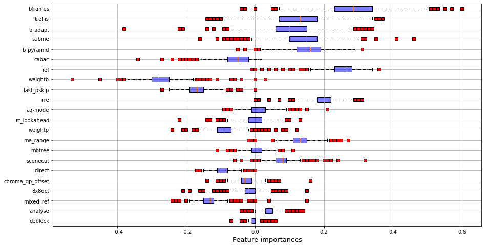
    


# RQ2

## RQ2.1 - Group of performances


```python
def plot_corr_matrix(corr, method = 'ward', title=''):

    df = pd.DataFrame(corr)
    
    links = linkage(df, method=method,)
    order = leaves_list(links)
    
    mask = np.zeros_like(corr, dtype=np.bool)
    
    for i in range(len(corr)):
        for j in range(len(corr)):
            if i>j:
                mask[order[i]][order[j]] = True
    
    g = sns.clustermap(df, cmap="vlag", mask=mask, method=method,
                   linewidths=0, figsize=(13, 13), vmin=-0.5)
    g.ax_heatmap.set_yticklabels([])
    g.ax_heatmap.set_xticklabels([])
    plt.title(title)
    plt.show()
    
    corrDescription = [corr[i][j] for i in range(len(corr)) for j in range(len(corr)) if i >j]
    return pd.Series(corrDescription).describe()

def plot_group(group_index):
    ind = np.array([k for k in range(len(corrSpearman)) if groups[k] == group_index], dtype=int)
    group = np.copy([[corrSpearman[k][j] for j in ind] for k in ind])
    print(plot_corr_matrix(group,title="group "+str(group_index)+" : "+str(len(group))))

for i in range(3):
    plot_group(i)
```


    
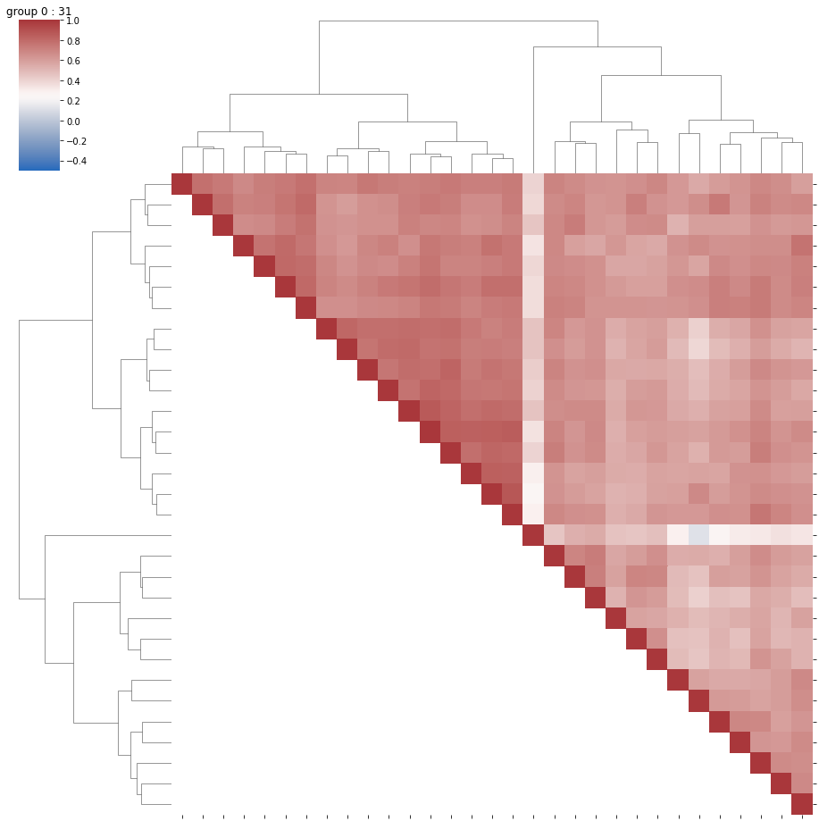
    


    count    465.000000
    mean       0.635606
    std        0.110522
    min        0.121200
    25%        0.579844
    50%        0.646696
    75%        0.706161
    max        0.879076
    dtype: float64


    
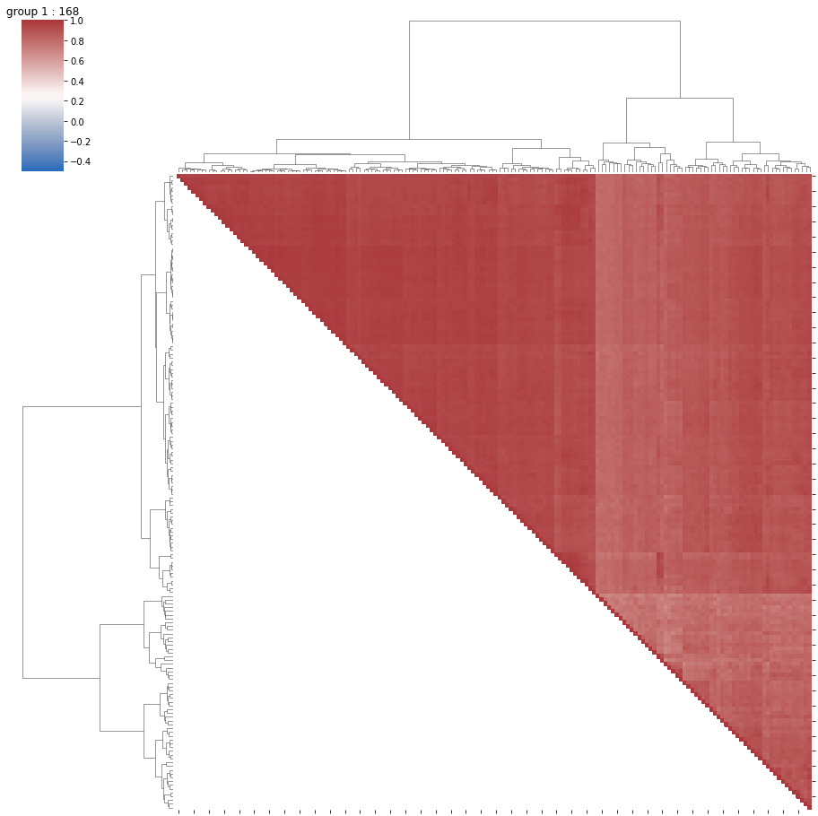
    


    count    14028.000000
    mean         0.897449
    std          0.056232
    min          0.676689
    25%          0.857975
    50%          0.907957
    75%          0.944213
    max          0.991528
    dtype: float64


    
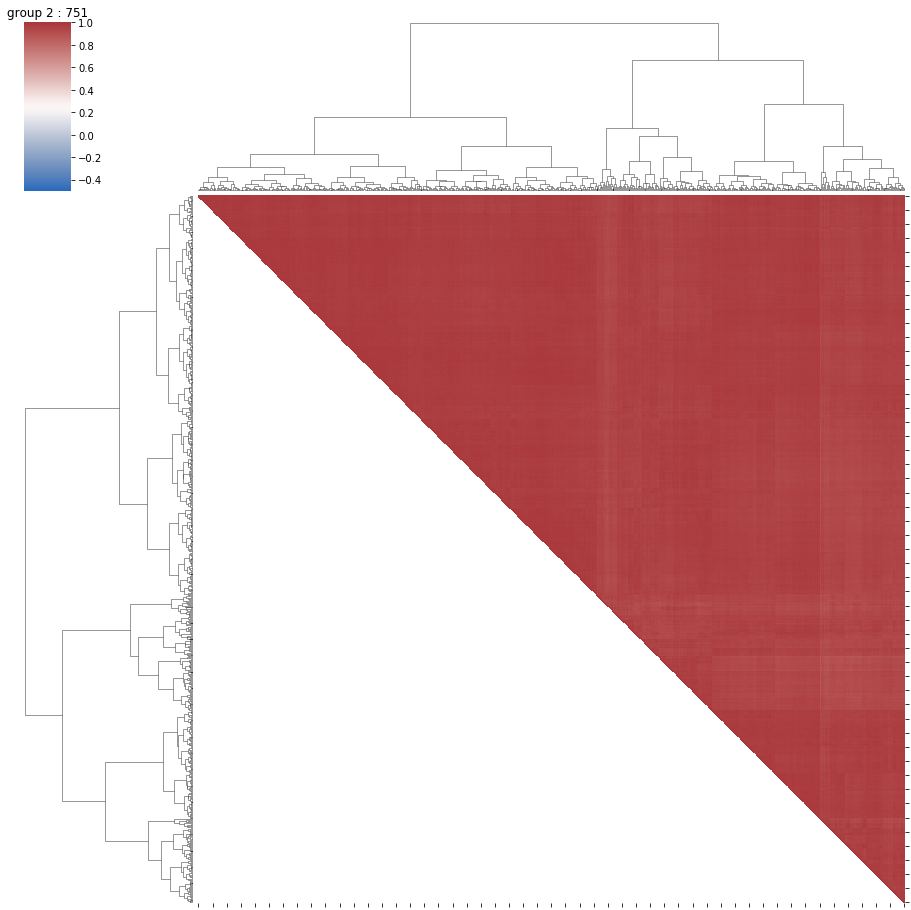
    


    count    281625.000000
    mean          0.964780
    std           0.016533
    min           0.853005
    25%           0.955281
    50%           0.968023
    75%           0.977356
    max           0.996395
    dtype: float64


## Summary per group


```python
meta = pd.read_csv("../data/ugc_meta/all_features.csv").set_index('FILENAME')
meta['category']=[str(meta.index[i]).split('_')[0] for i in range(meta.shape[0])]
del meta['NOISE_DMOS']
meta = meta.fillna(0)
cat_tab = pd.Series(meta['category'].values).unique()
meta['video_category'] = [np.where(cat_tab==meta['category'][i])[0][0] for i in range(len(meta['category']))]
del meta['category']
for col in meta.columns:#[:len(meta.columns)-1]:
    inter = np.array(meta[col],float)
    meta[col] = (inter-np.mean(inter))/np.std(inter)
perf = pd.DataFrame({'FILENAME': np.array([v_names[k][:-4] for k in range(len(v_names))])[1:],
              'perf_group' : np.array([k for k in groups])[1:]}).set_index('FILENAME')
meta_perf = perf.join(meta)
meta_perf
```


<div>
<style scoped>
    .dataframe tbody tr th:only-of-type {
        vertical-align: middle;
    }

    .dataframe tbody tr th {
        vertical-align: top;
    }

    .dataframe thead th {
        text-align: right;
    }
</style>
<table border="1" class="dataframe">
  <thead>
    <tr style="text-align: right;">
      <th></th>
      <th>perf_group</th>
      <th>SLEEQ_DMOS</th>
      <th>BANDING_DMOS</th>
      <th>WIDTH</th>
      <th>HEIGHT</th>
      <th>SPATIAL_COMPLEXITY</th>
      <th>TEMPORAL_COMPLEXITY</th>
      <th>CHUNK_COMPLEXITY_VARIATION</th>
      <th>COLOR_COMPLEXITY</th>
      <th>video_category</th>
    </tr>
    <tr>
      <th>FILENAME</th>
      <th></th>
      <th></th>
      <th></th>
      <th></th>
      <th></th>
      <th></th>
      <th></th>
      <th></th>
      <th></th>
      <th></th>
    </tr>
  </thead>
  <tbody>
    <tr>
      <th>Animation_1080P-05f8</th>
      <td>2</td>
      <td>0.843640</td>
      <td>0.742227</td>
      <td>0.380890</td>
      <td>0.330315</td>
      <td>-0.147062</td>
      <td>0.443113</td>
      <td>2.546727</td>
      <td>2.208462</td>
      <td>-1.618994</td>
    </tr>
    <tr>
      <th>Animation_1080P-0c4f</th>
      <td>2</td>
      <td>-0.656518</td>
      <td>-0.377309</td>
      <td>0.380890</td>
      <td>0.330315</td>
      <td>0.422696</td>
      <td>-0.963894</td>
      <td>1.055535</td>
      <td>-1.232585</td>
      <td>-1.618994</td>
    </tr>
    <tr>
      <th>Animation_1080P-0cdf</th>
      <td>2</td>
      <td>-0.294941</td>
      <td>-0.059125</td>
      <td>0.380890</td>
      <td>0.330315</td>
      <td>-0.028411</td>
      <td>0.429840</td>
      <td>-0.102867</td>
      <td>-0.448165</td>
      <td>-1.618994</td>
    </tr>
    <tr>
      <th>Animation_1080P-18f5</th>
      <td>2</td>
      <td>-0.479576</td>
      <td>-0.377309</td>
      <td>0.380890</td>
      <td>0.330315</td>
      <td>1.289667</td>
      <td>-0.959469</td>
      <td>-0.050889</td>
      <td>0.193239</td>
      <td>-1.618994</td>
    </tr>
    <tr>
      <th>Animation_1080P-209f</th>
      <td>2</td>
      <td>6.282675</td>
      <td>-0.377309</td>
      <td>0.380890</td>
      <td>0.330315</td>
      <td>2.315231</td>
      <td>-1.512538</td>
      <td>-0.622865</td>
      <td>-1.232585</td>
      <td>-1.618994</td>
    </tr>
    <tr>
      <th>...</th>
      <td>...</td>
      <td>...</td>
      <td>...</td>
      <td>...</td>
      <td>...</td>
      <td>...</td>
      <td>...</td>
      <td>...</td>
      <td>...</td>
      <td>...</td>
    </tr>
    <tr>
      <th>Vlog_720P-561e</th>
      <td>2</td>
      <td>-0.679597</td>
      <td>-0.377309</td>
      <td>-0.241046</td>
      <td>-0.334452</td>
      <td>0.979531</td>
      <td>-1.415198</td>
      <td>-0.652628</td>
      <td>0.457602</td>
      <td>1.494285</td>
    </tr>
    <tr>
      <th>Vlog_720P-5d08</th>
      <td>2</td>
      <td>-0.679597</td>
      <td>-0.377309</td>
      <td>-0.773579</td>
      <td>-0.334452</td>
      <td>3.258561</td>
      <td>-0.304636</td>
      <td>-0.437382</td>
      <td>-0.157800</td>
      <td>1.494285</td>
    </tr>
    <tr>
      <th>Vlog_720P-60f8</th>
      <td>2</td>
      <td>0.443598</td>
      <td>0.624381</td>
      <td>-0.241046</td>
      <td>-0.334452</td>
      <td>0.234735</td>
      <td>-0.043587</td>
      <td>-0.364052</td>
      <td>-0.149132</td>
      <td>1.494285</td>
    </tr>
    <tr>
      <th>Vlog_720P-6410</th>
      <td>2</td>
      <td>-0.456497</td>
      <td>3.770868</td>
      <td>-0.241046</td>
      <td>-0.334452</td>
      <td>-0.770858</td>
      <td>2.120018</td>
      <td>1.971948</td>
      <td>-0.240142</td>
      <td>1.494285</td>
    </tr>
    <tr>
      <th>Vlog_720P-6d56</th>
      <td>2</td>
      <td>0.628233</td>
      <td>-0.353740</td>
      <td>-0.241046</td>
      <td>-0.334452</td>
      <td>-0.329149</td>
      <td>0.328075</td>
      <td>1.647785</td>
      <td>0.565947</td>
      <td>1.494285</td>
    </tr>
  </tbody>
</table>
<p>949 rows × 10 columns</p>
</div>


```python
meta_perf['str_video_cat'] = [str(meta_perf.index[i]).split('_')[0] for i in range(meta_perf.shape[0])]
total_cat = meta_perf.groupby('str_video_cat').count()['perf_group']
group_perf = np.array([gr for gr in groups])
group_perf
```


    array([1, 2, 2, 2, 2, 2, 2, 2, 2, 2, 2, 2, 2, 2, 2, 2, 2, 1, 2, 1, 1, 2,
           1, 2, 1, 2, 2, 2, 2, 2, 2, 1, 2, 2, 2, 2, 2, 2, 2, 2, 2, 2, 2, 2,
           2, 2, 2, 2, 2, 2, 2, 2, 2, 2, 2, 2, 2, 2, 2, 2, 2, 2, 2, 2, 2, 2,
           2, 1, 2, 2, 2, 2, 2, 2, 2, 2, 2, 2, 2, 2, 2, 2, 2, 2, 2, 2, 2, 2,
           2, 2, 2, 2, 2, 2, 2, 2, 2, 2, 2, 2, 2, 2, 2, 2, 2, 2, 2, 2, 2, 2,
           1, 2, 2, 2, 2, 2, 1, 2, 2, 2, 2, 2, 2, 2, 2, 2, 2, 2, 2, 2, 2, 2,
           2, 2, 2, 2, 2, 1, 1, 1, 1, 1, 1, 1, 1, 1, 1, 1, 1, 1, 1, 1, 1, 1,
           1, 1, 1, 1, 1, 1, 1, 2, 2, 2, 2, 2, 2, 2, 2, 2, 2, 2, 2, 2, 2, 2,
           2, 2, 2, 2, 2, 2, 2, 2, 2, 2, 2, 2, 2, 2, 2, 2, 2, 2, 2, 2, 2, 2,
           2, 2, 2, 2, 2, 2, 2, 2, 2, 2, 2, 2, 2, 2, 2, 2, 2, 2, 2, 2, 2, 2,
           2, 2, 2, 2, 2, 2, 2, 2, 2, 2, 2, 2, 2, 2, 2, 2, 2, 2, 1, 1, 0, 1,
           1, 1, 1, 0, 1, 1, 1, 1, 0, 0, 0, 1, 1, 1, 0, 1, 1, 1, 1, 1, 1, 0,
           0, 0, 0, 0, 0, 0, 0, 0, 0, 0, 0, 0, 0, 0, 1, 1, 0, 0, 0, 1, 0, 0,
           1, 0, 0, 0, 2, 1, 2, 2, 2, 2, 1, 2, 2, 2, 2, 2, 2, 1, 2, 2, 2, 1,
           2, 2, 2, 2, 2, 2, 2, 2, 2, 2, 2, 2, 2, 2, 2, 2, 2, 2, 2, 2, 2, 2,
           2, 2, 2, 2, 1, 2, 2, 2, 2, 1, 2, 2, 2, 2, 2, 2, 2, 2, 2, 2, 2, 2,
           2, 2, 2, 1, 1, 2, 2, 2, 2, 2, 2, 2, 2, 2, 2, 2, 2, 2, 2, 1, 2, 2,
           2, 2, 2, 2, 2, 2, 1, 2, 2, 2, 2, 2, 2, 2, 2, 2, 2, 2, 2, 1, 2, 1,
           2, 2, 2, 2, 2, 2, 2, 2, 2, 2, 2, 2, 2, 2, 2, 2, 2, 2, 2, 2, 2, 2,
           2, 2, 2, 2, 2, 2, 2, 2, 2, 2, 2, 2, 2, 2, 1, 2, 2, 2, 2, 2, 2, 2,
           2, 2, 2, 2, 1, 2, 2, 2, 2, 2, 2, 2, 2, 2, 2, 2, 2, 2, 2, 2, 2, 2,
           2, 2, 2, 1, 2, 2, 2, 2, 2, 2, 2, 2, 2, 2, 2, 2, 2, 2, 2, 2, 2, 2,
           2, 2, 2, 2, 2, 2, 2, 2, 2, 1, 2, 2, 1, 2, 2, 2, 2, 2, 2, 1, 2, 2,
           2, 2, 2, 2, 1, 2, 2, 2, 2, 2, 2, 2, 2, 2, 2, 2, 2, 2, 2, 2, 2, 2,
           2, 2, 2, 2, 2, 2, 2, 2, 2, 2, 2, 2, 2, 2, 2, 2, 2, 1, 2, 2, 2, 2,
           2, 2, 2, 2, 2, 2, 2, 2, 1, 2, 2, 2, 2, 2, 2, 1, 2, 2, 2, 2, 2, 2,
           2, 2, 2, 2, 2, 2, 2, 2, 2, 2, 2, 2, 1, 2, 2, 2, 2, 2, 2, 2, 2, 2,
           2, 2, 2, 1, 1, 2, 2, 2, 2, 2, 2, 2, 2, 2, 2, 2, 2, 2, 2, 2, 2, 2,
           2, 2, 2, 2, 2, 2, 2, 2, 2, 2, 2, 2, 2, 2, 2, 2, 2, 2, 2, 2, 2, 2,
           2, 2, 2, 2, 2, 2, 2, 2, 2, 2, 2, 2, 2, 2, 2, 2, 2, 2, 2, 1, 2, 2,
           2, 2, 2, 2, 2, 2, 2, 2, 2, 2, 2, 2, 2, 2, 2, 2, 2, 2, 2, 2, 2, 2,
           2, 1, 1, 1, 1, 2, 1, 0, 2, 1, 1, 1, 1, 1, 2, 1, 1, 2, 2, 2, 2, 2,
           2, 2, 2, 2, 2, 2, 2, 2, 2, 2, 2, 2, 2, 1, 2, 1, 1, 2, 2, 2, 1, 1,
           2, 1, 1, 1, 2, 2, 1, 2, 2, 1, 2, 1, 1, 2, 2, 2, 2, 2, 2, 2, 2, 2,
           2, 2, 2, 2, 2, 2, 2, 2, 2, 2, 2, 2, 2, 2, 2, 2, 2, 2, 2, 2, 2, 2,
           1, 0, 2, 2, 1, 2, 2, 2, 2, 2, 2, 2, 2, 1, 2, 2, 2, 1, 2, 1, 2, 1,
           2, 2, 1, 2, 1, 2, 2, 2, 1, 2, 2, 1, 2, 2, 2, 2, 2, 2, 2, 2, 2, 2,
           2, 2, 2, 2, 2, 2, 2, 1, 2, 2, 1, 2, 2, 2, 2, 2, 2, 2, 1, 2, 2, 1,
           2, 1, 1, 1, 2, 1, 1, 1, 1, 1, 1, 1, 1, 1, 1, 1, 1, 1, 1, 1, 1, 1,
           1, 1, 1, 1, 1, 1, 1, 1, 1, 1, 1, 1, 1, 1, 1, 1, 2, 1, 1, 2, 1, 1,
           1, 1, 1, 2, 2, 2, 2, 2, 2, 2, 1, 2, 2, 2, 2, 2, 2, 2, 2, 2, 2, 2,
           2, 2, 2, 2, 2, 2, 2, 2, 2, 2, 2, 2, 2, 2, 1, 2, 2, 2, 2, 2, 2, 2,
           2, 2, 2, 2, 2, 2, 2, 2, 2, 1, 2, 2, 2, 2, 1, 2, 2, 2, 2, 2, 2, 2,
           2, 2, 2, 2])


```python
def summary_group(id_group):
            
    id_list = [i for i in range(len(listVideo)) if group_perf[i]==id_group]
    v_names_group = [v_names[i][:-4] for i in range(len(v_names)) if i in id_list]
    listVideoGroup = [listVideo[i] for i in range(len(listVideo)) if i in id_list]
    
    print('Group '+str(id_group)+' : '+str(len(listVideoGroup))+' videos!')
    
    print('\n')

    # features importances
    boxplot_imp(compute_Importances(listVideoGroup), criteria = 'name', xlim= (0, 1),
               name ="../../results/boxplot_imp_group"+str(id_group)+".png")

    # features effects
    boxplot_imp(compute_poly(listVideoGroup), criteria = 'name', xlim = (-1, 1),
               name ="../../results/boxplot_effect_group"+str(id_group)+".png")

    print('\n')

    interest_var = ['cpu', 'etime', 'fps', 'kbs', 'size']

    for iv in interest_var:
        pred = [np.mean(lv[iv]) for lv in listVideoGroup]
        print('Mean '+iv+' in the group: '+str(np.round(np.mean(pred),1)))

    print('\n')

    # percentage of the videos present in the group par category

    meta_perf_group = meta_perf.query('perf_group=='+str(id_group))
    meta_perf_group['str_video_cat'] = [str(meta_perf_group.index[i]).split('_')[0] for i in range(meta_perf_group.shape[0])]
    val_group = meta_perf_group.groupby('str_video_cat').count()['perf_group']
    df_res_cat_group = pd.DataFrame({'val': val_group, 'total': total_cat})
    print(df_res_cat_group['val']/df_res_cat_group['total'])

    print('\n')

    # Mean of the videos of the group per properties

    for col in meta_perf_group.columns:
        if col not in ['str_video_cat', 'video_category']:
            print('Mean '+col+' : '+str(meta_perf_group[col].mean()))

    print('\n')

    corrGroup = np.array([corrSpearman[i][j] for i in range(len(corrSpearman)) if i in id_list 
                 for j in range(len(corrSpearman)) if j in id_list],float)

    print("Correlations intra-group: \n" + str(pd.Series(corrGroup).describe().iloc[[1,5]])+'\n')
```


```python
summary_group(0)
```

    Group 0 : 31 videos!
    
    


    
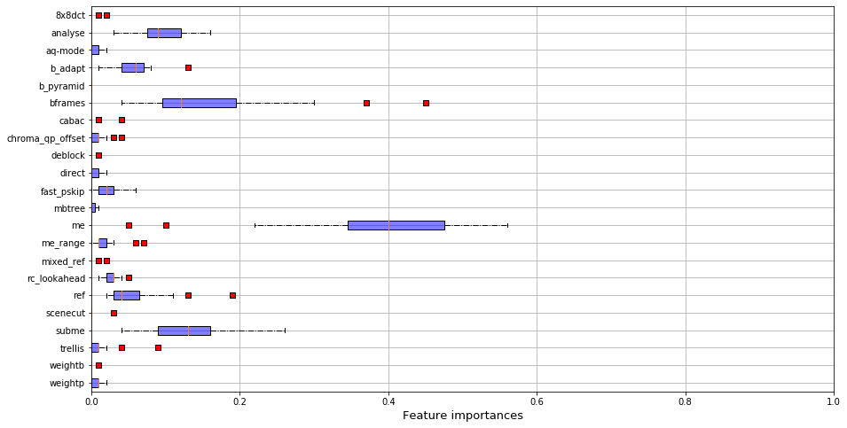
    


    
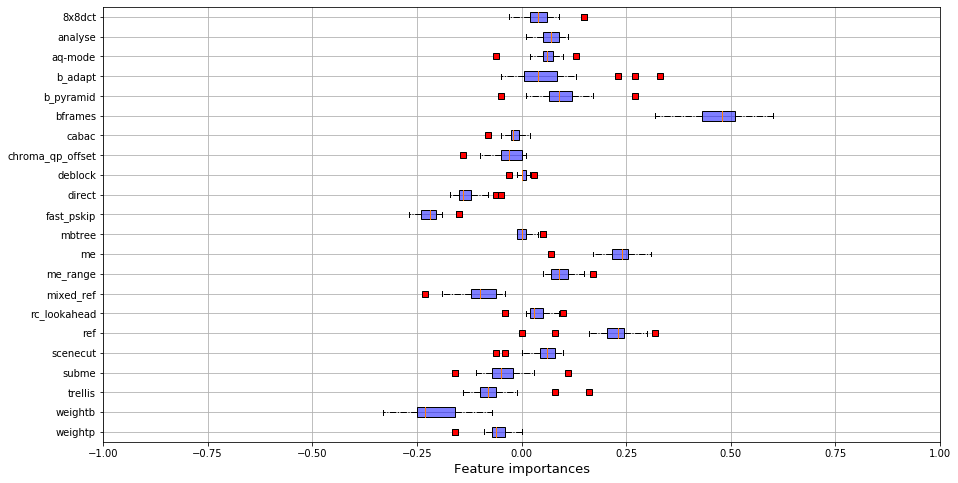
    


    
    
    Mean cpu in the group: 619.9
    Mean etime in the group: 98.3
    Mean fps in the group: 35.1
    Mean kbs in the group: 22588.0
    Mean size in the group: 56460239.9
    
    
    Animation              NaN
    CoverSong              NaN
    Gaming                 NaN
    HDR               0.557692
    HowTo                  NaN
    Lecture                NaN
    LiveMusic              NaN
    LyricVideo             NaN
    MusicVideo             NaN
    NewsClip               NaN
    Sports                 NaN
    TelevisionClip         NaN
    VR                0.014286
    VerticalVideo     0.013333
    Vlog                   NaN
    dtype: float64
    
    
    Mean perf_group : 0.0
    Mean SLEEQ_DMOS : 0.26343012532687715
    Mean BANDING_DMOS : -0.041258317690693165
    Mean WIDTH : 1.7957940639128431
    Mean HEIGHT : 1.8676186590659705
    Mean SPATIAL_COMPLEXITY : -0.7090504747427141
    Mean TEMPORAL_COMPLEXITY : -0.17960648222014755
    Mean CHUNK_COMPLEXITY_VARIATION : -0.39698798622016795
    Mean COLOR_COMPLEXITY : 0.2722262404389464
    
    
    Correlations intra-group: 
    mean    0.647361
    50%     0.651601
    dtype: float64
    


    /home/llesoil/anaconda3/envs/x264/lib/python3.7/site-packages/ipykernel_launcher.py:32: SettingWithCopyWarning: 
    A value is trying to be set on a copy of a slice from a DataFrame.
    Try using .loc[row_indexer,col_indexer] = value instead
    
    See the caveats in the documentation: https://pandas.pydata.org/pandas-docs/stable/user_guide/indexing.html#returning-a-view-versus-a-copy


```python
summary_group(1)
```

    Group 1 : 168 videos!
    
    


    
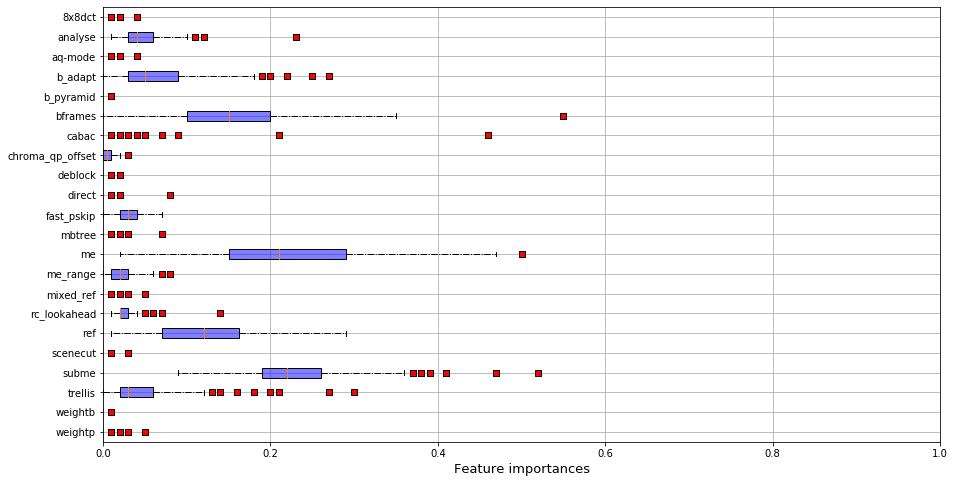
    


    
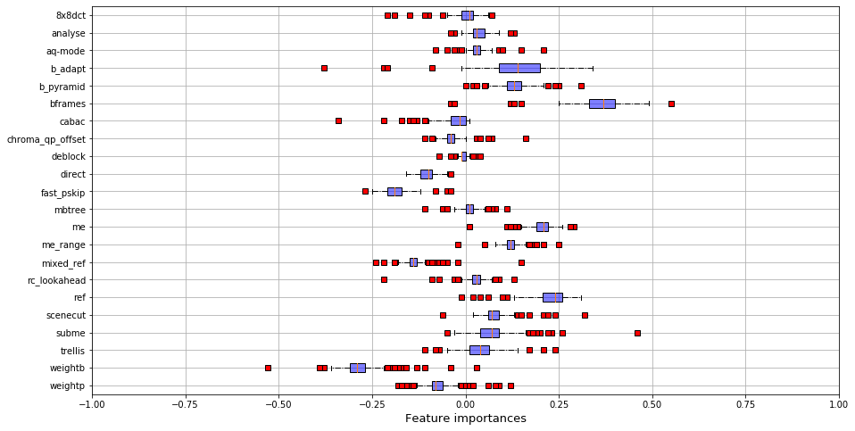
    


    
    
    Mean cpu in the group: 1215.7
    Mean etime in the group: 22.4
    Mean fps in the group: 138.9
    Mean kbs in the group: 21236.7
    Mean size in the group: 52228066.2
    
    
    Animation         0.081395
    CoverSong              NaN
    Gaming            0.181818
    HDR               0.442308
    HowTo             0.103448
    Lecture           0.057692
    LiveMusic         0.067568
    LyricVideo        0.181818
    MusicVideo             NaN
    NewsClip               NaN
    Sports            0.100000
    TelevisionClip    0.036364
    VR                0.185714
    VerticalVideo     0.240000
    Vlog              0.348101
    dtype: float64
    
    
    Mean perf_group : 1.0
    Mean SLEEQ_DMOS : -0.07603302366222811
    Mean BANDING_DMOS : 0.18997423123924528
    Mean WIDTH : 1.241800927428602
    Mean HEIGHT : 1.3356701827463904
    Mean SPATIAL_COMPLEXITY : -0.7596378992848146
    Mean TEMPORAL_COMPLEXITY : 0.2955135818524045
    Mean CHUNK_COMPLEXITY_VARIATION : -0.29901175798533086
    Mean COLOR_COMPLEXITY : -0.06624471131934162
    
    


    /home/llesoil/anaconda3/envs/x264/lib/python3.7/site-packages/ipykernel_launcher.py:32: SettingWithCopyWarning: 
    A value is trying to be set on a copy of a slice from a DataFrame.
    Try using .loc[row_indexer,col_indexer] = value instead
    
    See the caveats in the documentation: https://pandas.pydata.org/pandas-docs/stable/user_guide/indexing.html#returning-a-view-versus-a-copy


    Correlations intra-group: 
    mean    0.898060
    50%     0.908528
    dtype: float64
    


```python
summary_group(2)
```

    Group 2 : 751 videos!
    
    


    
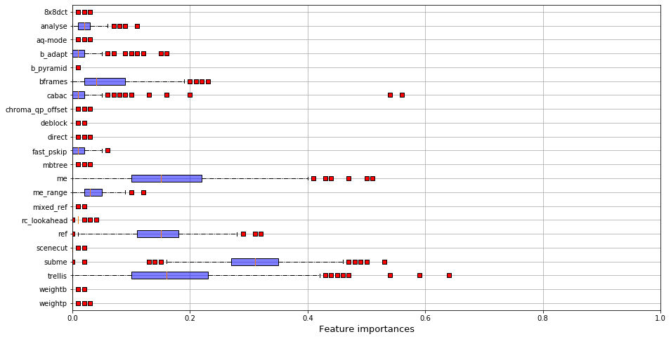
    


    
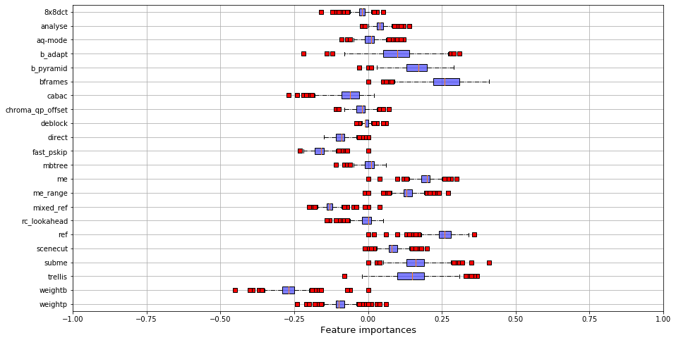
    


    
    
    Mean cpu in the group: 916.9
    Mean etime in the group: 5.5
    Mean fps in the group: 497.6
    Mean kbs in the group: 6977.0
    Mean size in the group: 17292549.3
    
    
    Animation         0.918605
    CoverSong         1.000000
    Gaming            0.818182
    HDR                    NaN
    HowTo             0.896552
    Lecture           0.942308
    LiveMusic         0.932432
    LyricVideo        0.818182
    MusicVideo        1.000000
    NewsClip          1.000000
    Sports            0.900000
    TelevisionClip    0.963636
    VR                0.800000
    VerticalVideo     0.746667
    Vlog              0.651899
    dtype: float64
    
    
    Mean perf_group : 2.0
    Mean SLEEQ_DMOS : -0.015120858265081628
    Mean BANDING_DMOS : -0.011453381663218349
    Mean WIDTH : -0.30999935703592946
    Mean HEIGHT : -0.32090882085145583
    Mean SPATIAL_COMPLEXITY : 0.1602213211949431
    Mean TEMPORAL_COMPLEXITY : -0.058610654133058486
    Mean CHUNK_COMPLEXITY_VARIATION : 0.11526256612951781
    Mean COLOR_COMPLEXITY : 0.025218700683890097
    
    


    /home/llesoil/anaconda3/envs/x264/lib/python3.7/site-packages/ipykernel_launcher.py:32: SettingWithCopyWarning: 
    A value is trying to be set on a copy of a slice from a DataFrame.
    Try using .loc[row_indexer,col_indexer] = value instead
    
    See the caveats in the documentation: https://pandas.pydata.org/pandas-docs/stable/user_guide/indexing.html#returning-a-view-versus-a-copy


    Correlations intra-group: 
    mean    0.964827
    50%     0.968049
    dtype: float64
    


```python
group_perf
id_list_0 = [i for i in range(len(listVideo)) if group_perf[i]==0]
id_list_1 = [i for i in range(len(listVideo)) if group_perf[i]==1]
id_list_2 = [i for i in range(len(listVideo)) if group_perf[i]==2]

res = np.zeros(9).reshape(3,3)

tab = []
for id0 in id_list_0:
    for id1 in id_list_1:
        tab.append(corrSpearman[id0][id1])
res[0][1] = np.mean(tab)

for id0 in id_list_0:
    for id2 in id_list_2:
        tab.append(corrSpearman[id0][id2])
res[0][2] = np.mean(tab)

for id1 in id_list_1:
    for id2 in id_list_2:
        tab.append(corrSpearman[id1][id2])
res[1][2] = np.mean(tab)

print(res)

res_med = np.zeros(9).reshape(3,3)

tab = []
for id0 in id_list_0:
    for id1 in id_list_1:
        tab.append(corrSpearman[id0][id1])
res_med[0][1] = np.median(tab)

for id0 in id_list_0:
    for id2 in id_list_2:
        tab.append(corrSpearman[id0][id2])
res_med[0][2] = np.median(tab)

for id1 in id_list_1:
    for id2 in id_list_2:
        tab.append(corrSpearman[id1][id2])
res_med[1][2] = np.median(tab)

res_med
```

    [[0.         0.10236622 0.39042802]
     [0.         0.         0.4402605 ]
     [0.         0.         0.        ]]


    array([[0.        , 0.10941812, 0.42301883],
           [0.        , 0.        , 0.47749604],
           [0.        , 0.        , 0.        ]])


## RQ2.2 - Group classification


```python
if 'str_video_cat' in meta_perf.columns:
    del meta_perf['str_video_cat']

accuracy = []

nbLaunches =10
for i in range(nbLaunches):
    X = np.array(meta_perf[[k for k in meta_perf.columns if k !='perf_group']], float)
    y = np.array(meta_perf['perf_group'], float)

    X_train, X_test, y_train, y_test = train_test_split(X, y, test_size=0.25)

    rf = RandomForestClassifier()
    rf.fit(X_train, y_train)
    y_pred = rf.predict(X_test)


    conf = pd.crosstab(y_pred, y_test)#, colnames=[1,2,3], rownames=[1,2,3])
    val = np.sum(np.diag(conf))/len(y_test)
    accuracy.append(val)
    print('Test accuracy : '+ str(val))
    conf.columns = pd.Int64Index([1,2,3], dtype='int64', name='Observed')
    conf.index = pd.Int64Index([1,2,3], dtype='int64', name='Predicted')
    conf
print(np.mean(accuracy))
conf
```

    Test accuracy : 0.772020725388601
    Test accuracy : 0.689119170984456
    Test accuracy : 0.7461139896373057
    Test accuracy : 0.7305699481865285
    Test accuracy : 0.7305699481865285
    Test accuracy : 0.6735751295336787
    Test accuracy : 0.7150259067357513
    Test accuracy : 0.7357512953367875
    Test accuracy : 0.7305699481865285
    Test accuracy : 0.7409326424870466
    0.7264248704663212


<div>
<style scoped>
    .dataframe tbody tr th:only-of-type {
        vertical-align: middle;
    }

    .dataframe tbody tr th {
        vertical-align: top;
    }

    .dataframe thead th {
        text-align: right;
    }
</style>
<table border="1" class="dataframe">
  <thead>
    <tr style="text-align: right;">
      <th>Observed</th>
      <th>1</th>
      <th>2</th>
      <th>3</th>
    </tr>
    <tr>
      <th>Predicted</th>
      <th></th>
      <th></th>
      <th></th>
    </tr>
  </thead>
  <tbody>
    <tr>
      <th>1</th>
      <td>39</td>
      <td>0</td>
      <td>11</td>
    </tr>
    <tr>
      <th>2</th>
      <td>0</td>
      <td>20</td>
      <td>11</td>
    </tr>
    <tr>
      <th>3</th>
      <td>11</td>
      <td>17</td>
      <td>84</td>
    </tr>
  </tbody>
</table>
</div>


```python
meta_perf
```


<div>
<style scoped>
    .dataframe tbody tr th:only-of-type {
        vertical-align: middle;
    }

    .dataframe tbody tr th {
        vertical-align: top;
    }

    .dataframe thead th {
        text-align: right;
    }
</style>
<table border="1" class="dataframe">
  <thead>
    <tr style="text-align: right;">
      <th></th>
      <th>perf_group</th>
      <th>SLEEQ_DMOS</th>
      <th>BANDING_DMOS</th>
      <th>WIDTH</th>
      <th>HEIGHT</th>
      <th>SPATIAL_COMPLEXITY</th>
      <th>TEMPORAL_COMPLEXITY</th>
      <th>CHUNK_COMPLEXITY_VARIATION</th>
      <th>COLOR_COMPLEXITY</th>
      <th>video_category</th>
    </tr>
    <tr>
      <th>FILENAME</th>
      <th></th>
      <th></th>
      <th></th>
      <th></th>
      <th></th>
      <th></th>
      <th></th>
      <th></th>
      <th></th>
      <th></th>
    </tr>
  </thead>
  <tbody>
    <tr>
      <th>Animation_1080P-05f8</th>
      <td>2</td>
      <td>0.843640</td>
      <td>0.742227</td>
      <td>0.380890</td>
      <td>0.330315</td>
      <td>-0.147062</td>
      <td>0.443113</td>
      <td>2.546727</td>
      <td>2.208462</td>
      <td>-1.618994</td>
    </tr>
    <tr>
      <th>Animation_1080P-0c4f</th>
      <td>2</td>
      <td>-0.656518</td>
      <td>-0.377309</td>
      <td>0.380890</td>
      <td>0.330315</td>
      <td>0.422696</td>
      <td>-0.963894</td>
      <td>1.055535</td>
      <td>-1.232585</td>
      <td>-1.618994</td>
    </tr>
    <tr>
      <th>Animation_1080P-0cdf</th>
      <td>0</td>
      <td>-0.294941</td>
      <td>-0.059125</td>
      <td>0.380890</td>
      <td>0.330315</td>
      <td>-0.028411</td>
      <td>0.429840</td>
      <td>-0.102867</td>
      <td>-0.448165</td>
      <td>-1.618994</td>
    </tr>
    <tr>
      <th>Animation_1080P-18f5</th>
      <td>0</td>
      <td>-0.479576</td>
      <td>-0.377309</td>
      <td>0.380890</td>
      <td>0.330315</td>
      <td>1.289667</td>
      <td>-0.959469</td>
      <td>-0.050889</td>
      <td>0.193239</td>
      <td>-1.618994</td>
    </tr>
    <tr>
      <th>Animation_1080P-209f</th>
      <td>2</td>
      <td>6.282675</td>
      <td>-0.377309</td>
      <td>0.380890</td>
      <td>0.330315</td>
      <td>2.315231</td>
      <td>-1.512538</td>
      <td>-0.622865</td>
      <td>-1.232585</td>
      <td>-1.618994</td>
    </tr>
    <tr>
      <th>...</th>
      <td>...</td>
      <td>...</td>
      <td>...</td>
      <td>...</td>
      <td>...</td>
      <td>...</td>
      <td>...</td>
      <td>...</td>
      <td>...</td>
      <td>...</td>
    </tr>
    <tr>
      <th>Vlog_720P-561e</th>
      <td>2</td>
      <td>-0.679597</td>
      <td>-0.377309</td>
      <td>-0.241046</td>
      <td>-0.334452</td>
      <td>0.979531</td>
      <td>-1.415198</td>
      <td>-0.652628</td>
      <td>0.457602</td>
      <td>1.494285</td>
    </tr>
    <tr>
      <th>Vlog_720P-5d08</th>
      <td>0</td>
      <td>-0.679597</td>
      <td>-0.377309</td>
      <td>-0.773579</td>
      <td>-0.334452</td>
      <td>3.258561</td>
      <td>-0.304636</td>
      <td>-0.437382</td>
      <td>-0.157800</td>
      <td>1.494285</td>
    </tr>
    <tr>
      <th>Vlog_720P-60f8</th>
      <td>0</td>
      <td>0.443598</td>
      <td>0.624381</td>
      <td>-0.241046</td>
      <td>-0.334452</td>
      <td>0.234735</td>
      <td>-0.043587</td>
      <td>-0.364052</td>
      <td>-0.149132</td>
      <td>1.494285</td>
    </tr>
    <tr>
      <th>Vlog_720P-6410</th>
      <td>1</td>
      <td>-0.456497</td>
      <td>3.770868</td>
      <td>-0.241046</td>
      <td>-0.334452</td>
      <td>-0.770858</td>
      <td>2.120018</td>
      <td>1.971948</td>
      <td>-0.240142</td>
      <td>1.494285</td>
    </tr>
    <tr>
      <th>Vlog_720P-6d56</th>
      <td>2</td>
      <td>0.628233</td>
      <td>-0.353740</td>
      <td>-0.241046</td>
      <td>-0.334452</td>
      <td>-0.329149</td>
      <td>0.328075</td>
      <td>1.647785</td>
      <td>0.565947</td>
      <td>1.494285</td>
    </tr>
  </tbody>
</table>
<p>769 rows × 10 columns</p>
</div>


```python
pd.DataFrame({'Random forest importance' : rf.feature_importances_,
              'name' : meta_perf.columns[1:]}).set_index('name')
```


<div>
<style scoped>
    .dataframe tbody tr th:only-of-type {
        vertical-align: middle;
    }

    .dataframe tbody tr th {
        vertical-align: top;
    }

    .dataframe thead th {
        text-align: right;
    }
</style>
<table border="1" class="dataframe">
  <thead>
    <tr style="text-align: right;">
      <th></th>
      <th>Random forest importance</th>
    </tr>
    <tr>
      <th>name</th>
      <th></th>
    </tr>
  </thead>
  <tbody>
    <tr>
      <th>SLEEQ_DMOS</th>
      <td>0.072091</td>
    </tr>
    <tr>
      <th>BANDING_DMOS</th>
      <td>0.046348</td>
    </tr>
    <tr>
      <th>WIDTH</th>
      <td>0.045705</td>
    </tr>
    <tr>
      <th>HEIGHT</th>
      <td>0.034997</td>
    </tr>
    <tr>
      <th>SPATIAL_COMPLEXITY</th>
      <td>0.289946</td>
    </tr>
    <tr>
      <th>TEMPORAL_COMPLEXITY</th>
      <td>0.209568</td>
    </tr>
    <tr>
      <th>CHUNK_COMPLEXITY_VARIATION</th>
      <td>0.148379</td>
    </tr>
    <tr>
      <th>COLOR_COMPLEXITY</th>
      <td>0.097515</td>
    </tr>
    <tr>
      <th>video_category</th>
      <td>0.055450</td>
    </tr>
  </tbody>
</table>
</div>


```python
meta_perf.groupby(['perf_group']).mean()
```


<div>
<style scoped>
    .dataframe tbody tr th:only-of-type {
        vertical-align: middle;
    }

    .dataframe tbody tr th {
        vertical-align: top;
    }

    .dataframe thead th {
        text-align: right;
    }
</style>
<table border="1" class="dataframe">
  <thead>
    <tr style="text-align: right;">
      <th></th>
      <th>SLEEQ_DMOS</th>
      <th>BANDING_DMOS</th>
      <th>WIDTH</th>
      <th>HEIGHT</th>
      <th>SPATIAL_COMPLEXITY</th>
      <th>TEMPORAL_COMPLEXITY</th>
      <th>CHUNK_COMPLEXITY_VARIATION</th>
      <th>COLOR_COMPLEXITY</th>
      <th>video_category</th>
    </tr>
    <tr>
      <th>perf_group</th>
      <th></th>
      <th></th>
      <th></th>
      <th></th>
      <th></th>
      <th></th>
      <th></th>
      <th></th>
      <th></th>
    </tr>
  </thead>
  <tbody>
    <tr>
      <th>0</th>
      <td>-0.078311</td>
      <td>-0.229780</td>
      <td>-0.116496</td>
      <td>-0.135671</td>
      <td>0.804723</td>
      <td>0.289698</td>
      <td>0.717640</td>
      <td>-0.082420</td>
      <td>0.043716</td>
    </tr>
    <tr>
      <th>1</th>
      <td>0.081870</td>
      <td>0.122683</td>
      <td>0.607173</td>
      <td>0.537666</td>
      <td>-0.891920</td>
      <td>0.661285</td>
      <td>-0.297182</td>
      <td>0.188592</td>
      <td>-0.008223</td>
    </tr>
    <tr>
      <th>2</th>
      <td>-0.071027</td>
      <td>0.103646</td>
      <td>-0.271269</td>
      <td>-0.301448</td>
      <td>-0.223278</td>
      <td>-0.461625</td>
      <td>-0.203138</td>
      <td>0.048928</td>
      <td>-0.386508</td>
    </tr>
  </tbody>
</table>
</div>


```python

```


```python

```
